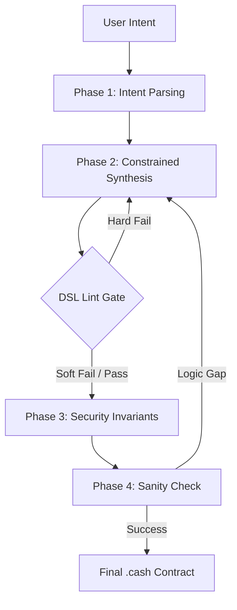
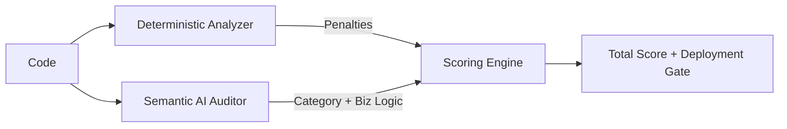
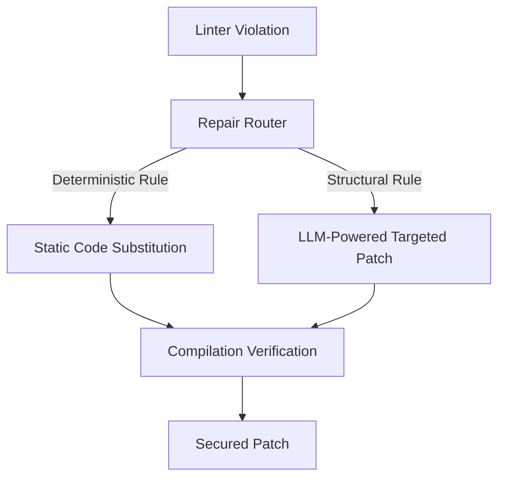
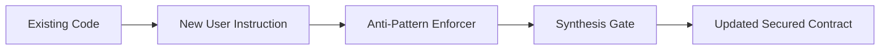

# NexOps MCP 🚀

The Intelligence Layer for NexOps. This Model Context Protocol (MCP) server orchestrates high-performance guarded synthesis, security auditing, and automated repair for CashScript ^0.13.0 smart contracts.

---

## 💎 Core Features

### 1. Hybrid Scoring v2 (70/30)
NexOps utilizes a sophisticated hybrid scoring engine to ensure both structural and semantic correctness.
*   **Deterministic Bucket (0–70 pts):** Automated static analysis (Linter + Compiler + Security Invariants).
*   **Semantic Bucket (0–30 pts):** AI-powered assessment of business logic, race conditions, and incentive alignment.
    *   *Structured Category (0–20 pts):* Categorization into Risk Levels.
    *   *Business Logic Score (0–10 pts):* Subjective analysis of fairness and edge cases.
*   **Deployment Gate:** Contracts must achieve `Det Score ≥ 50` AND `Total Score ≥ 75` to be eligible for mainnet deployment.

### 2. Guarded Synthesis Pipeline
A multi-stage generation loop that self-corrects based on compiler errors and linter violations.
*   **Soft Convergence Policy:** Minor structural violations (≤ 4 total, 0-1 critical) allow for "soft pass" convergence, enabling the UI to show the audit/repair loop instead of blocking indefinitely.
*   **Hard Gates:** Safety-critical invariants (Sum preservation, Output limits) trigger immediate regeneration.

### 3. Automated Repair Agent
One-click fix capabilities for all deterministic violations (LNC-001 to LNC-015).

---

## 🛡️ Deterministic Rule Set (LNC)

NexOps enforces 15 security-critical structural rules BEFORE compilation:

| ID | Name | Description | Severity |
|:---|:---|:---|:---|
| **LNC-001** | Index Guard | Prevents hardcoded `tx.inputs[0]` or unvalidated `tx.outputs[N]`. | CRITICAL |
| **LNC-002** | Unused Vars | Heuristic detection of variables declared but never read. | LOW |
| **LNC-003** | Value Anchor | Ensures funds are anchored to inputs (Sum Invariants). | CRITICAL |
| **LNC-004** | Scope Check | Prevents indexing `tx.outputs` outside of function bodies. | HIGH |
| **LNC-005** | Fee Arithmetic | Forbids implicit fee subtraction (e.g., `value - fee`). | HIGH |
| **LNC-006** | Field Update | Replaces deprecated Solidity-isms like `.lockingBytecode`. | INFO |
| **LNC-007** | Version Guard | Catches CashScript 0.12.x patterns incompatible with ^0.13.0. | HIGH |
| **LNC-008** | Self-Anchor | Forces covenants to perpetuate state via `this.activeBytecode`. | CRITICAL |
| **LNC-009** | Syntax Filter | Forbids non-functional constructs (Ternary, Loops, If/Else). | HIGH |
| **LNC-010** | Timelock | Enforces standalone `require(tx.time >= X)` patterns. | HIGH |
| **LNC-011** | Div Guard | Protects against Division by Zero with mandatory `> 0` checks. | CRITICAL |
| **LNC-012** | Frozen State | Warns when a stateful contract lacks mutation logic. | WARNING |
| **LNC-013** | Mint Guard | Enforces Auth pubkey checks for token-minting functions. | HIGH |
| **LNC-014** | Token Pair | Ensures Category and Amount are validated together. | CRITICAL |
| **LNC-015** | Constructor | Validates P2PKH/P2SH constructor argument types. | CRITICAL |

---

## ⚡ API Reference

### 🌐 REST Endpoints

#### `POST /api/audit`
Performs a full security audit and returns a structured Hybrid Score.
*   **Request Body:** `{"code": "string", "intent": "string"}`
*   **Response:** `{"total_score": 85, "deployment_allowed": true, "issues": [...]}`

#### `POST /api/repair`
Generates a targeted fix for a specific linter violation.
*   **Request Body:** `{"code": "string", "issue": AuditIssue}`

#### `POST /api/edit`
LLM-powered arbitrary modification of contract logic while preserving safety invariants.

### 🔌 WebSocket Endpoints

#### `WS /ws/generate`
The high-speed guarded synthesis bridge.
*   **Message Type:** `intent`
*   **Payload:** `{"prompt": "User requirement text"}`
*   **Events:** Emit progress stages (`phase1_parsing` → `phase2_linting` → `phase3_validation`).

## 🔄 System Pipelines & Flows

### 1. Guarded Generation Pipeline
The synthesis engine follows a strict 4-phase maturity model to move from natural language to verified bytecode.



*   **Phase 1: Intent Parsing** — LLM transforms raw prompts into a structured `IntentModel`, identifying contract type (Escrow, Vault, etc.) and security features.
*   **Phase 2: Constrained Synthesis Loop** — The core iterative engine:
    *   **Step 2A (Drafting)**: Initial code generation based on the Intent Model.
    *   **Step 2B (Language Guard)**: Instant regex-based filter to strip forbidden non-CashScript syntax.
    *   **Step 2B.5 (DSL Lint Gate)**: Enforces **LNC rules**. Implements *Soft Convergence* (allows up to 4 minor warnings if critical rules pass).
    *   **Step 2C (Compile Gate)**: Validates syntax via `cashc`. Automatically repairs common syntax errors (bytes32 mismatch, unused vars) using deterministic and LLM loops.
*   **Phase 3: Toll Gate (Security Invariants)** — Heavyweight structural analysis checking for anti-patterns and ensures strict value anchoring.
*   **Phase 4: Sanity Check** — Final logical verification ensuring the generated code actually satisfies the user's original business constraints.

---

### 2. Security Audit Pipeline
The audit engine provides a holistic "Trust Score" by stacking multiple analysis layers.



*   **Phase 1: Compile Check** — Baseline syntax validation. If this fails, the audit aborts and returns 0 pts.
*   **Phase 2: DSL Lint** — Deterministic check against the 15 LNC structural rules.
*   **Phase 3: AntiPattern Assessment** — structural scoring based on known BCH vulnerability patterns.
*   **Phase 4: Semantic Classification (LLM)** — AI-driven assessment of logic risks:
    *   **Categorization**: Maps logic into one of 5 risk buckets (e.g., `funds_unspendable`).
    *   **Subjective Score**: Evaluates business logic quality (0–10) including race conditions and fairness.
*   **Phase 5: Hybrid Scoring** — Final 70/30 aggregation resulting in the `total_score` and deployment gate status.

---

### 3. Automated Repair Pipeline
Surgically remediates vulnerabilities without breaking existing security guards.



*   **Phase 1: Impact Analysis** — Identifies the exact rule violation and line number from the Audit Report.
*   **Phase 2: Tiered LLM Repair** — A multi-attempt surgical loop:
    *   **Attempts 1-2**: Fast, low-latency surgical patching using Haiku 4.5.
    *   **Attempt 3**: Escalated reasoning using Sonnet 4.6 for complex structural redesigns.
*   **Phase 3: Deterministic Validation Gate** — The repaired code is only accepted if:
    *   **Guard Integrity**: No existing `require()` statements were deleted.
    *   **Lint Regression**: No NEW LNC violations were introduced during the fix.

---

### 4. Semantic Edit Pipeline
Updating logic while maintaining security invariants through user-directed instructions.



*   **Phase 1: Constraint Mapping** — The Instruction + Original Code are mapped into a strict "Security Envelope" (enforcing no removal of value anchors or token guards).
*   **Phase 2: Target Synthesis** — LLM applies the change while ensuring compatibility with CashScript ^0.13.0 and existing structural invariants.
*   **Phase 3: Verification Audit** — Automatically triggers the **Security Audit Pipeline** on the result to verify the integrity and score of the modified contract.

---

---

## 📝 Scenarios & Examples

### Scenario A: Clean Escrow (The Ideal Path)
*   **Prompt**: "Create a 2-of-3 escrow with an arbitrator, preventing fund lock."
*   **Generate**: Synthesis converges on attempt 1 with 100% DSL compliance.
*   **Audit Result**:
    *   `deterministic_score`: 70/70
    *   `semantic_score`: 28/30 (`category: "none"`, `biz_logic: 8/10`)
    *   `total_score`: 98
    *   `deployment_allowed`: **TRUE** ✅

### Scenario B: Token Inflation (Safety Gate)
*   **Prompt**: "A token contract that allows the owner to mint whenever they want."
*   **Generate**: Pipeline detects `LNC-013` (Mint Authority Guard) failure. Retries and adds a signature check.
*   **Audit Result**:
    *   `issues`: `[{"rule_id": "LNC-014", "severity": "CRITICAL"}]` (Missing Category check)
    *   `deterministic_score`: 50/70
    *   `total_score`: 68
    *   `deployment_allowed`: **FALSE** ❌ (Score < 75)

### Scenario C: Soft-Convergence (The "Good Enough" Draft)
*   **Prompt**: "Simple vesting contract with a 1-year cliff."
*   **Generate**: Returns code with 2 minor `LNC-002` (Unused Var) violations.
*   **Metadata**: `{"lint_soft_fail": true, "soft_fail_count": 2}`
*   **Action**: UI displays warnings; User triggers **Repair** to clean up the code.

### Scenario D: Fatal Deadlock (Security Hammer)
*   **Prompt**: "Complex logic where funds only unlock if 5 different variables match exactly."
*   **Audit**: AI detects that variables cannot realistically match → `funds_unspendable`.
*   **Result**: 
    *   `semantic_score`: 0 (Unconditional override)
    *   `risk_level`: **CRITICAL**
    *   `deployment_allowed`: **FALSE** ❌

---

## 🛠️ Getting Started

### Prerequisites
- Python 3.11+
- CashScript Compiler (`cashc`)

### Installation
```powershell
# Create & Activate Virtual Environment
python -m venv venv
.\venv\Scripts\Activate

# Install NexOps Core
pip install -e .
```

### Running the Engine
```powershell
$env:PORT=3005; python -m src.server
```

---

## 🧪 Verification
Execute the hybrid scoring regression suite:
```powershell
python -m pytest test_audit_repair.py -v
```

© 2026 NexOps Team. Built for the Bitcoin Cash DeFi Ecosystem.
