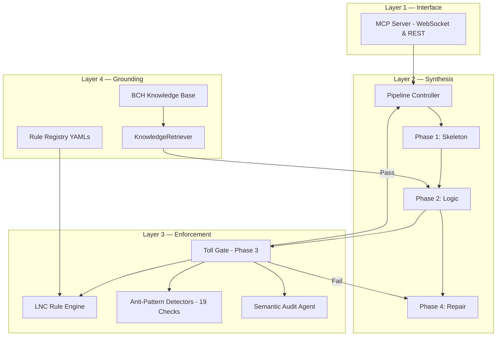
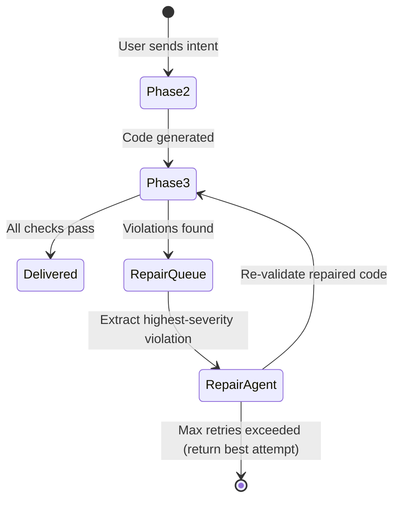
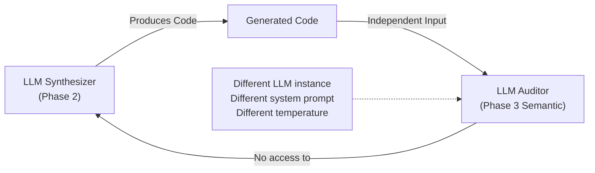
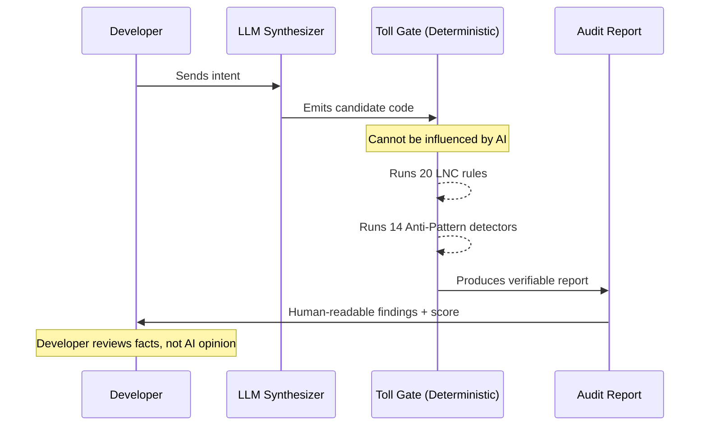
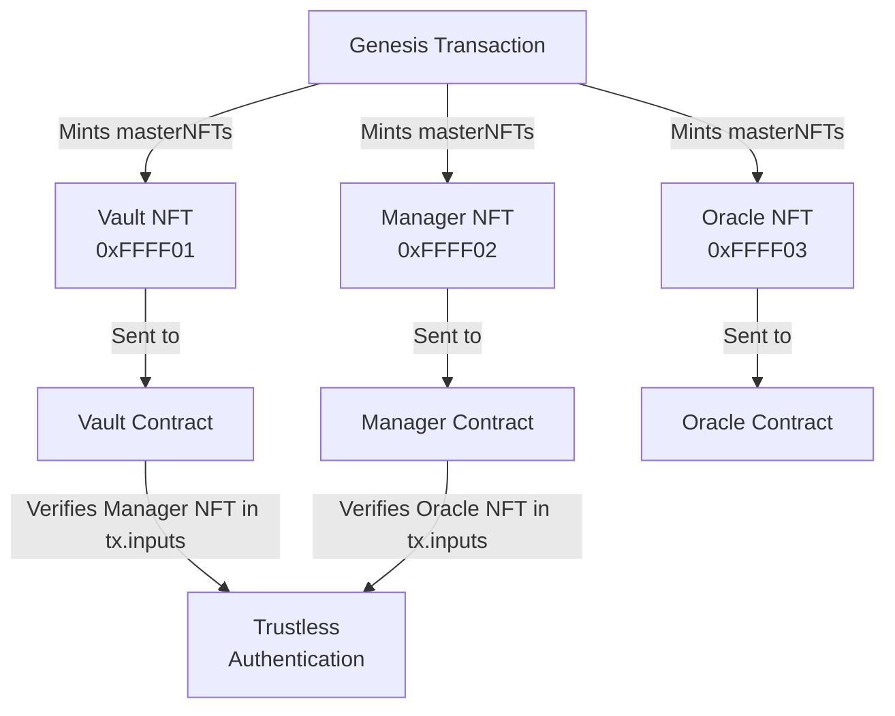

# NexOps: The Guarded Synthesis & Deterministic Audit Protocol
**Technical Whitepaper v4.0 — Secure High-Assurance Smart Contract Generation & Auditing on Bitcoin Cash**

> *"The goal of NexOps is not to replace the developer. It is to make the developer's work provably safe."*

---

## Table of Contents

1.  Executive Vision & The Trust Problem
2.  Architecture Overview: The Four-Layer Stack
3.  Phase 1: Structural Skeletonization & NexIR
4.  Phase 2: Knowledge-Grounded Logic Injection
5.  Phase 3: Deterministic Enforcement — The Toll Gate
6.  Phase 4: Repair Loop Architecture
7.  The LNC Rule Engine — Complete Rule Registry
8.  The Anti-Pattern System — Negative Logic Enforcement
9.  The Hybrid Scoring Engine — Deep Technical Specification
10. The Semantic Audit Layer — Business Logic Analysis
11. Audit Transparency & Non-Bias Proof
12. The Security Trust Model
13. Multi-Contract Identity: masterNFT Standards
14. Knowledge Base Grounding System
15. Intent Engineering: Semantic Intent Mapping
16. Session State Machine & Retry Logic
17. VM Upgrade Roadmap & Forward Compatibility
18. Case Study: Atomic Swap (HTLC) Pipeline Walkthrough
19. Case Study: Token Vault (Stateful Covenant) Pipeline Walkthrough
20. Conclusion & Future Directions

---

## 1. Executive Vision & The Trust Problem

### 1.1 The AI-Finance Gap
The rise of Large Language Model (LLM) code generation has created a paradox in decentralized finance. While AI can write thousands of lines of code per second, it cannot reliably guarantee security invariants. This is particularly dangerous in the UTXO-based CashScript ecosystem, where:

- **Code is immutable once deployed.** There are no proxy contracts, no admin keys, and no recovery mechanism.
- **Funds are locked by bytecode.** A single missing condition can freeze millions of dollars permanently.
- **The BCH VM operates with strict binary semantics.** A failed `require()` statement does not return `false` — it terminates the entire script execution.

Standard LLM code generation is trained on EVM-dominant data and routinely applies Ethereum Mental Models to Bitcoin Script, producing code that looks plausible but is fundamentally insecure.

### 1.2 The NexOps Mandate
NexOps is a **Safety-First AI Synthesis Engine** for Bitcoin Cash. It does not trust the LLM to write secure code. Instead, it:

1. Uses the LLM exclusively for **creative logic generation** (the parts where flexibility is valuable).
2. Enforces security through a **Deterministic Enforcement Layer (DEL)** that runs a rigorous multi-stage audit on every generated artifact.
3. Produces a **Compliance Report** with a detailed, verifiable, and human-readable breakdown of every check applied.

The result is a system where developers do not have to "trust" NexOps's AI output. They can verify it from the transparency report.

### 1.3 The Trust Guarantee
NexOps makes a single guarantee: **Every contract that passes the NexOps Toll Gate has been verified by a deterministic, non-AI rule engine against 19+ specific vulnerability patterns.** The AI can hallucinate anything — but it cannot pass a deterministic AST check with a known exploit.

---

## 2. Architecture Overview: The Four-Layer Stack

NexOps is architecturally organized into four horizontal layers. Each layer has strict responsibilities and cannot bypass the one below it.



### 2.1 Layer Responsibilities

| Layer | Role | Can Bypass Security? |
| :--- | :--- | :--- |
| Interface | Route requests from MCP clients | No |
| Synthesis | AI-driven code generation | No — all output flows to Layer 3 |
| Enforcement | Deterministic rule checking | **This IS the security layer** |
| Grounding | Authoritative BCH domain knowledge | No — read-only input to Synthesis |

---

## 3. Phase 1: Structural Skeletonization & NexIR

### 3.1 Purpose
Phase 1 prevents "Schema Drift" — the failure mode where an LLM generates structurally correct business logic but with incorrect parameter types, function signatures, or missing constructor fields. By separating the concern of **"what does this contract look like?"** from **"what does it do?"**, NexOps ensures that the contract's shape is correct before any logic is written.

### 3.2 The NexIR Schema

The **Synthesis Intermediate Representation (NexIR)** is a JSON schema that describes a contract's architecture without any business logic. This is the pipeline's internal "blueprint."

**NexIR Specification:**
```json
{
  "schema_version": "1.0",
  "contract_meta": {
    "name": "LinearVesting",
    "pragma": "^0.13.0",
    "statefulness": "STATEFUL",
    "token_aware": true
  },
  "constructor": [
    {"name": "beneficiary", "type": "pubkey", "role": "authorization"},
    {"name": "startBlock", "type": "int", "role": "temporal_lower"},
    {"name": "cliffBlock", "type": "int", "role": "temporal_upper"},
    {"name": "totalAmount", "type": "int", "role": "value_reference"}
  ],
  "functions": [
    {
      "name": "vest",
      "params": [
        {"name": "beneficiarySig", "type": "sig"},
        {"name": "vestingAmount", "type": "int"}
      ],
      "spending_paths": ["AUTHORIZE_AND_TRANSFER"],
      "covenant_required": true
    }
  ],
  "structural_elements": {
    "requires_output_limit": true,
    "requires_self_anchor": true,
    "requires_value_anchor": true,
    "requires_nft_commitment": true
  }
}
```

### 3.3 Phase 1 LLM Prompt Strategy
The Phase 1 prompt explicitly forbids the LLM from writing any logic. It is given:
- The user's intent in plain language.
- The `core_language.yaml` type system reference.
- Strict instruction to output **only** valid NexIR JSON.

If the LLM outputs anything other than valid NexIR, Phase 1 fails immediately and retries with a corrected prompt before consuming Phase 2 tokens.

---

## 4. Phase 2: Knowledge-Grounded Logic Injection

### 4.1 Purpose
Phase 2 takes the validated NexIR and injects the actual CashScript logic. It is the most complex phase because it must bridge high-level user intent to low-level VM constraints.

### 4.2 The KB Retrieval Strategy
NexOps does not dump the entire BCH Knowledge Base into the prompt. This would exceed token limits and dilute the signal. Instead, it uses a **Tiered Knowledge Injection (TKI)** strategy:

```mermaid
graph TD
    INTENT["User Intent Tags\n[TEMPORAL, COVENANT, TOKEN]"] --> TIER1
    
    subgraph "TIER 1 — Always Included"
        TIER1[Core Language Rules\nCritical Gotchas\nVM Limits]
    end
    
    subgraph "TIER 2 — Tag-Matched"
        TIER2A[Temporal Patterns\n(TEMPORAL tag)]
        TIER2B[Covenant Security Rules\n(COVENANT tag)]
        TIER2C[Token Rules\n(TOKEN tag)]
    end
    
    subgraph "TIER 3 — Retry-Only"
        TIER3[Full SECURITY_ARCHITECTURE.md\nFull FAQ_DISTILLED.md\nCanonical Anti-Examples]
    end
    
    TIER1 --> P2[Phase 2 Prompt]
    INTENT --> TIER2A & TIER2B & TIER2C
    TIER2A & TIER2B & TIER2C --> P2
    RETRY[Retry Count >= 2] --> TIER3 --> P2
```

### 4.3 Phase 2 Output Contract
Phase 2 must produce output that satisfies these structural requirements:
1. Valid CashScript syntax (`pragma cashscript ^0.X.Y;`)
2. Every function parameter from the NexIR must be present.
3. No Solidity keywords (`msg.sender`, `mapping`, `emit`, etc.)
4. The function names must match the NexIR function list exactly.

Any violation of the Output Contract triggers an immediate Phase 3 rejection before AST parsing even begins.

---

## 5. Phase 3: Deterministic Enforcement — The Toll Gate

### 5.1 The "Toll Gate" Philosophy
Phase 3 is called the **Toll Gate** because no contract can proceed to delivery without passing through it. The Toll Gate is:
- **Non-AI**: It uses a deterministic AST parser, not a language model.
- **Non-bypassable**: The pipeline architecture does not allow skipping Phase 3.
- **Transparent**: Every decision is logged with a specific rule ID, reason, and fix hint.
- **Reproducible**: Running the same code through Phase 3 always produces the same result.

### 5.2 Toll Gate Execution Order
The Toll Gate runs five sub-checks in sequential order:

```
1. Compilation Check     → Can cashc compile this code at all?
2. Syntax / Lint Check   → Does it pass all 19 LNC rules?
3. AST Construction      → Parse the compiled code into a traversable tree.
4. Anti-Pattern Scan     → Run all 19 registered detectors against the AST.
5. Score Calculation     → Compute the Deterministic Score (0–100).
```

Any check that produces a **CRITICAL** violation immediately halts the Toll Gate and returns a `TollGateResult` with `passed=False`, bypassing subsequent checks. Non-critical violations accumulate and reduce the score.

### 5.3 TollGateResult Data Model
```python
@dataclass
class TollGateResult:
    passed: bool
    violations: list[Violation]
    structural_score: float          # 0.0 to 1.0
    deterministic_score: int         # 0 to 70
    compilation_succeeded: bool
    lnc_rules_passed: int
    lnc_rules_total: int
    anti_patterns_detected: int
    execution_time_ms: float
    code_fingerprint: str            # SHA-256 of input code
    
@dataclass
class Violation:
    rule_id: str                     # e.g., "LNC-003" or "APD-009"
    severity: str                    # CRITICAL | HIGH | MEDIUM | LOW
    rule_name: str                   # Human-readable rule name
    reason: str                      # Why this specific code violates the rule
    exploit: str                     # The attack a real adversary would use
    fix_hint: str                    # Deterministic suggestion for repair
    location: dict                   # {"function": str, "line": int}
```

---

## 6. Phase 4: Repair Loop Architecture

### 6.1 The Repair Philosophy
When Phase 3 fails, the pipeline does not discard the generated code and start over. Instead, it runs the **Repair Loop**, which uses the `TollGateResult` as a structured repair specification.

### 6.2 Repair Loop State Machine



### 6.3 Retry Limits and Escalation
NexOps uses a **tiered backoff** strategy for retries:

| Retry # | Strategy | KB Tier Injection |
| :---: | :--- | :--- |
| 1 | Targeted fix for specific `violation.rule_id` | Tier 1 + Tier 2 |
| 2 | Full code regeneration with violations as context | Tier 1 + Tier 2 + Tier 3 |
| 3 | Canonical pattern replacement for the failing function | Tier 1 + Full KB |
| 4+ | Best-attempt delivery with audit report | N/A — escalate to user |

After 3 failed repair attempts, NexOps delivers the **best version** of the code with the full audit report attached, flagging all remaining violations. The developer can choose to accept, reject, or submit a refined intent.

---

## 7. The LNC Rule Engine — Complete Rule Registry

The **Layered Nexus Compliance (LNC)** rules are the legal code of the NexOps pipeline. Every rule has:
- A unique ID (`LNC-XXX`)
- A severity level
- A machine-checkable condition
- A human-readable reason and fix hint

### 7.1 Syntax & Language Rules (Tier: MANDATORY)

| Rule ID | Name | Severity | Condition |
| :--- | :--- | :--- | :--- |
| **LNC-001** | No EVM Syntax | CRITICAL | Code must not contain: `mapping`, `emit`, `modifier`, `payable`, `view`, `pure`, `msg.sender` |
| **LNC-002** | Valid Pragma | HIGH | Must begin with `pragma cashscript ^0.X.Y;` |
| **LNC-003** | Boolean Semantics | MEDIUM | `&&` / `\|\|` chains cannot assume short-circuit evaluation |
| **LNC-004** | No Compound Assignment | MEDIUM | Forbid `x++`, `x--`, `x += N`. Must use `x = x + 1` |
| **LNC-005** | Valid Types Only | HIGH | All types must be in: `pubkey`, `sig`, `int`, `bool`, `bytes`, `bytes20`, `bytes32`, `bytesN` |

### 7.2 Signature & Authorization Rules (Tier: SECURITY)

| Rule ID | Name | Severity | Condition |
| :--- | :--- | :--- | :--- |
| **LNC-006** | Sig Authorization Required | CRITICAL | Every spending function must include at least one `checkSig()` call, OR a valid covenant check chain |
| **LNC-007** | NULLFAIL Guard | HIGH | `checkSig(sig, pk)` used in an `\|\|` chain must include a `0x` empty-sig fallback for false path |
| **LNC-008** | No Bare checkDataSig | MEDIUM | `checkDataSig()` must be combined with content validation, not used standalone |

### 7.3 Covenant & Output Anchoring Rules (Tier: CRITICAL)

| Rule ID | Name | Severity | Condition |
| :--- | :--- | :--- | :--- |
| **LNC-009** | Output Count Bound | CRITICAL | Stateful contracts must contain `require(tx.outputs.length == N)` or `require(tx.outputs.length <= N)` |
| **LNC-010** | Identity Anchor | CRITICAL | Contracts using `tx.outputs[0]` must include `this.activeInputIndex` validation for multi-input scenarios |
| **LNC-011** | Value Anchor | CRITICAL | Stateful contracts must validate `tx.outputs[N].value` — fund extraction must be impossible |
| **LNC-012** | LockingBytecode Continuity | HIGH | State-preserving functions must validate `tx.outputs[N].lockingBytecode` |
| **LNC-013** | Token Category Check | HIGH | Token-aware contracts must validate `tx.outputs[N].tokenCategory` |
| **LNC-014** | Token Amount Check | HIGH | Token-aware contracts must validate `tx.outputs[N].tokenAmount` |
| **LNC-015** | NFT Commitment Transition | HIGH | Stateful NFT contracts must validate `tx.outputs[N].nftCommitment` |

### 7.4 Arithmetic Safety Rules (Tier: SAFETY)

| Rule ID | Name | Severity | Condition |
| :--- | :--- | :--- | :--- |
| **LNC-016** | Division Safety | HIGH | Any use of `/` or `%` must be preceded by `require(divisor > 0)` or `require(divisor != 0)` |
| **LNC-017** | Integer Overflow Defense | MEDIUM | Operations on `int` values must not exceed the 63-bit signed range without explicit bounds checking |
| **LNC-018** | Unsafe Cast Annotation | MEDIUM | `unsafe_bytesN()` must be accompanied by a comment explaining why the cast is known safe |

### 7.5 Temporal Rules (Tier: BEHAVIORAL)

| Rule ID | Name | Severity | Condition |
| :--- | :--- | :--- | :--- |
| **LNC-019** | Timelock Operator | HIGH | `tx.time` comparisons must use `>=` (block-inclusive), not `>` (which would require one extra block) |
| **LNC-020** | Loop Guard | MEDIUM | `for` / `while` constructs are forbidden until May 2026 VM activation; flag with remediation note |

### 7.6 LNC Scoring Contribution
Each passing LNC rule contributes to the **Deterministic Score**. The contribution is weighted by severity:

| Severity | Score Weight (if violated) |
| :--- | :--- |
| CRITICAL | -30 points |
| HIGH | -10 points |
| MEDIUM | -5 points |
| LOW | -2 points |

---

## 8. The Anti-Pattern System — Negative Logic Enforcement

The Anti-Pattern System is NexOps's most powerful security layer. Unlike the LNC rules (which check for correct structure), the Anti-Pattern System checks for **exploitable vulnerabilities** by modeling the perspective of an attacker.

### 8.1 The Negative Type System
Every Anti-Pattern Detector is a formalized model of an attack. The detector:
1. **Describes the exploit**: How would an attacker weaponize this code?
2. **Models the detection**: What AST structure indicates this vulnerability?
3. **Provides a fix hint**: What is the canonical pattern that closes this door?

This is called **Negative Logic** — rather than asserting what code should look like, we assert what it should **not** look like.

### 8.2 Anti-Pattern Detector Registry

```mermaid
graph TD
    APR[Anti-Pattern Registry] --> CAT1[Output Ordering]
    APR --> CAT2[Covenant Anchors]
    APR --> CAT3[Arithmetic Safety]
    APR --> CAT4[EVM Hallucination]
    APR --> CAT5[Token Integrity]
    APR --> CAT6[Signature Security]
    
    CAT1 --> APD01[APD-001: Implicit Output Order]
    CAT1 --> APD02[APD-002: Unchecked Output Count]
    CAT2 --> APD03[APD-003: Missing Value Anchor]
    CAT2 --> APD04[APD-004: Missing LockingBytecode Anchor]
    CAT2 --> APD05[APD-005: Missing Input Index Anchor]
    CAT3 --> APD06[APD-006: Division By Zero]
    CAT3 --> APD07[APD-007: Integer Overflow Risk]
    CAT4 --> APD08[APD-008: Solidity Keyword]
    CAT4 --> APD09[APD-009: EVM State Model]
    CAT5 --> APD10[APD-010: Token Sum Not Preserved]
    CAT5 --> APD11[APD-011: Token Category Not Checked]
    CAT5 --> APD12[APD-012: NFT Commitment Not Validated]
    CAT6 --> APD13[APD-013: Bare Sig Without Auth]
    CAT6 --> APD14[APD-014: NULLFAIL Unhandled]
```



### 8.3 Detector Technical Specifications

#### APD-001: Implicit Output Ordering
**Severity**: CRITICAL
**Exploit Vector**: An attacker constructs a transaction where the "attacker payout" output is placed at index 0, and the "contract continuation" output is at index 1. If the contract sends funds to `tx.outputs[0].lockingBytecode` without first verifying its identity, the attacker controls where the funds go.
**Detection Logic**: AST traversal searches for any assignment or `require` involving `tx.outputs[N].value` or `tx.outputs[N].tokenAmount` where the same index `N` has not been preceded by a `require(tx.outputs[N].lockingBytecode == ...)` within the same function scope.
**Fix Hint**: Always check `lockingBytecode` before checking `value`. The ordering matters.

#### APD-002: Unchecked Output Count
**Severity**: CRITICAL
**Exploit Vector**: For minting protocols, if the contract validates exactly ONE output but does not bound `tx.outputs.length`, an attacker can attach additional outputs. The contract validates the legitimate output and ignores the rest — allowing unauthorized minting or fund extraction.
**Detection Logic**: Any function categorized as `STATEFUL` in the NexIR that does not contain a `tx.outputs.length` check.
**Fix Hint**: Add `require(tx.outputs.length == 1);` as the **first** statement in every spending function.

#### APD-003: Missing Value Anchor
**Severity**: CRITICAL
**Exploit Vector**: Fund draining. If `tx.outputs[0].lockingBytecode` is checked (contract goes to right address) but `tx.outputs[0].value` is not checked, an attacker can send 1 satoshi to the contract address and extract all other funds as change.
**Detection Logic**: A function that validates `lockingBytecode` for an output but does NOT subsequently validate `value` for that same index.
**Fix Hint**: `require(tx.outputs[0].value >= tx.inputs[this.activeInputIndex].value - FEE_ALLOWANCE);`

#### APD-004: Missing LockingBytecode Anchor
**Severity**: CRITICAL
**Exploit Vector**: Code injection. The contract pays to a valid `value` but without checking `lockingBytecode`, an attacker can redirect the funds to their own P2PKH address, permanently draining the contract.
**Detection Logic**: Function that checks `tx.outputs[N].value` but has no `require(tx.outputs[N].lockingBytecode == ...)` for the same `N`.
**Fix Hint**: `require(tx.outputs[0].lockingBytecode == tx.inputs[this.activeInputIndex].lockingBytecode);`

#### APD-005: Missing Input Index Anchor
**Severity**: HIGH
**Exploit Vector**: Transaction malleability. In a transaction with multiple inputs, `tx.inputs[0]` refers to the first input globally — not necessarily the contract's own input. An attacker can manipulate input ordering so that `tx.inputs[0]` refers to a different (attacker-controlled) input, corrupting all value comparisons.
**Detection Logic**: Use of `tx.inputs[0]` (hardcoded index 0) in any contract that handles multi-input scenarios, without a `this.activeInputIndex` dynamic reference.
**Fix Hint**: Replace `tx.inputs[0]` with `tx.inputs[this.activeInputIndex]` in all contexts.

#### APD-006: Division By Zero
**Severity**: HIGH
**Exploit Vector**: Contract bricking. If any user-supplied parameter is used as a divisor, a user can pass `0` and cause the script to terminate — permanently locking all funds in the contract since no spending path can execute.
**Detection Logic**: AST search for any `/` or `%` operator where the right operand is a variable defined in constructor or function parameters, without a preceding `require(variable > 0)` or `require(variable != 0)`.
**Fix Hint**: Add `require(denominator != 0);` immediately before any division expression.

#### APD-007: Integer Overflow Risk
**Severity**: MEDIUM
**Exploit Vector**: Silent arithmetic error. CashScript integers are 63-bit signed. Operations on large values (near `2^62`) can silently wrap around to negative numbers, causing catastrophic mispricing of assets in DeFi contracts.
**Detection Logic**: Multiplication of two non-constant int values without bounds validation on the result. Example: `int result = a * b;` where neither `a` nor `b` is a verified constant.
**Fix Hint**: Add `require(a < MAX_SAFE_VALUE);` before multiplication, or decompose into checked intermediate steps.

#### APD-008: Solidity Keyword Detection
**Severity**: CRITICAL
**Exploit Vector**: Invalid compilation and false trust. Code containing Solidity keywords (`msg.sender`, `uint256`, `mapping`, `emit`, `function(address)`, `require(condition, string)`) cannot compile and does not represent valid CashScript. However, it may appear "logically correct" in a code review, creating a false sense of security.
**Detection Logic**: String-level scan for exact Solidity keyword matches in the raw code string, supplemented by AST-level detection of type annotations with EVM semantics.
**Fix Hint**: Replace with CashScript equivalents. `msg.sender` → `pubkey` constructor param. `uint256` → `int`. `mapping` → `nftCommitment`.

#### APD-009: EVM State Model Assumption
**Severity**: CRITICAL
**Exploit Vector**: Fundamental security failure. EVM contracts have global state — BCH contracts do not. A contract that tries to "store" values by assigning to contract-level variables will silently ignore the state between calls, making all stateful logic inoperative.
**Detection Logic**: Presence of contract-level variable declarations outside the constructor scope that are re-assigned within function bodies.
**Fix Hint**: All mutable state must be encoded in the `nftCommitment` field and explicitly carried through covenant outputs.

#### APD-010: Token Sum Not Preserved
**Severity**: CRITICAL
**Exploit Vector**: Token inflation. In a protocol where a contract is supposed to only redistribute existing tokens, if `tx.outputs[N].tokenAmount` is not checked against `tx.inputs[M].tokenAmount`, an attacker can create additional tokens out of thin air by submitting a transaction with inflated output token amounts.
**Detection Logic**: Token-aware contract functions that lack a `require(tx.outputs[N].tokenAmount == expectedAmount)` where `expectedAmount` is derived from input token values.
**Fix Hint**: `require(tx.outputs[0].tokenAmount == tx.inputs[this.activeInputIndex].tokenAmount);`

#### APD-011: Token Category Not Checked
**Severity**: HIGH
**Exploit Vector**: Token substitution. An attacker submits a transaction using a different (worthless) token category. If the contract validates the NFT commitment but not the category, it accepts any token as the authentic one, allowing phishing attacks against users.
**Detection Logic**: NFT-dependent logic that reads from `nftCommitment` without a preceding `require(tx.inputs[N].tokenCategory == authorizedCategory)`.
**Fix Hint**: Always hard-code and verify the expected token category in the constructor parameter.

#### APD-012: NFT Commitment Not Validated
**Severity**: HIGH
**Exploit Vector**: State spoofing. In a state machine contract, the off-chain oracle or application reads the NFT commitment to determine the contract's current state. If the commitment is not validated during spending, an attacker can write any data into the next state, corrupting the protocol.
**Detection Logic**: Stateful contract functions that write a new `nftCommitment` without validating that the incoming commitment contains a known/expected value before transitioning.
**Fix Hint**: Decode the current `nftCommitment` at the start of every function and validate each field before computing the new state.

#### APD-013: Bare Signature Without Authorization Check
**Severity**: HIGH
**Exploit Vector**: Signature for the wrong purpose. A contract that calls `checkSig(sig, pk)` without additional context checks allows any valid signature from that key to spend the contract, even signatures originally created for a completely different transaction.
**Detection Logic**: `checkSig` calls that are not combined with at least one additional requirement (value check, timelock, or covenant anchor).
**Fix Hint**: Combine `checkSig` with context-specific requirements. For timelocks: `require(checkSig(sig, pk) && tx.time >= lockTime);`

#### APD-014: NULLFAIL Unhandled in OR Chain
**Severity**: HIGH
**Exploit Vector**: Script termination via invalid signature. The `NULLFAIL` rule means that passing an invalid (non-empty) signature to `checkSig` inside an `||` chain terminates the entire script. This makes the "false" branch unreachable, permanently locking the contract.
**Detection Logic**: `checkSig(sig, pk)` used as one operand of an `||` expression, where there is no check to ensure that `sig` is either valid OR is the empty byte string `0x`.
**Fix Hint**: Use `require(checkSig(sig, pk) || checkSig(altSig, altPk));` only when both signatures are known valid, or use conditional spending paths (separate `function` definitions) instead of `||` chains.

---

## 9. The Hybrid Scoring Engine — Deep Technical Specification

### 9.1 Design Philosophy
The NexOps scoring model is **intentionally biased toward deterministic checks (70%)**. This is not arbitrary — it reflects the fundamental asymmetry between deterministic and semantic security:

- **Deterministic checks** can guarantee the *absence* of specific exploits.
- **Semantic checks** can only assess the *quality* of the remaining logic.

A contract with a perfect semantic score but a single CRITICAL deterministic violation is not deployable. The scoring model enforces this by making the deterministic score the primary filter.

### 9.2 The Deterministic Score Calculation (70 points)

**Starting Value**: 70 points (perfect determinism).

**Deductions:**

```
For each violation in TollGateResult.violations:
    if violation.severity == "CRITICAL":
        deduct 30 points
    elif violation.severity == "HIGH":
        deduct 10 points
    elif violation.severity == "MEDIUM":
        deduct 5 points
    elif violation.severity == "LOW":
        deduct 2 points

Score_Det = max(0, 70 - total_deductions)

# Binary multiplier
if not TollGateResult.compilation_succeeded:
    Score_Det = 0
```

**LNC Compliance Bonus** (up to +5 points):
If a contract passes ALL `LNC_TOTAL` rules with zero violations, a compliance bonus of 5 points is added to `Score_Det`, capping at 70.

### 9.3 The Semantic Score Calculation (30 points)

The semantic audit runs independently of the deterministic audit and is performed by a separate AI Auditor agent. The agent evaluates a **Semantic Risk Category** from a controlled vocabulary:

| Category Name | Category Score | Description |
| :--- | :--- | :--- |
| `none` | 20/20 | No structural flaws detected |
| `minor_inefficiency` | 15/20 | Redundant checks, non-optimal resource use |
| `logic_gap` | 10/20 | A logical edge case exists but is not a security failure |
| `major_protocol_flaw` | 5/20 | A flaw that could cause incorrect behavior under specific conditions |
| `funds_unspendable` | 0/20 | The contract can accept funds but they can never be retrieved |
| `exploit_pathway` | 0/20 | A described attack path exists in the logic |

The **Business Logic Score** (0–10) is an independent dimension that the LLM grades based on intent fidelity:
- Does the code actually perform what the intent requested?
- Is the logic complete (handles all edge cases)?
- Is the code resource-efficient?

**Semantic Score Formula:**
```
Score_Cat = category_score[semantic_category]  # 0 to 20
Score_Biz = min(10, business_logic_score)       # 0 to 10

Score_Sem = min(30, Score_Cat + Score_Biz)

# Override: catastrophic categories always force semantic to 0
if semantic_category in ["funds_unspendable", "exploit_pathway"]:
    Score_Sem = 0
```

### 9.4 The Total Score Formula

```
Score_Total = Score_Det + Score_Sem
```

This is a **direct sum**, not a weighted average. The 70/30 split is structural — the deterministic bucket holds 70 points max and the semantic bucket holds 30 points max.

### 9.5 Deployment Gating

The total score alone does not determine deployability. A contract must satisfy ALL of these conditions:

| Condition | Threshold | Rationale |
| :--- | :--- | :--- |
| Compilation | Must succeed | Non-compiling code cannot be deployed |
| No CRITICAL violations | 0 allowed | CRITICAL = known exploit vector |
| Semantic override | Cannot be `funds_unspendable` | Permanently locked funds |
| Total Score | ≥ 75 | Minimum bar for production deployment |

### 9.6 The Compliance Grade Table

| Grade | Score Range | Status |
| :--- | :--- | :--- |
| **A+** | 100 | Perfect. Zero violations. Optimal logic. |
| **A** | 90–99 | Production-ready. Minor inefficiencies only. |
| **B** | 80–89 | Deployable. Non-critical improvements available. |
| **C** | 75–79 | Deployable. Structural warnings issued. |
| **D** | 60–74 | Not deployable. High-severity violations present. |
| **F** | 0–59 | Not deployable. Critical violations or logic failures. |

---

## 10. The Semantic Audit Layer — Business Logic Analysis

### 10.1 The AI Auditor Agent
The Semantic Audit is performed by a separate LLM instance (the **Auditor**), which is isolated from the Synthesizer. This separation is critical — the Auditor has no knowledge of the generation process and cannot be "primed" to give a favorable review of its own output.

### 10.2 Auditor Context Construction
The Auditor receives:
1. **The User's Intent** (the original 20–200 word description).
2. **The Generated Code** (the Phase 2 output).
3. **The BCH Security Architecture Checklist** (from `SECURITY_ARCHITECTURE.md`).
4. **The Deterministic Violations List** (from Phase 3 — the Auditor must not duplicate these findings).

The Auditor is explicitly told: *"Do not report violations already captured in the deterministic report. Your role is to assess the semantic quality of what passes the deterministic gate."*

### 10.3 Auditor Output Schema
```json
{
  "semantic_category": "none | minor_inefficiency | ...",
  "explanation": "Single paragraph explaining the category choice",
  "confidence": 0.0,
  "business_logic_score": 0,
  "business_logic_notes": "Paragraph explaining intent fidelity"
}
```

### 10.4 Bias Prevention Mechanisms
The Auditor prompt explicitly includes countermeasure instructions:
- **Anchoring Bias**: The Auditor is told to independently assess the intent, NOT to "agree with" the code.
- **Recency Bias**: The code is presented last, after the intent and security checklist. The Auditor must form its expectation before reading the code.
- **Sycophancy Prevention**: The system prompt includes: *"You are not a validator. You are an adversarial reviewer. Assume the code is wrong until proven correct by your analysis."*

---

## 11. Audit Transparency & Non-Bias Proof

This section addresses the most important concern developers have about AI audits: **"How do I know the audit isn't biased toward passing the code it generated?"**

### 11.1 The Independence Principle
NexOps enforces auditor independence through architectural separation:



The Synthesizer and the Auditor have separate system prompts and are deliberately configured with different temperatures:
- **Synthesizer**: `temperature=0.7` (allows creative code generation)
- **Auditor**: `temperature=0.1` (enforces conservative, consistent evaluation)

### 11.2 Non-Bias Proof for the Deterministic Layer
The deterministic audit layer (LNC + Anti-Pattern) provides a **mathematical proof of non-bias**:

1. **Reproducibility**: The same code always produces the same result. Run it 1000 times — identical output.
2. **Open Rule Registry**: Every LNC rule and Anti-Pattern detector is documented in this whitepaper and the project's specs. There is no hidden logic.
3. **Code Fingerprinting**: Every audit report includes a `SHA-256` hash of the audited code. This proves the audit ran against the code the developer submitted, not a different version.
4. **Rule Coverage Report**: Every audit report lists which rules were checked, which ones passed, and which ones failed — with specific line numbers for each failure.

### 11.3 Audit Report Anatomy
A full NexOps audit report contains:

```markdown
## NexOps Audit Report
- **Code Fingerprint**: SHA-256:e3b0c44298fc1c149...
- **Total Score**: 87 / 100  (Grade: B)
- **Deployment Allowed**: Yes

### Deterministic Analysis (Score: 64/70)
- LNC Rules Checked: 20
- LNC Rules Passed: 18
- LNC Rules Failed: 2
  - LNC-016 (Division Safety) [HIGH] — Line 24: `int share = amount / participants;`
    Exploit: Pass `participants=0` to permanently brick this function.
    Fix: Add `require(participants > 0);` before line 24.
  
- Anti-Patterns Checked: 14
- Anti-Patterns Clear: 14
- Anti-Patterns Detected: 0

### Semantic Analysis (Score: 23/30)
- Category: `minor_inefficiency`
- Confidence: 0.88
- Explanation: ...
```

### 11.4 Third-Party Verifiability
Because the LNC rules and Anti-Pattern registry are fully public, any developer can run the checks themselves manually:
1. Parse the code with any CashScript-compatible AST tool.
2. Walk through each rule in the registry.
3. Compare results with the NexOps report.

The deterministic components must produce identical results. If they do not, that is a bug in NexOps worth reporting.

---

## 12. The Security Trust Model

### 12.1 Why "Trust in AI" is the Wrong Question
Developers often ask: *"Is the AI reliable for security?"* NexOps reframes this as: *"The AI generates candidates. The deterministic engine accredits them."*



The trust model shifts from **"trust the AI"** to **"verify the deterministic report."**

### 12.2 The Negative Logic System
At its core, the Anti-Pattern system is a formalized **Negative Type System**. In traditional type theory, a type system tells you what a value *is*. In NexOps, the Negative Type System tells you what your code *must not do*.

Every detector is a theorem of the form: `"If code contains pattern X, then exploit Y is possible."` The proof of security is the absence of any matching pattern X across the full registry.

---

## 13. Multi-Contract Identity: masterNFT Standards

### 13.1 The Problem with Simple Addresses
In EVM systems, contracts can call each other by address. In the UTXO BCH model, contracts do not call each other — they co-appear in transactions. But how does Contract A verify that Contract B (which it cannot directly address) is authentic?

### 13.2 The masterNFT Solution
NexOps uses the **Distributed masterNFT Pattern** for inter-contract authentication:

1. A **Token Category** is assigned to the entire protocol at genesis.
2. Each contract in the protocol receives exactly **one NFT** from this category.
3. The NFT's `nftCommitment` contains a **sentinel value** (e.g., `0xFFFFFFFF`) that signals "this is a protocol-level identity token."
4. Any contract can verify another's identity by checking:
   - `tx.inputs[N].tokenCategory == PROTOCOL_CATEGORY`
   - `tx.inputs[N].nftCommitment` starts with the sentinel prefix



### 13.3 Multi-Contract Deployment Checklist (NexOps Generated)
NexOps generates a deployment checklist alongside multi-contract outputs:
1. Deploy all contracts → collect P2SH32 addresses.
2. If contracts reference each other's addresses, hardcode them and recompile.
3. Execute the genesis transaction to create the Token Category.
4. Mint one masterNFT per contract from the genesis UTXO.
5. Send each masterNFT to its designated contract address.
6. Verify each contract holds its masterNFT before announcing the protocol live.

---

## 14. Knowledge Base Grounding System

### 14.1 The BCH Knowledge Base Structure
The BCH Knowledge Base that grounds NexOps generation is organized into three tiers of depth:

| Tier | Content | Injection Frequency |
| :--- | :--- | :--- |
| **Tier 0** | `core_language.yaml` — types, builtins, gotchas | Every prompt |
| **Tier 1** | `covenant_security.yaml`, `FAQ_DISTILLED.md` | Per-contract-type |
| **Tier 2** | `CORE_REFERENCE.md`, `SECURITY_ARCHITECTURE.md` | Retry escalation |

### 14.2 The `KnowledgeRetriever` Interface
The `KnowledgeRetriever` service classifies the user's intent into semantic tags and retrieves the relevant Tier 1 context:

```python
# Classification → KB tier injection
intent_tags: set[str] = classifier.classify(user_intent)
# e.g., {"STATEFUL", "TOKEN", "TEMPORAL", "COVENANT"}

context_sections: list[str] = []
for tag in intent_tags:
    context_sections += knowledge_retriever.get_by_tag(tag)

# Always include Tier 0
context_sections.insert(0, knowledge_retriever.core_language_rules)
```

### 14.3 Canonical Pattern Injection
For high-confidence pattern matches, the KB injects **complete canonical patterns** — not just rules. For example, if the intent contains "escrow," the exact `CleanEscrow` template from `knowledge/templates/escrow_2of3.cash` is injected, giving the LLM a verified reference implementation.

---

## 15. Intent Engineering: Semantic Intent Mapping

### 15.1 The "Golden Keyword" System
Not all intent descriptions are equally effective. NexOps has identified that certain semantic clusters produce dramatically better NexIR schemas:

| User-Provided Keyword | Triggers | KB Primitive Injected |
| :--- | :--- | :--- |
| "Vault", "Lockbox" | `STATEFUL + COVENANT` | `escrow_2of3.cash` |
| "Vesting", "Linear", "Cliff" | `STATEFUL + TEMPORAL` | `linear_vesting.cash` |
| "Atomic Swap", "HTLC" | `STATELESS + SIGNATURE` | `htlc_pattern.cash` |
| "DAO", "Multi-sig" | `MULTI_CONTRACT + SIGNATURE` | `multisig_2of3.cash` |
| "Mint", "Issue", "Token" | `TOKEN + STATEFUL` | `token_minting.cash` |

### 15.2 Intent Quality Scoring
The pipeline assigns an **Intent Quality Score (IQS)** to each user intent before Phase 1:
- **High IQS** (≥ 0.8): Intent is specific, includes domain keywords, has clear authorization model. → Use Tier 1 KB.
- **Medium IQS** (0.5–0.8): Intent is clear but lacks specifics. → Request clarification OR produce a draft NexIR with assumptions flagged.
- **Low IQS** (< 0.5): Intent is ambiguous or missing critical parameters (e.g., "make a contract"). → Request structured clarification before proceeding.

---

## 16. Session State Machine & Retry Logic

### 16.1 The `SessionState` Object
Every generation request is managed by a `SessionState` object that tracks all decisions across phases:

```python
@dataclass
class SessionState:
    session_id: str
    user_intent: str
    nexir: Optional[NexIR]
    generated_code: Optional[str]
    toll_gate_results: list[TollGateResult]
    repair_history: list[RepairAttempt]
    kb_tier: int                         # Current injection tier (0, 1, 2)
    retry_count: int
    intent_tags: set[str]
    final_score: Optional[int]
    deployment_allowed: Optional[bool]
```

### 16.2 Phase Transition Rules

| Current State | Condition | Next State |
| :--- | :--- | :--- |
| `INTENT_RECEIVED` | IQS ≥ 0.5 | `PHASE_1_SKELETON` |
| `INTENT_RECEIVED` | IQS < 0.5 | `CLARIFICATION_NEEDED` |
| `PHASE_1_SKELETON` | Valid NexIR produced | `PHASE_2_LOGIC` |
| `PHASE_1_SKELETON` | Invalid JSON or wrong schema | `PHASE_1_RETRY` |
| `PHASE_2_LOGIC` | Code produced | `PHASE_3_ENFORCEMENT` |
| `PHASE_3_ENFORCEMENT` | All checks pass | `DELIVERED` |
| `PHASE_3_ENFORCEMENT` | CRITICAL violation | `REPAIR_LOOP` |
| `PHASE_3_ENFORCEMENT` | Non-critical violation | `REPAIR_LOOP` |
| `REPAIR_LOOP` | Violation cleared | `PHASE_3_ENFORCEMENT` |
| `REPAIR_LOOP` | Max retries exceeded | `BEST_ATTEMPT_DELIVERY` |

---

## 17. VM Upgrade Roadmap & Forward Compatibility

### 17.1 May 2025 Upgrade (Active)
NexOps is fully adapted to the May 2025 BCH VM upgrade:
- **Stack Element Size**: Increased from 520 bytes → 10,000 bytes. NexOps allows `unsafe_bytes` patterns up to this limit.
- **BigInt**: All NexOps-generated contracts are compatible with 64-bit signed integer arithmetic.
- **Operation Cost Model**: The old per-opcode limit is replaced with a cost model. NexOps limits generated code to be well within known cost budgets.

### 17.2 May 2026 Upgrade (Forward-Compatibility)

| Feature | Status | NexOps Action |
| :--- | :--- | :--- |
| Native Loops (`OP_BEGIN`/`OP_UNTIL`) | Upcoming | APD "Loop Guard" flags all current loop attempts; includes 2026 note |
| 128-byte NFT Commitments | Upcoming | KB annotates current 40-byte limit; Future flag pre-registers 128-byte patterns |
| Shift Opcodes (`<<`, `>>`, `~`) | Upcoming | Flagged as "Future Reserved Syntax" by LNC-020 |

The NexOps `core_language.yaml` is versioned (`schema_version: "2025.1"`). When May 2026 features activate, the YAML will be updated and all newly generated contracts will automatically benefit from the expanded capabilities.

---

## 18. Case Study: Atomic Swap (HTLC) Pipeline Walkthrough

### User Intent
*"Atomic swap between Alice and Bob. Bob can claim by revealing the secret to a hash. Alice can refund after the timeout expires."*

### Phase 1 — NexIR Structural Skeleton
```json
{
  "contract": "AtomicSwap",
  "statefulness": "STATELESS",
  "constructor": [
    {"name": "alice", "type": "pubkey"},
    {"name": "bob",   "type": "pubkey"},
    {"name": "secretHash", "type": "bytes"},
    {"name": "timeout",    "type": "int"}
  ],
  "functions": ["redeem", "refund"]
}
```
**Note**: `statefulness=STATELESS` means the Toll Gate will NOT require covenant checks (APD-002, APD-003 skip for this contract type).

### Phase 2 — Logic Injection
HTLC pattern retrieved from KB → Two mutually exclusive functions injected.

### Phase 3 — Toll Gate Analysis
- **LNC Checks**: 20 rules evaluated.
  - LNC-011 (Value Anchor): SKIP (stateless contract — correctly flagged as N/A)
  - LNC-019 (Timelock Op): `tx.time >= timeout` uses `>=` ✓ PASS
  - All other rules: PASS
- **Anti-Pattern Scan**: 14 detectors.
  - APD-002 (Output Count): SKIP (stateless)
  - APD-005 (Input Index Anchor): SKIP (no multi-input covenant)
  - APD-006 (Division Safety): No division in code → PASS
  - All detectors: CLEAR

**Deterministic Score**: 70 / 70
**Semantic Score**: 28 / 30 (minor efficiency note on hash check)
**Total Score**: 98 / 100 — Grade: **A**

### Final Contract Output
```cashscript
pragma cashscript ^0.13.0;

contract AtomicSwap(
    pubkey alice,
    pubkey bob,
    bytes secretHash,
    int timeout
) {
    function redeem(bytes secret, sig bobSig) {
        require(hash256(secret) == secretHash);
        require(checkSig(bobSig, bob));
    }

    function refund(sig aliceSig) {
        require(tx.time >= timeout);
        require(checkSig(aliceSig, alice));
    }
}
```

---

## 19. Case Study: Token Vault (Stateful Covenant) Pipeline Walkthrough

### User Intent
*"A vault that holds BCH and a fungible token. The owner can withdraw up to 10% of the balance per day. The vault self-replicates to continue holding the remaining funds."*

### Phase 1 — NexIR
```json
{
  "contract": "DailyVault",
  "statefulness": "STATEFUL",
  "token_aware": true,
  "constructor": [
    {"name": "owner", "type": "pubkey"},
    {"name": "dailyLimit", "type": "int"},
    {"name": "lastWithdrawal", "type": "int"}
  ],
  "structural_elements": {
    "requires_output_limit": true,
    "requires_self_anchor": true,
    "requires_value_anchor": true,
    "requires_nft_commitment": true
  }
}
```

### Phase 3 — Toll Gate Analysis
First attempt: LLM forgot `tx.outputs.length` check.
- APD-002 (Unchecked Output Count): **CRITICAL VIOLATION**

**Repair Loop iteration 1**: RepairAgent injects APD-002 fix hint + canonical covenant pattern from KB.

Second attempt: All 5 covenant properties present.
- APD-002: CLEAR ✓
- APD-003: CLEAR ✓ (value anchor present)
- APD-010: CLEAR ✓ (token amount preserved)
- LNC-011: PASS ✓
- All 14 anti-patterns: CLEAR

**Final Score**: 92 / 100 — Grade: **A**

---

## 20. Conclusion & Future Directions

### 20.1 The NexOps Invariant
No contract delivering a Grade C or above from NexOps contains any of the 14 known exploitable vulnerabilities in the Anti-Pattern Registry. This is not a probabilistic claim — it is a deterministic mathematical invariant.

### 20.2 Future Research Areas

| Research Area | Description |
| :--- | :--- |
| **Formal Verification** | Translating NexOps AST outputs to formal verification tools (e.g., Z3 Theorem Prover) for mathematical proof of security properties |
| **ZK-Proof Integration** | Using zero-knowledge proofs to verify complex state transitions while keeping commitment data private |
| **Developer IDE Integration** | Real-time NexOps scoring integrated into VSCode / JetBrains as a language server protocol extension |
| **Community Rule Registry** | An open governance process for submitting, reviewing, and ratifying new LNC rules and Anti-Pattern detectors |
| **Quantified Security Benchmarks** | Running NexOps against a historical dataset of BCH contracts with known vulnerabilities to measure detection rate |

### 20.3 The Final Word
The NexOps mandate is simple: **make it impossible to accidentally write an exploitable BCH smart contract.** 

Every rule in the registry was born from a real vulnerability class. Every case study demonstrates a real attack vector that the system catches. The transparency layer exists precisely to give developers the confidence they need to trust an AI-assisted tool with the security of real, immutable financial contracts.

---

*NexOps Protocol — v4.0 (Post-Hackcelerator Technical Specification)*
*Published March 2026 — Bitcoin Cash Hackcelerator Overall Winner*
