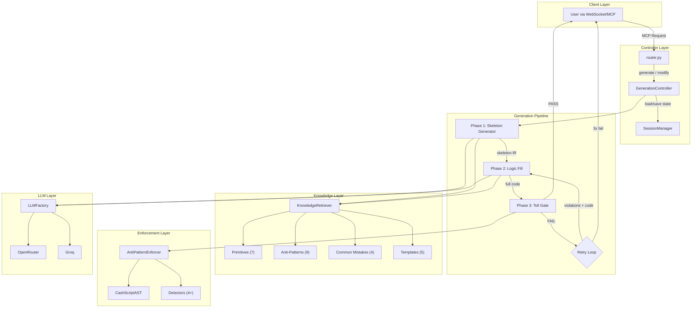
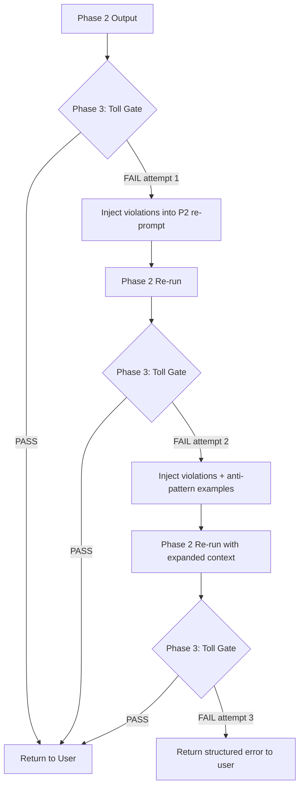

# 3-Phase CashScript Generation Architecture

> Natural Language Intent → Secure CashScript Contract

---

## 1  Architecture Diagram



---

## 2  Controller Structure — `GenerationController`

The central orchestrator replaces the current `generate_skeleton` function in [generator.py](file:///d:/downloadds/nexmcp/nexops-mcp/src/controllers/generator.py).

### Responsibilities

| Concern | Owner |
|---------|-------|
| Request parsing & routing | `router.py` (unchanged) |
| Pipeline orchestration (P1→P2→P3→retry) | `GenerationController` |
| Conversation state management | `SessionManager` |
| KB context assembly | `KnowledgeRetriever` (enhanced) |
| Anti-pattern enforcement | `AntiPatternEnforcer` (unchanged) |
| LLM calls | `LLMFactory` (unchanged) |

### Action Routing

| Action | Handler | Description |
|--------|---------|-------------|
| `generate` | `GenerationController.generate()` | Full 3-phase pipeline |
| `modify` | `GenerationController.modify()` | Targeted modification of prior contract |
| `audit` | `AuditController.audit()` | External code validation only (no generation) |

### Controller Lifecycle (generate)

```
generate(request) → 
  1. session = SessionManager.get_or_create(session_id)
  2. kb_context = KnowledgeRetriever.assemble(intent_keywords)
  3. skeleton = Phase1.run(intent, kb_context)
  4. session.store_skeleton(skeleton)
  5. full_code = Phase2.run(skeleton, kb_context, session.history)
  6. result = Phase3.validate(full_code)
  7. if result.passed:
       session.store_final(full_code)
       return full_code
     else:
       return RetryLoop.run(full_code, result.violations, ...)
```

### Controller Lifecycle (modify)

```
modify(request) →
  1. session = SessionManager.get(session_id)  # MUST exist
  2. prior = session.get_latest_contract()
  3. diff_context = build_diff_context(prior, request.modification)
  4. kb_context = KnowledgeRetriever.assemble(modification_keywords)
  5. updated = Phase2.run_modification(prior, diff_context, kb_context)
  6. result = Phase3.validate(updated)
  7. if result.passed:
       session.store_final(updated)
       return updated
     else:
       return RetryLoop.run(updated, result.violations, ...)
```

---

## 3  Internal Data Structures

### 3.1  `ContractIR` — Intermediate Representation

The core data structure passed between phases. **This is not an AST** — it is a structured JSON envelope that carries the contract through the pipeline.

```
ContractIR {
    contract_name: str
    pragma: str                        # e.g., "cashscript ^0.10.0"
    
    constructor_params: [
        { name: str, type: str, purpose: str }
    ]
    
    functions: [
        {
            name: str,
            params: [ { name: str, type: str } ],
            visibility: "public",
            structural_guards: [str],   # Phase 1 output
            business_logic: [str],      # Phase 2 output (empty after P1)
            primitives_used: [str],     # e.g., ["authorization", "time_gating"]
            requires: [str]             # require() statements
        }
    ]
    
    state: {
        is_stateful: bool,
        state_fields: [ { name: str, type: str } ],
        continuation_required: bool
    }
    
    metadata: {
        intent: str,                    # Original user request
        security_level: str,            # "high" | "medium"
        generation_phase: int,          # 1, 2, or 3
        retry_count: int,
        kb_categories_used: [str],
        timestamp: str
    }
}
```

### 3.2  `TollGateResult`

```
TollGateResult {
    passed: bool
    violations: [
        {
            rule: str,          # Anti-pattern / mistake ID
            reason: str,        # What's wrong
            exploit: str,       # How it's exploitable
            location: { line: int, function: str },
            severity: str,
            fix_hint: str       # Guidance for retry
        }
    ]
    hallucination_flags: [str]  # EVM-specific terms detected
    structural_score: float     # 0.0 - 1.0 (ratio of checks passed)
}
```

### 3.3  `SessionState`

```
SessionState {
    session_id: str
    created_at: str
    
    history: [
        {
            turn: int,
            intent: str,                 # User's request text
            contract_ir: ContractIR,     # IR at that turn
            final_code: str,             # Validated .cash output
            toll_gate_result: TollGateResult,
            kb_context_hash: str         # For cache invalidation
        }
    ]
    
    current_contract: ContractIR
    current_code: str                    # Latest validated .cash
    
    # Derived fields for efficient modification
    function_map: { fn_name → function_ir }
    param_map: { param_name → param_ir }
}
```

---

## 4  Phase Specifications

### 4.1  Phase 1 — Skeleton Generator

**Input**: User intent (natural language) + KB structural context  
**Output**: `ContractIR` with structural guards, **zero business logic**

#### What Phase 1 produces:
- Contract name and pragma
- Constructor parameters with correct CashScript types
- Function signatures (name, params, visibility)
- Structural guards **only**:
  - `require(this.activeInputIndex == 0)` anchoring
  - `require(tx.outputs[N].tokenCategory == 0x)` (NO_TOKEN)
  - `require(tx.outputs.length == N)` bounds
- Statefulness flag + state field declarations
- Empty `business_logic` arrays

#### What Phase 1 must NOT produce:
- No arithmetic expressions
- No time comparisons
- No value redistribution logic
- No covenant continuation
- No authorization (checkSig)
- No division operations

#### KB injection for Phase 1:
Only inject **template skeletons** (stripped of logic). Extract from the 5 template files:
- Function signatures
- Constructor parameter patterns
- Output count patterns

#### LLM prompt structure:
```
SYSTEM: You are a CashScript contract architect. [structural rules]
KB_CONTEXT: [template skeletons only]
USER: {intent}
FORMAT: Return JSON matching ContractIR schema (business_logic arrays empty)
```

### 4.2  Phase 2 — Logic Fill

**Input**: `ContractIR` from Phase 1 + full KB context  
**Output**: Complete `.cash` source code (compilable)

#### What Phase 2 produces:
- All `require()` statements for business logic
- Value redistribution (`require(tx.outputs[N].value == ...)`)
- Authorization (`require(checkSig(sig, pubkey))`)
- Time gating (`require(tx.time >= deadline)`)
- Covenant continuation (`require(tx.outputs[N].lockingBytecode == ...)`)
- State transition logic (if stateful)
- Division with safety guards
- Token validation (category + amount)

#### Primitive mapping:
Phase 2 must map each function to its required primitives:

| Function pattern | Required primitives |
|-----------------|---------------------|
| Any spending path | `authorization` |
| Time-locked paths | `time_gating` |
| Stateful contracts | `state_transition`, `covenant_enforcement` |
| Multi-output | `value_redistribution` |
| Token operations | `token_mint_control` |
| Any division | `division_safety` |

#### KB injection for Phase 2:
Inject relevant **primitives** (full pattern) + **anti-pattern summaries** (not full files):
- For a vesting contract: inject `time_gating`, `division_safety`, `covenant_enforcement`, `value_redistribution` primitives
- For an auction: inject `time_gating`, `authorization`, `value_redistribution` primitives
- Always inject anti-pattern constraint summaries (1-line per pattern, not full 700-line files)

#### LLM prompt structure:
```
SYSTEM: You are a CashScript security engineer. [logic fill rules]
SKELETON: {ContractIR as JSON}
KB_PRIMITIVES: [relevant primitives]
KB_CONSTRAINTS: [anti-pattern one-liners]
USER: Fill business logic into this skeleton.
FORMAT: Return complete .cash file
```

### 4.3  Phase 3 — Structural Toll Gate

**Input**: Complete `.cash` source code from Phase 2  
**Output**: `TollGateResult` (pass/fail + violations)

> [!CAUTION]
> Phase 3 is **deterministic** — it uses the existing `AntiPatternEnforcer` + `CashScriptAST`, **never** an LLM. This ensures the gate cannot be hallucinated past.

#### Detection checklist (all must pass):

| # | Check | Detection Method | Existing? |
|---|-------|-----------------|-----------|
| 1 | EVM hallucinations | Regex: `msg.sender`, `mapping`, `emit`, `modifier`, `payable`, `view`, `pure`, `constructor()` | **New** |
| 2 | Missing `tx.outputs.length` | `CashScriptAST.validates_output_count()` | ✅ Exists |
| 3 | Hardcoded input index | Regex: `tx.inputs[0]` without `this.activeInputIndex` check | **New** |
| 4 | Division without dominating `require` | AST: find `/` or `%` nodes, check for dominating `require(divisor > 0)` | **New** |
| 5 | `tokenCategory` without `tokenAmount` | AST: find `tokenCategory` checks, verify paired `tokenAmount` | **New** |
| 6 | Missing covenant continuation | AST: stateful contract without `lockingBytecode == input.lockingBytecode` | **New** |
| 7 | Implicit output ordering | `ImplicitOutputOrderingDetector` | ✅ Exists |
| 8 | Unvalidated position | `UnvalidatedPositionDetector` | ✅ Exists |
| 9 | Fee assumption | `FeeAssumptionViolationDetector` | ✅ Exists |
| 10 | Time validation error | Regex: `tx.time >` (should be `>=`) or `tx.time <=` (should be `<`) | **New** |

---

## 5  Retry Loop Design



### Retry rules:

| Retry # | Strategy | Context expansion |
|---------|----------|-------------------|
| 1 | Re-prompt P2 with violation list as explicit constraints | violations only |
| 2 | Expand KB context: inject the specific anti-pattern `.cash` file for each violation | violations + full anti-pattern docs |
| 3 | **Hard fail** — return error with violation details to user | N/A |

### What the user sees:

| Scenario | User sees |
|----------|-----------|
| P3 passes on first try | ✅ Final `.cash` code |
| P3 passes after retry 1 or 2 | ✅ Final `.cash` code (no hint of retry) |
| P3 fails after 3 retries | ❌ Structured error: `{ violations, suggestion }` |
| Intent is impossible | ❌ Error: `"IMPOSSIBLE_INTENT"` with reason |

> [!IMPORTANT]
> The user **never** sees intermediate rejected outputs. All retry outputs are internal.

---

## 6  Conversation Memory Strategy

### Storage model:

```
sessions/
  {session_id}/
    state.json          ← SessionState (serialized)
```

In-memory `dict[str, SessionState]` with optional file-system persistence.

### How modification works:

```
User: "Add a timeout refund path"
  ↓
1. Load SessionState for session_id
2. Parse modification intent → keywords: ["timeout", "refund"]
3. Identify target: new function needed (no existing function to modify)
4. Build diff_context:
   {
     "operation": "add_function",
     "function_name": "refund",
     "existing_ir": <current ContractIR>,
     "existing_code": <current .cash>
   }
5. Phase 2 receives:
   - EXISTING CONTRACT: <full current .cash>
   - MODIFICATION: "Add refund function with timeout"
   - KB_PRIMITIVES: time_gating, authorization, value_redistribution
6. Phase 2 returns: modified .cash with new function
7. Phase 3 validates entire modified contract (not just the diff)
8. On pass → store updated IR + code in session
```

### Diff operations supported:

| Operation | Example intent | How it works |
|-----------|---------------|--------------|
| `add_function` | "Add a timeout refund path" | P2 receives full contract + instruction to add function |
| `modify_function` | "Change reserve price logic" | P2 receives full contract + function name + modification |
| `change_parameter` | "Make it 2-of-2 multisig instead" | P2 receives full contract + parameter/structural change |
| `remove_function` | "Remove the reclaim path" | P2 receives full contract + removal instruction |

### What is retained across turns:

| Data | Retained? | Why |
|------|-----------|-----|
| Original intent | ✅ | For context in modifications |
| Latest `ContractIR` | ✅ | For structural awareness |
| Latest `.cash` code | ✅ | For P2 modification input |
| `TollGateResult` history | ✅ | For debugging, not sent to LLM |
| KB context hash | ✅ | Avoid redundant KB re-assembly if keywords unchanged |
| Prior intents (all turns) | ✅ | For cumulative context in prompts |
| Intermediate rejected code | ❌ | Never stored, never surfaced |

---

## 7  KB Loading & Injection Strategy

### The context window problem:

| Layer | Files | Avg lines/file | Total lines |
|-------|-------|-----------------|-------------|
| Primitives | 7 | ~400 | ~2,800 |
| Anti-patterns | 9 | ~700 | ~6,300 |
| Common mistakes | 4 | ~350 | ~1,400 |
| Templates | 5 | ~375 | ~1,875 |
| **Total** | **25** | — | **~12,375** |

Injecting all 25 files into every prompt is **impossible** (~50K tokens of KB alone).

### Tiered injection strategy:

| Phase | What to inject | Token budget |
|-------|---------------|-------------|
| **Phase 1** | Template skeletons only (struct, no logic) — ~50 lines each | ~250 tokens |
| **Phase 2** | Relevant primitives (full) + anti-pattern summaries (1-line each) | ~2,000 tokens |
| **Phase 2 retry** | Above + full anti-pattern file for each violation | ~3,500 tokens |
| **Phase 3** | Nothing (deterministic AST analysis, no LLM) | 0 tokens |

### Keyword-to-KB mapping:

Enhance `KnowledgeRetriever.assemble()` with intent classification:

| Intent keywords | Primitives to inject | Templates to reference |
|----------------|---------------------|----------------------|
| "auction", "bid", "price" | `time_gating`, `authorization`, `value_redistribution` | `auction_dutch` or `auction_english` |
| "vesting", "claim", "cliff" | `time_gating`, `division_safety`, `covenant_enforcement`, `value_redistribution` | `vesting_linear` |
| "escrow", "dispute", "arbiter" | `authorization`, `time_gating`, `value_redistribution` | `escrow_2of3` |
| "crowdfund", "pledge", "goal" | `time_gating`, `covenant_enforcement`, `value_redistribution`, `token_mint_control` | `crowdfunding_refundable` |
| "multisig", "signature" | `authorization` | — |
| "token", "mint", "NFT" | `token_mint_control`, `value_redistribution` | — |

### Anti-pattern summary format (injected into Phase 2):

Instead of injecting the full 700-line anti-pattern files, inject compressed constraint rules:

```
CONSTRAINTS (violations are FATAL):
- NEVER calculate fees (inputValue - outputValue)
- NEVER assume output ordering — validate lockingBytecode on every output
- ALWAYS validate tx.outputs.length on every function
- ALWAYS validate this.activeInputIndex
- ALWAYS check tokenCategory AND tokenAmount together
- ALWAYS use >= for "at or after", < for "before" in time checks
- NEVER allow minting without lockingBytecode validation
- ALWAYS validate lockingBytecode + tokenCategory + value on covenant continuation
```

This compresses ~6,300 lines of anti-pattern docs into ~8 lines (~100 tokens).

---

## 8  Failure Handling Model

| Failure | Source | Detection | Recovery |
|---------|--------|-----------|----------|
| LLM timeout / rate limit | LLM layer | HTTP 429 / timeout exception | `LLMFactory` failover: OpenRouter → Groq |
| LLM returns invalid JSON | Phase 1 | `json.loads()` exception | Retry with stricter format instruction (1 retry) |
| LLM returns EVM code | Phase 3 | Hallucination regex detector | Retry with explicit "CashScript ONLY, no Solidity" instruction |
| Anti-pattern violation | Phase 3 | AST detectors | Retry loop (3 attempts max) |
| Intent is impossible | Phase 1 | LLM returns `"impossible": true` with reason | Return error with structured explanation |
| Session not found | Modify action | `SessionManager.get()` returns None | Return error: `SESSION_NOT_FOUND` |
| KB file missing/corrupt | KB layer | `FileNotFoundError` / decode error | Log warning, continue without that file |
| Retry loop exhausted | Controller | `retry_count >= 3` | Return structured error with all violations |

### Error response format:

```
{
  "request_id": "...",
  "type": "error",
  "error": {
    "code": "TOLL_GATE_FAILED" | "IMPOSSIBLE_INTENT" | "SESSION_NOT_FOUND" | ...,
    "message": "Human-readable description",
    "violations": [...],                    # Only for TOLL_GATE_FAILED
    "suggestion": "Try rephrasing as..."    # Guidance for user
  }
}
```

---

## 9  Generation vs Audit — Flow Separation

| Concern | Generation flow | Audit flow |
|---------|----------------|------------|
| **Entry action** | `generate` or `modify` | `audit` |
| **Input** | Natural language intent | Raw `.cash` source code |
| **Uses LLM?** | Yes (Phase 1 + 2) | **No** |
| **Uses Phase 3?** | Yes (toll gate) | Yes (same detectors) |
| **Produces code?** | Yes | No — produces `TollGateResult` only |
| **Has retry loop?** | Yes | No — report violations, don't fix |
| **Uses KB?** | Yes (for generation) | No (for detection) |
| **Modifies session?** | Yes | No |

### Router mapping:

```python
# router.py
if action == "generate":
    return await generation_controller.generate(req)
elif action == "modify":
    return await generation_controller.modify(req)
elif action == "audit":
    return await audit_controller.audit(req)
```

The audit flow is a **strict subset** of the generation flow — it only runs Phase 3 on user-provided code and returns the result. No generation, no retry, no session.

---

## 10  Risks and Mitigations

| # | Risk | Likelihood | Impact | Mitigation |
|---|------|-----------|--------|------------|
| 1 | **LLM generates EVM/Solidity** instead of CashScript | High (CashScript is rare in training data) | Critical — user gets non-functional code | Phase 3 hallucination detector rejects; retry with explicit negative constraint |
| 2 | **Context window overflow** on complex modifications | Medium | Code truncation or quality degradation | Tiered KB injection (§7); summarize prior turns instead of including full history |
| 3 | **Retry loop produces same violation** repeatedly | Medium | 3 retries wasted, user gets error | Each retry escalates KB context (violation details → full anti-pattern file) |
| 4 | **Phase 2 produces structurally different code** on modification | Medium | User's prior logic is lost | Include full prior `.cash` in prompt with explicit "modify only X, preserve all else" |
| 5 | **Session state grows unbounded** | Low | Memory pressure | Cap session history at 10 turns; summarize older turns |
| 6 | **AST parser misses novel patterns** | Medium | False negatives in Phase 3 | Regex-based AST is inherently limited; document known blind spots; plan tree-sitter upgrade |
| 7 | **KB files change but cached KB is stale** | Low | Outdated patterns in prompts | Hash KB files on load; reload if hash changes |
| 8 | **Anti-pattern detector false positives** | Low | Valid code rejected in retry loop | Each detector must have explicit "safe" conditions documented; allow detector-specific overrides |

---

## 11  Module Map — New vs Modified Files

| File | Status | Purpose |
|------|--------|---------|
| `src/controllers/generator.py` | **MODIFY** | Replace `generate_skeleton` with `GenerationController` class |
| `src/controllers/audit.py` | **NEW** | Audit-only controller (no generation, no LLM) |
| `src/services/session.py` | **NEW** | `SessionManager` + `SessionState` |
| `src/services/pipeline.py` | **NEW** | `Phase1`, `Phase2`, `Phase3` classes + `RetryLoop` |
| `src/services/knowledge.py` | **MODIFY** | Add `assemble()` method with tiered injection |
| `src/services/anti_pattern_detectors.py` | **MODIFY** | Add 6 new detectors (EVM hallucination, division safety, etc.) |
| `src/utils/cashscript_ast.py` | **MODIFY** | Add division detection, token pair detection, covenant continuation detection |
| `src/models.py` | **MODIFY** | Add `ContractIR`, `TollGateResult`, `SessionState` models |
| `src/router.py` | **MODIFY** | Add `modify` and `audit` action routes |
| `specs/phase1_spec.md` | **MODIFY** | Update skeleton prompt template |
| `specs/phase2_spec.md` | **MODIFY** | Update logic fill prompt template |
| `specs/phase3_spec.md` | **NEW** | Toll gate detection rule spec |

---

## Proposed Changes

### Controller Layer

#### [MODIFY] [generator.py](file:///d:/downloadds/nexmcp/nexops-mcp/src/controllers/generator.py)
Replace `generate_skeleton()` and `load_phase1_prompt()` with `GenerationController` class containing `generate()`, `modify()`, and internal `_run_pipeline()` orchestrator.

#### [NEW] [audit.py](file:///d:/downloadds/nexmcp/nexops-mcp/src/controllers/audit.py)
Standalone audit controller: receives raw `.cash` code, runs Phase 3 only, returns `TollGateResult`.

---

### Service Layer

#### [NEW] [session.py](file:///d:/downloadds/nexmcp/nexops-mcp/src/services/session.py)
`SessionManager` (in-memory dict with optional file persistence) + `SessionState` dataclass.

#### [NEW] [pipeline.py](file:///d:/downloadds/nexmcp/nexops-mcp/src/services/pipeline.py)
`Phase1.run()`, `Phase2.run()`, `Phase2.run_modification()`, `Phase3.validate()`, `RetryLoop.run()`.

#### [MODIFY] [knowledge.py](file:///d:/downloadds/nexmcp/nexops-mcp/src/services/knowledge.py)
Add `assemble(intent_keywords, phase, retry_count)` — returns tiered KB context appropriate for the current phase and retry level.

#### [MODIFY] [anti_pattern_detectors.py](file:///d:/downloadds/nexmcp/nexops-mcp/src/services/anti_pattern_detectors.py)
Add 6 new detector classes to `DETECTOR_REGISTRY`: `EVMHallucinationDetector`, `DivisionSafetyDetector`, `TokenPairDetector`, `CovenantContinuationDetector`, `HardcodedInputIndexDetector`, `TimeValidationDetector`.

---

### Model Layer

#### [MODIFY] [models.py](file:///d:/downloadds/nexmcp/nexops-mcp/src/models.py)
Add `ContractIR`, `FunctionIR`, `TollGateResult`, `SessionState` Pydantic models.

---

### Router Layer

#### [MODIFY] [router.py](file:///d:/downloadds/nexmcp/nexops-mcp/src/router.py)
Add `modify` and `audit` action routing alongside existing `generate`.

---

### AST Layer

#### [MODIFY] [cashscript_ast.py](file:///d:/downloadds/nexmcp/nexops-mcp/src/utils/cashscript_ast.py)
Add: `has_division_without_guard()`, `has_token_category_without_amount()`, `has_covenant_without_continuation()`, `has_evm_hallucinations()`, `has_hardcoded_input_index()`, `has_time_validation_error()`.

---

## Verification Plan

### Automated Tests
- Unit tests for each new AST detection method with known vulnerable/secure snippets from KB
- Unit tests for `SessionManager` CRUD operations
- Integration test: `generate` action → verify Phase 3 passes on output
- Integration test: `modify` action → verify prior structure is preserved
- Regression test: run all 5 KB templates through Phase 3 → all must pass

### Manual Verification
- End-to-end: send natural language intent via WebSocket → receive valid `.cash`
- Iterative modification: generate → modify → modify → verify each output is valid
- Hallucination test: prompt with EVM terminology → verify Phase 3 rejects and retries
