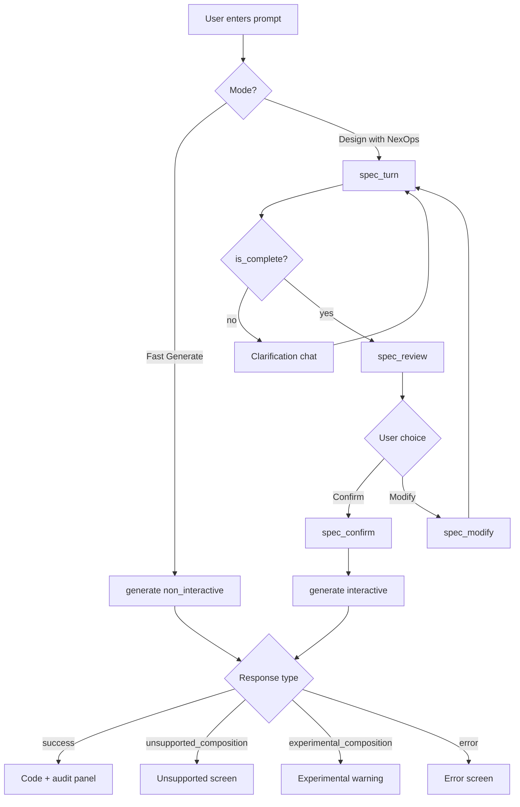

# NexOps Frontend Integration Guide

**Audience:** Frontend / product repo implementing the NexOps MCP API  
**Backend repo:** `nexops-mcp`  
**Last updated:** 2026-07-06  

This document describes every API action, response type, visual screen mapping, and the new **composition support** payloads. The frontend must **not** infer pattern support locally — render backend `composition_support` verbatim.

---

## 1. Core principles

| Principle | Rule |
|-----------|------|
| **Default = Fast Generate** | `action: "generate"` with `interactive: false`. No questions, no review. |
| **Guided = opt-in** | User selects "Design with NexOps" or similar → `interactive: true` + spec actions. |
| **Support = backend truth** | Render `composition_support` from API. Do not maintain a duplicate support matrix in the frontend. |
| **Session continuity** | Always send `session_id` after the first call. Backend stores `current_specification` on the session. |
| **Single-pattern unchanged** | "Create a 2 of 3 escrow" must work without entering spec/review flow. |

---

## 2. Request envelope

All calls use the same MCP envelope:

```json
{
  "request_id": "unique-client-id",
  "action": "<action_name>",
  "payload": { },
  "context": { }
}
```

### Actions

| Action | Purpose |
|--------|---------|
| `generate` | Run full generation pipeline (Phase 1 → Phase 2 → gates) |
| `spec_turn` | Chat / answer missing fields in guided mode |
| `spec_review` | Build human-readable specification review |
| `spec_confirm` | Mark specification confirmed (required before guided generate) |
| `spec_modify` | Reopen specification for edits |

### Context flags (`generate` only)

| Field | Default | Meaning |
|-------|---------|---------|
| `security_level` | `"high"` | `"low"` \| `"medium"` \| `"high"` |
| `interactive` | `false` | `true` → guided spec flow gates generation |
| `resolution_mode` | `"non_interactive"` | `"interactive"` when guided |
| `use_golden` | `false` | `true` → use golden templates where applicable |
| `allow_fallback` | `false` | `true` → allow secure fallback contracts |
| `allow_experimental` | `false` | `true` → proceed past `experimental_composition` block |
| `force_generate` | `false` | `true` → bypass composition block (power users / debug) |
| `skip_composition_check` | `false` | `true` → skip support assessment entirely |
| `api_key` / `openrouter_key` / `provider` | — | BYOK for LLM calls |

---

## 3. Response types (complete matrix)

| `type` | When | Blocks generation? | Primary UI |
|--------|------|-------------------|------------|
| `success` | Code generated | No | Code viewer + scores |
| `error` | Parse/semantic/compile failure | Yes | Error banner |
| `needs_input` | Missing spec fields (interactive) | Yes | Clarification form |
| `review` | Spec in review, not confirmed (interactive generate) | Yes | Review screen |
| `spec_turn` | Assistant reply / field collection | — | Chat + form |
| `spec_review` | Review payload from spec action | — | Review screen |
| `spec_confirm` | Spec confirmed | — | Proceed to generate |
| `spec_modify` | Spec reopened | — | Chat editor |
| `unsupported_composition` | **NEW** — composed pattern not production-supported | Yes | Mode C screen |
| `experimental_composition` | **NEW** — partial/experimental support | Yes until `allow_experimental` | Warning + opt-in |

### WebSocket progress (optional)

If your transport supports `on_update` callbacks (CLI/benchmark pattern), generation emits:

```json
{
  "type": "update",
  "stage": "phase1_parsing | phase1_complete | phase2_drafting | ...",
  "status": "processing | warning",
  "message": "Human-readable status",
  "attempt": 1
}
```

Use for a progress stepper during `generate`.

---

## 4. Product modes and screen map



---

## 5. Mode A — Fast Generate (default)

### Request

```json
{
  "request_id": "req-001",
  "action": "generate",
  "payload": {
    "user_request": "Create a 2 of 3 escrow with buyer, seller, and arbiter",
    "session_id": "sess-abc"
  },
  "context": {
    "security_level": "high",
    "interactive": false,
    "resolution_mode": "non_interactive"
  }
}
```

### Success response

```json
{
  "request_id": "req-001",
  "type": "success",
  "data": {
    "stage": "complete",
    "code": "pragma cashscript ^0.13.0;\n\ncontract ...",
    "contract_name": "GeneratedContract",
    "session_id": "sess-abc",
    "toll_gate": {
      "passed": true,
      "structural_score": 0.95,
      "violations": []
    },
    "sanity_check": { },
    "intent_model": {
      "contract_type": "escrow",
      "features": ["multisig", "escrow"],
      "signers": ["buyer", "seller", "arbiter"],
      "threshold": 2
    },
    "synthesis": {
      "compile_pass": true,
      "converged": true,
      "fallback_used": false
    }
  }
}
```

### Visual: Fast Generate result

```
┌─────────────────────────────────────────────────────────────┐
│  Generated Contract                              [Copy] [↓] │
├─────────────────────────────────────────────────────────────┤
│  Intent: escrow · multisig · 2-of-3                         │
│  Status: ✓ Compiled  ✓ Converged  Score: 0.95              │
├─────────────────────────────────────────────────────────────┤
│  pragma cashscript ^0.13.0;                                 │
│  contract Escrow(...) { ... }                               │
│                                                             │
├─────────────────────────────────────────────────────────────┤
│  [ Audit ]  [ Edit ]  [ New contract ]                      │
└─────────────────────────────────────────────────────────────┘
```

**Render from API:**
- `data.code` → monospace editor
- `data.intent_model.contract_type` + `features` → chips/tags
- `data.synthesis.converged` → green/red badge
- `data.toll_gate.structural_score` → optional meter

---

## 6. Mode B — Guided Specification

### 6.1 Start conversation — `spec_turn`

```json
{
  "request_id": "req-002",
  "action": "spec_turn",
  "payload": {
    "user_request": "Create a treasury with weighted multisig and linear decay after 30 days",
    "message": "Create a treasury with weighted multisig and linear decay after 30 days",
    "session_id": "sess-xyz"
  },
  "context": {
    "openrouter_key": "<key>",
    "provider": "openrouter"
  }
}
```

### Response (incomplete)

```json
{
  "request_id": "req-002",
  "type": "spec_turn",
  "data": {
    "message": "I need a few more details to build this safely...",
    "specification": {
      "intent": "...",
      "capabilities": [
        { "name": "treasury", "parameters": {} },
        { "name": "weighted_multisig", "parameters": {} },
        { "name": "linear_decay", "parameters": {} }
      ],
      "parameters": {},
      "status": "needs_input"
    },
    "still_missing": ["holders", "weights", "initial_threshold", "final_threshold", "duration_days", "asset_type"],
    "is_complete": false,
    "session_id": "sess-xyz"
  }
}
```

### Visual: Clarification chat

```
┌─────────────────────────────────────────────────────────────┐
│  Contract Architect                                         │
├─────────────────────────────────────────────────────────────┤
│  You: Create a treasury with weighted multisig...           │
│                                                             │
│  NexOps: I need a few more details...                       │
│                                                             │
│  Still needed:                                              │
│  ┌─────────────────────────────────────────────────────┐   │
│  │ Key holders (count)     [ 3          ]               │   │
│  │ Voting weights          [ 50, 30, 20 ]               │   │
│  │ Initial threshold       [ 2          ]               │   │
│  │ Final threshold         [ 3          ]               │   │
│  │ Duration (days)         [ 30         ]               │   │
│  │ Asset type              [ BCH        ▼]               │   │
│  └─────────────────────────────────────────────────────┘   │
│                                                             │
│  [ Submit answers ]                                         │
└─────────────────────────────────────────────────────────────┘
```

**Structured answers** — send another `spec_turn` with:

```json
{
  "payload": {
    "session_id": "sess-xyz",
    "answers": {
      "holders": 3,
      "weights": [50, 30, 20],
      "initial_threshold": 2,
      "final_threshold": 3,
      "duration_days": 30,
      "asset_type": "BCH"
    }
  }
}
```

### 6.2 Review — `spec_review`

With **Constraint Graph v2** (default), `spec_review` returns the authoritative graph plus projected sections. Edits mutate the graph via optional `graph_edits` in the request payload.

```json
{
  "action": "spec_review",
  "payload": {
    "session_id": "sess-xyz",
    "graph_edits": {
      "intent": "optional updated summary",
      "nodes": [{ "id": "n_abc123", "params": { "threshold": 2 } }]
    }
  }
}
```

### Response (includes composition support + constraint graph)

```json
{
  "type": "spec_review",
  "data": {
    "graph_v2": true,
    "constraint_graph": {
      "version": 1,
      "intent": "Create a treasury with weighted multisig",
      "nodes": [],
      "edges": [],
      "field_confidences": []
    },
    "review": {
      "sections": {
        "Patterns": ["treasury", "weighted_multisig", "linear_decay"],
        "Actors": [],
        "Lifecycle": ["Draft", "Funded", "Locked"],
        "Policies": ["Decay/Linear: {...}"],
        "Invariants": ["value_preservation"],
        "Core Pattern": ["Create a treasury with..."],
        "Access Control": ["Weighted: {...}"],
        "Time Rules": [],
        "Assets": [],
        "Operations": [],
        "Security": []
      },
      "constraint_graph": { "version": 1, "nodes": [], "edges": [] },
      "utxo_architecture": {
        "contracts": [
          { "id": "treasury", "type": "Vault" },
          { "id": "auth", "type": "Multisig" },
          { "id": "decay", "type": "ThresholdPolicy" }
        ],
        "transactions": [ ],
        "state_objects": [ ]
      }
    },
    "specification": { "status": "in_review", "..." : "..." },
    "composition_support": {
      "status": "unsupported",
      "reason": "This contract composition is not production-supported yet...",
      "detail": "Detected capabilities: ... Planned modules: VaultModule, WeightedMultisigModule, LinearThresholdModule",
      "detected_capabilities": ["linear_decay", "treasury", "vault", "weighted_multisig"],
      "selected_modules": ["VaultModule", "WeightedMultisigModule", "LinearThresholdModule"],
      "effective_mode": "vault",
      "suppressed_modules": ["WeightedMultisigModule", "LinearThresholdModule"],
      "supported_subset": ["2-of-3 escrow", "Multisig wallet", "Vault", "Dutch auction", "Linear vesting / decay"],
      "suggestions": [
        {
          "id": "vault",
          "label": "Vault",
          "description": "Staged withdrawal or delayed-release vault covenant.",
          "prompt_example": "Create a vault with delayed withdrawal after 7 days",
          "capabilities": ["vault", "treasury"]
        }
      ],
      "can_save_spec": true,
      "can_proceed": false,
      "capability_conflicts": []
    },
    "planning_report": {
      "detected_capabilities": ["..."],
      "selected_modules": ["VaultModule", "WeightedMultisigModule", "LinearThresholdModule"],
      "effective_mode": "vault"
    },
    "session_id": "sess-xyz"
  }
}
```

### Visual: Specification Review

```
┌─────────────────────────────────────────────────────────────┐
│  CONTRACT SPECIFICATION REVIEW                              │
├─────────────────────────────────────────────────────────────┤
│  ⚠ NOT PRODUCTION-SUPPORTED                                 │
│  This composition is not production-supported yet.          │
│  Generation currently collapses to vault and drops          │
│  WeightedMultisigModule, LinearThresholdModule.             │
│                                                             │
│  Planned modules:                                           │
│    ✓ VaultModule          → used (vault)                    │
│    ✗ WeightedMultisigModule → suppressed                    │
│    ✗ LinearThresholdModule  → suppressed                    │
├─────────────────────────────────────────────────────────────┤
│  Core Pattern                                               │
│    • Create a treasury with weighted multisig...            │
│  Access Control                                             │
│    • Weighted Multisig                                      │
│    • Key holders: 3                                         │
│  Time Rules                                                 │
│    • Linear threshold change                                │
│    • Duration: 30 days                                      │
│  UTXO Architecture                                          │
│    • Contract treasury: Vault                               │
│    • Contract auth: Multisig                                │
│    • Contract decay: ThresholdPolicy                        │
│    • withdraw: [TreasuryNFT, AuthUTXO] → [...]              │
├─────────────────────────────────────────────────────────────┤
│  Simpler alternatives:                                      │
│  ┌──────────────┐ ┌──────────────┐ ┌──────────────┐      │
│  │ Vault        │ │ 2-of-3 Escrow│ │ Multisig     │      │
│  │ [Use this]   │ │ [Use this]   │ │ [Use this]   │      │
│  └──────────────┘ └──────────────┘ └──────────────┘      │
├─────────────────────────────────────────────────────────────┤
│  [ Save spec only ]  [ Modify ]  [ Generate anyway ▼ ]    │
└─────────────────────────────────────────────────────────────┘
```

**Important UX rules on review screen:**

| `composition_support.status` | Banner color | Primary CTA | Generate button |
|------------------------------|--------------|-------------|-----------------|
| `supported` | Green / none | Confirm & Generate | Enabled |
| `experimental` | Amber | "Generate with caution" | Disabled until user confirms risk |
| `unsupported` | Red | Save spec / pick alternative | Disabled (unless `force_generate` dev toggle) |

**Render `suggestions[]` as cards:**
- `label` → card title
- `description` → body
- `prompt_example` → pre-fill for new Fast Generate or replace session prompt
- On click → either start new session with that prompt (Mode A) or reset spec

**Render `suppressed_modules[]` as struck-through or ghost chips** next to `selected_modules[]`.

### 6.3 Confirm — `spec_confirm`

```json
{
  "action": "spec_confirm",
  "payload": { "session_id": "sess-xyz" }
}
```

Response sets `specification.status` to `"confirmed"`.

**"Save spec only"** (no generation):
1. Call `spec_confirm`
2. Do **not** call `generate`
3. Show toast: "Specification saved. Generation for this composition is not supported yet."

### 6.4 Generate after confirm — `generate` (interactive)

```json
{
  "action": "generate",
  "payload": {
    "user_request": "Create a treasury with weighted multisig and linear decay after 30 days",
    "session_id": "sess-xyz"
  },
  "context": {
    "interactive": true,
    "resolution_mode": "interactive"
  }
}
```

If composition is **unsupported**, backend returns `unsupported_composition` **before** Phase 2 — same payload as review's `composition_support`.

---

## 7. Mode C — Unsupported / Experimental (backend-driven)

### 7.1 `unsupported_composition`

Returned from `generate` when `composition_support.status === "unsupported"` and `force_generate` is false.

```json
{
  "request_id": "req-003",
  "type": "unsupported_composition",
  "data": {
    "composition_support": { },
    "specification": { },
    "planning_report": { },
    "intent_model": { }
  }
}
```

### Visual: Unsupported screen

```
┌─────────────────────────────────────────────────────────────┐
│  ⛔ Composition not supported                               │
├─────────────────────────────────────────────────────────────┤
│  {composition_support.reason}                               │
│                                                             │
│  {composition_support.detail}                               │
│                                                             │
│  What NexOps supports today:                                │
│    • 2-of-3 escrow                                          │
│    • Multisig wallet                                        │
│    • Vault                                                  │
│    • Dutch auction                                          │
│    • Linear vesting / decay                                 │
│                                                             │
│  Try instead:                                               │
│  ┌─────────────────────────────────────────────────────┐   │
│  │ Vault                                                │   │
│  │ Staged withdrawal or delayed-release vault...        │   │
│  │ "Create a vault with delayed withdrawal after 7 days"  │   │
│  │                                    [ Use this prompt ] │   │
│  └─────────────────────────────────────────────────────┘   │
├─────────────────────────────────────────────────────────────┤
│  [ Save specification ]    [ Back to edit ]                 │
└─────────────────────────────────────────────────────────────┘
```

**Field mapping:**

| API field | UI element |
|-----------|------------|
| `reason` | Headline |
| `detail` | Expandable technical detail |
| `supported_subset` | Bulleted "supported today" list |
| `suggestions[]` | Alternative cards with `prompt_example` button |
| `suppressed_modules` | "Will NOT be generated" list |
| `effective_mode` | Small badge: "Would generate as: vault" |
| `can_save_spec` | Show "Save specification" if true |
| `capability_conflicts` | Red inline alerts if non-empty |

### 7.2 `experimental_composition`

```json
{
  "type": "experimental_composition",
  "data": {
    "composition_support": {
      "status": "experimental",
      "can_proceed": false,
      "reason": "Split payment generation is experimental (~50% benchmark convergence)."
    },
    "message": "This composition is experimental. Set context.allow_experimental=true to generate anyway.",
    "specification": { },
    "planning_report": { },
    "intent_model": { }
  }
}
```

### Visual: Experimental warning

```
┌─────────────────────────────────────────────────────────────┐
│  ⚠ Experimental composition                                │
├─────────────────────────────────────────────────────────────┤
│  {composition_support.reason}                               │
│                                                             │
│  First-pass quality may be below production standard.       │
│                                                             │
│  [ Cancel ]     [ Generate anyway ]                         │
└─────────────────────────────────────────────────────────────┘
```

On **Generate anyway**, retry:

```json
{
  "context": {
    "allow_experimental": true
  }
}
```

---

## 8. `composition_support` schema reference

```typescript
type CompositionSupportAssessment = {
  status: "supported" | "experimental" | "unsupported";
  reason: string;
  detail: string;
  detected_capabilities: string[];
  selected_modules: string[];
  effective_mode: string;
  suppressed_modules: string[];
  supported_subset: string[];
  suggestions: SuggestedAlternative[];
  can_save_spec: boolean;
  can_proceed: boolean;
  capability_conflicts: string[];
};

type SuggestedAlternative = {
  id: string;
  label: string;
  description: string;
  prompt_example: string;
  capabilities: string[];
};
```

### Status meanings (do not re-derive)

| `status` | Meaning |
|----------|---------|
| `supported` | Safe to generate. No banner required. |
| `experimental` | May generate with user opt-in (`allow_experimental: true`). |
| `unsupported` | Do not generate unless `force_generate: true` (debug only). |

### Backend-blocked compositions (examples)

- Treasury + weighted multisig + linear decay (3 modules)
- Weighted multisig + linear decay together
- Split + other patterns
- Capability conflicts from registry (e.g. split vs escrow)

### Backend-allowed examples

- Single vault, multisig, escrow, auction, timelock
- Escrow + multisig (2-of-3 escrow)
- Single linear_decay / split (experimental)

---

## 9. `specification` object reference

```typescript
type ContractSpecification = {
  intent: string;
  capabilities: { name: string; parameters: Record<string, unknown> }[];
  parameters: Record<string, unknown>;
  status: "draft" | "needs_input" | "in_review" | "confirmed";
};
```

### Known capability names

`treasury`, `vault`, `weighted_multisig`, `multisig`, `linear_decay`, `timelock`, `escrow`, `split`, `auction`, `token_ft`, `nft_immutable`, `nft_mutable`, `nft_minting`, `hybrid_token`, `withdrawal_policy`

### Common parameter keys

| Key | Used by |
|-----|---------|
| `signers`, `threshold` | multisig, escrow |
| `holders`, `weights` | weighted_multisig |
| `initial_threshold`, `final_threshold`, `duration_days` | linear_decay |
| `timeout_days` | timelock, escrow |
| `asset_type` | treasury, vault, auction |
| `start_price`, `min_price` | auction |
| `recipients`, `shares` | split |
| `token_category`, `max_supply` | tokens |

---

## 10. Error responses

```json
{
  "request_id": "req-err",
  "type": "error",
  "error": {
    "code": "semantic_unsupported | intent_parse_failed | MISSING_INTENT | ...",
    "message": "Human-readable explanation"
  },
  "synthesis": {
    "compile_pass": false,
    "converged": false
  }
}
```

| Code | UI |
|------|-----|
| `semantic_unsupported` | Explain BCH vs token mismatch; suggest rephrasing |
| `intent_parse_failed` | Ask user to simplify prompt |
| `MISSING_SPEC` | Session lost — restart guided flow |
| `INCOMPLETE_SPEC` | Show `missing_fields` from spec_review error |

---

## 11. Recommended frontend state machine

```typescript
type AppPhase =
  | "idle"
  | "generating"           // generate in flight
  | "clarifying"           // spec_turn, is_complete=false
  | "reviewing"            // spec_review shown
  | "unsupported"          // unsupported_composition
  | "experimental_gate"    // experimental_composition
  | "complete";            // success with code

// Store per session:
interface SessionState {
  sessionId: string;
  specification?: ContractSpecification;
  compositionSupport?: CompositionSupportAssessment;
  lastIntent?: string;
  mode: "fast" | "guided";
}
```

### Routing logic (pseudocode)

```typescript
function handleResponse(res: MCPResponse) {
  switch (res.type) {
    case "success":
      showCode(res.data.code, res.data.intent_model, res.data.synthesis);
      break;
    case "unsupported_composition":
      setPhase("unsupported");
      renderCompositionSupport(res.data.composition_support);
      break;
    case "experimental_composition":
      setPhase("experimental_gate");
      renderCompositionSupport(res.data.composition_support);
      break;
    case "needs_input":
      setPhase("clarifying");
      showQuestions(res.data.clarification_plan?.questions, res.data.specification);
      break;
    case "review":
      setPhase("reviewing");
      showReview(res.data.review, res.data.composition_support);
      break;
    case "spec_turn":
      if (!res.data.is_complete) setPhase("clarifying");
      else goToSpecReview();
      break;
    case "spec_review":
      setPhase("reviewing");
      showReview(res.data.review, res.data.composition_support);
      break;
    case "error":
      showError(res.error);
      break;
  }
}
```

---

## 12. What NOT to build in the frontend

| Do not | Why |
|--------|-----|
| Maintain your own "supported patterns" list | Backend `composition_support` is authoritative |
| Force all users through spec review | Breaks Fast Generate for escrow/multisig |
| Auto-enable `interactive: true` | Only for guided mode |
| Hide `suppressed_modules` on unsupported compositions | Users must see what will NOT be generated |
| Call `generate` on unsupported without user consent | Backend blocks; UX should explain first |

---

## 13. Quick integration checklist

- [ ] Fast Generate button → `generate` + `interactive: false`
- [ ] "Design with NexOps" → `spec_turn` loop
- [ ] Review screen reads `review.sections` + `utxo_architecture`
- [ ] Review screen reads `composition_support` for banner + alternatives
- [ ] Confirm → `spec_confirm` then `generate` with `interactive: true`
- [ ] Handle `unsupported_composition` with save/alternative CTAs
- [ ] Handle `experimental_composition` with opt-in retry
- [ ] Preserve `session_id` across all calls
- [ ] Progress stepper from WebSocket `update` events (optional)
- [ ] Suggestion card click → pre-fill prompt + new Fast Generate session

---

## 14. Example end-to-end flows

### Flow 1: 2-of-3 escrow (unchanged)

1. User: "Create a 2 of 3 escrow"
2. `generate` (non-interactive)
3. `type: success` → show code  
4. **Never** show spec review or unsupported screen

### Flow 2: Treasury composition (blocked)

1. User selects guided mode
2. `spec_turn` until `is_complete`
3. `spec_review` → `composition_support.status: unsupported`
4. Show review + red banner + alternatives
5. User picks "Vault" suggestion → new Fast Generate with `prompt_example`
6. OR user saves spec via `spec_confirm` without generate

### Flow 3: Split payment (experimental)

1. `generate` "Split payroll to 3 recipients"
2. `type: experimental_composition`
3. Show amber warning
4. User clicks "Generate anyway" → retry with `allow_experimental: true`
5. `type: success` or `error`
