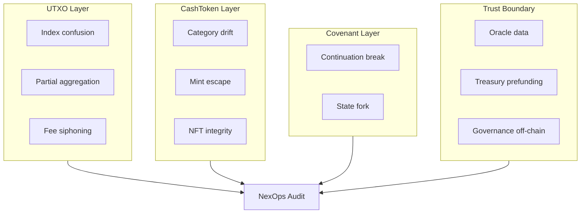

# BCH Real-World Threat Model

**Workstream:** H  
**Scope:** Bitcoin Cash UTXO + CashTokens + covenant audit threats for NexOps.

---

## Threat Landscape Overview

---

## UTXO-Specific Threats

| Threat | Description | NexOps coverage |
|--------|-------------|-----------------|
| Input index confusion | Hardcoded `tx.inputs[N]` without length guard | **full** — `fixed_index_oob`, `unvalidated_position` |
| activeInputIndex underflow | Subtract without lower bound | **full** — `index_underflow` |
| Partial aggregation | Loop doesn't cover all inputs | **full** — `partial_aggregation_risk` |
| Input/output coupling | Read input without output constraint | **full** — `input_output_coupling` |
| Fee siphoning | Attacker extracts value via fee/change | **partial** — `fee_assumption_violation` |
| Change leakage | Unconstrained change output | **partial** — `output_binding_missing` |
| Output ordering assumptions | Index order without bytecode bind | **full** — `implicit_output_ordering` |

---

## CashToken Threats

| Threat | Category | NexOps coverage |
|--------|----------|-----------------|
| Minting authority escape | 0x02 leaves covenant | **full** — `authority_leak`, `minting_authority_escape` |
| Mutable NFT no re-anchor | 0x01 update without continuation | **full** — `mutable_capability_leak` |
| Token category drift | Output category ≠ input | **full** — `token_category_drift` |
| Amount inflation | Unbounded tokenAmount increase | **full** — `token_amount_inflation`, `unbounded_mint` |
| Unintended burn | Send to 0x00 without policy | **full** — `token_amount_burn` |
| Commitment loss | Immutable NFT commitment not preserved | **full** — `nft_commitment_loss` |
| Hybrid migration break | FT↔NFT transition loses rules | **full** — `hybrid_continuity_break` |
| Soulbound violation | NFT to external script | **partial** — `capability_unrestricted_nft_transfer` |

---

## Covenant Threats

| Threat | Description | Coverage |
|--------|-------------|----------|
| Continuation break | Next output not `activeBytecode` | **partial** — `vulnerable_covenant` |
| State fork | Two valid next states | **partial** — reasoning only |
| Premature exit | Spend without required state update | **partial** |
| Cross-covenant replay | Same state used in two chains | **none** — out of scope |

---

## Oracle & Trust-Boundary Threats

| Threat | On-chain? | Coverage |
|--------|-----------|----------|
| Wrong oracle UTXO | Yes | **partial** — output binding on oracle input |
| Stale price | No (deployment) | **reasoning** — trust_assumption |
| Malicious oracle operator | No | **reasoning** — DEPLOYMENT_REQUIREMENT |
| Off-chain key rotation | No | **reasoning** — TRUST-2 |
| Treasury prefunding | No | **reasoning** — TRUST-1, FP-001 |

**Rule:** Distinguish **exploitable on-chain flaw** vs **trust assumption** (V2.1 mandatory check).

---

## Multi-Contract & Treasury Threats

| Threat | Description | Coverage |
|--------|-------------|----------|
| External UTXO funding | Who funds escrow/treasury | deployment note |
| LP provides liquidity | Third party funds payroll UTXO | TRUST-3 |
| DAO timelock bypass | Emergency path skips delay | **none** — P0 gap |
| Cross-contract replay | Reuse hashlock across swaps | **none** |

---

## Authorization Threat Model

| Class | Example | Layer |
|-------|---------|-------|
| Missing auth | No checkSig on spend | intent_invariants + detectors |
| Fake auth | Dead-code checkSig | adversarial FAKE_AUTH |
| Dual path | publicSpend + adminSpend | adversarial HIDDEN_AUTH |
| Multisig weak | Reused pubkeys | detectors |
| Intent vs enforcement | Declared 2-of-3, code 1-of-2 | SanityChecker + intent |

---

## Attack Class → Audit Layer Map

See [`coverage_gap_analysis.md`](coverage_gap_analysis.md) for detector vs reasoning split.

---

## Trust vs Exploit Decision Tree

1. Can attacker gain value **without** breaking on-chain requires? → **trust_assumption**
2. Does bundle prove auth/value invariant ENFORCED? → judge must not claim opposite
3. Is issue deployment/operator error only? → NON_ATTACKER triggerability
4. Material value at risk via unbound output? → attacker_gain + VULNERABILITY

---

## References

- Security patterns: [`security_patterns/`](security_patterns/)
- Adversarial traps: [`adversarial_strategy.md`](adversarial_strategy.md)
- FP patterns: [`false_positive_playbook.md`](false_positive_playbook.md)
