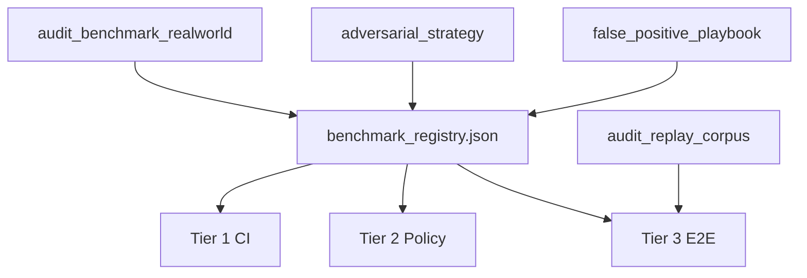

# NexOps Audit Benchmark Strategy

**Branch:** `research/audit-sprint-v2`  
**Workstream:** A (#1)  
**Generated:** 2026-06-18

## Executive Summary

NexOps has **183 generation benchmark cases** (`benchmark/suites/`) but only **~45 audit evaluation scenarios** (22 classification matrix + 23 adversarial judge). This document defines a permanent **180-entry audit benchmark registry** ([`benchmark_registry.json`](benchmark_registry.json)) that closes the measurement gap.

**North star:** Every future change to detectors, Semantic Judge V2.1, prompts, or models must be measurable against this corpus.

---

## Problem Statement

| Corpus | Location | Count | Measures |
|--------|----------|-------|----------|
| Generation benchmarks | `benchmark/suites/*.yaml` | 183 | Code generation quality |
| Classification matrix | `tests/audit_classification_matrix/` | 22 | Policy + intent invariants (mocked judge) |
| Adversarial judge | `tests/adversarial_semantic_judge/` | 23 | Judge guard + policy mapping |
| CashTokens fixtures | `tests/fixtures/cashtokens_invalid/` | 8 pairs | Detector precision |
| **Audit benchmark (new)** | `docs/benchmark_registry.json` | **180** | Full audit path evaluation |

Generation benchmarks test whether NexOps **produces** safe code. Audit benchmarks test whether NexOps **detects** unsafe code. These are orthogonal capabilities requiring separate corpora.

---

## Benchmark Schema

Each entry in `benchmark_registry.json` follows:

```json
{
  "id": "bench_escrow_001",
  "family": "escrow",
  "intent": "Natural-language intent string matching Phase 1 output.",
  "contract_ref": "Path or inline reference to .cash source",
  "mutation": "secure_baseline | remove_checksig | output_binding_missing | ...",
  "expected_findings": ["intent_auth_gate", "output_binding_missing"],
  "expected_severity": ["HIGH", "MEDIUM"],
  "expected_invariants": ["auth_gate:ENFORCED", "recipient_binding:MISSING"],
  "expected_kind": ["vulnerability", "invariant_gap"],
  "evaluation_mode": "detector_only | policy_only | full_audit",
  "source": "handcrafted | migrated_from_generation | adversarial_variant | realworld",
  "tier": 1,
  "notes": "Optional FP prevention or migration notes"
}
```

### Field Definitions

| Field | Purpose |
|-------|---------|
| `id` | Stable identifier; prefix `bench_` |
| `family` | Canonical pattern family (see [`pattern_profiles.py`](../src/services/pattern_profiles.py)) |
| `intent` | Declared intent for intent-invariant verification |
| `contract_ref` | Source artifact; implementation phase materializes inline `.cash` |
| `mutation` | Single-flaw variant applied to secure baseline |
| `expected_findings` | Rule IDs or semantic gap IDs that must appear |
| `expected_severity` | Parallel to findings; empty = no findings expected |
| `expected_invariants` | `invariant_id:STATUS` from intent matrix |
| `expected_kind` | `FindingKind` values after policy |
| `evaluation_mode` | Which pipeline stages participate |
| `source` | Provenance for corpus maintenance |
| `tier` | CI tier (1/2/3) — see Evaluation Tiers |

---

## Evaluation Tiers

### Tier 1 — Deterministic (CI-safe, no LLM)

**Pipeline:** compile → lint → `validate_audit()` → `verify_intent_invariants()`

**Use for:** Detector regression, invariant matrix accuracy, compile/lint gates.

**Registry count:** ~120 entries (`evaluation_mode: detector_only`, `tier: 1`)

### Tier 2 — Policy (CI-safe, mocked judge)

**Pipeline:** Tier 1 + mocked `SemanticJudgment` → `finalize_from_judgment()`

**Use for:** Finding kind, severity caps, triggerability, FP prevention.

**Registry count:** ~35 entries (`evaluation_mode: policy_only`, `tier: 2`)

**Existing implementation:** [`tests/audit_classification_matrix/`](../tests/audit_classification_matrix/)

### Tier 3 — Full E2E (non-CI, live LLM)

**Pipeline:** Tier 1 + `run_semantic_judge()` with live model

**Use for:** Judge compliance regression, model upgrade evaluation, prompt A/B.

**Registry count:** ~25 entries (`evaluation_mode: full_audit`, `tier: 3`)

**Existing implementation:** Adversarial judge tests (mock-only today); Tier 3 requires nightly runner.

---

## Corpus Composition

| Family | Target | Registry Count | Primary Seed |
|--------|--------|----------------|--------------|
| Payroll / split | 12 | 4 handcrafted + 8 migration | Classification matrix |
| Escrow | 10 | 18 migration | `escrow.yaml`, `escrow_suite.yaml` |
| Vault | 8 | 12 migration | `vaults.yaml`, classification |
| Timelock | 8 | 10 migration | `timelock.yaml` |
| Hashlock | 8 | 10 migration | `hashlock.yaml` (**zero audit coverage today**) |
| Multisig | 8 | 12 migration | `multisig.yaml`, classification |
| Split payment | 6 | 8 migration | `split_payment.yaml` |
| Subscription/decay | 8 | 6 migration | `decay.yaml`, `vesting.yaml` |
| Refundable | 6 | 12 migration | `refundable_payment.yaml` |
| Conditional spend | 6 | 10 migration | `conditional_spend.yaml` |
| Covenant | 8 | 6 migration | `covenant.yaml`, `stateful_suite.yaml` |
| Oracle | 6 | 6 handcrafted | Adversarial `ORACLE_PRICE` |
| DAO treasury | 4 | 4 handcrafted | Composite patterns |
| CashTokens FT | 8 | 6 migration | `cashtokens_ft.yaml`, invalid fixtures |
| CashTokens NFT | 8 | 8 migration | NFT suites + fixtures |
| Hybrid | 6 | 4 migration | `cashtokens_hybrid.yaml` |
| Cross-family | 8 | 8 handcrafted | Multi-pattern combos |
| Real-world (A.5) | 20+ | 20 slots | `audit_benchmark_realworld/` |

**Total:** 180 entries in [`benchmark_registry.json`](benchmark_registry.json)

---

## Migration Playbook

### Step 1: Identify generation case

Source: `benchmark/suites/{suite}.yaml` case `{id}` with intent text and `pattern` field.

Example: `esc_001` in `escrow.yaml` — 2-of-2 escrow with buyer+seller signatures.

### Step 2: Obtain secure baseline

Priority order for baseline `.cash`:

1. Converged code from `benchmark/results/*.json` for that case ID
2. Golden template from `knowledge/golden/patterns/`
3. Hand-crafted minimal secure contract matching intent

### Step 3: Apply single-flaw mutation

| Mutation | Change | Expected finding |
|----------|--------|------------------|
| `secure_baseline` | None | No vulnerability findings |
| `missing_auth` | Remove `checkSig`/`checkMultiSig` | `intent_auth_gate` |
| `output_binding_missing` | Remove `lockingBytecode` require | `output_binding_missing` |
| `index_underflow` | Subtract from `activeInputIndex` without guard | `index_underflow` |
| `token_category_drift` | Unbound output `tokenCategory` | `token_category_drift` |
| `authority_leak` | Mint 0x02 without covenant bind | `authority_leak` |

**Rule:** One mutation per benchmark entry. Multi-flaw cases belong in adversarial corpus (Workstream B).

### Step 4: Set expected invariants

Run intent text through [`intent_invariants.py`](../src/services/intent_invariants.py) heuristics:

| Intent marker | Invariant |
|---------------|-----------|
| "owner must sign", "authorize" | `auth_gate` |
| "fixed salary", "predetermined amount" | `fixed_amount_per_recipient` |
| "recipient", "employee", "lockingBytecode" | `recipient_binding` |
| "split", "payroll", "distribute" | `value_conservation` |
| Token split intents | `token_category_preservation` |
| "pre-funded", "treasury" | `treasury_prefunding` (NOT_ENFORCEABLE_ONCHAIN) |

### Step 5: Assign tier and mode

- Deterministic flaw → Tier 1, `detector_only`
- Trust/deployment assumption → Tier 2, `policy_only`
- Requires judge reasoning → Tier 3, `full_audit`

---

## Generation → Audit Migration Map (Sample)

Full registry in JSON. Key mappings:

| Generation ID | Suite | Audit benchmark prefix | Notes |
|---------------|-------|------------------------|-------|
| `esc_001`–`esc_006` | escrow.yaml | `bench_mig_*` | 2 flaws each (secure + missing_auth) |
| `hl_001`–`hl_005` | hashlock.yaml | `bench_mig_*` | **New audit coverage** |
| `ct_invalid_*` | cashtokens_invalid_negative.yaml | `bench_mig_*` | Maps to detector fixtures |
| `payroll_a`–`payroll_d` | classification matrix | `bench_payroll_001`–`004` | Handcrafted seeds |
| `rp_001`–`rp_006` | refundable_payment.yaml | `bench_mig_*` | Refund path auth checks |
| `cs_001`–`cs_005` | conditional_spend.yaml | `bench_mig_*` | Atomic swap conditions |

183 generation cases × 2 variants (secure + flaw) would yield 366 entries; current registry selects **representative subset** prioritizing families with zero audit coverage and CashTokens detector alignment.

---

## CI / Non-CI Split

| Tier | CI job | Pass criteria |
|------|--------|---------------|
| 1 | `pytest tests/audit_benchmark/test_tier1_deterministic.py` | 100% expected findings match |
| 2 | `pytest tests/audit_classification_matrix/` (existing) | 22/22 + expanded matrix |
| 3 | Nightly `scripts/run_audit_benchmark_e2e.py` | ≥95% kind/severity match |

**Implementation handoff:** Create `tests/audit_benchmark/` loader that reads `benchmark_registry.json`, resolves `contract_ref`, runs appropriate tier.

---

## False Positive Guards

Benchmarks must encode **negative expectations** (no finding expected):

| Scenario | Must NOT expect | Reference |
|----------|-----------------|-----------|
| Treasury prefunding | `VULNERABILITY` | [`false_positive_playbook.md`](false_positive_playbook.md) |
| Secure payroll with auth | `intent_auth_gate` | AUTH-2 adversarial |
| Bundle-proven auth | Any auth finding | CONTRA-1..3 |
| Dust/fee assumptions | `VULNERABILITY` | AG-1, trigger_non_attacker_dust |

---

## Relationship to Other Corpora



- **A.5 Real-world:** Populates `bench_realworld_*` slots with classified contracts
- **I Replay:** Captures expected vs actual for regression when Tier 3 runs
- **B Adversarial:** Stress variants; ~30% overlap with A baselines
- **E FP playbook:** Defines negative expectations

---

## Success Criteria

- [x] ≥ 100 benchmark entries specified — **180 in registry**
- [x] JSON schema documented
- [x] Three evaluation tiers defined
- [x] Migration map from 183 generation cases
- [x] CI/non-CI split documented
- [x] Families with zero audit coverage included (hashlock, decay, covenant, refundable, conditional_spend)
- [ ] Implementation in `tests/audit_benchmark/` (future code sprint)

---

## Maintenance

1. **New detector:** Add flaw mutation + expected finding to affected family entries
2. **New contract family:** Add quota row + migration from generation suite
3. **Judge prompt change:** Re-run Tier 3; update replay corpus (Workstream I)
4. **FP discovered:** Add negative-expectation entry + playbook pattern (Workstream E)
