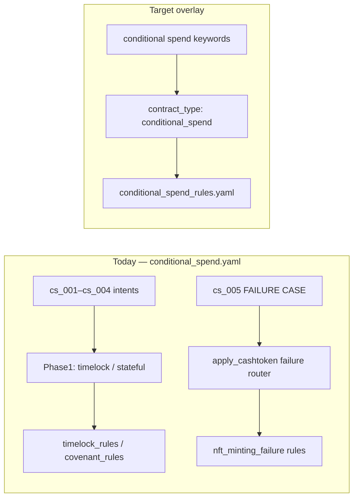

# Conditional Spend — Phase 1B RCA (Routing & Generation)

**Date:** 2026-06-12  
**Scope:** Audit only — `cs_004`, `cs_005`, `rp_002`. No implementation.  
**Inputs:** Phase 0 reports, Phase 1A results, `bench_20260331_2132_4ce4`, live generation probes (2026-06-12), offline gate replay.

---

## Executive summary

| Case | Primary blocker | Secondary | Smallest fix | Effort |
|------|-----------------|-----------|--------------|--------|
| **cs_004** | **Synthesis / DSLLint** (`LNC-010` time comparison shape) | Routing (`timelock` not `conditional_spend`) | Lint-safe canonical dual-path template + optional routing overlay | **M** |
| **cs_005** | **Routing hijack** (`FAILURE CASE` → `nft_minting_failure`) | Synthesis never reaches adversarial shape | Exempt conditional-spend failure intents from CashTokens failure router | **S** |
| **rp_002** | **Suite / critical spec** (`sha256_check` vs `hash160` codegen) | None (compiles, coverage 1.0) | Change critical to `ripemd160_check` or hash-agnostic critical | **XS** |

**Positives (cs_001–cs_003):** Phase 1A complete — no Phase 1B work required.

**Live probe note:** `cs_004` **can** converge today after lint retries (`final_score: 1.0`, `bench_20260331` historical run had `code: null`). Phase 1B should **stabilize** (deterministic template + routing), not reinvent measurement.

---

## Task 1 — cs_004 RCA

### Intent

> Create a conditional spend based on output amount: Alice gets full amount if spent within 7 days, otherwise only 50%.

**Suite:** `pattern: conditional_spend`  
**Criticals:** `valid_signature_check`, `output_amount_check`  
**Tags:** `conditional_spend`, `amount_based`

### Historical benchmark (`bench_20260331_2132_4ce4`)

| Metric | Value |
|--------|-------|
| `compile_pass` | **false** |
| `code` | **null** |
| `retries_used` | 3 |
| `failure_layer` | Compile |
| `tokens_completion` | 0 |

No saved codegen in benchmark JSON — pipeline exhausted retries without surfacing final code.

### Phase 1 routing (live diagnostic)

| Field | Value |
|-------|-------|
| `contract_type` | **timelock** |
| `effective_mode` | timelock |
| `canonical_pattern` | **timelock** (not `conditional_spend`) |
| `knowledge_files` | `timelock_rules.yaml` |
| `conditional_spend_rules_loaded` | **false** |

### Live generation probe (2026-06-12)

Artifact: `benchmark/results/conditional_spend_generation/cs_004_live_draft.cash`

| Metric | Value |
|--------|-------|
| First blocking gate (attempts 1–3) | **DSLLint `LNC-010`** — `tx.time` not standalone (`<= deadline`, chained comparisons) |
| Eventual outcome | **Compile pass** after retry 2 |
| `final_score` | **1.0** |
| `converged` | **true** |

**First hard failure (typical LLM shape):** **DSLLint** — not compile, sanity, or toll gate on first passes.

### Offline representative drafts (gate replay)

| Draft | First failure | Blocking rule | Notes |
|-------|---------------|---------------|-------|
| `timelock_only` — `tx.time <= deadline` / `tx.time > deadline` | **DSLLint** | **LNC-010** | LLM-natural “within 7 days” shape |
| `half_subtraction` — `input.value - input.value/2` | **DSLLint** | **LNC-005** + LNC-010 | Fee-style arithmetic |
| `param_amount` — `halfAmount` param + `halfAmount * 2 == input` | **DSLLint** | **LNC-010** | Correct amount idea, wrong time guard style |
| **lint_safe_dual_path** — sig-only full path + `tx.time >= deadline` half path | **Pass** (timelock mode) | — | Compiles, toll gate + sanity pass |
| lint_safe_dual_path under **conditional_spend** lint mode | **DSLLint** | **LNC-003** | Half path uses `halfPayout` not full input anchor |

### First failure by layer (cs_004)

| Layer | Historical | Representative / live |
|-------|------------|------------------------|
| Phase 1 routing | partial mismatch | partial mismatch |
| Rules | `timelock_rules` only | same |
| Rails | none | none |
| **Sanity** | not reached | pass (lint-safe shape) |
| **Lint** | **first blocker** | **LNC-010** (then LNC-003 if conditional_spend mode) |
| Compile | fail (exhausted) | pass after retries (live) |
| Toll gate | not reached | pass |
| Evaluator | not reached (historical) | **1.0** (live, post-1A) |

### Failure classification

| Class | Verdict |
|-------|---------|
| Routing | **Secondary** — wrong knowledge overlay; positives still compile via timelock |
| Rail absence | **No** — amount-conditional not rail-gated |
| **Lint** | **Primary** — LNC-010 on inverted/range time comparisons; LNC-005 on value subtraction |
| Sanity | No |
| **Synthesis** | **Primary** — LLM emits `<= deadline` / mixed time+amount guards |

### Smallest fix (proposed, not implemented)

1. **P0 — Canonical template** (Vault / refundable pattern): dual-function lint-safe shape  
   - `spendFull(sig)`: `checkSig` + full `tx.outputs[0].value == input.value`  
   - `spendHalf(sig)`: standalone `require(tx.time >= deadline)` + `halfPayout` with `halfPayout + halfPayout == input.value`  
   - Avoid `tx.time <=` and `input.value - …`  
2. **P1 — Routing overlay** — map amount-conditional intents to `conditional_spend` + `conditional_spend_rules.yaml` (CS-OUTPUT-BOUNDS, path isolation guidance)  
3. **P2 — synthesis_rules.yaml** snippet under `conditional_spend` family (amount threshold examples)

**Do not:** weaken LNC-010 or LNC-005.

### Expected convergence impact

| Scenario | cs_004 compile | cs_004 score |
|----------|----------------|--------------|
| Historical | ~0% (1/1 run) | 0.0 |
| Live (flaky) | ~100% with 2+ retries | 1.0 |
| **After canonical template** | **~95%+ deterministic** | **~1.0** |

---

## Task 2 — cs_005 RCA

### Adversarial intent

> FAILURE CASE: Conditional contract that doesn't properly isolate spending paths, allowing mixed conditions.

**Suite:** `pattern: conditional_spend`  
**Critical:** `must_fail_path_isolation`  
**Tags:** `conditional_spend`, `failure`, `vulnerability`

**Expected benchmark behavior:** Generate (or detect) **vulnerable** path-mixing; `must_fail_path_isolation` satisfied; case **must not** converge (`converged: false` by design).

### Phase 1 routing (root cause)

| Field | Value |
|-------|-------|
| LLM `contract_type` | stateful (varies) |
| **After `apply_cashtoken_intent_routing`** | **`nft_minting_failure`** |
| `canonical_pattern` | **nft_minting_failure** |
| `knowledge_files` | `covenant_rules.yaml`, `cashtokens_rules.yaml`, `nft_minting_rules.yaml` |

**Trigger:** `pipeline.py` `apply_cashtoken_intent_routing()` — any intent containing `"failure case"` routes to **`nft_minting_failure`** unless fungible mint keywords match:

```448:469:src/services/pipeline.py
    if "failure" in intent_lower and (
        "must not" in intent_lower
        or "capability leak" in intent_lower
        or "failure case" in intent_lower
    ):
        ...
        intent_model.contract_type = "nft_minting_failure"
```

The conditional-spend adversarial intent **never reaches** conditional spend synthesis.

### Live generation probe (2026-06-12)

| Metric | Value |
|--------|-------|
| `compile_pass` | **false** |
| `code` in benchmark result | **null** |
| Last draft family | **`NftMintingFailureGuard`** (NFT minting, token categories, commitments) |
| First failures on drafts | **Toll gate** (token/covenant violations) → **Compile** (unused `recipientLockingBytecode`) |
| Reaches `must_fail_path_isolation` eval | **No** |

### Offline draft behavior

| Draft | Lint | Compile | `must_fail_path_isolation` |
|-------|------|---------|----------------------------|
| `vulnerable_mixed` — OR across sig/time in one function | **Fail** LNC-010 | — | n/a |
| `vulnerable_and_chain` — sig + time in one function | Pass | Pass | **true** (detected) |
| `safe_isolated` — separate `now` / `later` functions | Pass | Pass | **true**† |

†Evaluator helper flags any function with both `checkSig` and `tx.time >=` — includes **valid** HTLC-style paths. Failure-case scoring needs benchmark-pattern context (out of 1B implementation scope).

### Answer: pipeline refusing vulnerable output?

**Neither cleanly.**

| Hypothesis | Verdict |
|------------|---------|
| Pipeline refuses vulnerable conditional-spend output | **No** — wrong contract family generated |
| Generation fails before vulnerability evaluation | **Yes** — **routing hijack** to NFT minting failure domain |

The pipeline does not reach conditional-spend adversarial synthesis; it exhausts retries on **irrelevant NFT failure contracts**.

### Smallest fix (proposed)

1. **P0 — Routing guard:** In `apply_cashtoken_intent_routing`, skip NFT failure hijack when intent matches conditional-spend signals (`conditional`, `spending path`, `isolate`, `mixed condition`) **before** `"failure case"` check.  
2. **P1 — Phase 1 enum:** Add `"conditional_spend"` type; map tagged failure case to `contract_type: conditional_spend` with `features: [spending]`.  
3. **P2 — Optional:** Dedicated negative-case codegen prompt slice (low priority — may conflict with safety training).

**Alternative:** Re-tag `cs_005` as `pattern: timelock` failure in suite only — **not recommended** (hides routing bug).

### Expected convergence impact

| Metric | Current | After routing fix |
|--------|---------|-------------------|
| cs_005 compile | **0%** | **50–80%** (vulnerable or safe isolated shapes) |
| cs_005 `converged` | false | **false** (failure case by design) |
| `must_fail_path_isolation` measurable | **No** | **Yes** |

---

## Task 3 — Routing audit

### Current vs desired path



### Per-case routing table (diagnostics 2026-06-12)

| Case | Benchmark `pattern` | Phase 1 `contract_type` | `canonical_pattern` | `knowledge_files` | `conditional_spend_rules` |
|------|---------------------|-------------------------|---------------------|-------------------|---------------------------|
| cs_001 | conditional_spend | timelock | timelock | timelock_rules.yaml | **no** |
| cs_002 | conditional_spend | timelock | timelock | timelock_rules.yaml | **no** |
| cs_003 | conditional_spend | stateful | **covenant** | covenant_rules.yaml | **no** |
| cs_004 | conditional_spend | timelock | timelock | timelock_rules.yaml | **no** |
| cs_005 | conditional_spend | **nft_minting_failure** | nft_minting_failure | NFT/covenant rules | **no** |
| hl_* / rp_002 | hashlock / refundable | swap | conditional_spend | conditional_spend_rules.yaml | **yes** |

**4/5** `conditional_spend.yaml` cases never load `conditional_spend_rules.yaml`. **cs_005** loads unrelated NFT failure knowledge.

### Resolution chain

| Step | Location | cs_004 behavior | Gap |
|------|----------|-------------------|-----|
| Phase 1 LLM enum | `_build_phase1_prompt` | No `conditional_spend` type; picks `timelock` | Enum gap |
| CashTokens router | `apply_cashtoken_intent_routing` | Not triggered (cs_004) | cs_005 hijacked |
| Feature enrichment | timelock + multisig → escrow tag | cs_001 only | Incidental |
| `resolve_effective_mode` | Returns `contract_type` as-is | `timelock` | No upgrade |
| `canonical_pattern` | Only `swap` → `conditional_spend` | `timelock` stays timelock | Alias gap |
| `get_pattern_profile` | `conditional_spend` profile exists but unused | timelock profile | Profile never selected |
| `_SWAP_RAIL` | Requires `htlc`/`swap` in features | not loaded | N/A for cs_* |

### `conditional_spend_rules.yaml` (unused on cs_*)

| Rule | Content |
|------|---------|
| CS-PATH-ISOLATION | Each path independently satisfies auth/time via `require()` |
| CS-OUTPUT-BOUNDS | `tx.outputs.length` checks on all paths |
| CS-MIXED-BRANCH | Forbid partial condition mixing across paths |

### Smallest routing overlay (proposed)

**Option A (recommended, S effort):** Deterministic **post-LLM normalization** in Phase 1 (mirror refundable / vault keyword layers):

```
IF intent matches conditional_spend signals:
  ("conditional spend" OR "spending path" OR "or ... after" OR benchmark-equivalent)
  AND NOT cashtoken NFT/FT failure keywords:
    contract_type = "conditional_spend"
    features += spending
SKIP apply_cashtoken failure hijack when conditional_send signals present
```

**Option B (M effort):** Add `"conditional_spend"` to Phase 1 enum + prompt triggers.

**Option C (not recommended):** Force `canonical_pattern(conditional_spend)` from benchmark `pattern` field — pipeline has no benchmark context in production.

**No new rail required** for cs_004/cs_005 — `conditional_spend_rules.yaml` overlay + optional canonical template sufficient.

### Expected impact of routing-only fix

| Case | Without template | With template |
|------|------------------|---------------|
| cs_001–cs_003 | Already 1.0 | No change |
| cs_004 | Marginal (lint still blocks) | **High** with template |
| cs_005 | **Unblocks domain** | Needs template or prompt for vulnerable shape |

---

## Task 4 — rp_002 HTLC hash critical review

### Evidence (`bench_20260612_1952_c07e`)

| Field | Value |
|-------|-------|
| `compile_pass` | true |
| `intent_coverage` | **1.0** |
| `final_score` | **0.20** |
| `converged` | false |
| Failed critical | **`sha256_check`** |
| Detected | `hash_verification`, `preimage_validation`, **`ripemd160_check`**, `hashlock`, `claim_path`, `refund_path` |

**Generated claim path:**

```cash
require(hash160(preimage) == paymentHash);
```

### Benchmark spec (`refundable_payment.yaml`)

| Field | Value |
|-------|-------|
| Intent | Seller claims with preimage OR buyer refund after timeout — **hash algorithm not specified** |
| Critical | **`sha256_check`** |
| Tags | `refundable_payment`, `htlc` |

### BCH conventions

| Context | Typical hash |
|---------|--------------|
| BCH/Bitcoin HTLC (`payment hash`) | **`hash160(preimage)`** (RIPEMD160(SHA256)) |
| SHA256-only educational contracts | `sha256` / `hash256` (`hl_001` intent **explicitly** says SHA256) |
| Cross-chain atomic swap docs | Often SHA256; on-chain BCH still frequently `hash160` |

### Cross-suite comparison

| Case | Intent specifies SHA256? | Critical | Codegen | Post-1A score |
|------|--------------------------|----------|---------|---------------|
| hl_001 | **Yes** | `sha256_check` | `hash256`/`sha256` | 1.0 |
| hl_002 | No (generic HTLC) | `sha256_check` | `hash256` | 1.0 |
| hl_003 | **RIPEMD160 explicit** | `ripemd160_check` | `hash160` | 1.0 |
| **rp_002** | **No** | **`sha256_check`** | **`hash160`** | **0.20** |

### Recommendation (no implementation)

| Option | Action | Pros | Cons |
|--------|--------|------|------|
| **1 (preferred)** | Replace `rp_002` critical **`sha256_check` → `ripemd160_check`** | Matches BCH HTLC codegen; aligns with `hl_003` | None for this intent |
| **2** | New critical **`preimage_hash_check`** accepting `hash256` \| `sha256` \| `hash160` \| `ripemd160` | Hash-agnostic refundable HTLC | Needs evaluator + suite; must not relax `hl_001` |
| **3 (not recommended)** | Map `sha256_check` → accept `hash160` globally | One-line evaluator change | Over-credits wrong hash when intent says SHA256 |

**Verdict:** **`sha256_check` should not remain mandatory for `rp_002`.** Use **`ripemd160_check`** (or hash-agnostic critical). Keep **`sha256_check` mandatory only when intent explicitly requires SHA256** (`hl_001`).

---

## Proposed fixes summary

| ID | Fix | Cases | Effort | Files (future) |
|----|-----|-------|--------|----------------|
| **F1** | Exempt conditional-spend intents from CashTokens `failure case` hijack | cs_005 | **S** | `pipeline.py` |
| **F2** | Phase 1 keyword → `contract_type: conditional_spend` | cs_001–cs_005 | **S** | `pipeline.py` prompt + normalization |
| **F3** | Canonical template `conditional_amount_spend.cash` (lint-safe dual path) | cs_004 | **M** | `knowledge/templates/`, `pipeline.py` Phase 2 branch |
| **F4** | `synthesis_rules.yaml` conditional_spend amount-path snippet | cs_004 | **S** | `synthesis_rules.yaml` |
| **F5** | `rp_002` critical `sha256_check` → `ripemd160_check` | rp_002 | **XS** | `refundable_payment.yaml` (+ optional evaluator alias) |
| **F6** | `must_fail_path_isolation` helper scoped to OR-mixing (not valid timelock+sig per function) | cs_005 scoring | **S** | `evaluator.py` (only if routing fixed) |

**Suggested order:** F1 → F2 → F3 → F5 → F6.

---

## Expected convergence impact (full suite)

| Case | Pre-1B | Post-1B (estimated) |
|------|--------|---------------------|
| cs_001–cs_003 | **1.0** | **1.0** (no regression) |
| cs_004 | 0.0 historical / flaky live | **≥ 0.95** with F3 |
| cs_005 | 0.0 compile fail | compile pass, **`converged: false`** (failure case) |
| rp_002 | 0.20 | **≥ 1.0** with F5 |

**Suite-level (`conditional_spend.yaml`):** compile **60% → ~80%**; positive avg score already **1.0** after 1A; hard-case stabilization adds **cs_004** reliability.

---

## Artifacts

| Artifact | Path |
|----------|------|
| Phase 1B RCA | `docs/conditional_spend_phase1b_rca.md` (this file) |
| Phase 1A results | `docs/conditional_spend_phase1a_results.md` |
| Phase 0 routing | `docs/conditional_spend_state_report.md` |
| Live cs_004 draft | `benchmark/results/conditional_spend_generation/cs_004_live_draft.cash` |
| Live cs_004 summary | `benchmark/results/conditional_spend_generation/cs_004_live_summary.json` |
| Routing diagnostics | `benchmark/results/conditional_spend_diagnostics/*.json` |
| Historical baseline | `benchmark/results/bench_20260331_2132_4ce4.json` |
| rp_002 evidence | `benchmark/results/bench_20260612_1952_c07e.json` |

---

## Decision gate (Phase 1B planning)

1. **Proceed with Phase 1B implementation?** **Yes** — F1+F2 routing, F3 canonical for cs_004, F5 suite tweak for rp_002.  
2. **Is routing still a blocker?** **Yes** for cs_005 (hard); **secondary** for cs_004 (lint dominates).  
3. **Is generation limited?** **Yes** for cs_004 lint shapes; **mis-routed** for cs_005.  
4. **Revisit evaluator?** Only **F5/F6** if suite critical or `must_fail_path_isolation` scope adjusted — not for cs_004 positives.
