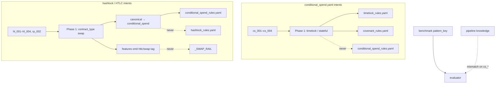

# Conditional Spend / Swap — State Report (Phase 0 Audit)

**Date:** 2026-06-12  
**Scope:** End-to-end audit of conditional spend, swap, HTLC, and claim/refund shapes. **No implementation changes.**  
**Method:** Code inspection, `scripts/diagnose_conditional_spend_case.py` (9-case routing subset), historical benchmark mining, cross-reference with Hashlock Phase 1 audit (`docs/hashlock_state_report.md`).  
**Key question:** Is Conditional Spend / Swap production-converged, or does Hashlock success mask unresolved gaps?

---

## Executive summary

**Verdict: Hashlock success partially masks gaps.** The `hashlock.yaml` suite converged on representative positives after Hashlock Phase 1A (`bench_20260611_1708_0154`: hl_001–hl_003 at **1.0**), but the dedicated **`conditional_spend.yaml` suite remains broken on measurement and routing**, and the composite HTLC case **`rp_002` still fails convergence** despite valid-looking codegen.

| Slice | Compile (latest full run) | Convergence (gate) | Avg score | Primary blocker |
|-------|---------------------------|------------------|-----------|-----------------|
| `conditional_spend.yaml` (5 cases) | **60%** (`bench_20260331_2132_4ce4`) | **60%**\* | **0.083** | Routing + measurement |
| `hashlock.yaml` (5 cases, historical) | **80%** (`bench_20260331_2117_fd6a`) | **80%**\* | **0.013** | Measurement (pre-1A) |
| `hashlock.yaml` (hl_001–hl_003 post-1A) | **100%** (`bench_20260611_1708_0154`) | **100%** | **1.0** | — |
| `rp_002` HTLC composite | **75%** (4 runs) | **50%** | **0.2** best | Critical `sha256_check` vs `hash160` codegen |

\*Historical convergence gate allowed `converged: true` with near-zero `final_score` on conditional_spend and pre-1A hashlock runs.

### Failure-class classification (umbrella)

| Class | Verdict |
|-------|---------|
| **A — Production converged** | **No** — `conditional_spend.yaml` avg score **0.083**; `rp_002` not converged; hard cases compile-fail |
| **B — Measurement-limited** | **Primary** for `conditional_spend` positives (cs_001–cs_003): coverage often high, `final_score` **0.07–0.20**; `rp_002` critical mismatch |
| **C — Routing-limited** | **Co-primary** — `conditional_spend.yaml` cases route to **timelock / covenant**, never `conditional_spend_rules.yaml`; `hashlock_rules.yaml` and `swap_rules.yaml` unused; `_SWAP_RAIL` never attaches |
| **D — Generation-limited** | **Secondary** — cs_004, cs_005, hl_004 (intermittent), hl_005 adversarial |

**Overall:** **Not production converged.** Hashlock positives are healthy post-1A; the broader conditional-spend family is **routing- and measurement-limited**, with generation gaps on hard variants.

---

## 1. Routing

| Step | Location | Behavior |
|------|----------|----------|
| Phase 1 enum | `pipeline.py` | No `conditional_spend` enum; `swap` → HTLC/hashlock; dual-path sig+time → often **`timelock`** |
| Canonical alias | `pattern_profiles.py:22` | `swap` → `conditional_spend` |
| `conditional_spend` profile | `pattern_profiles.py:201–205` | `conditional_spend_rules.yaml` — **only reached via `swap`**, not cs_* intents |
| `hashlock` profile | `pattern_profiles.py:51–54` | `hashlock_rules.yaml` — **unused** (Phase 1 never emits `contract_type: hashlock`) |
| `swap_rules.yaml` | `knowledge_structured/swap_rules.yaml` | **Orphan** — not referenced in `PATTERN_PROFILES` or pipeline |
| `_SWAP_RAIL` | `pipeline.py` | Requires `htlc` or `swap` in **Phase 1 features** — absent on all 9 diagnostic cases |
| Benchmark pattern | Suite YAML | `pattern: conditional_spend` / `hashlock` used by evaluator only |

### Routing diagnostics (2026-06-12)

Tool: `python scripts/diagnose_conditional_spend_case.py all`  
Output: `benchmark/results/conditional_spend_diagnostics/<case_id>.json`

| Case | Suite | `contract_type` | `effective_mode` | `canonical_pattern` | `knowledge_files` | `conditional_spend_rules_loaded` | `hashlock_rules_loaded` | `swap_rail_loaded` |
|------|-------|-----------------|------------------|---------------------|-------------------|----------------------------------|-------------------------|-------------------|
| cs_001 | conditional_spend.yaml | **timelock** | timelock | **timelock** | timelock_rules.yaml | **no** | no | no |
| cs_002 | conditional_spend.yaml | **timelock** | timelock | **timelock** | timelock_rules.yaml | **no** | no | no |
| cs_003 | conditional_spend.yaml | **stateful** | stateful | **covenant** | covenant_rules.yaml | **no** | no | no† |
| cs_004 | conditional_spend.yaml | **timelock** | timelock | **timelock** | timelock_rules.yaml | **no** | no | no |
| hl_001 | hashlock.yaml | swap | swap | conditional_spend | conditional_spend_rules.yaml | **yes** | **no** | **no** |
| hl_002 | hashlock.yaml | swap | swap | conditional_spend | conditional_spend_rules.yaml | **yes** | **no** | **no** |
| hl_003 | hashlock.yaml | swap | swap | conditional_spend | conditional_spend_rules.yaml | **yes** | **no** | **no** |
| hl_004 | hashlock.yaml | swap | swap | conditional_spend | conditional_spend_rules.yaml | **yes** | **no** | **no** |
| rp_002 | refundable_payment.yaml | swap | swap | conditional_spend | conditional_spend_rules.yaml | **yes** | **no** | **no** |

†cs_003: `_ESCROW_RAIL` attaches (`escrow` in Phase 1 features).

**Routing gap summary:** **4/4** `conditional_spend.yaml` cases never load `conditional_spend_rules.yaml`. **5/5** swap-routed HTLC cases load conditional_spend rules but **not** hashlock overlay or swap rail. **`swap_rules.yaml` is dead code** in the routing path.

---

## 2. Benchmark inventory

### Direct suites

| Suite | Cases | Role |
|-------|-------|------|
| `benchmark/suites/conditional_spend.yaml` | cs_001–cs_005 | Sig OR timelock, multi-path, amount-based, failure |
| `benchmark/suites/hashlock.yaml` | hl_001–hl_005 | SHA256, HTLC, RIPEMD160, multi-secret, token failure |

### Indirect / composite cases

| Suite | Case | Relevance |
|-------|------|-----------|
| `refundable_payment.yaml` | **rp_002** | HTLC-shaped claim + refund (`tags: htlc`) |
| `refundable_payment.yaml` | rp_001, rp_003–rp_006 | Refund/claim paths (not HTLC-primary; rp_001 basic refund) |
| `escrow.yaml` | — | No swap/HTLC cases (`conditional_destination` tag only) |
| `vaults_real` | — | **No** swap/HTLC/conditional-spend cases |

### Keyword inventory (16 cases across 3 suites)

Cases matching swap, HTLC, hashlock, conditional spend, claim/refund, preimage, timeout:  
cs_001–cs_005, hl_001–hl_005, rp_001–rp_006 (rp_002 is the HTLC representative).

---

## 3. Historical benchmark review

### `conditional_spend.yaml` — `bench_20260331_2132_4ce4` (sole full-suite run)

| Metric | Value |
|--------|-------|
| Compile rate | **60%** (3/5) |
| Convergence rate | **60%** (3/5) |
| Avg intent coverage | **0.48** |
| Avg final score | **0.083** |
| Failure distribution | Compile **2** (cs_004, cs_005); Evaluator penalty on **3** compiling cases |

| Case | Compile | Converged | Coverage | Score | First failure |
|------|---------|-----------|----------|-------|---------------|
| cs_001 | pass | true | 1.0 | **0.20** | Evaluator (critical) |
| cs_002 | pass | true | 0.67 | **0.07** | Evaluator (`time_validation` miss + critical) |
| cs_003 | pass | true | 0.75 | **0.15** | Evaluator (`multisig` miss + critical) |
| cs_004 | **fail** | false | 0.0 | 0.0 | **Compile** |
| cs_005 | **fail** | false | 0.0 | 0.0 | **Compile** (adversarial) |

### `hashlock.yaml` — historical vs post-1A

| Run | Cases | Compile | Convergence | Avg score | Notes |
|-----|-------|---------|-------------|-----------|-------|
| `bench_20260331_2117_fd6a` | 5 | **80%** | **80%**\* | **0.013** | Evaluator unmapped; hl_004 compile fail |
| `bench_20260611_1659_0cd2` | 3 (hl_001–003) | **100%** | **0%** | **0.044** | Pre-1A measurement only |
| `bench_20260611_1708_0154` | 5 | **80%** | **80%** | **~0.80**† | Post-1A: hl_001–hl_003 **1.0**; hl_004 pass; hl_005 compile fail |

†Weighted by case scores in run JSON.

### `rp_002` — cross-run (4 appearances)

| Metric | Value |
|--------|-------|
| Compile rate | **75%** |
| Convergence rate | **50%** |
| Best score | **0.20** (`bench_20260612_1952_c07e`) |
| Latest | compile pass, coverage **1.0**, `converged: false` — critical **`sha256_check`** unsatisfied (`hash160` in generated `AtomicSwap`) |

---

## 4. Coverage matrix

| Shape | Suite case(s) | Benchmark status | Pipeline status |
|-------|---------------|------------------|-----------------|
| Simple conditional spend (sig OR timelock) | cs_001, cs_002 | Compiles; score **0.07–0.20** | Routes to **timelock**, not conditional_spend |
| Multi-path (3-way) | cs_003 | Compiles; score **0.15**; `multisig` miss | Routes to **covenant** + escrow rail |
| Amount-based conditional | cs_004 | **Compile fail** | Routes to timelock |
| HTLC claim + refund | hl_002, rp_002 | hl_002 **1.0** post-1A; rp_002 **0.2** | swap → conditional_spend rules; no swap rail |
| SHA256 hashlock | hl_001 | **1.0** post-1A | swap → conditional_spend (not hashlock_rules) |
| RIPEMD160 / hash160 | hl_003, rp_002 | hl_003 **1.0**; rp_002 critical sha256 fail | Same routing |
| Multi-preimage | hl_004 | Intermittent compile | swap → conditional_spend |
| Atomic swap style | hl_002, rp_002 | Generates `AtomicSwap` / HTLC shapes | No dedicated atomic-swap rail |
| Timeout reclaim | cs_001, hl_002, rp_002 | Present in codegen (`tx.time >=`) | cs_002 uses `this.age` in historical run — evaluator gap |
| Adversarial / failure | cs_005, hl_005 | Compile fail or score 0 | Expected |

**Coverage verdict:** Shapes are **represented in suites** but **not uniformly converged**. Hashlock positives are covered and scored after 1A; **conditional_spend suite and rp_002 remain gaps**.

---

## 5. Decision gate

| Class | Applies? | Evidence |
|-------|----------|----------|
| **A — Production converged** | **No** | cs_* low scores; rp_002 not converged; hard cases fail compile |
| **B — Measurement-limited** | **Yes (primary)** | cs_001–cs_003: high coverage, low `final_score`; pre-1A hashlock; rp_002 `sha256_check` vs `hash160` |
| **C — Routing-limited** | **Yes (co-primary)** | cs_* → timelock/covenant; hashlock_rules + swap_rules + `_SWAP_RAIL` unused |
| **D — Generation-limited** | **Yes (residual)** | cs_004, cs_005, hl_004, hl_005 |

### Classification: **C + B (mixed)** — not A

Hashlock post-1A success on hl_001–hl_003 **masks** that:
1. The **`conditional_spend` benchmark pattern** does not route to conditional-spend knowledge.
2. **`conditional_spend.yaml` scores remain near zero** despite compile success.
3. **`rp_002`** still fails on critical hash function alignment.

---

## 6. Phase 1A recommendation (audit only — do not implement in Phase 0)

Proceed with **Phase 1A (measurement alignment)** before routing or generation work:

1. **Evaluator / semantic map** for `pattern: conditional_spend` — map `valid_signature_check`, `locktime_check`, `multisig`, `output_amount_check`, `must_fail_path_isolation`; accept `this.age` where appropriate for inactivity timeouts (cs_002).
2. **Re-benchmark `conditional_spend.yaml`** after measurement-only changes to establish true baseline (current sole run is `bench_20260331_2132_4ce4`).
3. **`rp_002` critical alignment** — either map preimage critical to `hash160` when intent is hash-agnostic, or tighten suite critical to match BCH HTLC convention (`hash160`).
4. **Defer routing changes** (`contract_type: conditional_spend`, hashlock overlay, `_SWAP_RAIL`) to Phase 1B unless Phase 1A re-benchmark proves generation already sufficient under corrected scoring.

**Do not** modify evaluator, routing, rails, lint, sanity, or synthesis during Phase 0 (this audit).

---

## Artifacts

| Artifact | Path |
|----------|------|
| State report | `docs/conditional_spend_state_report.md` (this file) |
| Layer diagnosis | `docs/conditional_spend_layer_diagnosis.md` |
| Diagnostic tool | `scripts/diagnose_conditional_spend_case.py` |
| Routing JSON | `benchmark/results/conditional_spend_diagnostics/*.json` |
| Related | `docs/hashlock_state_report.md`, `docs/hashlock_layer_diagnosis.md` |
