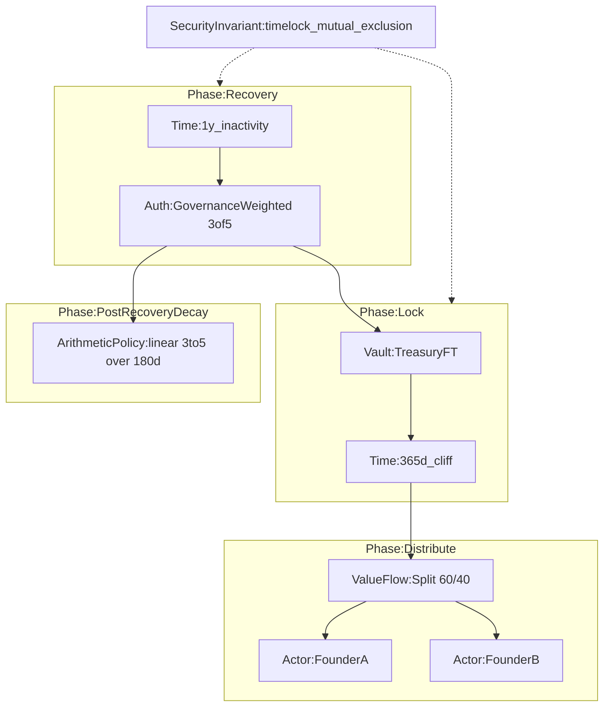

# Constraint Graph Validation — Phase 3 Architecture Review

**Sprint:** Phase 3 Validation  
**Date:** 2026-07-09  
**Reviewer stance:** Principal Architect — stress-test before implementation  
**Scope:** Proposed Constraint Graph (evolved from `ExecutionPlan` + `UTXOArchitecture`) for the AI Specification Architect layer  
**Out of scope:** Rewriting generation, audit, or benchmark systems

**Inputs reviewed:**
- [`src/models.py`](../src/models.py) — `ExecutionPlan`, `UTXOArchitecture`, `ContractSpecification`
- [`src/services/spec/architecture.py`](../src/services/spec/architecture.py) — `ArchitectureBuilder`, `TRANSACTION_PATTERNS`
- [`src/services/spec/planner.py`](../src/services/spec/planner.py) — `ModulePlanner`
- [`src/services/spec/composer.py`](../src/services/spec/composer.py)
- [`src/services/spec/phase2_adapter.py`](../src/services/spec/phase2_adapter.py) — single `effective_mode` collapse
- [`src/services/pattern_profiles.py`](../src/services/pattern_profiles.py) — 13+ pattern families
- [`docs/multi_pattern_generation_architecture.md`](multi_pattern_generation_architecture.md)
- [`docs/composition_threat_model.md`](composition_threat_model.md)

---

## Executive Summary

The proposed **Constraint Graph** is the right direction for replacing the rule-driven interaction layer, but **today's `ExecutionPlan` + `UTXOArchitecture` model only covers ~40% of the semantic surface** needed for multi-pattern contracts. It is adequate as a **v1 seed for spec capture and review**, not yet as a **complete replacement for pattern-first generation routing**.

| Question | Answer |
|----------|--------|
| Expressive enough for all 13 pattern families? | **Partially** — single-pattern families yes with minor additions; hashlock/oracle/covenant semantics are under-modeled |
| Multi-pattern prompts without ambiguity? | **No** — sequential phases and alternate paths need `Phase` and `Branch` nodes (P0) |
| Can replace pattern-first architecture entirely? | **Not yet** — generation still needs `effective_mode`, rails, and YAML profiles until CompositionIR exists |
| Implementation verdict | **READY WITH MINOR CHANGES** for spec-layer Constraint Graph v1; generation consumption remains a separate milestone |

---

## 1. Constraint Graph Validation — Per Pattern Family

### Proposed node categories (baseline)

| Category | Purpose |
|----------|---------|
| **Actors** | Parties, signers, holders, recipients, oracle operator |
| **Assets** | BCH, FT, NFT; category, supply, conservation scope |
| **Authorization** | Threshold, weights, multisig policy, path-specific auth |
| **Time** | Absolute lock, relative age, cliff, duration, decay window |
| **ValueFlow** | Inputs, outputs, splits, payouts, change rules |
| **Constraints** | Predicates, conservation, destination lock, amount bounds |
| **SecurityInvariants** | Cross-path rules (timelock mutual exclusion, no backdoor) |
| **Recovery** | Break-glass, governance override, refund, emergency |
| **ExternalDependencies** | Oracle feed, deployment pubkey placeholders, off-chain attestations |
| **LifecycleState** | Contract lifecycle FSM (Draft → Funded → Locked → Claimable → Claimed → Recovered → Closed) — **not** `UTXOArchitecture.StateObject` |
| **Phase** | Ordered lifecycle segment grouping nodes |
| **Branch** | Alternate spend paths (refund, emergency, hash claim) |
| **Policy** | Extensible rules: Decay/Linear, Distribution/WeightedSplit, Recovery/Multisig2of3, Auction/Dutch |

### What exists today (v1 seed)

```text
ExecutionPlan
  modules[]: GenerationModule { name, capability, params, depends_on[] }
  order[], dependencies{}, shared_parameters{}

UTXOArchitecture
  contracts[]: ContractNode { id, type }
  transactions[]: TransactionSpec { name, inputs[], outputs[] }
  state_objects[]: StateObject { name, storage }
```

**Already modeled:** module list, coarse dependency edges, shared flat parameters, contract role buckets (`treasury`, `auth`, `time`, `distribution`), named transaction skeletons, covenant state objects.

**Not modeled:** guard conditions on edges, arithmetic, branch exclusivity, per-path auth, oracle trust, milestone schedules, N-output split detail, token category continuity as graph constraints.

---

### 1.1 Single Signature

| Item | Detail |
|------|--------|
| **Nodes** | `Actor:Owner`, `Asset:BCH`, `Auth:SingleSig`, `ValueFlow:spend` |
| **Edges** | `Owner --authorizes--> spend`, `spend --conserves--> BCH` |
| **Information lost vs today** | None for simple transfer; deployment pubkey may be `speculative` until provided |
| **ExecutionPlan coverage** | `MultisigModule` with threshold=1 or implicit default; **overkill** |
| **Additional node types** | None |

---

### 1.2 Timelock

| Item | Detail |
|------|--------|
| **Nodes** | `Time:UnlockAt|RelativeAge`, `Auth:SingleSig|Multisig`, `ValueFlow:locked_spend` |
| **Edges** | `Time --gates--> locked_spend`, `Auth --required_for--> locked_spend` |
| **Information lost** | CSV vs CLTV distinction; block height vs wall-clock — today only `timeout_days` int |
| **ExecutionPlan coverage** | `TimelockModule` exists in planner; params in `shared_parameters` only |
| **Additional node types** | **P1:** `Time.mode` enum (`cltv` \| `csv` \| `height`) |

---

### 1.3 Hashlock

| Item | Detail |
|------|--------|
| **Nodes** | `Constraint:Preimage`, `Auth:HashReveal`, `ValueFlow:claim`, `ValueFlow:timeout_refund` |
| **Edges** | `Preimage --unlocks--> claim`, `Time --enables--> timeout_refund` |
| **Information lost** | Hash algorithm, preimage size, HTLC linking (same hash across contracts) |
| **ExecutionPlan coverage** | **Gap:** `hashlock` profile exists in [`pattern_profiles.py`](../src/services/pattern_profiles.py) but **no** `HashlockModule` in [`planner.py`](../src/services/spec/planner.py) or capability registry |
| **Additional node types** | **P0:** `Constraint:Preimage` with `hash_alg`, `linked_htlc_id` optional |

---

### 1.4 Multisig

| Item | Detail |
|------|--------|
| **Nodes** | `Actors:Signers[]`, `Auth:ThresholdPolicy`, optional `Auth:WeightedPolicy` |
| **Edges** | `ThresholdPolicy --authorizes--> ValueFlow:*` |
| **Information lost** | Per-signer pubkey vs placeholder name; weighted vs equal — params exist but not on graph edges |
| **ExecutionPlan coverage** | `MultisigModule` / `WeightedMultisigModule` — **good** |
| **Additional node types** | None |

---

### 1.5 Escrow

| Item | Detail |
|------|--------|
| **Nodes** | `Actors:Buyer,Seller,Arbiter`, `Asset:BCH`, `Auth:2of3`, `ValueFlow:release`, `Recovery:refund`, `Time:timeout_refund` |
| **Edges** | `2of3 --authorizes--> release`, `timeout_refund --alternate_path--> Recovery`, `SecurityInvariant:mutual_exclusion(release, refund)` |
| **Information lost** | Dispute-only arbiter path vs mutual buyer-seller release; deposit amount |
| **ExecutionPlan coverage** | `EscrowModule` + `MultisigModule`; transaction template `release` only — **no refund tx template** |
| **Additional node types** | **P0:** `Branch` for alternate spend paths; **P0:** `SecurityInvariant` for CT-001 style bypass prevention |

---

### 1.6 Refundable Payment

| Item | Detail |
|------|--------|
| **Nodes** | `Time:refund_deadline`, `ValueFlow:pay`, `ValueFlow:refund`, `Actor:payer`, `Actor:payee` |
| **Edges** | `refund_deadline --enables--> refund` (exclusive with `pay` after deadline semantics) |
| **Information lost** | Partial refund vs full; fee retention |
| **ExecutionPlan coverage** | Routed via `refundable_payment` profile; **no dedicated module** in planner — collapses to timelock/escrow heuristics |
| **Additional node types** | **P1:** `Branch` with temporal exclusivity |

---

### 1.7 Split Payment

| Item | Detail |
|------|--------|
| **Nodes** | `Actors:Recipients[]`, `ValueFlow:split`, `Constraint:ShareSum==100%`, `Constraint:OutputConservation` |
| **Edges** | `split --distributes--> Recipients` with labeled percentage edges |
| **Information lost** | N>2 outputs (rail hardcoded to 2 in generation); per-recipient fixed amounts vs percentages |
| **ExecutionPlan coverage** | `SplitPaymentModule`; params `recipients`, `shares` in flat dict — **not** on ValueFlow edges |
| **Additional node types** | **P0:** `ValueFlow` edges with `share` or `amount_sat` attributes |

---

### 1.8 Vault

| Item | Detail |
|------|--------|
| **Nodes** | `Asset:BCH|FT|NFT`, `State:TreasuryNFT`, `ValueFlow:withdraw`, `ValueFlow:deposit`, `Auth:*` |
| **Edges** | `withdraw --requires--> Auth`, `deposit --continues--> State` |
| **Information lost** | Tiered withdrawal limits, staged unlock tranches |
| **ExecutionPlan coverage** | `VaultModule` + `TRANSACTION_PATTERNS` — **good skeleton** |
| **Additional node types** | **P1:** `Phase` for staged tiers |

---

### 1.9 Covenant

| Item | Detail |
|------|--------|
| **Nodes** | `State:Commitment`, `Constraint:Continuation`, `Constraint:OutputBinding` |
| **Edges** | `spend --must_preserve--> State`, `Constraint:token_category_continuity` |
| **Information lost** | Which fields in commitment are mutable; parser/manager sub-shapes |
| **ExecutionPlan coverage** | Implicit via `StateObject` on vault/escrow modules — **not explicit** |
| **Additional node types** | **P1:** `Constraint:Continuation` as first-class invariant node (feeds audit) |

---

### 1.10 Conditional Spend

| Item | Detail |
|------|--------|
| **Nodes** | `Branch:condition_true`, `Branch:condition_false`, `Constraint:predicate` |
| **Edges** | `predicate --selects--> Branch` |
| **Information lost** | Predicate AST (swap hashes, oracle price threshold) |
| **ExecutionPlan coverage** | Profile `conditional_spend` exists; **no module** in planner |
| **Additional node types** | **P0:** `Branch` + `Constraint:Predicate` (opaque string v1, structured v2) |

---

### 1.11 Decay (linear threshold / dutch auction)

| Item | Detail |
|------|--------|
| **Nodes** | `Time:decay_window`, `Constraint:ArithmeticPolicy`, `Auth:time_varying_threshold` |
| **Edges** | `decay_window --modulates--> Auth.threshold` |
| **Information lost** | Formula (`initial + (final-initial)*elapsed/duration`); auction price floor vs threshold decay conflation |
| **ExecutionPlan coverage** | `LinearThresholdModule` / `VestingScheduleModule` / `DutchAuctionModule` — params only, **no formula edge** |
| **Additional node types** | **P0:** `ArithmeticPolicy` node with `kind: linear_threshold \| linear_price` |

---

### 1.12 CashTokens FT

| Item | Detail |
|------|--------|
| **Nodes** | `Asset:FT`, `Constraint:token_category`, `Constraint:amount_conservation`, `ValueFlow:mint|transfer` |
| **Edges** | `token_category --binds--> all ValueFlow` |
| **Information lost** | Mint authority vs transfer-only; max supply; genesis vs continuation |
| **ExecutionPlan coverage** | `FTTransferModule`, `ft_mint` profiles — module mapping exists |
| **Additional node types** | **P1:** `Asset.minting_capability` flag |

---

### 1.13 CashTokens NFT

| Item | Detail |
|------|--------|
| **Nodes** | `Asset:NFT`, `State:Commitment`, `Constraint:immutable|mutable|minting` |
| **Edges** | `Commitment --constrains--> ValueFlow` |
| **Information lost** | Mutable field schema; minting authority separation |
| **ExecutionPlan coverage** | `NFTImmutableModule`, `NFTMutableModule`, `NFTMintingModule` |
| **Additional node types** | None fundamental; **P2:** commitment schema reference |

---

### Family coverage summary

| Family | Graph sufficient (v1)? | ExecutionPlan partial? | P0 gap |
|--------|------------------------|------------------------|--------|
| Single Signature | Yes | Overfits multisig | — |
| Timelock | Yes | Yes | Time.mode |
| Hashlock | **No** | **No module** | Preimage constraint |
| Multisig | Yes | Yes | — |
| Escrow | Partial | Partial | Branch, SecurityInvariant |
| Refundable Payment | Partial | Weak | Branch |
| Split Payment | Partial | Yes | ValueFlow edge attrs |
| Vault | Yes | Yes | — |
| Covenant | Partial | Implicit only | Continuation invariant |
| Conditional Spend | **No** | **No module** | Branch, Predicate |
| Decay | Partial | Yes | ArithmeticPolicy |
| CashTokens FT | Yes | Yes | — |
| CashTokens NFT | Yes | Yes | — |

---

## 2. Multi-Pattern Validation — Worked Examples

Notation:
- **CG** = Constraint Graph (proposed)
- **EP** = current ExecutionPlan
- **Conf** = representative confidence after LLM extraction

---

### 2.1 Founder treasury with vesting, governance recovery, and decay

**Prompt (abbreviated):**
> Founder vesting vault. Funds unlock after 365 days. After unlock: 60% Founder A, 40% Founder B. If no claim for another year, governance multisig may recover. After recovery apply linear decay over 180 days. CashTokens FT. Preserve token category.

#### Extracted specification (target)

```json
{
  "capabilities": ["vault", "timelock", "split", "weighted_multisig", "linear_decay", "token_ft"],
  "parameters": {
    "timeout_days": 365,
    "recipients": ["Founder A", "Founder B"],
    "shares": [60, 40],
    "holders": 5,
    "weights": [40, 30, 15, 10, 5],
    "initial_threshold": 3,
    "final_threshold": 5,
    "duration_days": 180,
    "asset_type": "ft",
    "token_category": "preserve_at_deploy"
  }
}
```

#### Confidence (representative)

| Field | Value | Confidence | Provenance |
|-------|-------|------------|------------|
| timeout_days | 365 | firm | explicit "365 days" |
| shares | [60,40] | firm | explicit percentages |
| recovery multisig | 5 holders, 3-of-5 | likely | inferred "governance multisig" |
| decay 180d | 3→5 over 180d | likely | explicit post-recovery |
| token_category | preserve | firm | explicit |

#### Constraint Graph (proposed)



#### Detected capabilities

`vault`, `timelock`, `split`, `weighted_multisig`, `linear_decay`, `token_ft`

#### Module DAG (current planner output)

```text
VaultModule
  └─ depends_on: (none)
WeightedMultisigModule
  └─ depends_on: VaultModule
LinearThresholdModule  [or VestingScheduleModule]
  └─ depends_on: WeightedMultisigModule
SplitPaymentModule
  └─ depends_on: (none)   ← BUG: no dependency on vault/timelock phase
```

#### Validation issues

| Class | Issue |
|-------|-------|
| **ambiguous** | Is decay on governance threshold or on founder claim threshold? |
| **contradictory** | Sequential lifecycle vs flat capability list — order not in EP |
| **unsupported** | 4+ modules; split not composed with vault+timelock ([`support_assessment.py`](../src/services/spec/support_assessment.py)) |
| **dangerous** | Recovery path may bypass cliff without `SecurityInvariant` (CT-002) |

#### Ambiguity verdict

**Graph can represent intent** if `Phase` nodes exist. **Current EP cannot** — flat module list loses phase ordering and split isolation.

---

### 2.2 Payroll treasury with emergency recovery

**Prompt:** Monthly payroll to N employees; governance multisig approves batch; timelock delay; vault stages reserve; emergency council can override.

| Artifact | Result |
|----------|--------|
| **Capabilities** | `vault`, `split`, `weighted_multisig`, `timelock` |
| **CG** | `Phase:StageReserve → Phase:ApproveBatch → Phase:TimelockDelay → Phase:DistributeSplit(N)` + `Branch:EmergencyRecovery` bypassing timelock with stricter auth |
| **EP** | 4 modules; split has **no** `depends_on` vault; N employees not representable (shares list only) |
| **Validation** | `unsupported` composition; `ambiguous` emergency vs normal path priority; `dangerous` CT-001 timelock bypass |

**Ambiguity:** Graph **can** model if `Branch` + `SecurityInvariant` exist. **Cannot** without them.

---

### 2.3 Escrow with milestone releases and timeout refund

**Prompt:** Buyer/seller/arbiter; 3 milestone releases; full refund if seller misses final milestone deadline.

| Artifact | Result |
|----------|--------|
| **CG** | `Phase:Milestone1..3` each `ValueFlow:partial_release` + `Time:deadline_i` + `Branch:refund_all` |
| **EP** | `EscrowModule` + `MultisigModule`; single `release` transaction template — **milestones not represented** |
| **Validation** | `missing` milestone amounts/schedule; `unsupported` multi-release escrow in templates |

**Ambiguity:** Requires **P1 `Milestone` schedule nodes** — not fundamental P0 but needed for this prompt class.

---

### 2.4 Token vault with staged withdrawals and governance

**Prompt:** FT vault; 25% withdrawable per quarter; 3-of-5 governance for each withdrawal.

| Artifact | Result |
|----------|--------|
| **CG** | `Vault` + repeating `Phase:QuarterlyUnlock` × 4 with `Auth:3of5` on each |
| **EP** | `VaultModule` + `WeightedMultisigModule`; no repeating schedule |
| **Validation** | `missing` schedule repetition; `ambiguous` cumulative vs independent 25% tranches |

**Ambiguity:** Needs **P1 `Schedule:recurring`** or explicit four `Phase` nodes — graph can model with explicit phases (verbose but unambiguous).

---

### 2.5 Oracle-controlled treasury with emergency multisig recovery

**Prompt:** Oracle price feed gates withdrawals; emergency 2-of-3 multisig when oracle stale > 7 days.

| Artifact | Result |
|----------|--------|
| **CG** | `ExternalDependency:OraclePrice` + `Constraint:predicate(price > X)` + `Branch:emergency` gated by `Time:staleness > 7d` + `Auth:2of3` |
| **EP** | **No oracle module**; would collapse to `vault` + `multisig` losing oracle semantics |
| **Validation** | `missing` oracle trust model; `dangerous` emergency path without staleness invariant |

**Ambiguity:** Requires **P1 `ExternalDependencies:Oracle`** — fundamental for oracle prompts, not feature creep.

---

## 3. Missing Constraint Analysis

### Cannot be represented today (fundamental gaps)

| Constraint type | Example | Recommendation |
|-----------------|---------|----------------|
| **Alternate paths (branching)** | Refund vs release; emergency vs normal | **P0:** `Branch` node with `exclusivity` and `priority` |
| **Cross-path security invariants** | Timelock bypass via recovery (CT-001) | **P0:** `SecurityInvariant` with machine-readable `kind` |
| **Phase / lifecycle ordering** | Cliff → distribute → recovery → decay | **P0:** `Phase` container grouping subgraphs |
| **Arithmetic relationships** | Linear decay formula; share sum = 100% | **P0:** `ArithmeticPolicy` + `Constraint:conservation` |
| **Predicate / conditional** | Oracle price, hash preimage | **P0:** `Constraint:Predicate` (opaque v1) |
| **ValueFlow attribution** | 60% edge to Founder A | **P0:** Edge attributes on `ValueFlow` |
| **Hashlock / HTLC** | Preimage + timeout dual path | **P0:** `Constraint:Preimage` |

### Representable with verbosity (not fundamental new categories)

| Constraint type | Approach |
|-----------------|----------|
| **Schedules** | Explicit `Phase` nodes per tranche (quarterly × 4) |
| **Repeated actions** | Repeated `ValueFlow` nodes with distinct ids |
| **Percentages** | `ValueFlow` edge weights |
| **Deployment assumptions** | `Actor` with `role: deployer_placeholder` + `confidence: speculative` |

### Defer (P2 — avoid feature creep)

| Constraint type | Why defer |
|-----------------|-----------|
| **Cross-contract references** | No protocol-level IR in generation yet |
| **Full predicate AST** | Opaque string + audit judge sufficient for v1 |
| **Off-chain legal metadata** | Not generation-relevant |

---

## 4. Constraint Graph Schema Review

### Proposed categories — verdict

| Category | Sufficient? | Notes |
|----------|-------------|-------|
| Actors | **Yes** | Add `role` enum: signer, recipient, oracle_operator, deployer |
| Assets | **Yes** | Add `minting_capability`, `category_binding` |
| Authorization | **Yes** | Support weighted + threshold as attrs |
| Time | **Partial** | Add `mode` (cltv/csv/height/relative) |
| ValueFlow | **Partial** | Must support edge weights and N outputs |
| Constraints | **Partial** | Split into Predicate, Conservation, Preimage, Arithmetic |
| SecurityInvariants | **Yes** | **Required** — not optional enrichment |
| Recovery | **Yes** | Map to `Branch` with `kind: recovery` |
| ExternalDependencies | **Yes** | **Required for oracle** — P1 |

### Required additions (justified, minimal)

| New category | Justification |
|--------------|---------------|
| **Phase** | Sequential multi-pattern lifecycle (founder vesting, payroll) — cannot flatten to capability list |
| **Branch** | Alternate spend paths (refund, emergency, hash claim) — composition threat model CT-001–CT-006 |

No additional top-level categories beyond **Phase** and **Branch** for v1.

### Proposed v1 schema sketch

```yaml
ConstraintGraph:
  phases: [{ id, label, nodes: [...] }]
  nodes:
    - { id, category: Actor|Asset|Auth|Time|ValueFlow|Constraint|Invariant|External|Branch, attrs: {} }
  edges:
    - { from, to, kind: authorizes|gates|distributes|continues|selects|invariant_applies, attrs: {} }
  metadata:
    source_intent_hash: ...
    extraction_version: v1
```

Evolve from `ExecutionPlan` + `UTXOArchitecture`:

```text
GenerationModule  →  Phase + Auth/ValueFlow nodes
depends_on[]      →  Phase.order + Edge.kind
shared_parameters →  Node.attrs (distributed)
ContractNode        →  Asset/State nodes
TransactionSpec     →  ValueFlow skeleton (enriched with guards)
StateObject         →  Constraint:Continuation
```

---

## 5. Composition Readiness

### Can Pattern Detection operate entirely from the graph?

| Verdict | **Partially** |
|---------|---------------|
| **Yes for** | Inferring capability tags from subgraph shapes (Auth+Threshold → multisig; Time+gates → timelock) |
| **No without** | Explicit `pattern_tags[]` on Phase or exported from extractor alongside graph — graph alone under-determines catalog patterns (e.g. `refundable_payment` vs `escrow+timeout`) |
| **Recommendation** | Graph **primary**; capabilities as **indexed labels** on phases, not parallel flat list |

### Can Module Planning operate entirely from the graph?

| Verdict | **Partially** |
|---------|---------------|
| **Yes for** | Topological sort of phases → module order; richer than today's `depends_on` |
| **No without** | Mapping table `subgraph_shape → GenerationModule` (same as today but fed from graph) |
| **Blocker** | Single `effective_mode` collapse in [`phase2_adapter.py`](../src/services/spec/phase2_adapter.py) — planner output still loses multi-module semantics at generation |

### Can Audit consume graph invariants?

| Verdict | **Not yet** |
|---------|-------------|
| **Today** | [`audit_agent.py`](../src/services/audit_agent.py) consumes code + intent string — **no spec/graph feed** |
| **Potential** | `SecurityInvariant` nodes map directly to [`composition_threat_model.md`](composition_threat_model.md) CT-* mitigations and `intent_invariants` |
| **P0 for audit path** | Export `invariants[]` as machine-readable list alongside spec |

### Can Generation avoid looking back at raw prompts?

| Verdict | **No (current generation stack)** |
|---------|-----------------------------------|
| **Reason** | Phase 2 prompts use `IntentModel` + `effective_mode` + rails from [`pipeline.py`](../src/services/pipeline.py) — single-pattern keyed |
| **Graph sufficient for** | Spec review, clarification, composition assessment, future CompositionIR |
| **Graph insufficient for** | Free synthesis until multi-pattern rail resolver exists ([`multi_pattern_generation_architecture.md`](multi_pattern_generation_architecture.md) PROJECTED) |

### Missing information for full replacement

1. **Per-function binding** — which graph node maps to which contract function (PROJECTED CompositionIR)
2. **Rail selection** — which YAML profiles merge for multi-pattern (not in graph today)
3. **Token class routing** — `apply_cashtoken_intent_routing` side effects in pipeline.py
4. **Golden template bypass** — benchmark path ignores rich graph

---

## 6. Implementation Risk Review

### P0 — Must exist before Constraint Graph implementation

| Item | Effort | Risk if skipped |
|------|--------|-----------------|
| `Phase` node (lifecycle ordering) | Medium | Multi-pattern specs ambiguous |
| `Branch` node (alternate paths) | Medium | Escrow refund, recovery, hashlock wrong |
| `SecurityInvariant` node | Low | Dangerous compositions slip to review |
| `ValueFlow` edge attributes (share, amount) | Low | Split prompts lossy |
| `Constraint:Predicate` (opaque string) | Low | Conditional spend unrepresentable |
| `ArithmeticPolicy` (linear threshold/price) | Medium | Decay/auction conflation |
| `Constraint:Preimage` | Low | Hashlock family absent |
| Graph → spec round-trip tests | Medium | Drift between UI and generation params |
| Preserve `ContractSpecification` compat | Low | Breaks WS API / frontend |

### P1 — Strongly recommended

| Item | Effort | Notes |
|------|--------|-------|
| `Time.mode` (CLTV/CSV/height) | Low | Timelock correctness |
| `ExternalDependencies:Oracle` | Medium | Oracle treasury prompts |
| `Constraint:Continuation` (covenant) | Low | Audit + NFT continuity |
| `pattern_tags` on Phase | Low | Bridge to pattern_profiles without keyword detection |
| Export `invariants[]` for audit | Medium | Closes composition threat loop |
| Milestone schedule (or explicit phased ValueFlows) | Medium | Milestone escrow |

### P2 — Can evolve later

| Item | Notes |
|------|-------|
| Predicate AST | Opaque + judge sufficient initially |
| Cross-contract references | Protocol IR deferred |
| Automatic graph → CompositionIR | After interaction layer stable |
| Graph-driven rail resolver | Replaces `effective_mode` — separate program |

### Implementation difficulty estimate

| Work package | Difficulty | Duration |
|--------------|------------|----------|
| Constraint Graph v1 models + migration from EP/UTXO | Medium | 1.5–2 weeks |
| Extractor emits graph + confidence | Medium | 2 weeks (parallel with Spec Extractor) |
| Phase/Branch/Invariant node support | Medium | 1 week |
| Validator v2 consumes graph | Medium | 1 week |
| Review UI contract (API only) | Low | 3 days |
| Generation consumes graph (replace effective_mode) | **High** | 6–10 weeks — **out of scope for interaction migration** |

---

## 7. Architecture Risks

| Risk | Severity | Mitigation |
|------|----------|------------|
| Graph–EP drift during parallel operation | High | Single builder: `ConstraintGraph.from_execution_plan()` + `to_execution_plan()` until generation migrates |
| Over-engineering graph before extractor works | Medium | P0 nodes only; no predicate AST |
| False confidence in composition readiness | High | Keep `support_assessment` gates; graph does not imply generatable |
| Dual routing persists | High | Document graph as source of truth for **spec**; generation still uses adapter |
| Hashlock/conditional_spend invisible in planner | Medium | Add capability + module mapping or explicit `pattern_tags` |
| Benchmark regression | Low | Non-interactive path unchanged |

---

## 8. Final Recommendation

### Verdict: **READY WITH MINOR CHANGES**

The Constraint Graph architecture is **fit to implement** as the **specification interaction layer** artifact, evolved from today's `ExecutionPlan` + `UTXOArchitecture`, **provided** the following P0 schema additions are included in v1:

1. **Phase** — lifecycle ordering for multi-pattern specs  
2. **Branch** — alternate paths with exclusivity  
3. **SecurityInvariant** — machine-readable cross-path rules  
4. **ValueFlow edge attributes** — percentages, amounts  
5. **Policy** — decay, distribution, recovery, auction rules (extensible `kind` + `variant`)  
6. **Constraint:Predicate** and **Constraint:Preimage** — conditional spend and hashlock  
7. **LifecycleState** — contract state machine distinct from covenant `StateObject`

Without these six, the graph **cannot** represent escrow refunds, founder vesting + recovery, or hashlock families without ambiguity — and the Specification Architect will reproduce today's failure mode (flat capability list + wrong questions).

### What "READY" does **not** mean

- **Does not** mean the graph can replace [`phase2_adapter.py`](../src/services/spec/phase2_adapter.py) or pattern-first generation **yet**
- **Does not** mean all 13 families are generatable in composition — only **representable** for review and validation
- **Does not** eliminate [`support_assessment.py`](../src/services/spec/support_assessment.py) gates

### Recommended implementation sequence

1. Define `ConstraintGraph` Pydantic models (P0 categories only)  
2. Implement `ExecutionPlan` ↔ `ConstraintGraph` bidirectional mapping (lossy where expected, documented)  
3. Teach Specification Extractor to emit graph + field confidences  
4. Validator v2 + ClarificationEngine consume graph (not registry field order)  
5. Review-first UX edits graph  
6. **Defer** graph-driven generation to CompositionIR milestone  

### If P0 additions are rejected

Verdict downgrades to: **NEEDS ARCHITECTURAL REVISION**

---

## 9. Architecture approval amendments (2026-07-09)

### LifecycleState (P0)

Contract **lifecycle** state machine — not blockchain/covenant storage:

```text
Draft → Funded → Locked → Claimable → Claimed → Recovered → Closed
```

Code uses category `LifecycleState` to avoid collision with `UTXOArchitecture.state_objects` (NFT commitment storage).

### Policy (renamed from ArithmeticPolicy)

Extensible node: `kind` + `variant` + `params` (Decay/Linear, Distribution/EqualSplit, Recovery/2of3, Auction/Dutch).

### Single source of truth

After extraction, **ConstraintGraph is the only authoritative artifact**. Pattern detection, composition planning, validation, clarification, review, and generation **read from the graph**. `ContractSpecification.parameters` is a **projection** for API compat.

### effective_mode collapse — Phase 6 milestone

**Today:** `Prompt → effective_mode (single winner) → Generate`  
**Target:** `Prompt → Specification → ConstraintGraph → ModuleDAG → Generate`

Phases 1–5 implement graph interaction; **Phase 6** demotes `effective_mode` to a derived benchmark shim.

### Updated verdict

**APPROVED FOR IMPLEMENTATION** (Phases 1–5). Phase 6 required for full multi-pattern generation without prompt re-read.

---

## Appendix: Current vs Proposed (one diagram)

```mermaid
flowchart TB
  subgraph today [Today]
    NL1[Natural language]
    KW[keyword detection]
    REG[registry required_fields]
    RX[regex extract]
    EP1[ExecutionPlan flat]
    UA[UTXOArchitecture templates]
    MODE[effective_mode single winner]
    GEN1[Phase2 single pattern]
    NL1 --> KW --> REG --> RX --> EP1 --> UA --> MODE --> GEN1
  end
  subgraph proposed [Proposed spec layer]
    NL2[Natural language]
    EXT[LLM Spec Extractor]
    CG[ConstraintGraph with Phase Branch Invariant]
    CONF[Confidence Engine]
    VAL[Validator v2]
    CLAR[Clarify low confidence only]
    REV[Review edit graph]
    EP2[ExecutionPlan bridge]
    GEN2[Generation unchanged]
    NL2 --> EXT --> CG --> CONF --> VAL
    VAL --> CLAR
    VAL --> REV --> EP2 --> GEN2
  end
```



---

*End of validation report.*
