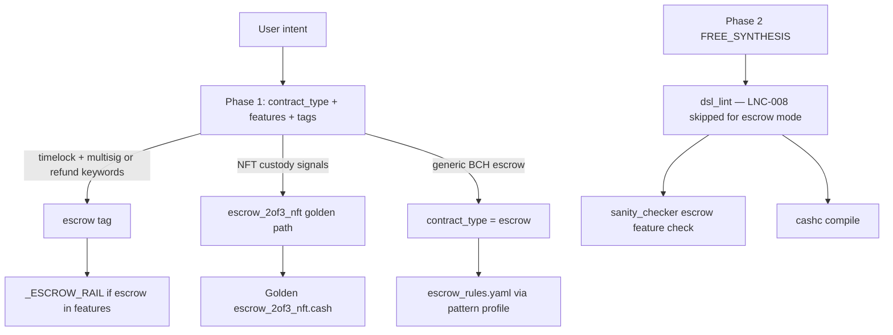

# Escrow — State Report (Phase 1 Audit)

**Date:** 2026-06-11  
**Scope:** Static audit of the `escrow` BCH pattern — rules, rails, evaluator, sanity checker, lint, routing, benchmark suites, and historical runs.  
**Method:** Code and artifact inspection; routing diagnostics (`scripts/diagnose_escrow_case.py`, `2026-06-11`); committed benchmark JSON under `benchmark/results/`. **No pipeline implementation changes in this audit.**

---

## Executive summary

Escrow has **working compile/convergence scaffolding** on both benchmark suites (6/6 and 10/10 in latest committed runs) but **very low measured quality on `escrow.yaml`** — avg final score **0.085**, avg intent coverage **0.475** (`bench_20260331_2120_3d04`). The dominant gap is **not compile failure**; it is **evaluator / suite mismatch** (spurious `token_validation` on pure BCH intents, `multisig` not credited for dual `checkSig` patterns) plus **generation gaps** on multi-path and dual-destination intents.

**Routing is mostly correct** for positive cases (14/16 diagnostics → `contract_type: escrow`, `escrow_rules_loaded: true`). **Failure-case intents** (`esc_005`, `esc_006`) misroute to `semantic_unsupported` / `nft_minting` when Phase 1 runs with `disable_golden=True`. **`_ESCROW_RAIL` attaches only when `"escrow"` appears in Phase 1 `features`** (4/16 cases) — most escrows rely on free synthesis without rail guidance.

**Regression harness** (`2_escrow`) **fails compile exhaustion** on both Llama and Claude runs — a **generation / convergence** signal distinct from benchmark success (different prompt, full guarded pipeline, model variance).

**Verdict:** Escrow is the **highest-priority BCH pattern**, but Phase 1 work should **not** mirror split’s N-output conservation rewrite. Priority order:

1. **Evaluator + suite alignment** (remove spurious token requirements; map `multisig` / role signatures).
2. **Rails + generation guidance** for arbiter, dual-destination, and timelock branches.
3. **Regression convergence** for vague 2-of-3 + timeout prompts.
4. **Failure-case routing** so negative tests stay in escrow profile.

**Primary failure class: E (evaluator mismatches)** on `escrow.yaml`; secondary **D (generation quality)** for regression and complex paths; minor **A (routing)** for failure cases and sparse rail attachment.

---

## 1. Generation path map



| Step | Location | Behavior |
|------|----------|----------|
| Phase 1 enum | `pipeline.py` ~1099–1102 | `escrow` vs `escrow_2of3_nft` (NFT/token custody triggers golden) |
| Tag enrichment | `pipeline.py` ~650–661 | `timelock` + `multisig` → `escrow` tag; refund/timeout keywords → `escrow` tag |
| NFT downgrade | `pipeline.py` ~702–706 | `escrow_2of3_nft` → `escrow` when no NFT context |
| BCH/token mismatch | `check_pure_bch_escrow_mismatch` ~786 | May set `semantic_unsupported` (seen on `esc_005`/`esc_006` diagnostics) |
| Pattern profile | `pattern_profiles.py:61–64` | `escrow` → `escrow_rules.yaml`; no lint disables |
| Rails | `build_pattern_rails()` ~379 | `"escrow" in tags` → `_ESCROW_RAIL` (minimal release/refund template) |
| Golden | `_GOLDEN_TYPE_MAP` | `escrow_2of3_nft` only |
| Fallback | `fallbacks/fallback_escrow.cash` | Basic release/refund template |

---

## 2. Escrow rules (`escrow_rules.yaml`)

**File:** `src/services/knowledge_structured/escrow_rules.yaml`

| Rule ID | Content | Gap |
|---------|---------|-----|
| ESCROW-RELEASE-AUTH | Dual `checkSig` for release branch | No 2-of-3 `checkMultiSig` variant; no separate arbiter paths |
| ESCROW-REFUND-TIMEOUT | `require(tx.time >= timeout)` | No guidance on buyer-only vs buyer+seller refund auth |
| ESCROW-REFUND-AUTH | Single-party `checkSig` on refund | No dual-destination lockingBytecode rules |

**Related:** `synthesis_rules.yaml` — no `canonical_escrow_*` entry comparable to split’s `canonical_split_nparty`. Golden templates: `knowledge/golden/patterns/escrow_2of3_nft.cash`, `knowledge/templates/escrow_2of3.cash`.

---

## 3. Escrow rail (`_ESCROW_RAIL`)

**File:** `pipeline.py:296–300`

```
[RAIL: ESCROW MODE]
- Release branch: require(checkSig(sigA, A)); require(checkSig(sigB, B));
- Refund branch: require(tx.time >= timeout); require(checkSig(sigA, A));
```

| Finding | Detail |
|---------|--------|
| Attachment | Only when `"escrow" in features` (Phase 1 tag), not when `effective_mode == "escrow"` alone |
| Coverage | **4/16** diagnostic cases had `escrow_rail_loaded: true` |
| Scope | 2-of-2 release + single-party timeout refund only — no arbiter, dual-destination, or `checkMultiSig` |
| vs split rail | Split rail was actively harmful (2-output hardcode); escrow rail is **under-specified**, not over-constraining |

---

## 4. Benchmark cases

### Suite A — `benchmark/suites/escrow.yaml` (6 cases)

| ID | Intent focus | Required features (problematic in **bold**) |
|----|--------------|-----------------------------------------------|
| esc_001 | 2-of-2 release | signature_verification, **multisig**, **token_validation** |
| esc_002 | 2-of-3 any-2 release | signature_verification, **multisig**, **token_validation** |
| esc_003 | Release + 30-day buyer reclaim | signature_verification, **multisig**, time_validation, multiple_paths, **token_validation** |
| esc_004 | Dual destination (seller path / buyer+arbiter path) | signature_verification, **multisig**, output_destination_validation, **token_validation** |
| esc_005 | **FAILURE** — no destination check | signature_verification, multisig |
| esc_006 | **FAILURE** — permanent covenant lock | signature_verification, multisig |

### Suite B — `benchmark/suites/escrow_suite.yaml` (10 cases)

Role-based features (`buyer_signature`, `seller_signature`, `arbitrator_signature`, `timelock_refund`, `multisig_2of3`) — **aligned with `feature_extractor.py`** and score **1.0** on `bench_20260315_1101_4fa4`.

### Regression harness

**File:** `tests/test_regression.py` — `("2_escrow", "2-of-3 multisig escrow with 30 day timeout reclaim")`  
Not in either YAML suite; exercises full guarded pipeline with fallbacks enabled.

---

## 5. Known failures

| Source | Symptom | Root cause (audit) |
|--------|---------|-------------------|
| `escrow.yaml` scoring | 6/6 compile, avg score **0.085** | Spurious `token_validation`; `multisig` not detected for 2× `checkSig`; failure cases not scored as negative tests |
| `esc_004` generated code | Single `release()` with one destination | Generation omits dual-path functions (compile still passes) |
| `esc_003` scoring | `multisig` missing despite 2× `checkSig` | Evaluator requires literal `multisig` feature; extractor only sets it on `checkMultiSig` |
| `esc_005`/`esc_006` diagnostics | `contract_type: semantic_unsupported`, `nft_minting` | Phase 1 misparses “FAILURE CASE” adversarial intents |
| `regression_results.json` `2_escrow` | `compile_exhausted`, 0 output chars | Generation / fix-loop exhaustion (Llama: 4 toll_gate violations) |
| `regression_results_run2.json` `2_escrow` | Same failure on Claude | Not model-specific |
| `bench_20260314_1530_7fe0` `escrow_medium_1` | intent_cov **0.25** despite compile | `checkMultiSig` detected but `buyer_signature`/`seller_signature`/`arbitrator_signature` not expanded from pubkey names (`arbiter` vs `arbitrator`) |
| `statusjune.md` | Regression vs benchmark conflict | Different prompts, paths, and success criteria |

---

## 6. Historical benchmark evidence

| Run ID | Suite | Cases | Compile | Converge | Avg intent cov | Avg final score | Notes |
|--------|-------|-------|---------|----------|----------------|-----------------|-------|
| `bench_20260331_2120_3d04` | escrow.yaml | 6 | 100% | 100% | 0.475 | **0.085** | Primary quality baseline |
| `bench_20260315_1101_4fa4` | escrow_suite.yaml | 10 | 100% | 100% | 1.0 | **1.0** | Role-based features work |
| `bench_20260314_1530_7fe0` | legacy 4-case | 4 | 100% | 100% | 0.8125 | 0.796 | `escrow_medium_1` evaluator gap |
| `diagnosis_11_patterns_20260331_213659.json` | 11-pattern sweep | escrow subset | high compile | — | low on escrow.yaml style | — | Dominant issue: `compile_pass_but_low_intent_coverage` |

**Per-case (`bench_20260331_2120_3d04`):**

| Case | compile | intent_cov | final_score | Missing features (typical) |
|------|---------|------------|-------------|----------------------------|
| esc_001 | pass | 0.33 | 0.067 | multisig, token_validation |
| esc_002 | pass | 0.67 | 0.133 | token_validation |
| esc_003 | pass | 0.60 | 0.06 | multisig, token_validation |
| esc_004 | pass | 0.75 | 0.15 | token_validation |
| esc_005 | pass | 0.50 | 0.10 | multisig (should fail negative test) |
| esc_006 | pass | 0.00 | 0.00 | signature_verification, multisig |

---

## 7. Evaluator requirements

**Files:** `benchmark/evaluator.py`, `benchmark/feature_extractor.py`, `benchmark/config/feature_rules.yaml`, `benchmark/config/semantic_requirement_map.yaml`

| Requirement | How satisfied today | Gap |
|-------------|---------------------|-----|
| `token_validation` | `tokenCategory` + `tokenAmount` in code | **Always missing** on pure BCH escrows — should not be required |
| `multisig` | `multisig` in detected set | Only from `checkMultiSig` — **not** from two `checkSig` lines |
| `signature_verification` | Any `*_signature` or `multisig` | Works when role names match (`buyer`, `seller`) |
| `buyer_signature` / `seller_signature` | `checkSig(..., buyer)` regex | Fails when pubkey named `arbiter` vs `arbitrator` |
| `multisig_2of3` | `checkMultiSig` regex in feature_rules | Works when model uses `checkMultiSig` |
| `output_destination_validation` | `locking_bytecode` detected | Works when `lockingBytecode ==` present |
| `timelock_refund` / `time_validation` | `timelock_refund` / `timelock_unlock` rules | Generally works on timeout branches |
| `both_signatures_required` | **No mapping** | Critical feature on esc_001 — never scored |
| `must_fail_*` (esc_005/006) | **No negative scoring** | Converged “bad” contracts score 0.0–0.5, not explicit fail |

**Pattern pool:** No dedicated `escrow` entry in `_cashtoken_alias_pool`; uses default pool.

---

## 8. Sanity requirements

**File:** `sanity_checker.py`

| Check | Trigger | Rule |
|-------|---------|------|
| Escrow feature evidence | `ctype == "escrow"` or `"escrow" in features` | Requires `tx.outputs` and `lockingBytecode` in code |
| Multisig accountancy | `contract_type == "multisig"` or `"multisig" in features` | Pubkey count vs threshold |

**Gaps:**

- No escrow-specific branch completeness check (release vs refund vs arbiter).
- No dual-destination enforcement for `esc_004`-style intents.
- Escrow mode does **not** skip sanity checks (unlike some token modes).
- Failure-case intents that route to `nft_minting` bypass escrow sanity rules entirely.

**Benchmark evidence:** No `escrow.yaml` case failed sanity in `bench_20260331_2120_3d04` (failures not at this layer).

---

## 9. Lint requirements

**File:** `dsl_lint.py`

| Rule | Escrow behavior |
|------|-----------------|
| LNC-003 (value anchoring) | **Skipped** for modes including `escrow`, `escrow_2of3_nft` |
| LNC-008 (output limit) | **Skipped** for `escrow` mode |
| LNC-016 | **Not** disabled in escrow profile (unlike multisig/timelock) |
| Covenant modes | `escrow` listed in `COVENANT_MODES` — stricter fee-subtraction context |

**Golden prefixes:** `escrow_` in golden adaptation list — fee subtraction allowed in golden escrow templates.

**Benchmark evidence:** All `escrow.yaml` and `escrow_suite.yaml` cases: `lint_errors: 0` in committed runs. Lint is **not** the primary bottleneck.

---

## 10. Routing diagnostics summary (`2026-06-11`)

**Tool:** `python scripts/diagnose_escrow_case.py all`  
**Output:** `benchmark/results/escrow_diagnostics/<case_id>.json`

| Metric | Result |
|--------|--------|
| `contract_type == escrow` | 14/16 |
| `escrow_rules_loaded` | 14/16 |
| `escrow_rail_loaded` | 4/16 |
| Misrouted (`esc_005`, `esc_006`) | `semantic_unsupported` → `nft_minting`, no escrow rules |

---

## 11. Failure classification (A–E)

| Class | Description | Escrow weight |
|-------|-------------|---------------|
| **A** Routing | Wrong contract_type, profile, or golden path | **Minor** — failure-case intents only in diagnostics; positive cases route correctly |
| **B** Rail failures | Missing or wrong `_ESCROW_RAIL` / rules overlay | **Low** — rail under-attached (12/16) but compile still passes |
| **C** Sanity/lint | Pre-compile policy blocks | **Low** — 0 lint failures in benchmark JSON |
| **D** Generation quality | Wrong branches, missing paths, compile exhaustion | **Moderate** — regression `2_escrow`, `esc_004` dual-path gap, `esc_006` generates literal permanent covenant |
| **E** Evaluator mismatches | Compile OK, low intent_coverage / score | **Primary** — `escrow.yaml` avg 0.085 despite 100% convergence |

---

## 12. Files referenced

| File | Role |
|------|------|
| `src/services/knowledge_structured/escrow_rules.yaml` | Pattern must/forbidden rules |
| `src/services/pipeline.py` | `_ESCROW_RAIL`, Phase 1 escrow tagging, golden path |
| `src/services/pattern_profiles.py` | `escrow` profile |
| `src/services/sanity_checker.py` | Escrow feature evidence |
| `src/services/dsl_lint.py` | LNC-003/008 escrow skips |
| `knowledge/golden/patterns/escrow_2of3_nft.cash` | NFT escrow golden |
| `knowledge/templates/escrow_2of3.cash` | Template |
| `src/services/fallbacks/fallback_escrow.cash` | Fallback |
| `benchmark/suites/escrow.yaml` | Legacy 6-case suite |
| `benchmark/suites/escrow_suite.yaml` | Role-based 10-case suite |
| `benchmark/evaluator.py` | Scoring |
| `scripts/diagnose_escrow_case.py` | Routing diagnostics |
| `benchmark/results/bench_20260331_2120_3d04.json` | Primary escrow.yaml evidence |
| `regression_results.json` | `2_escrow` failure |

---

## 13. Recommended Phase 1 focus (see `escrow_phase1_plan.md`)

1. **1A — Measurement gate:** Unify on `escrow_suite.yaml` + cleaned `escrow.yaml`; fix evaluator aliases; rerun 6-case subset.
2. **1B — Rails + synthesis:** Expand `_ESCROW_RAIL` / `escrow_rules.yaml` for 2-of-3, arbiter, dual-destination; attach rail when `effective_mode == escrow`.
3. **1C — Regression + failure cases:** Converge `2_escrow`; fix Phase 1 routing for adversarial intents; add negative scoring for `must_fail_*`.
