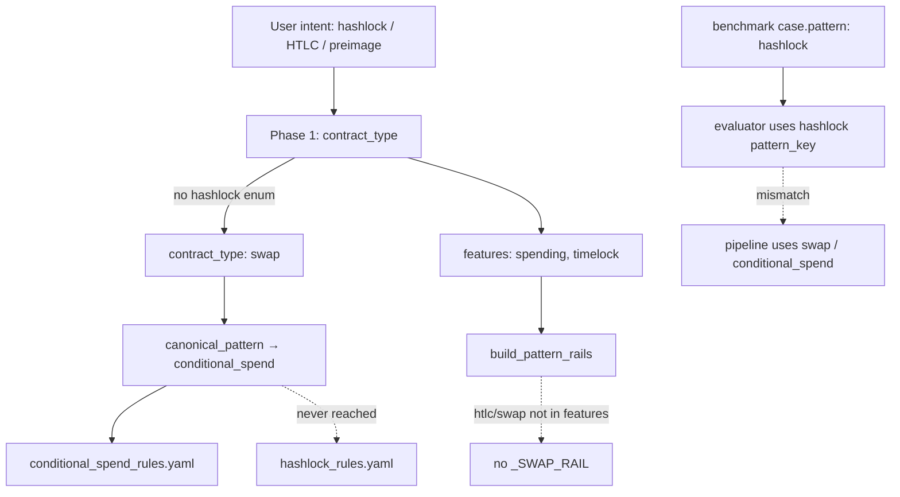

# Hashlock — State Report (Phase 1 Audit)

**Date:** 2026-06-11  
**Scope:** End-to-end audit of `hashlock` after Timelock Phase 1A. No implementation changes.  
**Method:** Code inspection, `scripts/diagnose_hashlock_case.py`, 4-case routing diagnostics, 3-case validation benchmark (`bench_20260611_1659_0cd2`).  
**Historical:** `bench_20260331_2117_fd6a` (full 5-case suite).

---

## Executive summary

Hashlock has **partial scaffolding**: `hashlock_rules.yaml`, pattern profile entry, 5-case suite, `fallback_swap.cash`, and `_SWAP_RAIL` exist — but **Phase 1 routes hashlock intents to `swap` → `conditional_spend`**, so **`hashlock_rules.yaml` is never injected** and **`_SWAP_RAIL` does not attach** (Phase 1 features omit `htlc`/`swap` even when benchmark YAML tags include them).

**Validation (2026-06-11, hl_001–hl_003):** **100% compile**, **0% convergence**, **avg score 0.044**. Generated contracts include correct `sha256`/`hash256`/`hash160` preimage checks and dual-path HTLC — **evaluator/suite naming is the sole blocker** on compiling cases.

**Historical full suite (`bench_20260331_2117_fd6a`):** **80% compile**, **80% convergence***, **avg score 0.013**. `hl_004` (multi-secret) fails at **Compile**; `hl_005` failure case compiles but scores 0 (evaluator).

\*Historical convergence used loose gate despite near-zero intent scores.

### Failure-class classification

| Class | Verdict |
|-------|---------|
| **A — Measurement-limited** | **Primary** — `hash_verification`, `preimage_validation`, `sha256_check`, `ripemd160_check`, `multiple_preimages`, `must_fail_missing_token_validation` unmapped in evaluator / semantic map |
| **C — Routing-limited** | **Secondary** — `contract_type: swap` → `conditional_spend_rules.yaml`; `hashlock_rules.yaml` unused; `_SWAP_RAIL` gated on features not emitted by Phase 1 |
| **B — Generation-limited (Split class)** | **No** on positive subset — 3/3 compile with valid preimage logic |
| **D — New synthesis family** | **No** — HTLC/hashlock shapes generate without dedicated rail; prompt DISTRIBUTION block references HTLC claim |

**Overall:** Hashlock follows **Escrow / Multisig / Timelock (measurement + routing)** — **not** Split-style structural generation failure on representative cases.

---

## 1. Routing



| Step | Location | Behavior |
|------|----------|----------|
| Phase 1 enum | `pipeline.py` ~1098–1127 | **`hashlock` not listed**; closest is `"swap"` → atomic exchange, hashlock or HTLC |
| Mode resolution | `resolve_effective_mode()` | Returns `swap` unchanged |
| Canonical alias | `pattern_profiles.py:22` | **`swap` → `conditional_spend`** (not `hashlock`) |
| Pattern profile | `pattern_profiles.py:51–54` | `hashlock` profile exists with `hashlock_rules.yaml` but **only if `contract_type == hashlock`** |
| Knowledge injection | `build_structured_knowledge()` | Loads profile for `swap` → **`conditional_spend_rules.yaml`** |
| `_SWAP_RAIL` | `pipeline.py:380` | Requires `"swap" in tags` or `"htlc" in tags` in **Phase 1 features** — not benchmark YAML tags |
| Benchmark pattern | `hashlock.yaml` | `pattern: hashlock` used by evaluator only; **does not override Phase 1 routing** |
| Golden | `_GOLDEN_TYPE_MAP` | **No** hashlock golden |
| Fallback | `pipeline_engine.py:405–406` | `fallback_swap.cash` when `swap`/`htlc` tags or `btype == swap` |

### Diagnostics (2026-06-11)

| Case | benchmark_pattern | contract_type | canonical | knowledge_files | hashlock_rules | swap_rail |
|------|-------------------|---------------|-----------|-----------------|----------------|-----------|
| hl_001 | hashlock | **swap** | conditional_spend | conditional_spend_rules.yaml | **no** | **no** |
| hl_002 | hashlock | **swap** | conditional_spend | conditional_spend_rules.yaml | **no** | **no** |
| hl_003 | hashlock | **swap** | conditional_spend | conditional_spend_rules.yaml | **no** | **no** |
| rp_002 | refundable_payment | **swap** | conditional_spend | conditional_spend_rules.yaml | **no** | **no** |

**Routing gap:** Benchmark measures `hashlock`; pipeline trains on `conditional_spend` without hashlock overlay or HTLC rail.

---

## 2. Rails

| Rail | Hashlock relevance | Loads on validation? |
|------|-------------------|----------------------|
| `_SWAP_RAIL` | `hash160(preimage)`, timeout refund branch | **No** — Phase 1 features lack `htlc`/`swap` |
| `_ESCROW_RAIL` | Unrelated unless escrow tagged | No |
| Phase 2 DISTRIBUTION block | HTLC claim pattern (external payout) | Prompt-only |

**No `_HASHLOCK_RAIL`** in `build_pattern_rails()`.

`hashlock_rules.yaml` content (unused on current routing):

| Rule | Content |
|------|---------|
| HL-PREIMAGE | `require(hash256(preimage) == expectedHash)` |
| HL-AUTH | `require(checkSig(claimSig, claimant))` |
| HL-TIMEOUT | Refund: `tx.time >= timeout` + refund sig |

---

## 3. Sanity

**File:** `sanity_checker.py`

| Check | Hashlock-specific? |
|-------|-------------------|
| Timelock evidence | Only when `"timelock" in features` |
| Hash / preimage | **None** |

**Validation run:** No sanity failures on hl_001–hl_003.

---

## 4. Lint

**File:** `dsl_lint.py` + `pattern_profiles.py`

| Rule | Hashlock behavior |
|------|-------------------|
| Profile disables | **None** — `hashlock` profile has empty `disable_lint_rules` |
| Effective mode `swap` | Uses `conditional_spend` profile — skips LNC-008, LNC-016, `missing_output_anchor` |
| Hash-specific lint | **None** dedicated |
| LNC-010 (timelock standalone) | Applies when timelock in code on HTLC refund paths |

**Validation run:** 0 lint errors on 3 cases.

---

## 5. Evaluator

| Component | Status |
|-----------|--------|
| `feature_rules.yaml` | `hashlock` regex detects `require(hash256\|sha256\|hash160\|ripemd160(...)==...)` |
| Suite `required_features` | `hash_verification`, `preimage_validation` — **not mapped** in `semantic_requirement_map.yaml` |
| Critical features | `sha256_check`, `ripemd160_check`, `locktime_check`, `multiple_hash_validation`, `must_fail_missing_token_validation` — **mostly unmapped** |
| `_cashtoken_alias_pool` | **No `hashlock` pool** |
| `pattern_key in {...}` | **`hashlock` not in timelock/multisig-style pool list** |

### Naming mismatch (root cause)

| Suite requirement | Detected in code | Credited? |
|-------------------|------------------|-----------|
| `hash_verification` | `hashlock` feature | **No** — different name |
| `preimage_validation` | `hashlock` + preimage param | **No** — unmapped |
| `sha256_check` (critical) | `sha256(preimage)` or `hash256(preimage)` | **No** — unmapped |
| `ripemd160_check` (critical) | `hash160(secret)` | **No** — unmapped |
| `time_validation` | `timelock_unlock` / `tx.time` | Partially via timelock mappings (post–Timelock 1A) |
| `multiple_paths` | ≥2 functions | Via default alias / function count |

**Example (hl_001 validation):** Code has `require(sha256(preimage) == paymentHash)`; `hashlock` detected; score **0.0** because `hash_verification` and `preimage_validation` missing.

**Example (hl_002 validation):** Valid HTLC with `claim` + `refund`; intent_cov **0.67**; final **0.133** — critical `sha256_check` / `locktime_check` penalty (×0.2).

---

## 6. Historical benchmark evidence

**Run:** `bench_20260331_2117_fd6a` (5 cases)

| Metric | Value |
|--------|-------|
| Compile rate | **80%** (4/5) |
| Convergence rate | **80%** (4/5) |
| Avg intent coverage | **0.133** |
| Avg final score | **0.013** |

### Per-case (historical)

| Case | Compile | Score | First failure | Notes |
|------|---------|-------|---------------|-------|
| hl_001 | pass | 0.0 | **Evaluator** | `sha256(secret)` present; `hash_verification` unmapped |
| hl_002 | pass | 0.067 | **Evaluator** | Full HTLC; missing `hash_verification`; critical penalty |
| hl_003 | pass | 0.0 | **Evaluator** | `hash160(secret)` present; unmapped |
| hl_004 | **fail** | 0.0 | **Compile** | Multi-secret — pipeline exhausted |
| hl_005 | pass | 0.0 | **Evaluator** | Failure case; token checks present; `must_fail_*` unwired |

11-pattern diagnosis (`diagnosis_11_patterns_20260331_213659.json`) flagged **4/4 compiling hashlock cases** as `compile_pass_but_low_intent_coverage` false positives.

---

## 7. Validation subset (2026-06-11)

**Run:** `bench_20260611_1659_0cd2` — hl_001, hl_002, hl_003

| Metric | Value |
|--------|-------|
| Compile rate | **100%** (3/3) |
| Convergence rate | **0%** (0/3) |
| Avg intent coverage | **0.222** |
| Avg final score | **0.044** |

| Case | Compile | Intent cov | Score | Generated hash logic | First failure |
|------|---------|------------|-------|---------------------|---------------|
| hl_001 | pass | 0.0 | 0.0 | `sha256(preimage) == paymentHash` | **Evaluator** |
| hl_002 | pass | 0.67 | 0.133 | `hash256` + `tx.time` refund | **Evaluator** (critical) |
| hl_003 | pass | 0.0 | 0.0 | `hash160(secret) == secretHash` + refund | **Evaluator** |

**Generation quality:** All three produce production-shaped hashlock/HTLC contracts. **No Split-class compile exhaustion** on this subset.

---

## 8. Security-negative cases (track separately)

Do not block Hashlock Phase 1A on:

| Case | Issue | Layer |
|------|-------|-------|
| hl_004 | Multi-secret simultaneous preimage — compile exhausted | Generation (hard) |
| hl_005 | `must_fail_missing_token_validation` — failure intent | Evaluator + compile path (mirror tl_004 / ms_004) |

Same initiative as `esc_005`, `esc_006`, `ms_004`, `ms_005`, `tl_004`.

---

## 9. Recommendation

### Proceed with **Hashlock Phase 1A (measurement alignment only)**

Mirror Escrow / Multisig / Timelock 1A:

1. Map `hash_verification` ↔ `hashlock` detected feature; `preimage_validation`, `sha256_check`, `ripemd160_check`, `multiple_preimages`
2. Wire `must_fail_missing_token_validation` for hl_005
3. Align suite critical/required naming with generated `sha256` vs `hash256` vs `hash160` variants
4. Optional routing fix in **later phase** (not 1A): add `hashlock` to Phase 1 enum or map `swap` → `hashlock` profile — **out of scope for measurement-only 1A** unless user approves pipeline touch

### Do **not** start Phase 1B (rails/golden) yet

Generation compiles representative hashlock/HTLC without a dedicated rail. Routing overlay gap is secondary to evaluator false negatives.

### Classification answer

**Primary: A (Measurement-limited)** with **C (Routing-limited)** overlay — **not B, not D**.

---

## Reproduce

```bash
python scripts/diagnose_hashlock_case.py all
python -m benchmark.runner benchmark/suites/hashlock.yaml --ids hl_001,hl_002,hl_003
```
