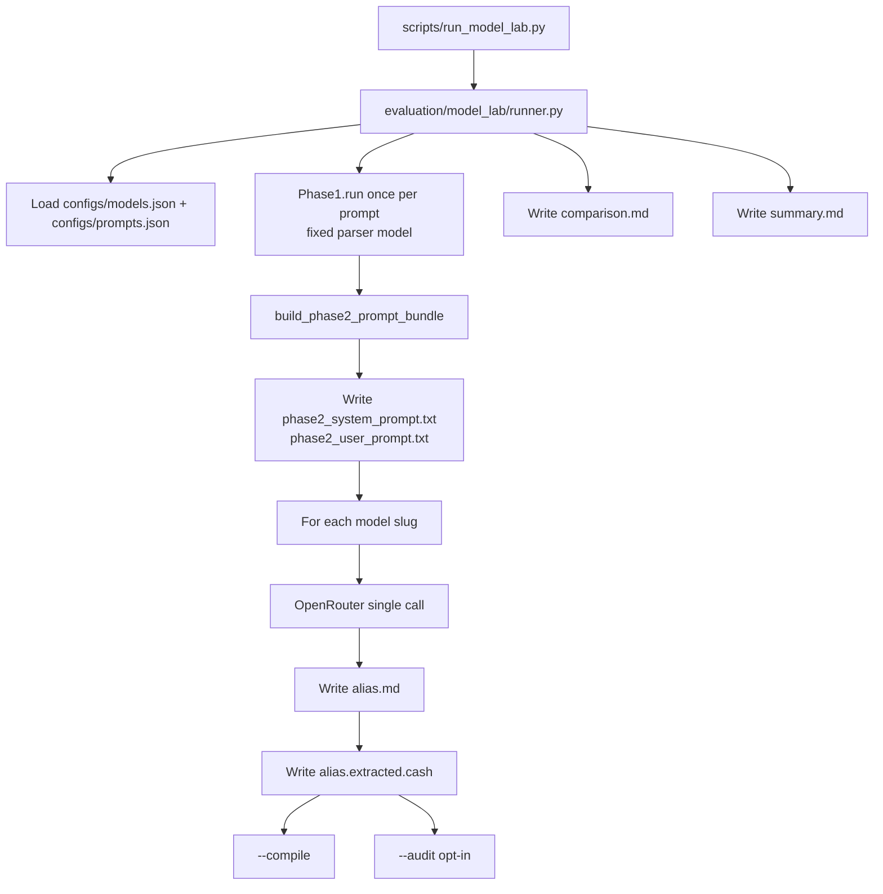

# NexOps Model Lab

## Goal

Run the **same NexOps Phase 2 prompt** (system + user) against multiple OpenRouter models and write outputs side-by-side for **manual** review. No automatic ranking, scoring, or LLM-as-judge comparison in the lab itself.

**Execution mode:** Shared Phase 1 per prompt, then one Phase 2 LLM call per model (no compile/fix retry loop). Raw model text stored unchanged in `.md` files.

---

## Architecture



### Design principles

| Principle | Implementation |
|-----------|----------------|
| Identical prompts | Phase 1 once per prompt; shared Phase 2 `(system, user)` |
| Prompt reproducibility | `phase2_system_prompt.txt` + `phase2_user_prompt.txt` per prompt folder |
| Raw storage | `.md` = exact LLM string |
| Extracted artifact | `{alias}.extracted.cash` via `_extract_cash_code` |
| No lab scoring | `summary.md` / `comparison.md` list files only — no winner |
| Audit is opt-in | Default: generation (+ optional `--compile`) |

---

## Folder layout

```
nexops-mcp/
├── configs/models.json
├── configs/prompts.json
├── evaluation/model_lab/
├── scripts/run_model_lab.py
└── model_lab_runs/              # gitignored
    └── run_2026_06_23/
        ├── run_manifest.json
        ├── summary.md
        └── prompt_concert_ticket_nft/
            ├── phase1_intent.json
            ├── phase2_system_prompt.txt
            ├── phase2_user_prompt.txt
            ├── comparison.md
            ├── sonnet.md
            ├── sonnet.json
            ├── sonnet.extracted.cash
            └── sonnet.compile.json   # if --compile
```

---

## Config schemas

### `configs/models.json`

```json
{
  "schema_version": "1.0",
  "models": [
    { "slug": "anthropic/claude-sonnet-4", "alias": "sonnet", "label": "Sonnet" }
  ]
}
```

Shorthand: `"models": ["anthropic/claude-sonnet-4"]` — alias derived from slug tail.

### `configs/prompts.json`

```json
{
  "schema_version": "1.0",
  "prompts": [
    {
      "id": "concert_ticket_nft",
      "prompt": "...",
      "tags": ["cashtokens", "nft", "minting"]
    }
  ]
}
```

---

## Per-generation metadata (`{alias}.json`)

Includes `temperature`, `max_tokens`, `phase1_model`, `tokens`, `latency_ms`, `response_sha256`, `extracted_sha256`, and `response`.

---

## CLI

```bash
python scripts/run_model_lab.py \
  --models configs/models.json \
  --prompts configs/prompts.json \
  --compile
```

| Flag | Purpose |
|------|---------|
| `--models PATH` | Model config (required) |
| `--prompts PATH` | Prompt config (required) |
| `--output-dir PATH` | Default: `model_lab_runs/run_YYYY_MM_DD` |
| `--phase1-model SLUG` | Override Phase 1 parser model |
| `--compile` | Compile `{alias}.extracted.cash` files |
| `--audit` | Opt-in full NexOps audit (expensive) |
| `--concurrency N` | Parallel model calls (default 3) |
| `--dry-run` | Validate configs, no API calls |
| `--filter-tags TAG,...` | Run prompts matching any tag |

Requires `OPENROUTER_API_KEY`.

---

## Git branch

Work on branch `model-lab` (not `main`).

---

## Out of scope

- Automatic ranking / leaderboards
- LLM judge for cross-model comparison
- Full guarded pipeline per model
- Web UI
