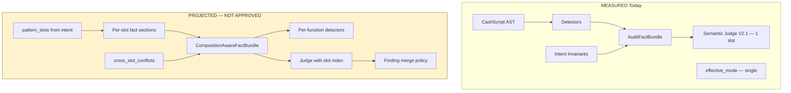

# Multi-Pattern Audit Architecture — Research Findings

**Sprint:** Phase 2 Composition Research  
**Branch:** `research/composition-sprint-v2`  
**Date:** 2026-06-20  
**Status:** Research only — **no implementation proposed or approved**  
**Builds on:** [`coverage_gap_analysis.md`](coverage_gap_analysis.md), [`false_positive_playbook.md`](false_positive_playbook.md), [`adversarial_strategy.md`](adversarial_strategy.md), [`bch_threat_model.md`](bch_threat_model.md)  
**Companion:** [`multi_pattern_generation_architecture.md`](multi_pattern_generation_architecture.md)

---

## Executive Summary

| Finding | Label |
|---------|-------|
| Baseline audit pipeline (compile → lint → detectors → `AuditFactBundle` → Semantic Judge V2.1) is **strong for single-pattern** contracts | MEASURED |
| **Interaction effects** between composed patterns produce emergent gaps not visible in per-family coverage | INFERRED |
| **Single semantic slot ceiling** — judge emits one primary finding; deterministic layer must surface secondary gaps | **MEASURED** (MIXED-1/2) |
| **Composition-aware AuditFactBundle** is a **research recommendation only** — not approved | PROJECTED |
| No composite detector for governance/timelock bypass, hashlock+escrow triple, or vault+multisig emergency paths | MEASURED |

**Scope:** This document analyzes **composition interaction effects**, not the baseline audit pipeline architecture (see [`audit_pipeline_architecture.md`](audit_pipeline_architecture.md), [`research_sprint_plan.md`](research_sprint_plan.md)).

---

## Label Legend

| Label | Meaning |
|-------|---------|
| **MEASURED** | Committed fixtures, adversarial runs, coverage matrices, or code behavior |
| **INFERRED** | Logical conclusion from MEASURED per-pattern coverage |
| **PROJECTED** | Research recommendation — **not approved for implementation** |

---

## Relationship to Audit Sprint v2

Audit Sprint v2 ([`research_sprint_plan.md`](research_sprint_plan.md)) delivered:

| Asset | Composition relevance | Label |
|-------|----------------------|-------|
| 180 benchmark scenarios | Single-pattern; `bench_dao_treasury_*` registered but composite detector **none** | MEASURED |
| Detector vs reasoning matrices | P0: governance composite, hashlock, dual-path | MEASURED |
| 18 FP patterns | Payroll treasury (FP-001) dominates composite payroll false positives | MEASURED |
| 200 adversarial scenarios | MIXED-1/2 document single-slot limit | MEASURED |
| 16 `security_patterns/` docs | Pairwise notes; no composition invariant merge rules | MEASURED |
| Semantic Judge V2.1 | 23/23 adversarial pass — **single-pattern** scope | MEASURED |

**Composition Research does not redesign Judge V2.1.** It documents why composite contracts need **additional bundle facts** and **interaction-aware detectors** before benchmark materialization.

---

## Single Semantic Slot Ceiling (MEASURED)

### Evidence

| Source | Observation | Label |
|--------|-------------|-------|
| `tests/adversarial_semantic_judge/scenarios.py` MIXED-1 | `ground_truth_notes`: "Single semantic slot surfaces treasury; auth gap must appear deterministically" | MEASURED |
| MIXED-1 `must_include_deterministic` | `intent_auth_gate` required — auth not from judge | MEASURED |
| [`semantic_judge_v2_adversarial_report.md`](semantic_judge_v2_adversarial_report.md) | "Deterministic layer compensates for single semantic slot" | MEASURED |
| V2.1 MIXED-1 result | PASS — `deployment_requirement` from judge; `VULNERABILITY` from deterministic | MEASURED |
| Replay `replay_mixed_trust_001` | V2 failed; V2.1 fixed treasury classification | MEASURED |

### Architectural Implication

The Semantic Judge is scoped to emit **one primary semantic finding** per invocation (INFERRED from MIXED-1 design). In composite contracts:

- **Trust-boundary** findings (treasury prefunding, LP funding) consume the semantic slot
- **Authorization** gaps (missing multisig on distribute) must surface via **deterministic** `intent_invariants` or detectors
- **Third-pattern** gaps (timelock bypass on emergency) have **no slot** today

| Pattern count | Slots available | Deterministic burden | Label |
|---------------|-----------------|----------------------|-------|
| 1 | 1 semantic + N deterministic | Low | MEASURED |
| 2 (mixed trust+auth) | 1 semantic | Medium — MIXED-1/2 | MEASURED |
| 3+ | 1 semantic | **High** — untested | INFERRED |

**Research conclusion:** Multi-pattern audit cannot rely on judge alone. Composition-aware fact bundles (PROJECTED) must pre-classify per-pattern findings for policy merge.

---

## Focus Compositions (P0/P1)

Four compositions selected for interaction-effect analysis — aligned with [`composition_matrix.md`](composition_matrix.md) P0 deep-dives and catalog entries.

| Composition | Catalog | Patterns | Audit fixture status |
|-------------|---------|----------|---------------------|
| **Vault + Timelock** | UCT-033, UCT-036 | Vault, Timelock | P — `vault/founder_cliff_secure.cash` |
| **Vault + Split + Multisig** | UCT-001, UCT-114 | Vault, Split, Multisig | P/N — payroll assumes owner sig |
| **Escrow + Hashlock + Timelock** | UCT-065 | Escrow, Hashlock, Timelock | P — `refundable/htlc_refund_secure.cash` |
| **FT + NFT + Treasury** | UCT-015 | FT, NFT, Vault, Multisig | P — `cashtokens/hybrid_treasury_secure.cash` |

---

## Composition 1: Vault + Timelock

**Example:** Founder Vesting (UCT-033), Employee Cliff (UCT-036)

### Per-Pattern Baseline Coverage

| Pattern | Detector | Reasoning | Label |
|---------|----------|-----------|-------|
| Vault | partial (`time_validation` FN) | partial | MEASURED |
| Timelock | partial (`time_validation_error`) | partial evaluator mapping | MEASURED |

### Interaction Effects (Emergent)

| Emergent risk | Mechanism | Baseline catches? | Label |
|---------------|-----------|-------------------|-------|
| **Cliff bypass via wrong function** | Attacker calls `claimEarly()` without timelock guard while `claimCliff()` is correct | partial — per-function only | INFERRED |
| **Staged amount vs time mismatch** | Vault tier releases amount X at T1; timelock on different function allows early spend | none — cross-function | INFERRED |
| **Evaluator false negative** | `this.age >= delay` not credited (`vault_layer_diagnosis`) | measurement gap masks audit confidence | MEASURED |
| **Cancellation vs emergency** | `emergencyRecover` without timelock competes with staged claim | reasoning only | INFERRED |

### Invariant Composition

| Invariant | Vault slot | Timelock slot | Composed rule (research) |
|-----------|------------|---------------|--------------------------|
| `auth_gate` | ENFORCED on claim | ENFORCED on time-gated path | Both functions must gate |
| `time_validation` | staged delay | CLTV absolute | **Min(delay, locktime)** per path |
| `output_value_validation` | tier conservation | n/a | Claim output ≤ staged allowance |

**Gap:** No merged invariant ID `vault_timelock_staged_release` in intent engine (MEASURED).

### Detector Composition

- `time_validation_error` runs per AST — does not know vault tier context (INFERRED)
- Vault profile disables some LNC rules — timelock paths may skip checks (MEASURED vault audit profile)

### Conflict Detection (Research)

| Conflict | Symptom | Detection today |
|----------|---------|-----------------|
| Shorter timelock on recovery than cliff | Emergency spends before cliff | **none** |
| Vault tier amount > input | Conservation break | partial `output_binding_missing` |

### Emergent Vulnerabilities

1. **Recovery shortcut** — `emergencyRecover` without `require(tx.time >= cliff)` (dao_treasury.md analog, INFERRED)
2. **Wrong-function spend** — public function missing timelock duplicates vault claim path (INFERRED)

### FP Risk

- FP-001 treasury prefunding on vesting contracts with off-chain funding narrative (MEASURED FP playbook)
- Do not classify cliff timing as DEPLOYMENT_REQUIREMENT (INFERRED)

---

## Composition 2: Vault + Split + Multisig

**Example:** Payroll Treasury (UCT-001), Emergency Recovery Vault (UCT-114), Bonus Pool (UCT-006)

### Per-Pattern Baseline Coverage

| Pattern | Detector | Reasoning | Label |
|---------|----------|-----------|-------|
| Vault | partial | partial | MEASURED |
| Split | `intent_fixed_amount_per_recipient` full | partial proportional | MEASURED |
| Multisig | `multisig_distinctness_flaw` full | full intent vs code | MEASURED |

### Interaction Effects (Emergent)

| Emergent risk | Mechanism | Baseline catches? | Label |
|---------------|-----------|-------------------|-------|
| **Multisig on vault but not split** | `approveBatch` multisig'd; `distribute` single-sig | partial — dual-path class | INFERRED |
| **Split without multisig on treasury path** | Payroll fixture assumes owner sig (MEASURED) | **miss** on composite | MEASURED |
| **Vault staging bypasses split conservation** | `instantSpend` drains before N-way split | partial aggregation | INFERRED |
| **Threshold downgrade on distribute only** | 2-of-3 on vault; 1-of-1 on split | HIDDEN_AUTH class | INFERRED |

### Invariant Composition

| Composed invariant | Required hold | Conflict with |
|--------------------|---------------|---------------|
| Σ split outputs = distributable | Split | Vault staged reserve |
| `checkMultiSig` on all spend entrypoints | Multisig | Split owner-sig payroll model |
| Staged reserve ≥ sum(split) | Vault + Split | Instant spend paths |

**MEASURED gap:** Payroll audit (`payroll/fixed_salary_secure.cash`) does not assert multisig on distribute (composition_matrix P0).

### Detector Composition

| Detector | Vault path | Split path | Composed blind spot |
|----------|------------|------------|---------------------|
| `intent_auth_gate` | per-function | per-function | Different functions, one unchecked |
| `multisig_distinctness_flaw` | recovery only | n/a | Distribute path omitted |
| `intent_fixed_amount_per_recipient` | n/a | distribute | Vault staging ignored |

### Conflict Detection (Research)

| Conflict | Label |
|----------|-------|
| `effective_mode=split` → multisig profile not loaded | MEASURED (routing) |
| MIXED-2: multisig intent + single-sig code + LP funding | MEASURED adversarial |
| Single semantic slot → treasury or auth, not both | MEASURED |

### Emergent Vulnerabilities

1. **Governed vault, ungoverned distribute** — highest P0 payroll risk (MEASURED catalog rationale UCT-001)
2. **Partial batch approval** — multisig approves amount A; split sends A+B (INFERRED)
3. **Emergency drain before split** — vault `emergencyRecover` bypasses payroll split (bch_threat_model DAO timelock bypass, MEASURED none)

### FP Playbook Interactions

| FP | Composite scenario | Prevention |
|----|-------------------|------------|
| FP-001 | Treasury prefunding on payroll multisig | Assert `NOT_ENFORCEABLE_ONCHAIN` only when no auth gap |
| FP-004 | Hallucinated missing auth when multisig on **wrong** function | Per-function `cap.has_checksig` scope |
| FP-005 | Duplicate split invariant + judge rediscovery | `delta_only` scope per pattern slot |

---

## Composition 3: Escrow + Hashlock + Timelock (HTLC)

**Example:** HTLC Escrow (UCT-065), rp_002 routing

### Per-Pattern Baseline Coverage

| Pattern | Detector | Reasoning | Label |
|---------|----------|-----------|-------|
| Escrow | role separation **none** (unregistered) | partial | MEASURED |
| Hashlock | **none** | **none** | MEASURED |
| Timelock | partial | partial | MEASURED |

### Interaction Effects (Emergent)

| Emergent risk | Mechanism | Baseline catches? | Label |
|---------------|-----------|-------------------|-------|
| **Both paths executable** | Preimage reveal AND timeout refund both lack mutual exclusion | partial reasoning | INFERRED |
| **Wrong hash function** | sha256 vs hash160 mismatch | evaluator gen gap | MEASURED |
| **Routing hijack** | `swap`→`conditional_spend` drops escrow role model | MEASURED hashlock_layer_diagnosis | MEASURED |
| **Timelock on wrong branch** | Refund path unlocked immediately | partial `time_validation_error` | INFERRED |

### Invariant Composition

| Branch | Required invariants | Composed mutual exclusion |
|--------|---------------------|----------------------------|
| Reveal | `hashlock_preimage`, `auth_gate` buyer/seller | `require(!timeoutExpired)` |
| Refund | `time_validation`, `auth_gate` refundee | `require(timeoutExpired)` |
| Escrow | role separation, 2-of-3 release | Arbiter must not unlock both |

**Gap:** No `htlc_mutual_exclusion` invariant (MEASURED coverage_gap P0 hashlock).

### Detector Composition

- No hashlock detector → preimage binding unverified (MEASURED)
- `EscrowRoleEnforcementDetector` unregistered (MEASURED)
- Timelock partial — timeout path not all covered (MEASURED)

### Conflict Detection (Research)

| Conflict | Evidence |
|----------|----------|
| Escrow arbiter + hashlock reveal same output | INFERRED — role confusion |
| Conditional_spend rail vs escrow rail | MEASURED routing |

### Emergent Vulnerabilities

1. **Double-spend via path race** — both HTLC branches satisfiable (INFERRED — classic HTLC)
2. **Arbiter preimage theft** — escrow multisig on wrong party for reveal (INFERRED)
3. **Evaluator false pass** — compile success with wrong hash algo (MEASURED)

### Adversarial Strategy Link

- Category **HIDDEN_AUTH** — admin path + public path (adversarial_strategy)
- Category **PARTIAL** — auth on 1 of 2 HTLC branches (INFERRED mapping)
- No dedicated HTLC adversarial family in 200 registry (MEASURED gap)

---

## Composition 4: FT + NFT + Treasury (Hybrid)

**Example:** Hybrid FT/NFT Treasury (UCT-015), Token Payroll (UCT-002 partial)

### Per-Pattern Baseline Coverage

| Pattern | Detector | Reasoning | Label |
|---------|----------|-----------|-------|
| FT | full token stack | full | MEASURED |
| NFT | full + commitment | full | MEASURED |
| Vault | partial | partial | MEASURED |
| Multisig | full distinctness | full | MEASURED |

### Interaction Effects (Emergent)

| Emergent risk | Mechanism | Baseline catches? | Label |
|---------------|-----------|-------------------|-------|
| **FT migration breaks NFT gate** | Hybrid continuity on vault stage transition | `hybrid_continuity_break` on path | MEASURED |
| **NFT spent without multisig** | Separate functions per asset class | per-function only | INFERRED |
| **Category drift on treasury rebalance** | FT vault → NFT vault migration | `token_category_drift` if coded | MEASURED |
| **Governance composite** | Emergency skips timelock | **none** | MEASURED |

### Invariant Composition

| Asset | Invariants | Treasury composed rule |
|-------|------------|------------------------|
| FT | amount conservation, category | Multisig on all FT spends |
| NFT | commitment, authority | Multisig on NFT transfers |
| Vault | staged release | Per-asset staging independent |
| Multisig | threshold, distinctness | **Same threshold all paths** |

**Gap:** No cross-asset `treasury_governance_uniform` invariant (MEASURED — governance composite none).

### Detector Composition

CashToken detectors are **mode-aware** (`effective_mode` = `hybrid_token` | `token_ft` | `nft_*`) — single mode cannot run all detectors on composite artifact (INFERRED from `pipeline.py` mode-conditional lint).

| Mode passed | Detectors active | Blind to |
|-------------|------------------|----------|
| `hybrid_token` | hybrid + FT partial | NFT-only paths in separate fns |
| `vault` | vault disables token checks | FT/NFT inflation |

### Conflict Detection (Research)

| Conflict | Label |
|----------|-------|
| `hybrid_token` golden vs vault+multisig functions | INFERRED |
| Soulbound NFT in treasury migration | partial `capability_unrestricted_nft_transfer` | MEASURED |

### Emergent Vulnerabilities

1. **Asset-class auth asymmetry** — FT path 2-of-3; NFT path single-sig (INFERRED)
2. **Hybrid migration state fork** — two valid treasury states after rebalance (bch_threat_model state fork, partial)
3. **Mint escape during treasury rebalance** — FT mint authority on migration function (MEASURED detectors if mode correct)

### BCH Threat Model Mapping

| Threat class | Composite manifestation | Coverage |
|--------------|------------------------|----------|
| Token category drift | Rebalance FT→NFT | full per-path |
| DAO timelock bypass | Emergency on vault | **none** |
| Cross-contract replay | Same hashlock in two swaps | **none** |
| Treasury prefunding | LP funds hybrid UTXO | TRUST-3, reasoning |

---

## Cross-Cutting Frameworks

### Invariant Composition (Research)

**Today (MEASURED):** `intent_invariants` engine evaluates flat invariant list against AST. Pattern profiles add/disable invariants per `effective_mode`.

**Composition gap (INFERRED):** Invariants are not **scoped to pattern slots** or **functions**. A composed contract needs:

| Composition construct | Research need | Status |
|-----------------------|---------------|--------|
| Slot-scoped invariants | `inv.auth_gate@distribute` vs `@recover` | PROJECTED |
| Cross-slot implications | `staging_reserve >= sum(split)` | PROJECTED |
| Mutual exclusion | `reveal XOR refund` for HTLC | PROJECTED |
| Priority rules | Security > business > informational per slot | INFERRED from tier docs |

### Detector Composition (Research)

| Strategy | Description | Tradeoff | Status |
|----------|-------------|----------|--------|
| **Union** | Run all pattern detectors regardless of mode | FP increase on vault LNC disables | INFERRED |
| **Per-function mode** | Map AST function → `effective_mode` | Requires CompositionIR (PROJECTED) | PROJECTED |
| **Composite detectors** | `GovernanceCompositeDetector`, `HTLCMutualExclusionDetector` | Maintenance cost | PROJECTED |
| **Status quo** | Single `effective_mode` | Blind spots documented above | MEASURED |

[`detector_roadmap.md`](detector_roadmap.md) P0: register or delete unregistered escrow/hashlock detectors before composite detectors (INFERRED priority).

### Conflict Detection (Research)

Conflicts arise when pattern requirements **cannot jointly hold** or **one pattern silences another**:

| Conflict type | Example | Detection today |
|---------------|---------|-----------------|
| Rail | Covenant terminate vs Split P2PKH | MEASURED semantic_005_008 |
| Mode | split wins over multisig | MEASURED |
| Invariant | Treasury prefund vs auth gap | MEASURED MIXED-1 |
| Evaluator | Vault FN hides timelock pass | MEASURED |
| Judge | Single slot — trust vs exploit | MEASURED |

**PROJECTED research:** Static conflict matrix from [`composition_matrix.md`](composition_matrix.md) X cells → audit warnings at bundle build time.

### Emergent Vulnerabilities Taxonomy

| Class | Definition | Example compositions |
|-------|------------|---------------------|
| **E1 — Path asymmetry** | Pattern A secured; Pattern B on adjacent function not | Vault+Split+Multisig distribute |
| **E2 — Mutual exclusion failure** | Both branches of composed logic satisfiable | HTLC Escrow |
| **E3 — Mode blindness** | Detectors for pattern B inactive under mode A | FT+NFT hybrid |
| **E4 — Slot starvation** | Judge consumes slot; exploit on pattern C undetected | MIXED-1 class |
| **E5 — Measurement false confidence** | Evaluator pass; composite intent unmet | Vault evaluator FN |

---

## Composition-Aware Audit Fact Bundle (PROJECTED — Research Recommendation Only)

**Not approved for implementation.** Research recommendation for a future audit sprint.

### Motivation

Current `AuditFactBundle` (MEASURED from audit pipeline) aggregates:

- Capabilities (`cap.*`)
- Intent invariants (`inv.*`)
- Deterministic findings
- Judge instructions (`delta_only`, scope)

Single `effective_mode` scopes all facts (INFERRED). Composite contracts need **fact partitioning**.

### PROJECTED Bundle Extensions

### PROJECTED Fields (Illustrative)

| Field | Purpose |
|-------|---------|
| `pattern_slots[]` | `{pattern_id, functions[], effective_mode, invariant_ids[]}` |
| `facts_by_slot` | Capabilities and invariants scoped per slot |
| `cross_slot_constraints[]` | Mutual exclusion, conservation across functions |
| `composition_conflicts[]` | Matrix X-cell warnings from composition_matrix |
| `judge_instructions.slots[]` | Per-slot semantic scope; preserves single-slot per call OR multi-call merge |
| `finding_merge_policy` | Deterministic > semantic; security tier ordering |

### Interaction with False Positive Playbook

| FP | Bundle mitigation (PROJECTED) |
|----|-------------------------------|
| FP-001 | Tag treasury facts `slot:operational`; separate from `slot:auth` |
| FP-004 | Per-slot `cap.has_checksig` — no global flag |
| FP-005 | `delta_only` per slot |
| FP-008 | MIXED trust+auth — explicit `primary_slot` + `secondary_deterministic_required[]` |

### Interaction with Adversarial Strategy

Materialize adversarial families (PROJECTED priority):

| Category | Composite extension |
|----------|---------------------|
| HIDDEN_AUTH | Multisig on vault, single-sig on split |
| PARTIAL | HTLC auth on reveal only |
| TRUST | Hybrid treasury LP + auth gap |
| CONTRA | Secure escrow + scary split intent |

### Interaction with BCH Threat Model

Composition-aware bundle would tag threats by layer interaction:

- UTXO + Token (FT+NFT treasury)
- Covenant + Timelock (vault staged + absolute CLTV)
- Trust + Auth (payroll composite)

---

## Benchmark Implications

| Gap | Impact | Label |
|-----|--------|-------|
| 38 executable audit benches — single-pattern | L1 partial only | MEASURED |
| No composite `expected_findings` per slot | Cannot test E1–E5 | MEASURED |
| `bench_dao_treasury_*` stub | Governance composite untested | MEASURED |
| Replay corpus — no composite entries | Regression gap | MEASURED |
| MIXED-1/2 only composite adversarial | Insufficient for 3+ patterns | MEASURED |

### Research Benchmark Tiers (Not Implementation)

| Tier | Compositions | Validates |
|------|--------------|-----------|
| T1 | Escrow+Multisig (UCT-067) | Baseline union adequate? |
| T2 | Vault+Timelock (UCT-036) | Cross-function timelock |
| T3 | HTLC (UCT-065) | Mutual exclusion + hashlock detector |
| T4 | Vault+Split+Multisig (UCT-001) | E1 path asymmetry — **blocked** until gen Split GREEN |
| T5 | FT+NFT+Treasury (UCT-015) | Per-function mode + hybrid |

---

## Detector vs Reasoning — Composition Overlay

Extends [`coverage_gap_analysis.md`](coverage_gap_analysis.md) with **interaction column**:

| Attack class | Single-pattern | Composition interaction | Detector | Reasoning |
|--------------|----------------|-------------------------|----------|-----------|
| Governance timelock bypass | none | Vault+Multisig emergency | none | untested |
| Hashlock wrong preimage | none | HTLC triple | none | none |
| Dual-path auth | partial | Vault+Split distribute | partial | partial |
| Token category drift | full | FT+NFT rebalance | full per-path | partial |
| Treasury prefunding | n/a | Payroll composite | n/a | full — **starves slot** |
| HTLC mutual exclusion | n/a | Escrow+Hashlock+Timelock | none | none |

---

## Honest Assessment

| Question | Answer | Label |
|----------|--------|-------|
| Can baseline audit handle 2-pattern escrow+multisig? | **Mostly yes** with correct `effective_mode` | INFERRED |
| Can baseline audit handle payroll treasury? | **No** — multisig distribute gap + single slot | MEASURED |
| Can baseline audit handle HTLC? | **No** — hashlock detector none | MEASURED |
| Is CompositionAwareFactBundle required for 3+? | Research says **yes**; not approved | PROJECTED |
| Should we expand judge to multi-finding? | Out of scope; deterministic burden rises | INFERRED |

---

## Related Documents

- [`multi_pattern_generation_architecture.md`](multi_pattern_generation_architecture.md) — generation-side composition limits
- [`composition_matrix.md`](composition_matrix.md) — pairwise compatibility
- [`coverage_gap_analysis.md`](coverage_gap_analysis.md) — baseline gaps
- [`false_positive_playbook.md`](false_positive_playbook.md) — FP-001, FP-004, FP-005, FP-008
- [`adversarial_strategy.md`](adversarial_strategy.md) — MIXED-1/2, category taxonomy
- [`bch_threat_model.md`](bch_threat_model.md) — DAO timelock bypass, cross-contract
- [`audit_replay_strategy.md`](audit_replay_strategy.md) — replay corpus extension point
- [`research_sprint_plan.md`](research_sprint_plan.md) — Audit Sprint v2 baseline

---

## Non-Goals (This Document)

- No Semantic Judge V2.1 redesign
- No finding policy changes
- No `AuditFactBundle` code changes
- No approval of composition-aware bundle schema
- No new detector implementation
