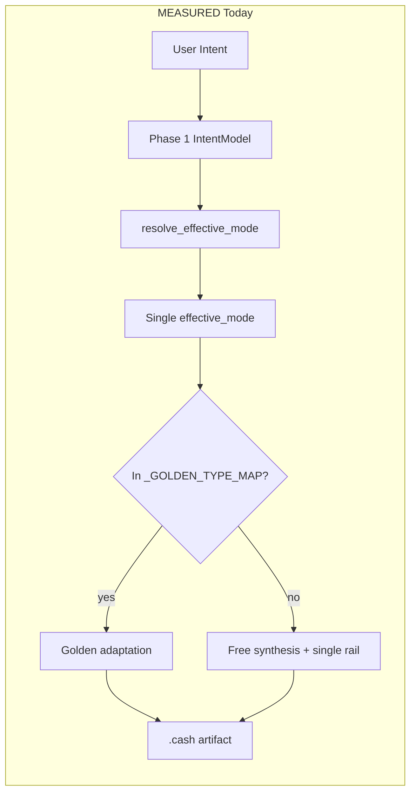
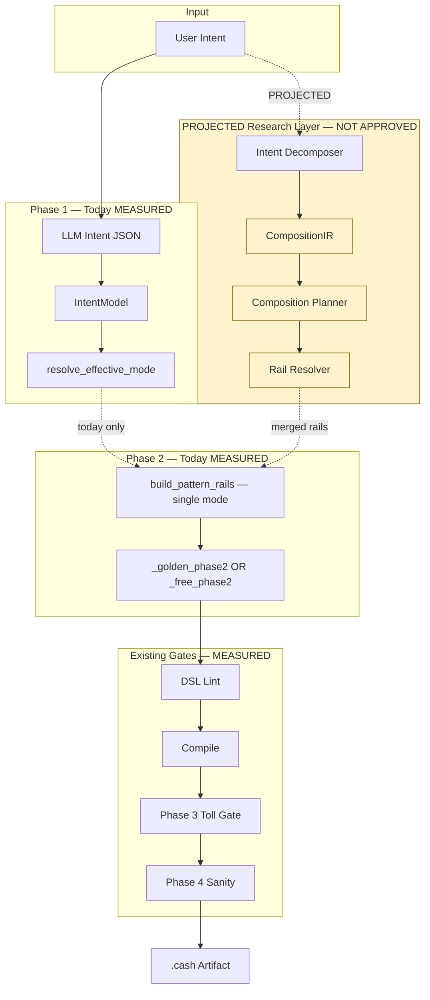

# Multi-Pattern Generation Architecture — Research Findings

**Sprint:** Phase 2 Composition Research  
**Branch:** `research/composition-sprint-v2`  
**Date:** 2026-06-20  
**Status:** Research only — **no implementation proposed or approved**  
**Inputs:** [`composition_readiness_scorecard.md`](composition_readiness_scorecard.md), [`composition_matrix.md`](composition_matrix.md), [`uncommon_contract_catalog.md`](uncommon_contract_catalog.md) (P0 top 20), [`statusjune.md`](../statusjune.md) §4, `pipeline.py` `resolve_effective_mode`, [`generation_failure_corpus.md`](generation_failure_corpus.md)

---

## Executive Summary

| Finding | Label |
|---------|-------|
| **2-pattern** compositions where both operands are Escrow, Multisig, Timelock, FT, or NFT can succeed via **golden template adaptation** today | INFERRED |
| **3-pattern** business contracts (DAO Treasury, HTLC Escrow, Founder Vesting without Split overlay) are **almost** feasible with golden staging but unreliable under free synthesis | INFERRED |
| **4+ pattern** contracts (Payroll Treasury, Hybrid FT/NFT Treasury) **fail** under single `effective_mode` + tag stacking | MEASURED |
| **CompositionIR**, **composition planner**, and **rail resolver** are **PROJECTED** research artifacts — not approved for implementation | PROJECTED |

**Honest ceiling:** Golden-path **2-pattern** may work today. **4+ patterns** need a planner; tag stacking alone cannot select mutually exclusive rails, profiles, and evaluators.

---

## Label Legend

| Label | Meaning |
|-------|---------|
| **MEASURED** | Evidence from committed benchmark JSON, compile artifacts, or code inspection |
| **INFERRED** | Logical conclusion from multiple MEASURED facts; not directly benchmarked |
| **PROJECTED** | Research hypothesis for a future architecture — **not approved** |

---

## Plan Examples A–D (P0/P1 Catalog Scope)

Analysis limited to P0/P1 entries in [`uncommon_contract_catalog.md`](uncommon_contract_catalog.md) §P0 Top 20 and related P1 pairs cited in [`composition_matrix.md`](composition_matrix.md).

| Example | Catalog ID | Patterns | Tier | Readiness | Priority |
|---------|------------|----------|------|-----------|----------|
| **A — Payroll Treasury** | UCT-001 | Split + Multisig + Timelock + Vault | L4 | Not yet | P0 |
| **B — Founder Vesting** | UCT-033 | Vault + Timelock + Split | L3 | Almost | P0 |
| **C — Revenue Share** | UCT-051 | Split + Escrow + FT | L3 | Partial | P0/P1 |
| **D — Complex Workflow** | UCT-015 (proxy) | FT + NFT + Vault + Multisig | L4 | Partial | P1 |

*Example D uses UCT-015 Hybrid FT/NFT Treasury as the canonical L4 “complex workflow” from [`composition_matrix.md`](composition_matrix.md) L4 tier. UCT-003 (Payroll With Governance Recovery) is an alternate L4 payroll variant with the same architectural failure mode.*

---

## Example A — Payroll Treasury (UCT-001)

**Intent:** Monthly payroll to N employees; governance multisig approves batch; timelock delay before release; vault stages reserve funding.

### Why Current Architecture Succeeds (Partial)

| Dimension | Evidence | Label |
|-----------|----------|-------|
| Individual pattern knowledge exists | Split rail (`_SPLIT_RAIL`), vault rail (`_VAULT_RAIL`), multisig profile, timelock rules YAML | MEASURED |
| Payroll audit fixtures | `payroll/fixed_salary_secure.cash`; 4 executable payroll benches | MEASURED |
| Pairwise Escrow+Multisig, Multisig+Timelock | Compatible per matrix | INFERRED |

### Why Current Architecture Fails

| Dimension | Evidence | Label |
|-----------|----------|-------|
| Split convergence | Latest dedicated suite **50%** conv (`bench_20260331_2125_2cb6`) | MEASURED |
| Split+Multisig compile | `A_split_multisig` FAILED in `coverage_stability_results.json` | MEASURED |
| N-output conservation | `_SPLIT_RAIL` hardcoded for 2 outputs (GF-007) | MEASURED |
| Single `effective_mode` | `multisig+distribution` → `split` wins; multisig profile may not load | MEASURED |
| Payroll audit assumes owner sig | Not multisig threshold on distribute path | MEASURED |

### Routing Requirements (Research)

1. Decompose intent into **primary distribution** (Split) vs **authorization shell** (Multisig) vs **temporal gate** (Timelock) vs **staging** (Vault) — not a single winner-take-all mode.
2. Preserve **feature tags** for all four patterns through Phase 1 → Phase 2; `resolve_effective_mode` today collapses to one string (MEASURED).
3. Route CashToken payroll variants (UCT-002) separately — `split`+`ft` currently hijacked to `ft_transfer` (GF-008, MEASURED).

### Intent Decomposition (Research)

| Slot | Payroll Treasury semantics | Current `IntentModel` gap |
|------|---------------------------|---------------------------|
| Distribution | N fixed amounts to employees | `features: ["split"]` only; no structured recipient list |
| Authorization | 2-of-3 treasury council | Loses to `effective_mode=split` |
| Temporal | CLTV on monthly release | Timelock tag enriches escrow paths, not split |
| Staging | Reserve vault before distribute | Vault canonical path excludes split overlay |

### Constraint Extraction (Research)

Cross-pattern constraints that must be jointly satisfied:

- **Conservation:** Σ employee outputs + change = input (Split)
- **Threshold:** `checkMultiSig` on distribute entry (Multisig)
- **Delay:** `require(tx.time >= releaseTime)` on payout (Timelock)
- **Staged unlock:** vault tier rules on reserve path (Vault)

No single pattern profile encodes all four (INFERRED). Free synthesis without merged constraints produces compile failures or auth gaps (MEASURED via GF-007, GF-009).

### IR Requirements (PROJECTED — Not Approved)

A **CompositionIR** (PROJECTED) would need:

- Ordered **pattern slots** with per-slot parameters (not a flat `contract_type`)
- **Function boundaries** — e.g. `stageReserve()`, `approveBatch()`, `releasePayroll()` — explicit in IR, not LLM-inferred
- **Cross-slot edges** — which function invokes which rail rules
- **Token class overlay** when FT present (UCT-002)

Current `ContractIR` is single-pattern-centric (`pipeline.py` Phase 1). Extension is PROJECTED research only.

### Knowledge System Implications

| Asset | Payroll Treasury need | Today | Label |
|-------|----------------------|-------|-------|
| `split_payment_rules.yaml` | N-output treasury | 2-output rail | MEASURED |
| `payroll.md` KB | Multisig distribute | Owner-sig model | MEASURED |
| Golden `split_003_multisig_distribution` | Composite gen bench | Registry stub; compile fail | MEASURED |

### Audit Implications (Generation Side)

Generation must emit contracts auditable as payroll **and** multisig **and** vault. Today audit evaluates under one `effective_mode` (INFERRED from audit pipeline). Composite gen without composite audit mode yields false confidence (INFERRED).

### Benchmark Implications

| Gap | Impact | Label |
|-----|--------|-------|
| No composition tags in YAML suites | Cannot measure L4 gen convergence | MEASURED |
| `split_003_multisig_distribution` stub | Closest composite bench — failed | MEASURED |
| Evaluator single primary pattern | Payroll multisig features missed | INFERRED |

**Research recommendation:** Materialize UCT-001 as Tier-3 E2E **after** Split RED cleared; until then, document as **blocked**, not benchmarkable.

---

## Example B — Founder Vesting (UCT-033)

**Intent:** Founder tokens/BCH vest with cliff; linear unlock; optional multi-recipient split at unlock.

### Why Current Architecture Succeeds (Partial)

| Dimension | Evidence | Label |
|-----------|----------|-------|
| Vault + Timelock pair | Compatible (C) in matrix | INFERRED |
| Golden `linear_vesting` | In `_GOLDEN_TYPE_MAP` | MEASURED |
| Vesting fixtures | `vault/founder_cliff_secure.cash` (stub bench) | MEASURED |
| Vault compile | 92% latest on vaults_real | MEASURED |

### Why Current Architecture Fails (Split Overlay)

| Dimension | Evidence | Label |
|-----------|----------|-------|
| Split overlay | UCT-033 includes Split; Split RED 50% | MEASURED |
| rp_004 vesting compile | Refundable vesting variant compile fail | MEASURED |
| `effective_mode` | `linear_vesting` golden bypasses vault+split composite | MEASURED |
| Evaluator | Vault evaluator misses multisig recovery on composite paths | MEASURED (GF-022) |

### Routing Requirements (Research)

1. Distinguish **vesting schedule** (Vault+Timelock) from **post-vest distribution** (Split) as sequential lifecycle phases.
2. Do not upgrade to `linear_vesting` golden when Split recipients are explicit in intent (INFERRED — golden strips Split semantics).
3. Route cliff vs linear as vault tier parameters, not separate contract types.

### Intent Decomposition (Research)

| Phase | Patterns | Function sketch |
|-------|----------|-----------------|
| Lock | Vault + Timelock | `claimCliff()`, `claimLinear()` |
| Distribute | Split (optional) | `distributeToFounders()` post-cliff |

Without planner, Phase 1 likely emits `contract_type: linear_vesting` and drops Split (INFERRED).

### Constraint Extraction (Research)

- Cliff: `require(tx.time >= cliffTime)` before any claim (Timelock)
- Tier conservation: staged output values sum to input (Vault)
- Post-vest split: fixed per-recipient amounts (Split) — **blocked** until N-output rail

### IR Requirements (PROJECTED)

CompositionIR would model **temporal phases** with pattern activation per phase. Current `IntentModel.features` is an unordered set (MEASURED).

### Knowledge System

Vault KB strong; Split overlay weak. `bench_vesting_001` is stub (P) per catalog.

### Audit / Benchmark

Vesting audit uses timelock patterns in fixtures (MEASURED). No composite gen bench for Vault+Timelock+Split (MEASURED). **2-pattern** Vault+Timelock feasible with golden; **3-pattern** with Split needs planner (INFERRED).

---

## Example C — Revenue Share (UCT-051)

**Intent:** Revenue held in escrow until milestone; released as FT split among partners.

### Why Current Architecture Succeeds (Partial)

| Dimension | Evidence | Label |
|-----------|----------|-------|
| Escrow + FT | Compatible (C) | MEASURED |
| Escrow convergence | 100% latest dedicated suite | MEASURED |
| FT convergence | 95% gen, 95% audit | MEASURED |
| Token escrow benches | `escrow/token_sale_secure.cash` generatable | MEASURED |

### Why Current Architecture Fails (Split Primary)

| Dimension | Evidence | Label |
|-----------|----------|-------|
| Split as distribution | Split RED; blocks primary path | MEASURED |
| Escrow+Split | Conditional (N) — not free synthesis | INFERRED |
| `effective_mode` | Escrow wins over Split when both tagged | MEASURED (escrow tag enrichment) |
| Revenue share fixture | `split/revenue_share_secure.cash` — stub | MEASURED |

### Routing Requirements (Research)

1. Primary mode for **hold** = Escrow; primary for **release split** = Split — requires dual-phase routing (PROJECTED).
2. FT category preservation on escrow release (MEASURED on Escrow+FT golden path).
3. Avoid routing revenue intents to `distribution`→`split` when escrow milestone semantics dominate (INFERRED).

### Intent Decomposition

| Slot | Semantics |
|------|-----------|
| Hold | Escrow 2-of-3 or arbiter release |
| Token | FT category + amount conservation |
| Split | Proportional or fixed partner shares on release |

### Constraint Extraction

- Escrow: role separation, timeout refund (MEASURED audit fixtures)
- FT: `token_category_drift`, amount inflation detectors (MEASURED full coverage)
- Split: sum conservation across N outputs (**blocked**, MEASURED)

### IR / Knowledge / Audit / Benchmark

**2-pattern Escrow+FT** is generatable today (INFERRED from UCT-073 Token Sale Escrow). **3-pattern** with Split is Partial/Not yet. Benchmark gap: no `bench_revenue_001` executable entry (catalog P).

---

## Example D — Complex Workflow (UCT-015 Hybrid FT/NFT Treasury)

**Intent:** DAO treasury holds FT reserves and NFT governance assets; multisig governs migrations; vault stages withdrawals.

### Why Current Architecture Succeeds (Partial)

| Dimension | Evidence | Label |
|-----------|----------|-------|
| FT + NFT pair | Compatible (C) | INFERRED |
| FT + NFT gen/audit | Both Composite Ready = Yes | MEASURED |
| `hybrid_token` routing | `stablecoin_minter_sidecar` golden | MEASURED |
| Vault + Multisig | Conditional — separate functions | INFERRED |

### Why Current Architecture Fails (L4)

| Dimension | Evidence | Label |
|-----------|----------|-------|
| Pattern count | 4 patterns — L4 tier | MEASURED |
| Single `effective_mode` | `hybrid_token` OR `vault` OR `multisig` — not all | MEASURED |
| Planner absence | Matrix: L4 not supported | INFERRED |
| Composite detector | None for DAO/treasury (coverage_gap P0) | MEASURED |

### Routing Requirements (Research)

1. **Planner** (PROJECTED) orders: Vault (container) → Multisig (governance) → FT/NFT (asset classes) → per-asset spend functions.
2. Rail resolver (PROJECTED) merges `_VAULT_RAIL` + CashToken rails without contradiction.
3. Emergency recovery path must not bypass timelock (dao_treasury.md gap, MEASURED).

### Intent Decomposition

Minimum slots: AssetClass(FT), AssetClass(NFT), Governance(Multisig), Staging(Vault). Current `IntentModel` supports `token_class` + `features` but not slot ordering (MEASURED).

### Constraint Extraction

- Hybrid continuity across FT↔NFT migration (MEASURED detector: `hybrid_continuity_break`)
- Multisig on all spend paths
- Vault staged release per asset type
- Cross-asset invariant: NFT authority retained on vault stages (INFERRED from matrix Vault+NFT deep-dive)

### Benchmark Implications

`bench_hybrid_treasury_001` stub only. No L4 composition YAML tags (MEASURED). Wave 2 CashTokens gates do not cover multisig+vault composite (INFERRED).

---

## Cross-Cutting Analysis

### Why Current Architecture Succeeds (2-Pattern Golden Path)

| Success condition | Examples | Label |
|-------------------|----------|-------|
| Both patterns ∈ {Escrow, Multisig, Timelock, FT, NFT} | Escrow+Multisig (UCT-067), Escrow+NFT (UCT-066) | MEASURED |
| Golden maps `contract_type` | `escrow_2of3_nft`, `linear_vesting` | MEASURED |
| No Split/Subscription primary | — | MEASURED |

### Why Current Architecture Fails (3+ Patterns)

| Failure mode | Mechanism | Label |
|--------------|-----------|-------|
| Mode collapse | `resolve_effective_mode` returns one string; `build_pattern_rails` selects one rail set | MEASURED |
| Profile exclusivity | `pattern_profiles.py` loads one canonical pattern per lint/evaluator pass | INFERRED |
| Rail contradiction | Split P2PKH guidance vs Covenant terminating rail (semantic_005_008) | MEASURED |
| Evaluator aliasing | Single primary pattern in `FeatureExtractor` | INFERRED |
| Composition-blocked operands | Split 50%, Subscription 25% | MEASURED |

`resolve_effective_mode` precedence (MEASURED from `pipeline.py:413–445`):

1. `_GOLDEN_TYPE_MAP` membership → return `contract_type` directly
2. CashToken `token_class` overrides (`ft`, `nft_immutable`, etc.)
3. `distribution` + `split` feature → `split`
4. Else `contract_type` base

Tag stacking does not produce multi-rail injection (INFERRED).

### Routing Requirements Summary (Research)

| Requirement | 2-pattern | 3-pattern | 4+ pattern | Label |
|-------------|-----------|-----------|------------|-------|
| Preserve all pattern tags | Yes | Yes | Yes | INFERRED |
| Ordered pattern slots | Optional | Required | Required | PROJECTED |
| Per-function mode | Sometimes | Required | Required | PROJECTED |
| Planner for rail merge | No | Almost | Yes | INFERRED |
| Golden template per pair | Sufficient | Sometimes | No | INFERRED |

### Intent Decomposition (Research Framework)

**PROJECTED** decomposition pipeline (not approved):

1. **Extract** business nouns (payroll, vesting, escrow, treasury)
2. **Map** to pattern catalog (12 patterns)
3. **Order** by lifecycle (fund → lock → authorize → release → split)
4. **Assign** functions to pattern slots
5. **Emit** CompositionIR (PROJECTED) → current `ContractIR` adapter for Phase 2 compatibility

Today: LLM JSON → `IntentModel` with flat `contract_type` + `features[]` (MEASURED).

### Constraint Extraction (Research Framework)

Constraints must be extracted **per pattern** then **cross-product checked**:

| Constraint class | Source | Composition risk |
|------------------|--------|------------------|
| Conservation | Split, Vault, FT | Double-counting across functions |
| Auth gate | Multisig, Escrow roles | Emergency path bypass |
| Temporal | Timelock, Vault tiers | Conflicting CLTV values |
| Token | FT/NFT category | Drift on composite release |
| Mutual exclusion | Hashlock vs Timelock refund | HTLC path ordering |

No automated cross-product checker exists (MEASURED).

### IR Requirements (PROJECTED — CompositionIR)

| Field | Purpose | Status |
|-------|---------|--------|
| `pattern_stack[]` | Ordered `{pattern_id, phase, functions[]}` | PROJECTED |
| `cross_edges[]` | Calls, shared state, covenant continuation | PROJECTED |
| `constraints[]` | Merged invariant IDs per function | PROJECTED |
| `effective_modes[]` | Per-function mode for lint/evaluator | PROJECTED |
| `golden_chain[]` | Optional ordered golden template IDs | PROJECTED |

**Not approved for implementation.** Research artifact for planner sprint handoff.

### Knowledge System Implications

| Layer | 2-pattern | 4+ pattern | Label |
|-------|-----------|------------|-------|
| `knowledge_structured/*_rules.yaml` | Load 2 profiles sequentially? | Need merged overlay doc | INFERRED |
| `security_patterns/` | 16 family docs; pairwise notes in matrix | No composite family docs | MEASURED |
| Golden registry | 13 types in `_GOLDEN_TYPE_MAP` | No L4 golden | MEASURED |
| Rails | 6 dedicated rails | No composite rail composer | MEASURED |

### Audit Implications (Handoff to Audit Research)

Generation architecture choices directly affect audit `effective_mode` passed to `AuditAgent` (MEASURED). Composite contracts audited under wrong mode → false negatives (payroll multisig) or false positives (treasury prefunding, FP-001).

See [`multi_pattern_audit_architecture.md`](multi_pattern_audit_architecture.md).

### Benchmark Implications

| Action | Priority | Label |
|--------|----------|-------|
| Add `composition_patterns[]` to YAML case schema | P0 | PROJECTED |
| Tier L1: 2-pattern golden pairs (Escrow+Multisig, Escrow+NFT) | P0 | INFERRED |
| Tier L2: 3-pattern (DAO Treasury, HTLC Escrow) | P1 | INFERRED |
| Tier L3: L4 blocked until Split GREEN | P0 | MEASURED |
| Per-function evaluator aliases | P1 | PROJECTED |

Current: 183 gen cases, **zero** with composition tags (MEASURED per matrix).

---

## Relationship to Audit Sprint v2

[`research_sprint_plan.md`](research_sprint_plan.md) (Audit Sprint v2) established:

- 180-entry `benchmark_registry.json` — **single-pattern** scenarios (MEASURED)
- Detector vs reasoning split — governance composite **none** (MEASURED)
- FP playbook — payroll treasury prefunding (FP-001) — affects composite payroll audit (MEASURED)
- Adversarial MIXED-1/2 — single semantic slot limit (MEASURED)

**Composition Research extends Audit Sprint v2** without superseding it:

| Audit Sprint v2 asset | Composition Research use |
|-----------------------|--------------------------|
| `coverage_gap_analysis.md` P0 governance composite | Validates need for multi-pattern audit (see audit doc) |
| `benchmark_registry.json` | Migration map for L1 composite variants |
| `security_patterns/dao_treasury.md` | KB seed for UCT-017, UCT-015 |
| `false_positive_playbook.md` | Composite payroll must not reintroduce FP-001 on vesting treasuries |
| Replay corpus | No composite replay entries yet (MEASURED gap) |

Audit Sprint v2 explicitly excluded architecture redesign (MEASURED). Composition Research documents **generation-side** gaps that explain why audit composite benchmarks were not prioritized.

---

## Proposed Research Architecture (PROJECTED — Not Approved)

The following diagram describes **research findings only**. CompositionIR, planner, and rail resolver are **not approved** for implementation.

### PROJECTED Component Descriptions

| Component | Research role | Approval status |
|-----------|---------------|-----------------|
| **Intent Decomposer** | NLP/heuristic mapping intent → ordered pattern stack | PROJECTED |
| **CompositionIR** | Multi-slot IR with functions, edges, constraints | PROJECTED |
| **Composition Planner** | Select golden chain or synthesis strategy per slot; resolve conflicts | PROJECTED |
| **Rail Resolver** | Merge `_SPLIT_RAIL`, `_ESCROW_RAIL`, `_VAULT_RAIL`, CashToken rails without contradiction | PROJECTED |

### Honest Feasibility Matrix

| Tier | Pattern count | NexOps today | Golden path | Planner required | Label |
|------|---------------|--------------|-------------|------------------|-------|
| L1 | 2 | Partial | **May work** | No | INFERRED |
| L2 | 3 | Not reliable | Sometimes (milestone escrow) | Almost | INFERRED |
| L3 | 3–4 | Fails free synthesis | Founder w/o Split; DAO partial | Yes | INFERRED |
| L4 | 4+ | **Not supported** | No | **Yes** | MEASURED |

**Bottom line:** Do not benchmark L4 compositions until Split and composition IR research complete. L1 pairs (Escrow+Multisig, Escrow+NFT) are the honest near-term measurement surface.

---

## P0/P1 Composition Priority Queue (Research)

| Rank | Contract | Tier | Blocker | Research next step |
|------|----------|------|---------|-------------------|
| 1 | UCT-066 NFT Escrow | L3 | None — generatable | Benchmark as L1 anchor |
| 2 | UCT-067 Milestone Payout | L3 | None | L2 golden chain doc |
| 3 | UCT-065 HTLC Escrow | L3 | Hashlock routing | Routing research only |
| 4 | UCT-017 DAO Treasury | L3 | Planner | PROJECTED planner spec |
| 5 | UCT-033 Founder Vesting | L3 | Split overlay | Defer Split until RED cleared |
| 6 | UCT-051 Revenue Share | L3 | Split | Escrow+FT L1 first |
| 7 | UCT-001 Payroll Treasury | L4 | Split+mode collapse | Blocked |
| 8 | UCT-015 Hybrid Treasury | L4 | Planner | Blocked |

---

## Related Documents

- [`composition_matrix.md`](composition_matrix.md) — pairwise compatibility
- [`composition_readiness_scorecard.md`](composition_readiness_scorecard.md) — per-pattern gates
- [`uncommon_contract_catalog.md`](uncommon_contract_catalog.md) — UCT IDs
- [`generation_failure_corpus.md`](generation_failure_corpus.md) — GF-* failure taxonomy
- [`multi_pattern_audit_architecture.md`](multi_pattern_audit_architecture.md) — audit interaction effects
- [`research_sprint_plan.md`](research_sprint_plan.md) — Audit Sprint v2 baseline
- [`statusjune.md`](../statusjune.md) — convergence evidence

---

## Non-Goals (This Document)

- No implementation plan or RFC
- No approval of CompositionIR, planner, or rail resolver
- No code changes to `pipeline.py`
- No new benchmark YAML commits
