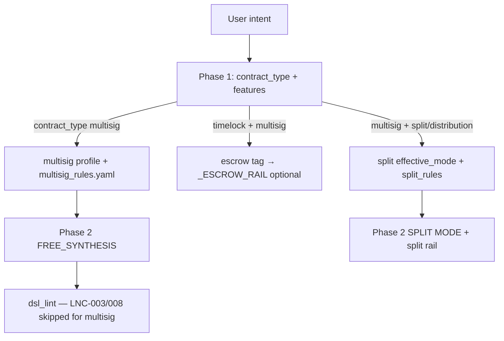

# Multisig — State Report (Phase 1 Validation Audit)

**Date:** 2026-06-11  
**Scope:** Definitive audit of `multisig` after Split Payment and Escrow stabilization — routing, rails, lint, sanity, evaluator, historical artifacts.  
**Method:** Code inspection, `scripts/diagnose_multisig_case.py`, 4-case validation benchmark (`bench_20260611_1552_cbe5`, `bench_20260611_1553_8eee`). **No implementation changes in this audit.**

---

## Executive summary

| Question | Answer |
|----------|--------|
| **Converged?** | **Partially** — generation compiles 100% on validation subset; convergence 50% (2/4) due to evaluator gate |
| **Flaky?** | **Regression yes** (model-dependent); **benchmark multisig.yaml stable compile** |
| **Evaluator-only block?** | **Yes** for `ms_001`/`ms_002` — sole missing feature is spurious `token_validation` |
| **Generation block?** | **No** on 4-case validation; historical `A_split_multisig` fixed via split Phase 1 |

**Verdict:** Multisig **generation path is mostly healthy** for 2-of-2, 2-of-3, timelock backup, and split+multisig composite. Remaining gap is **measurement** (suite + evaluator, mirror Escrow Phase 1A) plus **no dedicated `_MULTISIG_RAIL`**. Regression harness remains **flaky** across models.

---

## 1. Routing

| Step | Location | Behavior |
|------|----------|----------|
| Phase 1 enum | `pipeline.py` ~1112 | `multisig` = multiple parties sign, no escrow logic required |
| Mode resolution | `resolve_effective_mode()` | Stays `multisig` unless distribution+split overrides |
| Escrow steal | `pipeline.py` ~653–661 | `timelock` + `multisig` → `escrow` **feature tag** (not contract_type change) |
| Split composite | `pipeline.py` ~669 | `multisig` + distribution keywords → `split` feature |
| Pattern profile | `pattern_profiles.py:56–59` | `multisig_rules.yaml`; disables LNC-008, LNC-016, `missing_output_anchor` |
| Golden | `_GOLDEN_TYPE_MAP` | **No** dedicated multisig golden |
| Fallback | `pipeline_engine.py:419–420` | `fallback_multisig.cash` when fallbacks enabled |

### Phase 1 diagnostics (2026-06-11)

| Case | contract_type | effective_mode | multisig_rules | Rail |
|------|---------------|----------------|----------------|------|
| ms_001 | multisig | multisig | yes | none |
| ms_002 | multisig | multisig | yes | none |
| ms_006 | multisig | multisig | yes | **escrow** (timelock+escrow tags) |
| split_003 | distribution | split | no (split_rules) | **split** |

**Routing passes** for all four validation cases. Composite `split_003` correctly lands on `split_payment` profile, not `multisig`.

---

## 2. Rails

**No `_MULTISIG_RAIL`** in `build_pattern_rails()` (`pipeline.py:356–385`).

| Rail | Multisig relevance |
|------|-------------------|
| `_ESCROW_RAIL` | Attached when `"escrow" in features` — `ms_006` diagnostic |
| `_SPLIT_RAIL` | Attached for `split_003` via split feature |
| Phase 2 MULTISIG block | Inline prompt guidance only (`pipeline.py:136–142`) |

**Threshold guidance (prompt only):**

- 2-of-2: dual `require(checkSig(...))`
- 2-of-3: `checkMultiSig([sig1, sig2], [pk1, pk2, pk3])`
- Distinctness: `require(pk1 != pk2)` for all pairs
- Forbidden: ternary `checkSig`, `+=` accumulation

**`multisig_rules.yaml`:**

| Rule | Content |
|------|---------|
| MS-THRESHOLD | checkMultiSig or explicit checkSig per signer |
| MS-DISTINCT | pk distinctness |
| MS-SIG-REUSE (forbidden) | No signature variable reuse |

---

## 3. Lint

**File:** `dsl_lint.py`

| Rule | Multisig behavior |
|------|-----------------|
| LNC-003 (value anchoring) | **Skipped** when `mode in {multisig, timelock, stateless, ""}` |
| LNC-008 (output limit) | **Skipped** for `multisig` mode |
| LNC-016 | **Skipped** via pattern profile |

**Common lint failures (historical):** Composite split+multisig hit LNC-003 before split Phase 1; resolved for `split_003` in current code.

**Validation run:** 0 lint errors on all 4 cases.

---

## 4. Sanity

**File:** `sanity_checker.py`

| Check | Trigger | Rule |
|-------|---------|------|
| Feature evidence | `"multisig" in features` | `checkSig`, `checkMultiSig`, or `pubkey` in code |
| Threshold accountancy | `multisig` + `threshold` set | Pubkey count vs threshold (skipped for token covenant modes) |
| Timelock operator | `"timelock" in features` | Requires `>=` with `tx.time` |

**Validation run:** No sanity failures recorded on 4-case pass.

---

## 5. Evaluator

**Files:** `benchmark/evaluator.py`, `benchmark/feature_extractor.py`, `benchmark/config/semantic_requirement_map.yaml`

### Required features (`multisig.yaml`)

| Feature | Issue |
|---------|-------|
| `token_validation` on ms_001–003 | **Spurious** on pure BCH — blocks convergence at 0.667 intent |
| `multisig` | Now detected via dual `checkSig` (escrow 1A extractor improvement) |
| `both_signatures_required`, `three_of_five_logic` | **Unmapped** in semantic_requirement_map |
| `must_fail_pubkey_substitution`, `must_fail_duplicate_signer` | **Unwired** to Toll Gate / alias pool |

### Feature extractor (current)

| Pattern | Detected? |
|---------|-----------|
| `checkMultiSig` 2-of-3 | `multisig`, `multisig_2of3`, role `*_signature` |
| Dual separate `checkSig` | `multisig`, `multisig_2of2` (added in escrow 1A) |
| Dynamic pk1/pk2 2-of-3 | Role inference (escrow 1A spillover) |

### Known evaluator mismatches

1. **`token_validation`** on BCH multisig cases (primary KPI drag)
2. **`both_signatures_required`** critical on ms_001 — no mapping
3. **Failure cases** ms_004/ms_005 — `must_fail_*` not wired; can show `converged: true` with low score
4. **Convergence gate** `intent_coverage >= 0.70` — ms_001/ms_002 at 0.667 fail converge despite valid code

### Evaluator helpers (shared with escrow)

- `_multisig_detected()` in `evaluator.py` — used in legacy_capabilities
- No dedicated `multisig` entry in `_cashtoken_alias_pool` (uses default)

---

## 6. Historical evidence

### Regression harness

| Run | File | Model | `1_multisig` | Notes |
|-----|------|-------|--------------|-------|
| Run 1 | `regression_results.json` | Llama 3.3 | **SUCCESS** | 331 chars, 4 toll_gate violations |
| Run 2 | `regression_results_run2.json` | Claude 4.6 | **FAILED** | 0 output chars |

Prompt: `"simple multisig 2 of 2"` — fallbacks **enabled** in regression vs **disabled** in benchmark.

### Benchmark timeline

| Run | Suite / scope | Compile | Converged | Avg score | Avg intent | Notes |
|-----|---------------|---------|-----------|-----------|------------|-------|
| `bench_20260331_2118_ff90` | multisig.yaml 6-case | 100% | 100% | **0.135** | 0.736 | Pre extractor fix; token_validation noise |
| `diagnosis_11_patterns_20260331_213659` | multisig subset | 100% | 100% | low | — | Dominant: `compile_pass_but_low_intent_coverage` |
| `bench_20260611_1500_19ae` | split_003 only | pass | yes | **1.0** | 1.0 | Post split Phase 1 |
| **`bench_20260611_1552_cbe5`** | **ms_001,002,006** | **100%** | **33%** | **0.778** | 0.778 | token_validation blocks converge on 001/002 |
| **`bench_20260611_1553_8eee`** | **split_003** | **100%** | **100%** | **1.0** | 1.0 | Case D composite |

### Coverage stability (historical)

`A_split_multisig` — compile **FAILED** (LNC-003, `LockingBytecodeP2PKH`) before split Phase 1. **Resolved** — `split_003_multisig_distribution` now scores 1.0.

---

## 7. Toll Gate (generation)

| Detector | ID | Severity | Blocks Phase 3? |
|----------|-----|----------|-----------------|
| MultisigDistinctnessDetector | `multisig_distinctness_flaw` | low | No |
| MultisigSignatureReuseDetector | `multisig_signature_reuse` | high | Yes if fired |

Fix hints in `pipeline.py` ~1466–1495. Not modified in this audit.

---

## 8. Validation subset design

| Case | ID | Suite | Role |
|------|-----|-------|------|
| A — 2-of-2 | `ms_001` | multisig.yaml | Simple Alice+Bob |
| B — 2-of-3 | `ms_002` | multisig.yaml | checkMultiSig threshold |
| C — multisig + timelock | `ms_006` | multisig.yaml | Backup paths + timeout |
| D — multisig + split | `split_003_multisig_distribution` | split_payment.yaml | 2-of-3 treasury 3-way BCH split |

---

## 9. Classification preview

| Layer | Validation result |
|-------|-------------------|
| Routing | **Pass** — all 4 cases correct contract_type / effective_mode |
| Rails | **Informational gap** — no multisig rail; escrow/split rails attach where expected |
| Sanity | **Pass** |
| Lint | **Pass** |
| Compile | **100%** (4/4) |
| Evaluator | **Blocks** ms_001/ms_002 convergence (`token_validation`) |
| Generation | **Pass** — valid multisig structures produced |

---

## 10. Files referenced

| File | Role |
|------|------|
| `benchmark/suites/multisig.yaml` | 6-case suite |
| `benchmark/suites/split_payment.yaml` | `split_003_multisig_distribution` |
| `src/services/knowledge_structured/multisig_rules.yaml` | Pattern rules |
| `src/services/pattern_profiles.py` | Multisig profile |
| `src/services/pipeline.py` | Routing, MULTISIG prompt block, rails |
| `src/services/sanity_checker.py` | Multisig evidence + threshold |
| `src/services/dsl_lint.py` | LNC skips |
| `src/services/anti_pattern_detectors.py` | Toll Gate multisig detectors |
| `src/services/fallbacks/fallback_multisig.cash` | Fallback template |
| `benchmark/evaluator.py` | Scoring |
| `benchmark/feature_extractor.py` | Detection (incl. dual checkSig) |
| `scripts/diagnose_multisig_case.py` | Routing diagnostics |
| `regression_results.json` / `run2` | Harness evidence |

---

*Refresh after multisig Phase 1A (evaluator/suite alignment) with `python -m benchmark.runner benchmark/suites/multisig.yaml`.*
