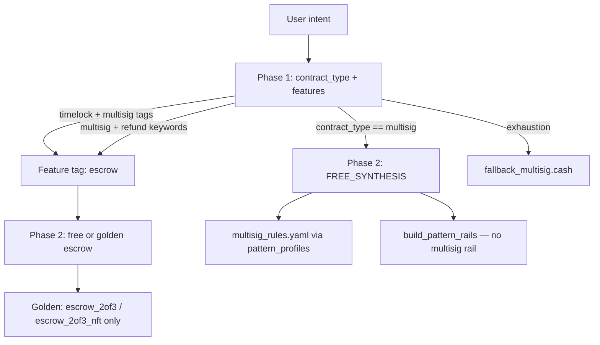

# Multisig Support — State Report

**Date:** 2026-06-07  
**Scope:** End-to-end trace of multisig through benchmark suite, pattern profile, generation rails, golden templates, evaluator, and audit detectors.  
**Method:** Code and artifact inspection only (no new benchmark runs).

---

## Executive summary

Multisig has **complete scaffolding** (YAML rules, pattern profile, 6-case benchmark suite, fallback template, Toll Gate detectors) but **no dedicated generation rail and no golden adaptation path**. The benchmark suite reports **100% compile and convergence** on its latest full run, yet **scores are very low** (avg final score **0.135**) and several suite design issues (spurious `token_validation`, unmapped critical aliases) mean “converged” overstates production quality.

Regression harness results **disagree by model**: Groq Llama 3.3 **SUCCESS** vs Claude Sonnet 4.6 **FAILED** on the same vague prompt `"simple multisig 2 of 2"`, with different fallback and retry behavior.

---

## 1. Why did multisig pass in one regression run and fail in another?

### Evidence

| Run | File | Model | Status | Output | Toll Gate viol. | Compile exhausted |
|-----|------|-------|--------|--------|-----------------|-------------------|
| Run 1 | `regression_results.json` | `llama-3.3-70b-versatile` | **SUCCESS** | 331 chars | 4 | no |
| Run 2 | `regression_results_run2.json` | `anthropic/claude-sonnet-4.6` | **FAILED** | 0 chars | 1 | no |

Harness: `tests/test_regression.py` — intent for `1_multisig` is **`"simple multisig 2 of 2"`** (minimal, no signers/threshold/output rules).

### Root causes (evidence-based)

1. **Different LLM backends**  
   Run 1 used Groq Llama 3.3; Run 2 used Claude Sonnet 4.6 (`actual_model` in JSON). Generation is free-synthesis with no golden rail; output quality is model-dependent.

2. **Different harness flags vs benchmark**  
   Regression calls `generate_guarded(intent, security_level="high")` with **fallbacks enabled** (default `disable_fallbacks=False`).  
   Benchmark calls `disable_fallbacks=True` (`benchmark/evaluator.py:290–291`).  
   Run 1 SUCCESS with only 331 chars may be a **minimal** contract; Run 2 FAILED with **0 output chars** — pipeline exhausted without returning code (error path, not fallback success in JSON).

3. **Toll Gate does not block on non-critical violations**  
   Run 1 logged **4 Toll Gate violations** yet still SUCCESS. Phase 3 only fails on **`severity == "critical"`** (`pipeline.py:1052–1055`). Multisig-specific detectors `multisig_distinctness_flaw` and `multisig_signature_reuse` use **low** and **high** severity respectively — high alone could block, but Run 1 succeeded despite 4 violations (likely mix of non-critical).

4. **No multisig-specific stabilization**  
   Unlike vault, there is no pattern rail, no golden template in `_GOLDEN_TYPE_MAP`, and no evaluator relaxations for multisig — so regression is a raw LLM + global gates test.

### Conclusion

Pass/fail in regression is **not a stable multisig signal**; it primarily reflects **model choice**, **prompt vagueness**, and **fallback policy**, not a fixed multisig code path.

---

## 2. What code paths generate multisig contracts?



### Path A — Primary: `contract_type: multisig` (free synthesis)

| Step | Location | Behavior |
|------|----------|----------|
| Phase 1 | `pipeline.py:1092`, `_parse_phase1_response` | LLM may set `contract_type: "multisig"` |
| Mode resolution | `resolve_effective_mode()` | Stays `multisig` (not in `_GOLDEN_TYPE_MAP`) |
| Phase 2 branch | `Phase2.run()` ~824 | **`FREE_SYNTHESIS`** — LLM + unified DSL rules |
| Knowledge | `pattern_profiles.py:55–58` | Loads `multisig_rules.yaml` |
| Rails | `build_pattern_rails()` ~351–379 | **No multisig branch** — only split/escrow/swap/vault/CashTokens |

### Path B — Escrow routing (multisig as feature, not type)

| Trigger | Location |
|---------|----------|
| `timelock` + `multisig` in features | `pipeline.py:643–645` → appends `escrow` tag |
| Refund/timeout keywords + `multisig` | `pipeline.py:648–651` |
| NFT/token custody signals | Upgrades to `escrow_2of3_nft` golden |

Multisig-heavy prompts often become **escrow** rather than pure multisig.

### Path C — Golden adaptation (indirect)

| Template | Path | Multisig role |
|----------|------|----------------|
| `knowledge/templates/escrow_2of3.cash` | `_GOLDEN_TYPE_MAP` → `escrow_2of3_nft` | 2-of-3 multisig release path |
| `knowledge/golden/patterns/escrow_2of3_nft.cash` | Golden registry | Same |
| `knowledge/templates/escrow_2of3.cash` | Reference only for generic escrow | Multisig + timelock |

**No** `multisig` entry in `_GOLDEN_TYPE_MAP` (`pipeline.py:60–74`).

### Path D — Secure fallback

| File | `pipeline_engine.py:419–420` |
|------|-------------------------------|
| `src/services/fallbacks/fallback_multisig.cash` | 2-of-2 `checkSig` + distinctness + single output + `payoutLock` |

Used when generation exhausts retries and fallbacks are enabled.

### Path E — Embedded multisig (other patterns)

- **Vault** recovery paths (`vaults.yaml`, `vaults_real`) — 2-of-3 recovery wording  
- **Conditional spend** / **escrow** suites — multisig + timelock combinations  
- **CashTokens semantic** — governance NFT multisig approval (`cashtokens_semantic.yaml`)

---

## 3. Is there a dedicated multisig rail?

**No.**

`build_pattern_rails()` in `pipeline.py:351–379` appends rails for:

- CashToken modes (`_FT_RAIL`, `_NFT_*`, `_HYBRID_RAIL`, …)
- `"split"` → `_SPLIT_RAIL`
- `"escrow"` → `_ESCROW_RAIL`
- `"swap"` / `"htlc"` → `_SWAP_RAIL`
- `contract_type == "vault"` → `_VAULT_RAIL`

There is **no `_MULTISIG_RAIL`** and no `if "multisig" in tags` rail branch.

Generation guidance for multisig comes only from:

- `src/services/knowledge_structured/multisig_rules.yaml` (3 must / 1 forbidden rules)
- Phase 2 prompt fix hints for `multisig_distinctness_flaw` / `multisig_signature_reuse` (`pipeline.py:1441–1470`)
- Generic synthesis rules in unified DSL YAML

---

## 4. What benchmark cases exist?

**Suite:** `benchmark/suites/multisig.yaml` — **6 cases**

| ID | Difficulty | Intent summary | Tags | Notes |
|----|------------|----------------|------|-------|
| `ms_001` | medium | 2-of-2 Alice + Bob | `2of2` | Requires spurious `token_validation` |
| `ms_002` | hard | 2-of-3 any two of Alice/Bob/Carol | `2of3` | Same |
| `ms_003` | hard | 3-of-5 any three signatures | `3of5` | Same |
| `ms_004` | hard | **FAILURE:** pubkey param substitution attack | `failure`, `vulnerability` | `must_fail_pubkey_substitution` |
| `ms_005` | hard | **FAILURE:** duplicate signer attack | `failure`, `vulnerability` | `must_fail_duplicate_signer` |
| `ms_006` | medium | 2-of-2 + Alice+Carol backup after 90 days | `backup`, `timelock` | Multi-path + timelock |

**Related suites (not `pattern: multisig`):**

- `benchmark/suites/test2.yaml` — `validator_multisig_expansion` (2-of-3 buyer/seller/arbiter)
- `tests/test_coverage_stability.py` — `A_split_multisig` (2-of-2 + 50/50 split) — **FAILED** compile (`coverage_stability_results.json`)

### Latest full-suite artifact

**Run:** `bench_20260331_2118_ff90.json`

| Metric | Value |
|--------|-------|
| Cases | 6 |
| Compile rate | 100% |
| Convergence rate | 100% |
| Avg intent coverage | 0.736 |
| Avg final score | **0.135** |

**Interpretation:** Pipeline produces compilable code for all cases, but **quality score is poor** (token_validation noise, unmapped critical keys). Failure cases `ms_004`/`ms_005` show `converged: true` with `final_score: 0.2` in this artifact — see Section 5 (evaluator gaps).

---

## 5. Top likely convergence blockers

Ranked by evidence from benchmark JSON, suite design, and code.

### 5.1 Spurious `token_validation` on pure BCH multisig (suite + evaluator)

**Evidence:** `ms_001`–`ms_003` list `token_validation` in `required_features`; generated BCH-only code cannot satisfy it.  
`ms_001` missing: `multisig`, `token_validation`; intent coverage **0.33** but still `converged: true` in artifact.

**Location:** `multisig.yaml` required_features; evaluator `legacy_capabilities["token_validation"]` (`evaluator.py:330–334`).

**Impact:** Depresses intent coverage and final_score; misleads KPIs.

---

### 5.2 Feature detection gap — 2-of-2 separate `checkSig` not counted as `multisig`

**Evidence:** `feature_rules.yaml` — `multisig_2of2` requires **both** `checkSig` in **same** `require` with `&&`.  
`ms_001` generated code uses two separate `require(checkSig(...))` lines → **`multisig` not in detected_features** (`bench_20260331_2118_ff90.json` ms_001).

**Location:** `benchmark/config/feature_rules.yaml:8–10`; `FeatureExtractor` does not infer multisig from dual checkSig alone.

**Impact:** False `missing_features`; weak alignment between generation (valid 2-of-2) and benchmark.

---

### 5.3 Unmapped critical feature aliases

**Evidence:** These appear in `multisig.yaml` `critical_features` but **not** in `benchmark/config/semantic_requirement_map.yaml`:

- `both_signatures_required`
- `three_of_five_logic`
- `must_fail_pubkey_substitution`
- `must_fail_duplicate_signer`

Mapped: `valid_signature_check`, `two_of_three_logic`, `locktime_check` (partial).

**Location:** `semantic_requirement_map.yaml` (no entries for above); `_invalid_detector_alias_pool()` only covers **CashTokens** detectors (`evaluator.py:145–154`).

**Impact:** `critical_missing` handling and failure-case gates are inconsistent; security negative cases lack detector-backed `must_fail_*` wiring.

---

### 5.4 No generation rail → LLM structural variance

**Evidence:** Regression pass/fail by model; `ms_003` mislabels 3-of-5 as `checkMultiSig(..., [pk1..pk5])` with **3 sigs** (2-of-3 semantics on 5 keys) in artifact code.  
No `_MULTISIG_RAIL` to enforce threshold math (`pipeline.py:351–379`).

**Impact:** Wrong threshold logic can still compile and converge under loose gates.

---

### 5.5 Toll Gate multisig detectors are weak severity

**Evidence:**

| Detector | ID | Severity | Blocks Phase 3? |
|----------|-----|----------|-----------------|
| `MultisigDistinctnessDetector` | `multisig_distinctness_flaw` | **low** | No |
| `MultisigSignatureReuseDetector` | `multisig_signature_reuse` | **high** | Yes (if fired) |

**Location:** `anti_pattern_detectors.py:688–720`, `876–896`.

**Impact:** Missing `pk1 != pk2` may pass Phase 3; Run 1 regression had 4 violations but still SUCCESS.

---

### 5.6 Pattern profile disables only one detector

**Evidence:** `pattern_profiles.py:55–58`:

```yaml
disable_lint_rules: ["LNC-008", "LNC-016"]
disable_detectors: ["missing_output_anchor"]
```

LNC-008/016 skipped for stateless multisig (`dsl_lint.py:498–508`) — correct.  
Other global detectors still apply; no multisig-specific Toll Gate tuning.

---

### 5.7 Composite intents (split + multisig) fail lint/compile

**Evidence:** `coverage_stability_results.json` — `A_split_multisig`:

- `contract_mode: multisig`
- LNC-003 value anchor failures on `split` function
- Compile error: `LockingBytecodeP2PKH` type undefined
- Status: **FAILED**

**Impact:** Real user phrasing combining split + multisig is a known failure family (not covered by `multisig.yaml` alone).

---

### 5.8 Escrow routing steals multisig intents

**Evidence:** Phase 1 adds `escrow` when timelock + multisig co-occur (`pipeline.py:643–645`).  
`ms_006` generates escrow-like contract (`MultiSigEscrowWithBackup`) with `missing_features: ["multisig"]` but `converged: true`.

**Impact:** “Pure multisig” benchmarks may not reflect production routing for timelock+multisig prompts.

---

## Trace reference tables

### Pattern profile

| Field | Value |
|-------|-------|
| Profile key | `multisig` |
| Knowledge | `multisig_rules.yaml` |
| Disabled lint | LNC-008, LNC-016 |
| Disabled detectors | `missing_output_anchor` |

### Golden templates

| Asset | Dedicated multisig? |
|-------|---------------------|
| `_GOLDEN_TYPE_MAP` | **No** multisig entry |
| `knowledge/templates/vault_2step.cash` | No |
| `knowledge/templates/escrow_2of3.cash` | Multisig **inside** escrow |
| `src/services/fallbacks/fallback_multisig.cash` | **Yes** (fallback only) |

### Evaluator logic (multisig-relevant)

| Mechanism | File | Notes |
|-----------|------|-------|
| Convergence gate | `evaluator.py:468–475` | compile + intent ≥ 0.7 + no critical_missing + semantic_pass |
| `multisig` required feature | `legacy_capabilities` + `requirement_satisfied` | Often via detected `multisig` or alias |
| `multisig_2of2` detection | `feature_rules.yaml` | Inline `&&` only |
| `two_of_three_logic` | `_cashtoken_alias_pool` default | `multisig_2of3` or `checkMultiSig` in code |
| Failure cases | `has_failure_tag` + `must_fail_*` | Multisig `must_fail_*` **not** wired to Toll Gate detectors |

### Audit / Toll Gate detectors

| Detector | Generation registry | Audit registry | Multisig-specific? |
|----------|--------------------|----------------|--------------------|
| `MultisigDistinctnessDetector` | Yes | No (separate audit AST detectors) | Yes |
| `MultisigSignatureReuseDetector` | Yes | No | Yes |
| `MultisigDistinctnessDetector` skip | Golden non-multisig prefixes | — | — |

Audit path (`audit_detectors.py`) has **no** dedicated multisig distinctness/reuse detectors — generation/audit **drift** for multisig rules.

---

## Multisig Phase 1 stabilization plan

**Goal:** Make multisig **measurably stable** on the 6-case suite + regression prompt, with honest failure-case scoring, before expanding cases.

**Phase 1** = benchmark/evaluator/generation alignment + minimal rail (no golden template yet).

### Workstream 1 — Fix benchmark suite semantics (0.5 day)

| Task | Change | Effort |
|------|--------|--------|
| 1.1 | Remove `token_validation` from `ms_001`–`ms_003` required_features (pure BCH) | 0.1 d |
| 1.2 | Add `semantic_requirement_map.yaml` entries for `both_signatures_required`, `three_of_five_logic` | 0.2 d |
| 1.3 | Wire `must_fail_pubkey_substitution` → AST/toll check (e.g. pubkey params in `checkMultiSig` path) | 0.15 d |
| 1.4 | Wire `must_fail_duplicate_signer` → `MultisigSignatureReuseDetector` or explicit alias | 0.05 d |

**Exit:** Re-run `multisig.yaml` only; failure cases must show `converged: false`; positive cases intent ≥ 0.7.

---

### Workstream 2 — Feature detection alignment (0.5 day)

| Task | Change | Effort |
|------|--------|--------|
| 2.1 | Treat dual `require(checkSig(a))` + `require(checkSig(b))` as `multisig` / `multisig_2of2` in `FeatureExtractor` | 0.25 d |
| 2.2 | Add `multisig_nm` heuristic for N sigs + M pubkeys in `checkMultiSig` (flag wrong thresholds) | 0.25 d |

**Exit:** `ms_001` detects `multisig`; `ms_003` can score threshold correctness.

---

### Workstream 3 — Add `_MULTISIG_RAIL` (1 day)

| Task | Change | Effort |
|------|--------|--------|
| 3.1 | Add `_MULTISIG_RAIL` in `pipeline.py` with canonical patterns: 2-of-2 dual checkSig, 2-of-3 checkMultiSig, distinctness requires, optional output anchor | 0.5 d |
| 3.2 | Append rail when `contract_type == "multisig"` or `"multisig" in tags` (exclude pure escrow golden) | 0.1 d |
| 3.3 | Expand `multisig_rules.yaml` with threshold formula examples (N-of-M) | 0.2 d |
| 3.4 | Unit test: Phase 2 prompt includes rail for multisig intent | 0.2 d |

**Exit:** Regression prompt `"simple multisig 2 of 2"` produces structurally similar output across 2 model runs (manual spot check).

---

### Workstream 4 — Toll Gate tuning (0.5 day)

| Task | Change | Effort |
|------|--------|--------|
| 4.1 | Raise `multisig_distinctness_flaw` to **medium** or **critical** for `contract_mode == "multisig"` | 0.2 d |
| 4.2 | Add audit parity tests for multisig detectors (mirror generation rules) | 0.3 d |

**Exit:** Generated 2-of-2 without `alice != bob` fails Phase 3 in benchmark mode.

---

### Workstream 5 — Measurement & CI (0.5 day)

| Task | Change | Effort |
|------|--------|--------|
| 5.1 | Run and commit `benchmark/run_11_pattern_diagnosis.py` subset for multisig only | 0.1 d |
| 5.2 | Add `tests/test_multisig_convergence.py` — 3 positive cases, mock or recorded LLM optional | 0.2 d |
| 5.3 | Document regression harness: fixed prompt + `disable_fallbacks` flag for apples-to-apples | 0.2 d |

**Exit:** Committed JSON artifact + CI gate: multisig suite compile ≥ 90%, convergence ≥ 85%, avg score ≥ 0.5.

---

### Effort summary

| Workstream | Effort | Priority |
|------------|--------|----------|
| 1 — Suite + semantic map | **0.5 d** | P0 |
| 2 — Feature detection | **0.5 d** | P0 |
| 3 — `_MULTISIG_RAIL` | **1.0 d** | P0 |
| 4 — Toll Gate severity | **0.5 d** | P1 |
| 5 — Measurement | **0.5 d** | P1 |
| **Total Phase 1** | **~3.0 engineering days** | |

### Out of scope for Phase 1 (Phase 2+)

- Golden template + `_GOLDEN_TYPE_MAP` entry for `multisig_2of2` / `multisig_2of3` (**+2–3 d**)
- Split + multisig composite (`A_split_multisig`) — depends on split_payment stabilization (**+1–2 d**)
- Full 11-pattern diagnosis commit (**+0.5 d** shared infra)

---

## Appendix — Key file index

| Layer | Path |
|-------|------|
| Benchmark suite | `benchmark/suites/multisig.yaml` |
| Pattern profile | `src/services/pattern_profiles.py` |
| Generation rules | `src/services/knowledge_structured/multisig_rules.yaml` |
| Rails | `src/services/pipeline.py` (`build_pattern_rails`) |
| Phase 1 routing | `src/services/pipeline.py` (`Phase1.run`) |
| Fallback | `src/services/fallbacks/fallback_multisig.cash` |
| Evaluator | `benchmark/evaluator.py` |
| Feature rules | `benchmark/config/feature_rules.yaml` |
| Requirement map | `benchmark/config/semantic_requirement_map.yaml` |
| Detectors | `src/services/anti_pattern_detectors.py` |
| Regression | `tests/test_regression.py`, `regression_results*.json` |
| Latest bench | `benchmark/results/bench_20260331_2118_ff90.json` |

---

*Report based on repository state at `main` (~2026-06-07). Re-run `python -m benchmark.runner benchmark/suites/multisig.yaml` after Phase 1 changes to refresh metrics.*
