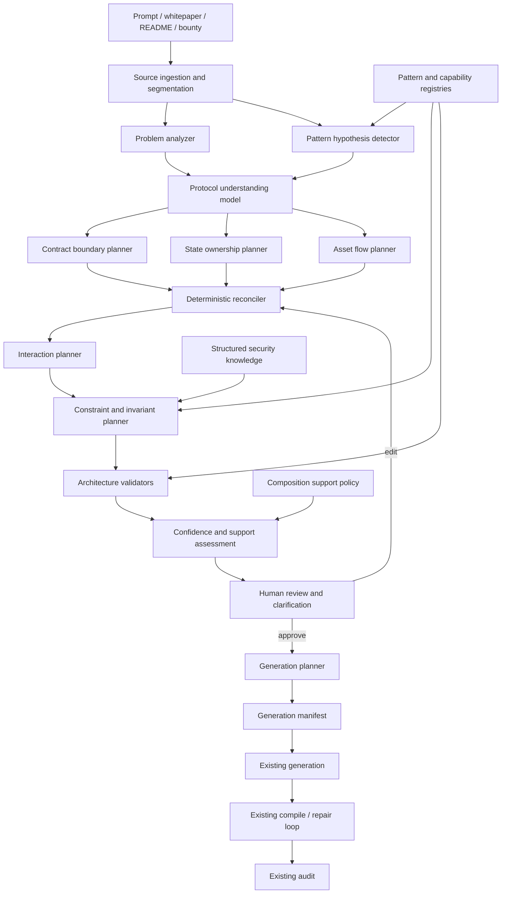

# Parallel AI Contract Architect — Principal Architecture Review

**Date:** 2026-07-11  
**Status:** Architectural feasibility study; no implementation approval implied  
**Scope:** Pre-generation protocol understanding, architecture planning, review, and generation handoff  
**Explicitly out of scope:** Compile-loop redesign, compile-repair redesign, and audit redesign

## Executive decision

NexOps should introduce a reviewable protocol architecture artifact before generation for complex and multi-contract requests.

The proposal is technically sound and likely to outperform the current linear specification path on whitepapers, protocol descriptions, bounties, READMEs, and multi-contract ideas, with four qualifications:

1. It should be an evolution of the existing graph-first specification work, not a new parallel source of truth.
2. “Parallel” should mean parallel proposal generation against a shared protocol model. Planners must not independently mutate the canonical graph.
3. LLM output must be treated as a hypothesis with provenance and uncertainty. Deterministic reconciliation, validation, and support gates remain authoritative.
4. The review gate should be mandatory for complex, high-impact, or low-confidence architectures, while the existing fast path remains available for well-supported single-pattern prompts.

The recommended target is:

```text
Source material
  ├─ Problem Understanding ─┐
  └─ Pattern Hypotheses ────┤
                            v
                 Protocol Understanding
                            |
          ┌─────────────────┼─────────────────┐
          v                 v                 v
   Contract proposals   State proposals   Asset-flow proposals
          └─────────────────┼─────────────────┘
                            v
              Deterministic graph reconciler
                            |
                   Interaction planner
                            |
             Constraint and invariant planner
                            |
                 Architecture validation
                            |
             Human review / clarification gate
                            |
                   Generation manifest
                            |
              Existing generation + compile loop
                            |
                       Existing audit
```

The first durable artifact is an editable `ProtocolArchitecture`, not generated CashScript.

## Evidence from the current repository

NexOps already contains much of the foundation:

- `src/services/spec/constraint_graph.py` defines a graph with actors, assets, authorization, time, value flow, constraints, invariants, phases, branches, policies, lifecycle state, provenance, and confidence.
- `src/services/spec/graph_extractor.py` extracts a graph with an LLM and falls back to deterministic heuristics.
- `src/services/spec/graph_pattern_detection.py` derives multiple pattern tags from graph topology.
- `src/services/spec/confidence_engine.py` and `validator_v2.py` provide initial confidence and graph validation.
- `src/services/spec/graph_planner.py` creates a module DAG from the graph.
- `src/services/spec/review.py` renders graph-backed review sections and accepts edits.
- `src/controllers/spec_controller.py` already exposes review, confirm, modify, and session persistence.
- `src/services/spec/support_assessment.py` prevents unsupported compositions from silently reaching generation.
- `src/services/spec/graph_generation_bridge.py` provides a graph-to-generation handoff while retaining the legacy mode shim.

The current graph is not yet a complete protocol architecture:

- It does not have first-class `Contract`, covenant `State`, or `Transaction` node categories.
- `ValueFlow`, `Recovery`, and `ExternalDependency` categories are declared but are not materially populated by the current extractor and mappers.
- Contract count and boundaries are not planned from responsibilities and trust domains.
- Asset flow is represented only partially, and phase ordering is reserved in the graph planner but not used.
- Graph edges do not carry all guards, state transitions, asset quantities, or cross-contract bindings.
- Review edits are parametric only: the current edit path changes node labels, parameters, and confidence, but cannot add or remove nodes or edges.
- Confidence is mostly self-reported or based on parameter completeness; it is not calibrated against extraction accuracy.
- The module planner still reserves phase ordering for future work and maps several graph shapes to a single module sequence.
- The graph and legacy planners can drift: for example, the graph planner emits `SplitModule` while the legacy planner and downstream mappings expect `SplitPaymentModule`, and graph planning does not yet cover all token modules.
- `ArchitectureBuilder` uses coarse, static transaction templates.
- Generation still has a single-mode compatibility boundary in important paths.
- Session persistence is in-memory, and the graph version is a counter rather than a retained revision history.

Therefore this proposal is an extension and hardening of the current direction, not a greenfield replacement.

## Architecture principles

### One canonical artifact

After source ingestion, `ProtocolArchitecture` is authoritative. Summaries, pattern lists, legacy `ContractSpecification`, `ExecutionPlan`, `UTXOArchitecture`, generation manifests, and UI views are projections.

No planner owns a private version of the architecture. Each planner returns a proposal:

```text
ArchitecturePatch
  planner_id
  base_revision
  proposed_nodes
  proposed_edges
  proposed_updates
  evidence_refs
  confidence
  assumptions
  conflicts
```

A deterministic reconciler applies compatible patches, records conflicts, and creates a new immutable revision.

### Graph as the model, hierarchy as a view

The canonical representation should be graph-based because ownership, authorization, state transitions, token flow, and transaction dependencies are many-to-many.

A hierarchy remains useful for navigation:

```text
Protocol
  Contract
    Entry point / transaction
      Guards
      State reads and writes
      Asset inputs and outputs
```

The hierarchy is a projection based on `contains` and `implemented_by` edges. It must not become a second model.

### Requirements are not code

Architecture nodes describe intent and obligations, not CashScript syntax. A constraint such as “preserve token category” exists independently from its eventual implementation.

### Unknown is a valid value

The system must not convert absent requirements into confident design choices. Missing trust assumptions, upgrade policy, emergency powers, and asset custody should remain explicit unknowns and trigger review when material.

### BCH-native interaction semantics

“Cross-contract call” is usually the wrong abstraction for CashScript. Interactions should be modeled through UTXOs, transactions, token categories, commitments, bytecode constraints, and off-chain transaction assembly. Contract edges describe coordination, not synchronous invocation.

## Target component diagram



## Canonical data model

### ProtocolArchitecture

The proposed artifact is a versioned graph with these logical sections:

- `identity`: architecture ID, revision, parent revision, status, timestamps, extractor and schema versions.
- `sources`: source documents, content hashes, sections, spans, and retrieval metadata.
- `summary`: purpose, non-goals, lifecycle, trust model, security goals, unresolved questions.
- `nodes`: typed protocol entities.
- `edges`: typed relationships between entities.
- `decisions`: accepted or rejected architecture choices with rationale.
- `assumptions`: explicit assumptions, impact, owner, and review status.
- `conflicts`: incompatible planner proposals or contradictory source requirements.
- `confidence`: field-level evidence and calibrated confidence.
- `support`: representable, generatable, experimental, or unsupported assessment.

### Required node categories

- `Actor`: user, founder, signer, governance council, oracle operator, relayer, attacker role.
- `Asset`: BCH, CashTokens FT, immutable NFT, mutable NFT, minting NFT, external asset representation.
- `Contract`: responsibility boundary, custody role, upgrade posture, deployment identity.
- `State`: storage owner, mutability, encoding, initialization, transition rules, continuity requirement.
- `Transaction`: named protocol action with input/output roles.
- `LifecyclePhase`: ordered or branching protocol phase.
- `Authorization`: single signature, threshold, weighted threshold, role, or capability.
- `Time`: absolute lock, relative lock, block height, timeout, recurrence, inactivity window.
- `Constraint`: predicate, bound, conservation rule, preimage, destination binding, continuation rule.
- `SecurityInvariant`: cross-path or cross-contract property that must always hold.
- `Policy`: distribution, vesting, recovery, auction, decay, or governance policy.
- `ExternalDependency`: oracle, off-chain signer, indexer, deployment configuration, external transaction builder.
- `Pattern`: indexed label linking graph evidence to the pattern registry.
- `Unknown`: an intentionally unresolved design choice when no more specific node is safe.

### Required edge categories

- `contains`, `owns_state`, `holds_asset`, `reads_state`, `writes_state`
- `consumes`, `produces`, `flows_to`, `continues`
- `authorizes`, `gates`, `guarded_by`, `constrained_by`
- `precedes`, `branches_to`, `exclusive_with`, `recovers_to`
- `depends_on`, `references`, `implemented_by`
- `preserves`, `mints`, `burns`, `transfers`
- `supported_by_evidence`, `conflicts_with`

Edges may carry amount, share, token category, commitment field, ordering, branch priority, and confidence attributes.

### State taxonomy

State planning must distinguish:

- `immutable_metadata`: data fixed at genesis or deployment.
- `mutable_nft_commitment`: state carried by a mutable NFT commitment.
- `ft_balance_or_supply`: fungible token amount and supply constraints.
- `bch_value`: satoshi value held or transferred by a UTXO.
- `shared_protocol_state`: a logical state split across multiple UTXOs or contracts.
- `derived_state`: recomputable data that should not be persisted.
- `off_chain_state`: external data whose trust and freshness must be explicit.
- `lifecycle_state`: conceptual protocol phase; not blockchain storage.

Every state node needs one owner, or an explicit shared-state protocol. “Shared” must not mean unowned.

## Data flow and interfaces

### Source ingestion

Input:

- Raw prompt or document
- Optional source URL/repository metadata supplied by the caller
- Content type and user-selected network or language constraints

Output:

- `SourceBundle` with normalized text, section boundaries, stable source spans, and content hash

Responsibilities:

- Preserve quotes and locations for provenance
- Separate normative requirements from examples and commentary
- Detect duplicate or conflicting sections
- Enforce size budgets and chunk boundaries

Long documents should use hierarchical extraction: section-level claims first, followed by protocol-level reconciliation. Concatenating an entire whitepaper into every planner prompt will not scale.

### Planner interface

All AI planners use the same logical contract:

```text
plan(
  source_bundle,
  architecture_snapshot,
  planner_scope,
  registry_snapshot
) -> ArchitecturePatch
```

Planners may propose additions or changes but cannot commit them. The response must include source evidence, assumptions, alternatives considered, and confidence per proposal.

### Reconciler interface

```text
reconcile(
  architecture_revision,
  patches[],
  deterministic_rules
) -> ReconciliationResult
```

The result contains an updated revision, accepted and rejected changes, conflicts, unresolved questions, and validation diagnostics.

### Review interface

The existing `spec_review`, `spec_confirm`, and `spec_modify` actions can be retained and versioned. The review payload should expose:

- Protocol summary and trust assumptions
- Contracts and responsibilities
- State ownership
- Asset-flow graph
- Transaction and lifecycle graph
- Constraints and security invariants
- Pattern matches and confidence
- Unsupported or experimental generation boundaries
- Questions whose answers would materially change the design
- Revision and source provenance

Edits should be optimistic-concurrency operations against a base revision. Invalid edits return diagnostics and do not partially mutate the graph.

### Generation handoff

The generation planner emits a `GenerationManifest`, not source code:

- Architecture ID and approved revision
- Contract units with stable IDs and responsibility summaries
- Per-contract state, entry points, constraints, and pattern profiles
- Shared constants and deployment-time placeholders
- Cross-contract bindings and transaction assembly requirements
- Contract dependency and compile order
- Traceability from every generation obligation to graph node IDs
- Unresolved items that block generation

Only an approved and validation-complete manifest enters existing generation. The existing compile loop and audit remain downstream systems.

## Stage assessment

Latency values below are design targets, not measurements. They assume a warm provider connection, parallel execution where stated, and a moderate protocol description. Long whitepapers can require 10–25 seconds of pre-review processing unless extraction is cached.

### Stage A — Problem Understanding

Inputs:

- `SourceBundle`
- Domain and chain context
- Existing protocol architecture for follow-up turns

Outputs:

- Purpose and non-goals
- Actors and roles
- Assets
- Trust assumptions
- Lifecycle
- External dependencies
- Security goals
- Open questions and source citations

Confidence:

- High only for explicit, consistently repeated source claims
- Medium for domain-supported interpretation
- Low for inferred trust, emergency, governance, and upgrade assumptions

Dependencies:

- Source segmentation and provenance
- BCH/CashTokens terminology
- Contradiction detection

LLM suitability:

- Strong for semantic extraction, summarization, entity resolution, and candidate trust-model identification
- Weak as the sole authority for omitted requirements or formal consistency

Deterministic logic:

- Source-span validation
- Entity deduplication
- Required-field checks
- Contradiction and terminology checks

Expected latency:

- 1.5–4 seconds for a prompt or README
- 5–15 seconds for hierarchical whitepaper extraction, cacheable by source hash

Feasibility verdict:

- Feasible, but “infer” must mean “propose with uncertainty.” An LLM cannot reliably discover unstated security goals or trust assumptions. It can reliably expose that they are missing.

### Stage B — Contract Planner

Inputs:

- Protocol understanding
- Actor, asset, lifecycle, trust, and security-goal nodes
- Pattern hypotheses and platform constraints

Outputs:

- Candidate contract boundaries
- Responsibilities and custody
- Contract-to-state and contract-to-transaction assignments
- Alternative decompositions with trade-offs

Confidence:

- Based on explicit custody boundaries, independent authorization domains, state ownership, lifecycle isolation, and known pattern structures
- Reduced when decomposition is driven only by naming or analogy

Dependencies:

- Stages A and G
- BCH execution model
- Supported generation patterns

LLM suitability:

- Good for generating candidate decompositions and explaining trade-offs
- Insufficient for choosing a final boundary without deterministic checks and review

Deterministic logic:

- No orphan responsibility
- Exactly one owner for exclusive state
- No impossible synchronous calls
- Contract boundary and support limits
- Dependency-cycle detection

Expected latency:

- 2–6 seconds; run in parallel with state and asset planners

Feasibility verdict:

- Feasible. The planner should produce a graph, with a hierarchical projection for UI. Contract count is an architecture decision, not a classification result. For complex cases it should present a recommended decomposition and at least one credible alternative.

### Stage C — State Planner

Inputs:

- Protocol model
- Candidate contracts
- Assets, lifecycle phases, and transaction candidates

Outputs:

- State nodes classified by storage type
- State ownership
- Initialization and transition edges
- Mutability and continuity rules
- Derived versus persisted decisions

Confidence:

- High for explicit NFT commitment or token-category requirements
- Medium for state derived from a well-known pattern
- Low when storage location is selected primarily for implementation convenience

Dependencies:

- Contract candidates and asset taxonomy
- CashTokens state capabilities

LLM suitability:

- Good for identifying candidate state and explaining semantics
- Weak for proving that state transitions are complete or non-forking

Deterministic logic:

- Owner and initialization checks
- Mutable/immutable compatibility
- Transition completeness
- Token-category and commitment continuity
- Derived-state redundancy checks

Expected latency:

- 2–5 seconds in parallel with Stages B and D

Feasibility verdict:

- Feasible before code generation. Ownership can often be inferred from custody and update authority, but ambiguous shared state must remain unresolved until review.

### Stage D — Asset Flow Planner

Inputs:

- Assets, actors, candidate contracts, lifecycle, and state ownership

Outputs:

- Editable value-flow graph
- Sources, sinks, custody points, fees, change, mint, burn, and recovery flows
- Conservation scopes and token-category bindings

Confidence:

- High for explicitly stated transfers
- Medium for required change or continuation outputs
- Low for fees, implicit funding, or unstated recovery destinations

Dependencies:

- Stages A–C
- Asset rules and pattern registry

LLM suitability:

- Good for extracting named flows and finding likely missing paths
- Not suitable for arithmetic or conservation enforcement

Deterministic logic:

- BCH conservation
- FT amount and supply constraints
- NFT uniqueness and category preservation
- Every flow has a source and sink
- No unauthorized mint, burn, or recovery path

Expected latency:

- 2–5 seconds in parallel with Stages B and C; validation under 500 ms

Feasibility verdict:

- Strongly feasible and particularly valuable. Asset flow is easier to review as a graph than as generated code.

### Stage E — Interaction Planner

Inputs:

- Reconciled contracts, state, and asset flows

Outputs:

- Transactions such as deploy, fund, deposit, claim, refund, migrate, and recover
- Input/output roles
- Lifecycle ordering and alternate branches
- State reads, writes, and contract coordination

Confidence:

- High for source-defined actions
- Medium for mechanically necessary funding or continuation transactions
- Low for convenience operations and emergency paths not explicitly requested

Dependencies:

- Reconciled output of Stages B–D

LLM suitability:

- Good for transaction candidates and user-facing naming
- Weak for complete ordering, exclusivity, and UTXO feasibility

Deterministic logic:

- Topological ordering
- Reachability and terminal-state checks
- Input/output compatibility
- Branch exclusivity
- State-transition and asset-flow alignment

Expected latency:

- 1.5–4 seconds plus sub-second graph validation

Feasibility verdict:

- Feasible. Ordering should be a partial order with branches, not a single list. Deploy is not necessarily the only root because external token genesis or pre-existing UTXOs may be dependencies.

### Stage F — Constraint Planner

Inputs:

- Source claims
- Reconciled architecture and interactions
- Pattern profiles and security knowledge

Outputs:

- Independent constraint and invariant nodes
- Scope: contract, transaction, spend path, asset, state, or protocol
- Severity, provenance, enforcement expectation, and affected nodes

Confidence:

- Separate confidence in requirement existence from confidence in proposed enforcement
- Explicit source constraints can be high confidence even before an implementation is known

Dependencies:

- Stages A–E
- Pattern registry, structured knowledge, and composition threat model

LLM suitability:

- Strong for extracting natural-language obligations and suggesting missing controls
- Not suitable for proving arithmetic, conservation, threshold validity, or temporal consistency

Deterministic logic:

- Threshold bounds
- Time-unit and CLTV/CSV compatibility
- Token and BCH preservation
- Numeric bounds and share sums
- Cross-path bypass checks
- Contradiction and duplicate detection

Expected latency:

- 1.5–4 seconds plus sub-second deterministic validation

Feasibility verdict:

- Feasible and necessary. Constraints must remain first-class and traceable even if generation cannot yet satisfy them.

### Stage G — Pattern Planner

Inputs:

- Source bundle and evolving graph
- Pattern profiles, aliases, readiness, and compatibility data

Outputs:

- Zero or more pattern matches
- Evidence subgraph for each match
- Confidence, maturity, compatibility, and generation support

Confidence:

- Computed from explicit terms, topology match, required-field coverage, and registry compatibility
- Pattern confidence must not imply generation readiness

Dependencies:

- Pattern registry and maturity/support assessment

LLM suitability:

- Useful for semantic synonym matching and pattern hypotheses
- Deterministic topology and registry checks should make the final classification

Deterministic logic:

- Required and forbidden feature checks
- Alias normalization
- Pairwise and stack compatibility
- Pattern maturity and support policy

Expected latency:

- 0.5–2 seconds with registry-first logic; up to 4 seconds when an LLM resolves ambiguous terminology

Feasibility verdict:

- Already partially demonstrated by graph-native multi-pattern detection. It should remain a labeling/indexing layer over the graph, not the primary architecture.

### Stage H — Human Review Layer

Inputs:

- Validated architecture revision
- Confidence, conflicts, assumptions, alternatives, and support assessment

Outputs:

- Approved revision, edits, rejected alternatives, or clarification answers
- User attribution and audit trail

Confidence:

- User-confirmed fields gain strong provenance but are still subject to deterministic validity checks
- Confirmation does not turn an unsupported composition into a supported one

Dependencies:

- Review rendering, graph editing, session persistence, and revision control

LLM suitability:

- Good for explanations, impact summaries, and focused questions
- Must not silently reinterpret an explicit user edit

Deterministic logic:

- Schema validation
- Optimistic concurrency
- Permission and support gates
- Revalidation after every edit

Expected latency:

- System render under 500 ms; human time is unbounded and excluded

Pause policy:

- Mandatory for multi-contract architectures
- Mandatory for three or more independent patterns
- Mandatory for external dependencies, minting, emergency recovery, upgrades, low-confidence critical constraints, or unresolved conflicts
- Optional for supported, high-confidence, single-pattern fast generation

Feasibility verdict:

- Already partially available and should become the product boundary between architecture and generation.

### Stage I — Generation Planner

Inputs:

- Approved architecture revision
- Pattern profiles and current support assessment

Outputs:

- `GenerationManifest`
- Ordered contract units
- Shared identifiers and deployment placeholders
- Cross-contract bindings
- Per-contract obligations and traceability

Confidence:

- Derived from architecture completeness, generation support, and unresolved-item severity
- No manifest should be marked ready if critical graph nodes are unknown

Dependencies:

- Approved graph
- Graph-to-module planning
- Existing generation inputs

LLM suitability:

- Useful for partitioning implementation tasks and preparing per-contract context
- Deterministic logic must own stable IDs, dependency order, shared bindings, and manifest completeness

Deterministic logic:

- Dependency DAG and cycle checks
- Cross-contract reference resolution
- Shared constant consistency
- Obligation coverage
- Supported-composition gate

Expected latency:

- Under 1 second for deterministic manifest assembly; 1–3 seconds if an LLM proposes function-level allocation

Feasibility verdict:

- Feasible as a handoff layer. Generating contracts “individually” is safe only when every unit receives the same approved revision and shared binding registry. Independent prompts without a manifest will drift.

## Confidence model

### Confidence is field-level

Confidence belongs on claims, node fields, and edges. A single “architecture confidence” number hides dangerous local uncertainty.

Each claim records:

- Value
- Source span or deterministic derivation
- Provenance: `user_explicit`, `source_explicit`, `llm_inferred`, `registry_derived`, `deterministic_derived`, or `defaulted`
- Confidence band
- Alternative values
- Materiality: informational, design-affecting, security-critical, or generation-blocking
- Confirmation state

### Recommended bands

- `proven`: deterministically derived and validated from confirmed inputs.
- `firm`: explicit source or user statement with no conflict.
- `likely`: supported inference with corroborating topology or registry evidence.
- `speculative`: plausible but weakly supported design choice.
- `unknown`: missing or contradictory.

This aligns better with existing audit confidence vocabulary than the current graph’s high/medium/low labels. API compatibility can map `proven/firm` to high, `likely` to medium, and `speculative/unknown` to low.

### Scoring

An internal numeric score may rank clarification questions, but it should not be presented as calibrated probability until benchmarked.

Initial scoring can combine:

- Source explicitness and span quality
- Agreement between independent extraction passes
- Registry/topology support
- Deterministic validation success
- Contradiction and ambiguity penalties

Do not average independent fields into a passing result. The architecture gate is the minimum confidence of all security-critical and generation-blocking fields.

### Calibration plan

Build an architecture extraction corpus with human-labeled actors, assets, contracts, state ownership, flows, transactions, and constraints. Measure precision, recall, contradiction rate, unsupported-assumption rate, and human edit distance by stage and document type. Confidence thresholds should be adjusted from these results.

## Parallel execution and reconciliation

The safe parallelism model is:

1. Problem and pattern analyzers run concurrently over the same source bundle.
2. A protocol-understanding merge normalizes entities and records conflicts.
3. Contract, state, and asset planners run concurrently against the same immutable revision.
4. The reconciler serializes their patches into a new revision.
5. Interaction planning runs after reconciliation because ordering depends on contract, state, and asset decisions.
6. Constraint planning runs after interaction planning, while source-only constraint extraction may start earlier and be merged later.
7. Validation and confidence scoring are deterministic and repeatable.

This reduces wall-clock latency without allowing planners to create divergent realities.

Planner outputs should be idempotent for a given source hash, architecture revision, registry version, model, and prompt version. Caching at that key makes long-document iteration practical.

## Deterministic validation layers

The architecture layer needs validators separate from compilation:

- Schema integrity: IDs, references, enums, and revision consistency
- Graph integrity: no dangling edges, illegal cycles, or orphan critical nodes
- Responsibility coverage: every requirement assigned or explicitly deferred
- State integrity: owner, initialization, mutation authority, and continuation
- Asset integrity: source/sink, conservation scope, token category, supply, and NFT uniqueness
- Interaction integrity: reachable lifecycle, valid branch semantics, and complete transaction roles
- Constraint integrity: numeric, temporal, authorization, and preservation consistency
- Support integrity: representable does not imply generatable
- Traceability integrity: every generated obligation traces to approved graph evidence

These validators do not replace compilation or audit. They reject architecture defects earlier.

## Human interaction design

The review should answer five questions without requiring code literacy:

1. What is the protocol trying to do?
2. Who can move which assets, and under what conditions?
3. Why does each contract exist?
4. What happens on normal, timeout, refund, and emergency paths?
5. Which facts are inferred, unsupported, or still unknown?

Recommended editing modes:

- Summary editor for purpose, trust, and non-goals
- Contract responsibility list with merge/split actions
- State ownership view
- Asset-flow graph with amount/category labels
- Transaction timeline with alternate branches
- Constraint list filtered by security criticality
- Pattern/support panel
- Decision and assumption log

Every edit creates a revision and reruns deterministic validation. The system should explain the impact of merging contracts, moving state, changing authorization, or adding an emergency path before accepting the revision.

## Reuse, simplification, and retirement

### Reuse directly

- Existing compile and repair loop, unchanged
- Existing audit system, unchanged
- Pattern profiles and structured knowledge
- Constraint graph node, edge, provenance, and session concepts
- Graph extractor and deterministic fallback as a baseline
- Graph review/confirm/modify controller flow
- Composition support assessment and unsupported/experimental gates
- Capability and parameter registries
- Existing planning report and metadata traceability

### Extend

- `ConstraintGraph` into the protocol-level architecture schema
- `GraphExtractor` into source-aware hierarchical extraction
- `ConfidenceEngine` into evidence-based, calibrated confidence
- `ValidatorV2` into architecture, state, flow, and interaction validators
- `GraphPatternDetection` into registry-backed multi-pattern evidence matching
- `GraphModulePlanner` into a manifest planner with phase and contract boundaries
- Review rendering into editable architecture views
- Session persistence into versioned architecture revisions

### Simplify

- `ContractSpecification` becomes a compatibility projection rather than an authority.
- Flat capability lists become indexes derived from graph evidence.
- Parameter completion becomes confidence-driven clarification of material unknowns.
- `UTXOArchitecture` becomes a transaction/state projection of the architecture graph.
- Composition checks consume graph topology and the generation manifest instead of a flat module count.
- The execution planner consumes approved phase, contract, and transaction dependencies instead of reconstructing them from keywords.

### Retire gradually

- Duplicate keyword-first detection in guided mode
- Flat, winner-take-all `effective_mode` as an architecture decision
- Static contract-count assumptions in `ArchitectureBuilder`
- Legacy graph-to-spec-to-graph round trips
- Heuristic parameter defaults that are not represented as assumptions

The compatibility shim may remain for benchmarks and supported fast paths until graph-native generation reaches parity. Compile and audit are not candidates for retirement.

## Scalability

### Document scale

Use section extraction, claim deduplication, and protocol-level reconciliation. Store source spans rather than repeating full text in every planner call.

### Planner scale

Use bounded parallelism: two analyzers, then three domain planners. More agents increase disagreement and cost without necessarily improving recall.

### Graph scale

Protocol graphs are expected to contain tens to low hundreds of nodes, which is manageable in memory and in the UI. Large source corpora, not graph traversal, are the scaling bottleneck.

### Cost control

- Cache source extraction and planner patches
- Re-run only planners affected by an edit
- Use deterministic rules before LLM escalation
- Use smaller models for extraction and larger models only for unresolved boundary or trust decisions
- Preserve source hashes and registry versions for reproducibility

### Consistency

Revisioned graph patches and deterministic reconciliation are mandatory. Last-write-wins merging is unsafe for financial protocols.

## Expected quality impact

The architecture should outperform the current linear pipeline when success means intent coverage, cross-contract consistency, and reviewability:

- Higher recall of actors, assets, transactions, and constraints
- Fewer dropped patterns from single-mode collapse
- Earlier detection of unsupported compositions
- Better state and asset ownership consistency
- Lower cost of correcting requirements before generation
- Stronger traceability from source to generated obligation

It may underperform the current fast path on:

- Latency and token cost for simple single-pattern prompts
- User effort when review is unnecessary
- False complexity if the contract planner over-decomposes

Therefore the correct comparison is a routed system, not replacing every prompt with the full architect.

Success criteria for an evaluation:

- Architecture requirement recall and precision
- Critical unsupported-assumption rate
- Human edit distance before approval
- Contract-boundary acceptance rate
- Cross-contract binding consistency
- Generation intent-fidelity score
- Compile convergence, observed but not redesigned
- Audit findings attributable to architecture omissions, observed but not redesigned
- End-to-end latency and cost by prompt class

## Implementation effort

These are engineering estimates, not commitments.

### Architecture layer to approved editable artifact

- Schema evolution, revisions, source provenance, and patch reconciliation: 2–3 engineer-weeks
- Hierarchical extraction and problem understanding: 2–3 engineer-weeks
- Contract/state/asset/interaction planners: 4–6 engineer-weeks
- Validators, confidence, and support integration: 3–4 engineer-weeks
- Review API and frontend graph editing: 4–6 engineer-weeks
- Evaluation corpus, telemetry, and calibration: 4–6 engineer-weeks

With two backend engineers, one frontend engineer, and part-time BCH/security review, a credible guided-mode pilot is approximately 8–12 calendar weeks.

### Graph-native generation handoff

Generation manifest, cross-contract bindings, per-contract generation orchestration, and parity hardening are approximately 6–10 additional engineer-weeks. This does not include redesigning compile repair or audit.

### Production readiness

Including benchmark materialization, migration, observability, failure recovery, and frontend polish, plan for roughly 16–24 total engineer-weeks across the program. Existing graph-first components reduce risk but do not remove the need for evaluation.

## Key risks and mitigations

### False architectural confidence

Risk: A polished graph makes inferred assumptions look authoritative.

Mitigation: source spans, materiality, explicit unknowns, calibrated confidence, and mandatory review for critical uncertainty.

### Planner disagreement

Risk: Contract, state, and asset planners propose incompatible ownership.

Mitigation: immutable snapshots, patch outputs, deterministic reconciliation, and surfaced conflicts.

### Over-decomposition

Risk: The contract planner creates a contract for every conceptual responsibility.

Mitigation: boundary criteria based on custody, authorization, independent lifecycle, upgrade domain, and supported generation—not nouns.

### Under-decomposition

Risk: A monolithic contract mixes incompatible trust or state domains.

Mitigation: deterministic responsibility and trust-domain checks plus alternative decomposition review.

### Graph and generation drift

Risk: Generation silently ignores graph requirements.

Mitigation: approved revision hash in the manifest, obligation coverage checks, stable IDs, and no raw-prompt reinterpretation after approval.

### Long-document hallucination

Risk: Requirements are attributed to the source when they are not present.

Mitigation: span verification, claim-level provenance, retrieval of exact supporting text, and contradiction checks.

### Latency and cost

Risk: Full planning makes the product feel slow.

Mitigation: complexity routing, bounded parallelism, caching, incremental re-planning, and preserving the fast path.

### Premature generation claims

Risk: Representable architectures are presented as generatable.

Mitigation: retain `supported`, `experimental`, and `unsupported` as separate backend-authored states.

## Final recommendation

Proceed with the Parallel AI Contract Architect as a staged evolution of the existing graph-first specification layer.

The architecture is technically feasible and strategically justified for complex protocols. The strongest reason is not that multiple LLMs will “reason better”; it is that NexOps can make protocol decisions explicit, editable, validated, and traceable before irreversible generation choices are made.

Do not approve a design that:

- Creates multiple planner-owned graphs
- Treats confidence as a single self-reported percentage
- Uses contract calls rather than BCH transaction/UTXO semantics
- Forces simple prompts through mandatory review
- Equates graph representability with generation support
- Lets generation reread and reinterpret the raw source after approval

Approve a pilot when the P0 graph schema, source provenance, deterministic reconciliation, critical validators, human review gate, and backward-compatible fast path are all specified and benchmarkable.
