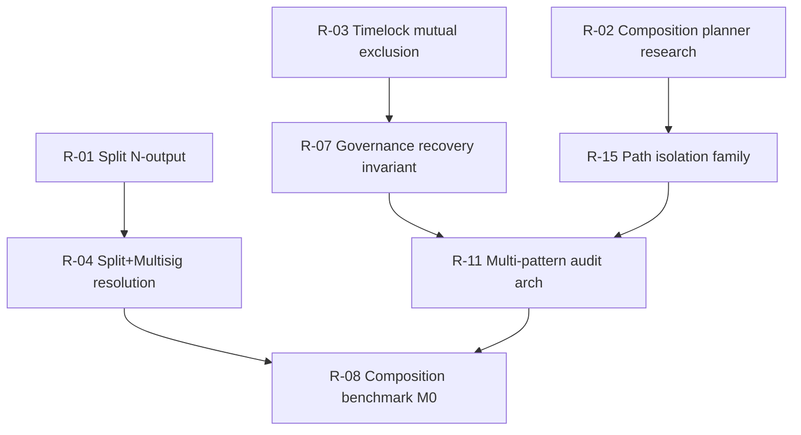

# Pattern Coverage Roadmap

**Sprint:** Phase 2 Composition Research (Wave 4)  
**Branch:** `research/composition-sprint-v2`  
**Date:** 2026-06-20  
**Status:** **Research recommendations only** — implementation explicitly deferred pending separate sprint approval

**Inputs:** [`composition_readiness_scorecard.md`](composition_readiness_scorecard.md); [`composition_matrix.md`](composition_matrix.md); [`pattern_maturity_heatmap.md`](pattern_maturity_heatmap.md); P0 catalog [`uncommon_contract_catalog.md`](uncommon_contract_catalog.md); [`generation_failure_corpus.md`](generation_failure_corpus.md)

---

## Executive Summary

Phase 2 research identifies **28 ranked items** (research + future implementation) ordered by composite score: `(ecosystem_impact × security_value) / (engineering_effort + benchmark_effort)`. **P0 research** (items 1–8) unblocks 12 of 20 P0 contracts. **No implementation** in this sprint — each item tagged **Research** or **Future implementation**.

**MEASURED blockers:** Split 50% convergence; `A_split_multisig` FAILED; no composition planner; governance timelock bypass undetected.  
**PROJECTED:** P0 research complete in Q1; first generatable L3 composites in Q3–Q4 with planner.

---

## Scoring Methodology

| Dimension | Scale | Source |
|-----------|-------|--------|
| **Ecosystem impact** | 1–5 | P0 catalog density + bch_contract_ecosystem frequency |
| **Engineering effort** | 1–5 | Heatmap avg inverse; 5 = highest effort |
| **Benchmark effort** | 1–5 | composition_benchmark_strategy materialization |
| **Security value** | 1–5 | composition_threat_model CT-* severity |
| **Composite rank** | — | `(impact × security) / (eng + bench)` descending |

---

## Ranked Roadmap (28 items)

| Rank | ID | Item | Eco | Eng | Bench | Sec | Score | Type | P0 unblock |
|------|-----|------|:---:|:---:|:---:|:---:|:-----:|------|------------|
| 1 | R-01 | **Split N-output conservation** — generalize rail, rules, Phase 2 prompt, LNC-003 | 5 | 4 | 3 | 4 | 2.86 | Future impl | UCT-001, 049, 051, 129 |
| 2 | R-02 | **Composition planner research** — function graph, path isolation, no code | 5 | 2 | 1 | 5 | 3.33 | **Research** | All L3+ |
| 3 | R-03 | **Timelock mutual exclusion audit invariant** — CT-001 detector spec | 5 | 2 | 2 | 5 | 3.33 | **Research** | UCT-017, 113 |
| 4 | R-04 | **Split+Multisig routing resolution** — resolve X cell or document permanent defer | 5 | 4 | 2 | 4 | 2.00 | **Research** | UCT-001, 003, 002 |
| 5 | R-05 | **Hashlock detector + evaluator alignment** — hash160/sha256 | 4 | 3 | 2 | 4 | 2.29 | Future impl | UCT-065 |
| 6 | R-06 | **Vault evaluator FN closure** — vr_010/vr_023 | 4 | 3 | 2 | 3 | 2.00 | Future impl | UCT-033, 113, 114 |
| 7 | R-07 | **Governance recovery bounded invariant** — CT-002 research | 5 | 2 | 2 | 5 | 3.33 | **Research** | UCT-003, 017 |
| 8 | R-08 | **Composition benchmark M0** — 12 MEASURED L1/L2 audit fixtures | 4 | 1 | 3 | 4 | 3.33 | Future impl | L1 corpus |
| 9 | R-09 | **HTLC triple golden template** — Escrow+Hashlock+Timelock | 4 | 3 | 2 | 4 | 2.29 | Future impl | UCT-065 |
| 10 | R-10 | **Refundable routing fix** — rp_003/rp_004 compile | 3 | 3 | 2 | 3 | 1.80 | Future impl | UCT-129, 068 |
| 11 | R-11 | **Multi-pattern audit architecture** — interaction invariants doc | 5 | 2 | 1 | 5 | 3.33 | **Research** | All P0 audit |
| 12 | R-12 | **Escrow+NFT composition tag** — registry schema extension research | 4 | 1 | 2 | 3 | 3.33 | **Research** | UCT-066 |
| 13 | R-13 | **Timelock evaluator `timestamp_based` mapping** | 3 | 2 | 2 | 3 | 2.14 | Future impl | UCT-033, 050 |
| 14 | R-14 | **Vault+NFT golden composite** — generation template research | 4 | 3 | 2 | 3 | 2.00 | **Research** | UCT-035 |
| 15 | R-15 | **Path isolation invariant family** — cross-function spec | 5 | 2 | 2 | 5 | 3.33 | **Research** | CT-001–004 |
| 16 | R-16 | **Subscription first-class routing research** — defer impl | 3 | 4 | 3 | 2 | 1.14 | **Research** | UCT-081 defer |
| 17 | R-17 | **Covenant+Split conflict documentation** — negative control | 3 | 1 | 1 | 3 | 3.75 | **Research** | UCT-052 |
| 18 | R-18 | **Oracle detector composition** — CT-012 | 3 | 3 | 2 | 4 | 2.00 | Future impl | UCT-161 |
| 19 | R-19 | **Hybrid FT/NFT continuity** — Wave 2A.5 extension research | 4 | 3 | 2 | 4 | 2.29 | **Research** | UCT-015 |
| 20 | R-20 | **Composition registry JSON schema** — spec from benchmark_strategy | 4 | 1 | 3 | 3 | 3.00 | **Research** | M1–M4 |
| 21 | R-21 | **CondSpend routing stabilization** — swap hijack cases | 3 | 3 | 2 | 3 | 1.80 | Future impl | UCT-114, 161 |
| 22 | R-22 | **Payroll multisig audit fixtures** — align with composition | 4 | 2 | 2 | 4 | 2.67 | Future impl | UCT-001, 003 |
| 23 | R-23 | **Real-world composition harvest** — 10+ multi-pattern from A.5 | 3 | 2 | 3 | 3 | 2.14 | **Research** | Catalog validation |
| 24 | R-24 | **Evaluator decoupling fix** — gen vs eval pattern alias | 4 | 4 | 2 | 2 | 1.33 | Future impl | All composites |
| 25 | R-25 | **Refundable+Split crowdfund golden** | 4 | 3 | 3 | 3 | 1.71 | Future impl | UCT-129 |
| 26 | R-26 | **DAO treasury emergency path benchmark** — Tier 2 policy | 5 | 2 | 2 | 5 | 3.33 | Future impl | UCT-017 |
| 27 | R-27 | **Generation failure corpus composition tag** — GF-* composition_blocking | 3 | 1 | 1 | 2 | 3.00 | **Research** | Done in corpus |
| 28 | R-28 | **Adversarial composition traps** — 25 HIDDEN_AUTH cross-path variants | 4 | 2 | 3 | 5 | 2.86 | **Research** | Red team |

---

## P0 Critical Path

**MEASURED:** R-27 complete in [`generation_failure_corpus.md`](generation_failure_corpus.md).  
**INFERRED:** R-01 and R-02 are parallel prerequisites for L3 generation; R-03/R-07/R-15 gate L3 audit.

---

## Dependencies and Execution Order

### Phase A — Research only (this sprint + Q1)

| Order | ID | Deliverable | Depends on |
|-------|-----|-------------|------------|
| A1 | R-02 | Composition planner research doc (Wave 3) | scorecard, matrix |
| A2 | R-15 | Path isolation invariant spec | R-02, threat model |
| A3 | R-03 | Timelock mutual exclusion spec | threat model CT-001 |
| A4 | R-07 | Governance recovery bounded spec | threat model CT-002 |
| A5 | R-11 | Multi-pattern audit architecture (Wave 3) | A2–A4 |
| A6 | R-04 | Split+Multisig resolution decision | matrix X cell |
| A7 | R-17 | Covenant+Split negative control doc | semantic_005_008 |
| A8 | R-20 | Composition registry schema | benchmark_strategy |
| A9 | R-28 | Adversarial composition trap specs | threat model |

### Phase B — Future implementation (post-approval, Q2)

| Order | ID | Prerequisite |
|-------|-----|--------------|
| B1 | R-01 | A6 resolution |
| B2 | R-05 | Audit sprint hashlock gap |
| B3 | R-06 | Vault phase 1B |
| B4 | R-13 | Timelock layer diagnosis |
| B5 | R-08 | A8 schema + A5 audit arch |
| B6 | R-09 | R-05 |
| B7 | R-22 | B1 partial |

### Phase C — Composition convergence (Q3–Q4, PROJECTED)

| Order | ID | Prerequisite |
|-------|-----|--------------|
| C1 | R-24 | B1, A1 planner spec |
| C2 | R-10, R-21 | Routing RCAs |
| C3 | R-14, R-19 | B1, token Wave 2 |
| C4 | R-25, R-26 | B5 benchmarks |
| C5 | R-16 | Subscription research complete — likely defer to 2027 |

---

## Pattern-Specific Recommendations

### Split Payment (RED — highest priority)

| Action | Type | Rationale |
|--------|------|-----------|
| N-output conservation | Future impl | **MEASURED** 2-output hardcode blocks 51 catalog entries |
| Split+Multisig resolution | Research | **MEASURED** A_split_multisig FAILED |
| Defer Split+Subscription | Research | **X** cell — no path |

### Escrow / Multisig / FT / NFT (GREEN)

| Action | Type | Rationale |
|--------|------|-----------|
| Composition tags in YAML | Research | Enable L1 measurement |
| Escrow+NFT registry extension | Research | **MEASURED** escrow_2of3_nft golden |
| Maintain regression | Future impl | escrow regression_results conflict |

### Vault / Timelock / Hashlock (YELLOW)

| Action | Type | Rationale |
|--------|------|-----------|
| Vault evaluator FN | Future impl | **MEASURED** vr_010/vr_023 |
| HTLC golden | Future impl | **MEASURED** evaluator hash mismatch |
| Timelock mutual exclusion | Research | CT-001 P0 gap |

### Subscription / Refundable (RED)

| Action | Type | Rationale |
|--------|------|-----------|
| Subscription defer | Research | 25% gen, **X** with Split |
| Refundable rp_003/004 | Future impl | **MEASURED** compile fail |

---

## Effort Summary (PROJECTED)

| Phase | Items | Person-weeks | Outcome |
|-------|-------|--------------|---------|
| A Research | 9 | 4–6 | Specs + architecture studies |
| B Implementation | 7 | 8–12 | L1–L2 benchmarks + pattern fixes |
| C Composition | 6 | 12–16 | L3 gen + audit for P0 top 10 |
| **Total** | **22 active** | **24–34** | 12/20 P0 generatable |

---

## Related Documents

| Document | Relationship |
|----------|--------------|
| [`composition_benchmark_strategy.md`](composition_benchmark_strategy.md) | Benchmark IDs R-08, R-20 |
| [`composition_threat_model.md`](composition_threat_model.md) | CT threats drive security value |
| [`composition_matrix.md`](composition_matrix.md) | X/N/C classification |
| [`research_master_checklist_v2.md`](research_master_checklist_v2.md) | Capstone checklist |
| [`detector_roadmap.md`](detector_roadmap.md) | Sprint v1 detector ROI |
| [`multi_pattern_generation_architecture.md`](multi_pattern_generation_architecture.md) | Wave 3 — R-02 output |
| [`multi_pattern_audit_architecture.md`](multi_pattern_audit_architecture.md) | Wave 3 — R-11 output |
