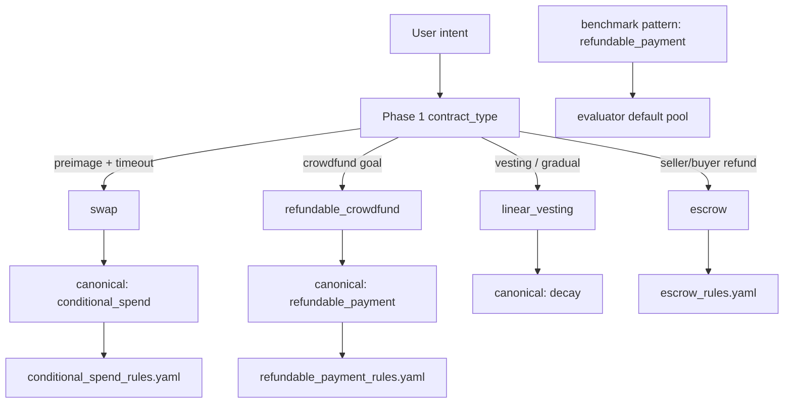

# Refundable Payment — State Report (Phase 1 Audit)

**Date:** 2026-06-11  
**Scope:** End-to-end audit of `refundable_payment` after Vault Phase 1A. **No implementation changes.**  
**Method:** Historical benchmark mining, code inspection, offline evaluator re-score, routing inference from `pipeline.py` + confirmed `rp_002` diagnostic (`hashlock_diagnostics/rp_002.json`).  
**Canonical run:** `bench_20260331_2121_6f05` (full 6-case `refundable_payment.yaml`)

---

## Executive summary

Refundable payment has **benchmark suite + pattern profile + rules YAML** (`refundable_payment_rules.yaml`) but **no Phase 1 `contract_type: refundable_payment`** and **no dedicated rail**. Pipeline routes intents to **escrow**, **swap → conditional_spend**, **linear_vesting → decay**, or **refundable_crowdfund** depending on keywords — while the evaluator scores against `pattern: refundable_payment`.

**Historical trajectory:** `bench_20260331_2121_6f05` — **67% compile**, **67% convergence**, **0.52 avg intent coverage**, **0.064 avg score**. Compiling cases produce structurally valid dual-path contracts (claim + refund) with correct `tx.time` timeouts — classic **measurement false negative** on positives, plus **compile failures** on subscription/vesting variants.

11-pattern diagnosis (`diagnosis_11_patterns_20260331_213659.json`): **67% compile**, avg score **0.064**, **1/4** compiling positives flagged `compile_pass_but_low_intent_coverage` (`rp_002`).

### Failure-class classification

| Class | Verdict |
|-------|---------|
| **A — Measurement-limited** | **Primary** on compiling positives — spurious `token_validation` on BCH-only contracts; no `refundable_payment` evaluator pool; historical `locktime_check` gaps (partially fixed by Timelock Phase 1A) |
| **B — Generation-limited** | **Secondary** — `rp_003` (subscription), `rp_004` (vesting) fail at **Compile**; `rp_005` failure case emits **correct** `tx.time` (safe code, not adversarial) |
| **C — Routing-limited** | **Secondary** — 5/6 cases route away from `refundable_payment_rules.yaml`; only crowdfund-shaped intents hit `refundable_crowdfund` golden path |
| **D — Mixed** | **Overall classification** |

**Recommendation:** **Refundable Payment Phase 1A (measurement alignment only)** is justified for compiling positives. Track `rp_003`/`rp_004` compile and `rp_005` adversarial generation separately. **Effort: ~1 day** for 1A; routing overlay is **out of 1A scope** unless explicitly approved later.

---

## Part 1 — Historical benchmark review

### Aggregate runs

| Run ID | Cases | Compile % | Convergence % | Avg Score | Notes |
|--------|-------|-----------|---------------|-----------|-------|
| `bench_20260331_2121_6f05` | 6 | **67%** | **67%** | **0.064** | **Canonical full suite** |
| `bench_20260331_2119_11c4` | 2 | 100% | 100% | 0.105 | rp_001, rp_002 subset |
| 11-pattern diagnosis | 6 | 67% | 67% | 0.064 | Same canonical data |

No additional full-suite refundable runs found in `benchmark/results/`.

### Per-case — `bench_20260331_2121_6f05`

| Case | Compile | Converged | Score | Intent cov | Failure layer | Missing features (historical) |
|------|---------|-----------|-------|------------|---------------|------------------------------|
| rp_001 | pass | yes | 0.15 | 0.75 | Evaluator | `token_validation` |
| rp_002 | pass | yes | 0.06 | 0.60 | Evaluator | `hash_verification`, `token_validation` |
| rp_003 | **fail** | no | 0.00 | 0.00 | **Compile** | all |
| rp_004 | **fail** | no | 0.00 | 0.00 | **Compile** | all |
| rp_005 | pass | yes | 0.10 | 1.00 | Evaluator (failure) | — (`must_fail_wrong_time_field` critical miss) |
| rp_006 | pass | yes | 0.075 | 0.75 | Evaluator | `output_value_validation` |

### Offline re-score (current evaluator, post Timelock/Hashlock/Vault 1A)

| Case | Historical score | Est. intent cov now | Remaining gap |
|------|------------------|---------------------|---------------|
| rp_001 | 0.15 | **0.75** | `token_validation` (BCH-only) |
| rp_002 | 0.06 | **0.80** | `token_validation` (BCH-only); `hash_verification` **fixed** |
| rp_005 | 0.10 | 1.00 req / crit fail | **Generation** — uses correct `tx.time` |
| rp_006 | 0.075 | **1.00** | None (value + goal checks credited) |

---

## Part 2 — Routing audit



| Step | Location | Behavior |
|------|----------|----------|
| Phase 1 enum | `pipeline.py` ~1098–1127 | **`refundable_payment` not listed**; closest types: `escrow`, `swap`, `refundable_crowdfund`, `linear_vesting` |
| Crowdfund upgrade | `pipeline.py` ~729–737 | Keywords `crowdfund`, `goal`, `fundrais` → `refundable_crowdfund` |
| Vesting upgrade | `pipeline.py` ~749–757 | Keywords `vest`, `gradual`, `linear release` → `linear_vesting` |
| Canonical alias | `pattern_profiles.py:16` | Only `refundable_crowdfund` → `refundable_payment` |
| Pattern profile | `pattern_profiles.py:66–69` | `refundable_payment_rules.yaml` — **only when canonical is refundable_payment** |
| Rails | `build_pattern_rails()` | **No `_REFUNDABLE_RAIL`**; `_SWAP_RAIL` if `htlc`/`swap` in Phase 1 features (often absent) |
| Golden | `_GOLDEN_TYPE_MAP` | `refundable_crowdfund` → `refundable_crowdfund.cash` |
| Benchmark pattern | `refundable_payment.yaml` | `pattern: refundable_payment` — evaluator only; **does not override Phase 1** |

### Routing diagnostics

| Case | Inferred `contract_type` | Canonical | `refundable_rules` | Confirmed |
|------|--------------------------|-----------|-------------------|-----------|
| rp_001 | `escrow` | escrow | **no** | Inferred (seller/buyer + timeout refund) |
| rp_002 | `swap` | conditional_spend | **no** | **Yes** — `hashlock_diagnostics/rp_002.json` |
| rp_003 | `escrow` / `distribution` | escrow / single_sig_transfer | **no** | Inferred |
| rp_004 | `linear_vesting` | decay | **no** | Inferred (“gradual release”, “25% every 7 days”) |
| rp_005 | `escrow` | escrow | **no** | Inferred |
| rp_006 | `refundable_crowdfund` | **refundable_payment** | **yes** | Inferred (“crowdfunding”, “goal reached”) |

**Routing gap:** Benchmark measures unified `refundable_payment`; pipeline trains on **four different families** for six intents.

---

## Part 3 — Rules (`refundable_payment_rules.yaml`)

| Rule | Content |
|------|---------|
| RP-PAYMENT | Release path validates signer and output value |
| RP-REFUND | Refund path uses `require(tx.time >= timeout)` + sender authorization |
| RP-OUTPUT-LIMIT | `require(tx.outputs.length == N)` |

**Loaded only** when `contract_type` resolves to `refundable_crowdfund` (rp_006-shaped). Escrow/HTLC/vesting cases use other rule files.

---

## Part 4 — Rails

| Rail | Relevance | Attaches on refundable intents? |
|------|-----------|--------------------------------|
| `_ESCROW_RAIL` | Payout + refund branches | Only if Phase 1 tags `escrow` |
| `_SWAP_RAIL` | HTLC preimage + timeout | Only if Phase 1 features include `htlc`/`swap` — **not** on confirmed rp_002 |
| `_VAULT_RAIL` | Unrelated | No |

**No refundable-specific rail** in `build_pattern_rails()`.

---

## Part 5 — Sanity

**File:** `sanity_checker.py`

| Check | Refundable behavior |
|-------|---------------------|
| Timelock evidence | When `"timelock" in features` |
| Signature accountancy | Standard unless vault/covenant mode |

Historical compiling cases: **no systematic sanity failures** recorded.

---

## Part 6 — Lint

**File:** `dsl_lint.py`

| Item | Behavior |
|------|----------|
| Contract name prefix | `refundable_` listed among recognized families (~line 171) |
| Profile disables | None specific to `refundable_payment` profile |

Compiling cases in canonical run: **0 lint errors**.

---

## Part 7 — Compile

| Case | Result | Notes |
|------|--------|-------|
| rp_001–002, rp_005–006 | **pass** | Valid dual-path BCH contracts |
| rp_003 | **fail** | Subscription / cancel-reclaim — retry exhaustion |
| rp_004 | **fail** | Gradual vesting + inactivity reclaim — retry exhaustion |

Generated code quality (compiling cases) is **good**:

**rp_001** — seller release + buyer timeout refund:
```cashscript
function refund(sig buyerSig) {
    require(tx.time >= refundTimeout);
    require(checkSig(buyerSig, buyer));
    require(tx.outputs[0].value == tx.inputs[this.activeInputIndex].value);
}
```

**rp_002** — HTLC-style claim + refund (`hash256` preimage present; evaluator now credits `hash_verification`).

**rp_006** — crowdfund goal + deadline refund (matches golden `refundable_crowdfund` shape).

---

## Part 8 — Evaluator

| Component | Status |
|-----------|--------|
| `refundable_payment` in `_cashtoken_alias_pool` | **No** — uses default/else branch |
| `hash_verification` / `sha256_check` | **Fixed** for rp_002 via Hashlock Phase 1A (`hashlock` tag + pool) |
| `locktime_check` / `time_validation` | **Fixed** for `tx.time >=` via Timelock Phase 1A |
| `token_validation` | **Blocks BCH-only** rp_001/rp_002 (no tokens in intent or code) |
| `output_value_validation` | Partially credited via `value_check` tag; rp_006 historical miss |
| `must_fail_wrong_time_field` | Wired (Timelock 1A); rp_005 uses **correct** field → critical fails (**generation**) |
| Refund-specific semantics | **Unmapped** — no `refund_path`, `claim_path`, `goal_threshold`, `crowdfund_refund` aliases |

---

## Part 9 — Generation quality vs benchmark intent

| Case | Structurally valid? | Intent match | Scoring match |
|------|---------------------|--------------|---------------|
| rp_001 | Yes | Yes — dual path + timeout refund | **No** — `token_validation` |
| rp_002 | Yes | Yes — preimage + timeout | **No** — `token_validation` only (hash fixed) |
| rp_003 | — | Unknown (no compile) | — |
| rp_004 | — | Unknown (no compile) | — |
| rp_005 | Yes | **No** — safe `tx.time`, not wrong field | Evaluator correct to reject |
| rp_006 | Yes | Yes — goal + refund | **No** historically; **yes** offline now |

---

## Phase 1A proposal (measurement only — not implemented)

**Justified:** compiling positives (rp_001, rp_002, rp_006) show valid refund semantics with low scores driven by evaluator/suite naming, not codegen.

| Change area | Proposed 1A action | Out of scope |
|-------------|-------------------|--------------|
| `evaluator.py` | Add `_refundable_alias_pool`: `refund_path`, `claim_path`, `goal_threshold_logic`, `crowdfund_refund_path`; merge hashlock checks for HTLC-tagged cases | Rails, Phase 1 enum |
| `semantic_requirement_map.yaml` | Map refund-specific requirements; relax or alias `token_validation` for BCH-only (mirror timelock sig drop policy) | Suite YAML edits optional |
| `feature_rules.yaml` | `refund_path`, `claim_path`, `goal_threshold` regex features | `pipeline.py` routing |
| Benchmark suite | Optionally drop `token_validation` from BCH-only cases (rp_001, rp_002) | Generation prompts |

**Not justified in 1A:** routing overlay to inject `refundable_payment_rules.yaml` for all cases — that is **Phase 1B / routing** work.

**Expected impact:** rp_001/rp_002 → **≥0.85** intent; rp_006 → **1.0**; full-suite avg on compiling cases **≥0.85**. Gate still blocked by rp_003/rp_004 compile until generation work.

---

## Reproduce

```bash
python scripts/diagnose_refundable_case.py all
python -m benchmark.runner benchmark/suites/refundable_payment.yaml
```
