# Semantic benchmark investigation: `semantic_005` & `semantic_008`

**Run context:** `bench_20260522_1919_sem` — **6/8 Tier B** (gate met). This report focuses on the two non-converged cases.

**Methods:** Normalization/rail static analysis, failed-pipeline `last_code` capture for 005, live `diagnose_semantic_case.py` runs for 005 and 008 (2026-05-22).

---

## Executive summary

| Case | Symptom | Primary cause class | Fix surface |
|------|---------|---------------------|-------------|
| **semantic_005** (marketplace) | `compile_pass=false`, 0% coverage | **Pipeline / repair-loop / template drift** — not semantic-layer weakness | `pipeline_engine` compile repair, Phase 2 routing, optional marketplace rail |
| **semantic_008** (voucher) | `compile_pass=true`, 50% coverage, all **critical** features pass | **Evaluator `required_features` gap** (`token_validation`) — synthesis is partially thin but converges semantically on critical bar | `benchmark/evaluator.py` and/or redeemable supply rail |

---

## Part A — `semantic_005` (marketplace) deep dive

### Benchmark contract

**Intent:** Marketplace covenant that locks immutable NFT until buyer pays exact BCH amount to seller.

**Pattern:** `semantic_marketplace`

**Critical features:** `valid_signature_check`, `output_amount_check`, `migratory_locking_bytecode`, `token_category_check`

**Observed (checkpoint):** `compile_pass=false`, `failure_layer=Compile`, ~87s latency (3 full regen cycles).

### Phase 1 routing (deterministic — correct enough)

From `apply_semantic_normalization()` on the suite intent:

| Field | Resolved value |
|-------|----------------|
| `ownership_mode` | `transferable` |
| `lifecycle_mode` | **`terminating`** (keyword `marketplace` in escrow/payout bucket; no `transfer to buyer` phrase) |
| `supply_mode` | `fixed` |
| `contract_type` | `nft_transfer_immutable` |
| `token_class` | `nft_immutable` |
| Injected rails | **`[RAIL: TERMINATING LIFECYCLE]`** only (+ `terminating_payout_path` profile hint) |

**Note:** `semantic_001` (escrow) resolves to the **same** semantic fields; 001 can still reach Tier B when codegen happens to include `buyerPkh` / `sellerPkh` style migratory checks. 005 is not failing because normalization is empty — it fails **before** evaluation.

### Failure timeline (typical retry run)

Per terminal logs and a fresh diagnostic generation:

1. **Lint phase** (full `--all` run): heavy **LNC-015** loops on `LockingBytecodeP2PKH(buyerPkh)` before Pkh-suffix allowance; **LNC-003** on escrow-style release paths. Stuck-lint breaker can force proceed to compile with unresolved lint context still in prompt history.
2. **Compile phase** (dominant on retries):
   - `ExtraneousInputError: Extraneous input 'bytes32'` — constructor/param placement error.
   - `UnknownError: LockingBytecodeP2PKH with type undefined where type function was expected` — usually **missing `new`** on a later repair pass (initial codegen often has `new LockingBytecodeP2PKH(...)`).
   - `Mismatched input '<EOF>'` / `No viable alternative at input 'require('` — **truncated function body** mid-repair.
3. **Regen:** 3× full generation (`disable_fallbacks=true`) → `synthesis_failed_no_fallback`.

### Smoking gun: `last_code` artifact

Captured from `generate_guarded(..., disable_fallbacks=True)` after pipeline exhaustion:

| Signal | Value | Interpretation |
|--------|-------|----------------|
| Brace balance | **`{` ×3, `}` ×1** | Structure corrupted — not a semantic “wrong covenant” alone |
| Tail of file | `function dispute(...)` ends with **unclosed** `require(` at line 38 | EOF compile errors are **symptoms of truncation**, not root business-logic bugs |
| P2PKH usage | **`new LockingBytecodeP2PKH` ×2** (buyer/seller payout) | Constructor syntax is correct in the surviving fragment |
| Shape | **Buyer + seller + arbiter + `dispute`** | **Escrow template bleed** — marketplace intent does not mention arbiter/dispute |

Excerpt (truncated file — line 38 is incomplete):

```cashscript
    function dispute(sig buyerSig, sig arbiterSig) {
        require(buyer != seller);
        require(buyer != arbiter);
        require(seller != arbiter);

        require(
```

### Root-cause hypothesis matrix (005)

| Hypothesis | Evidence | Verdict |
|------------|----------|---------|
| **Rail composition conflict** | `lifecycle_mode=terminating` rail says “no `this.activeBytecode` on payout”; benchmark still expects `migratory_locking_bytecode`. `synthesis_rules.yaml` split pattern says **avoid** `LockingBytecodeP2PKH` in splits; terminating rail **encourages** P2PKH. | **Contributing** — increases LLM variance; not sole cause of compile fail |
| **Repair-loop contamination** | Brace imbalance 3:1; deterministic `ExtraneousInputError` + `<EOF>` → append `}` can **over-correct**; LLM repair on truncated `require(` worsens file | **Primary** for compile failure |
| **Prompt overflow** | Marketplace run ~87s, 3 regens; no direct token-meter proof in checkpoint | **Possible** on long lint-injected Phase 2 threads — secondary |
| **Invalid injected syntax fragment** | `bytes32` in wrong syntactic position; partial `require(` left by repair | **Primary** alongside truncation |
| **Semantic weakness (ownership/lifecycle)** | Normalization + NFT immutable route are coherent; failure is **pre-eval** | **Rejected** as primary |

### Why 001 passes and 005 fails (same normalization)

Both map to `terminating` + `nft_transfer_immutable`. Difference is **stochastic Phase 2 output** and **repair path**:

- 001 retry log: same `LockingBytecodeP2PKH` / EOF errors, then a clean regen → **PASS**.
- 005 repeatedly lands on **escrow-shaped multi-party** contracts that **truncate** during compile-fix, leaving unbalanced braces.

This matches “highest-leverage debugging target” = **compile/regen stability**, not expanding semantic enums.

### Recommended fixes (005) — ordered by leverage

1. **Compile gate guardrails** (`pipeline_engine._request_syntax_fix`):
   - After any fix, reject output if `{`/`}` counts differ or any `function` block has unclosed `require(`.
   - On `LockingBytecodeP2PKH` “undefined function” error, deterministic prepend `new ` when pattern is `LockingBytecodeP2PKH(` without `new`.
   - Do **not** apply `bytes` → `bytes32` upgrade on **constructor parameter lists** (only locals).

2. **Marketplace Phase 2 constraint** (small rail, not new enums):
   - Explicit: **2-party purchase only** (buyer pays seller, NFT to buyer); **forbid arbiter/dispute** unless intent mentions dispute.
   - Prefer `bytes20 buyerPkh, bytes20 sellerPkh` constructor params vs inline constructors (aligns with `canonical_split_2party`).

3. **Normalization tweak** (benchmark-aligned):
   - For `marketplace` + immutable NFT, set `lifecycle_mode=migratory` when intent implies NFT transfer to buyer (e.g. “until buyer pays” → treat as migratory payout path). Reduces terminating/migratory evaluator tension.

4. **Lint** (already partially addressed): LNC-015 suffix allowlist for `*Pkh`; ensure stuck-lint breaker does not pass **structurally broken** code to compile repair without a **full regen** reset of `code` string.

---

## Part B — `semantic_008` (voucher) semantic analysis

### Benchmark contract

**Intent:** Redeemable voucher token that burns itself when exchanged for BCH payout.

**Pattern:** `semantic_voucher`

**Required features:** `signature_verification`, `token_validation`

**Critical features:** `redeem_burn_termination`, `burn_supply_reduction`, `output_amount_check`

**Observed:** `compile_pass=true`, `intent_coverage=50%`, `converged=false`, `failure_layer=null`.

### Phase 1 routing (correct)

| Field | Value |
|-------|-------|
| `supply_mode` | `redeemable` |
| `lifecycle_mode` | `terminating` |
| `contract_type` | `ft_transfer` / `token_class=ft` |
| Rails | TERMINATING + **REDEEMABLE** |

### Diagnostic breakdown (live run)

```
required_features satisfaction:
  signature_verification: True
  token_validation:       False   ← sole required miss

critical_features satisfaction:
  redeem_burn_termination: True
  burn_supply_reduction:   True
  output_amount_check:     True

critical_missing=[]
converged_blockers: intent_coverage 50% < 70% (not critical_features)
```

### Generated code (representative)

```cashscript
contract FungibleVoucherRedeem(
    pubkey owner,
    bytes recipientLockingBytecode,
    bytes32 tokenCategory
) {
    function redeem(sig ownerSig) {
        require(checkSig(ownerSig, owner));
        require(tx.inputs[this.activeInputIndex].tokenCategory == tokenCategory);
        require(tx.outputs.length == 1);
        require(tx.outputs[0].tokenCategory == 0x);   // burn via empty category
        require(tx.outputs[0].lockingBytecode == recipientLockingBytecode);
        require(tx.outputs[0].value == tx.inputs[this.activeInputIndex].value);
    }
}
```

**Substring check:** `"tokenAmount" in code` → **False**.

### Which critical_features “failed”?

**None.** All three critical checks pass via `_semantic_alias_pool()`:

| Critical feature | How it passes |
|------------------|---------------|
| `burn_supply_reduction` | `tokenCategory == 0x` on output and/or `redeem` in function name |
| `redeem_burn_termination` | `burn_path` ∧ `terminating` (value check + `redeem`) |
| `output_amount_check` | `tx.outputs[0].value == tx.inputs[...].value` |

### Route / ownership / lifecycle

| Check | Assessment |
|-------|------------|
| Route (`ft_transfer` + redeemable) | **Correct** |
| Ownership | Default transferable — OK for voucher |
| Lifecycle terminating + redeem rail | **Correct** |
| Semantic miss on critical bar | **No** |

### Why Tier B = false

Convergence requires `intent_coverage >= 0.70`. With two required features, missing **`token_validation`** caps coverage at **50%** even when all critical features pass.

`token_validation` is implemented as:

```python
("token_amount" in detected)           # regex: .tokenAmount == <expr>
or ("token_nft" in detected)
or ("tokenCategory" in code and "tokenAmount" in code)
```

The voucher uses **category-zero burn** only — valid on CashTokens, but:

- Feature rule `token_amount` does not fire.
- Substring `tokenAmount` is absent → capability stays **False**.

**Also detected:** `bch_only_output` (from `tokenCategory == 0x` on output) — heuristic aimed at “no tokens on output,” which is exactly the burn pattern here. That label is misleading for redeemable FT but does not block critical checks.

### Verdict (008)

| Layer | Verdict |
|-------|---------|
| Synthesis | **Minor gap:** no `tokenAmount` conservation check (e.g. output amount vs input token amount on FT burn). Category-only burn compiles and matches redeem intent loosely. |
| Benchmark / evaluator | **Primary gap:** `token_validation` required feature does not treat **FT burn via `tokenCategory == 0x`** as satisfying validation when `supply_mode=redeemable`. |
| Benchmark design | **Optional:** move `token_validation` to critical only with redeem-specific alias, or add `token_amount` to critical for voucher instead of a generic required slot. |

### Recommended fixes (008) — pick one or combine

**A. Evaluator (fastest path to Tier B for 008)**

In `BenchmarkEvaluator.requirement_satisfied` or `_semantic_alias_pool` for `semantic_voucher`:

- Treat `token_validation` as satisfied when `tokenCategory == 0x` burn pattern appears on outputs **and** input category is constrained.

**B. Synthesis (stricter covenant)**

In redeemable rail / Phase 2 hint:

```cashscript
require(tx.outputs[0].tokenAmount == 0);
// or preserve: == tx.inputs[this.activeInputIndex].tokenAmount with category 0x
```

**C. Benchmark suite**

Drop `token_validation` from `required_features` for 008 and rely on the three critical features (already redeem-specific).

---

## Part C — Cross-case comparison

```mermaid
flowchart TD
  subgraph five [semantic_005 marketplace]
    P1[Phase1: terminating + nft_immutable]
    P2[Phase2: escrow-shaped 3-party DSL]
    Lint[LNC-015 / LNC-003 loops]
    Compile[Compile-fix truncates file]
    Fail[compile_pass=false]
    P1 --> P2 --> Lint --> Compile --> Fail
  end

  subgraph eight [semantic_008 voucher]
    P1b[Phase1: redeemable FT terminating]
    P2b[Phase2: redeem + category 0x burn]
    CompileOK[compile_pass=true]
    Eval[required token_validation false]
    NC[converged=false 50% coverage]
    P1b --> P2b --> CompileOK --> Eval --> NC
  end
```



---

## Part D — Action checklist

| Priority | Item | Owner file(s) |
|----------|------|----------------|
| P0 | Compile-fix structural validator (brace balance, no dangling `require(`) | `src/services/pipeline_engine.py` |
| P0 | Deterministic `new LockingBytecodeP2PKH` repair | `pipeline_engine._request_syntax_fix` |
| P1 | Marketplace 2-party rail (no arbiter/dispute) | `semantic_profiles.py` or Phase 2 pattern hint |
| P1 | `token_validation` alias for redeemable category burn | `benchmark/evaluator.py` |
| P2 | `lifecycle_mode=migratory` for marketplace intents | `semantic_normalization.py` |
| P2 | Redeemable rail: optional `tokenAmount` check in codegen | `semantic_profiles.py` |

---

## Appendix — Commands used

```powershell
cd d:\downloadds\nexmcp\nexops-mcp
python scripts/diagnose_semantic_case.py semantic_005
python scripts/diagnose_semantic_case.py semantic_008
```

Normalization probe:

```powershell
python -c "from src.models import IntentModel; from src.services.semantic_normalization import apply_semantic_normalization; ..."
```

---

*Generated: 2026-05-22. Suite: 8 cases, gate ≥6/8 Tier B — **met** with 005 and 008 as remaining improvement targets.*
