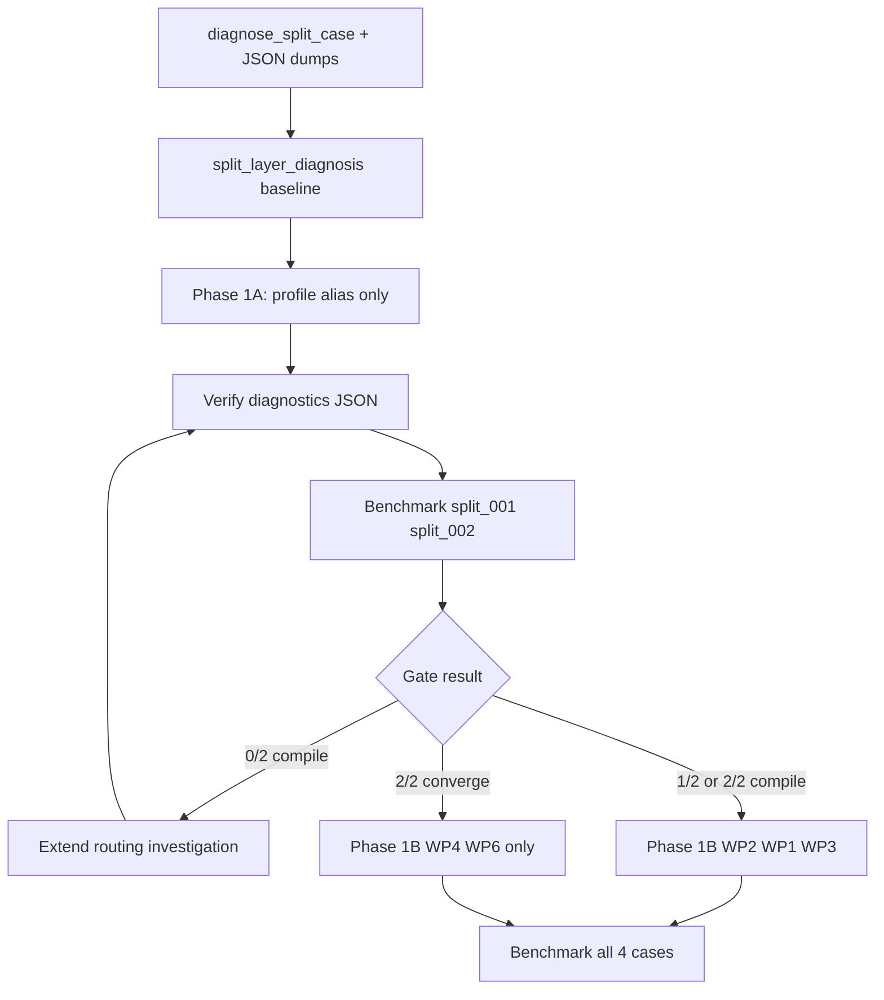

# Split Payment Phase 1 — Implementation Plan (1A / 1B)

**Date:** 2026-06-07 (revised)  
**Goal:** Stabilize `split_payment` and N-output conservation before escrow or other composite patterns.  
**Baseline:** 0/4 compile on Phase 1 subset (`bench_20260607_2109_cdbc`).  
**Final target:** ≥85% convergence on 4 real-world cases.

---

## Strategy

The 0/4 compile result suggests failure may occur at **routing → knowledge loading → rail attachment** before conservation logic is exercised. Split work into:

- **Phase 1A (~1 day):** Routing gate only — smallest possible change set to answer *"Is routing broken?"*
- **Phase 1B (~2–3 days):** Conservation, lint, benchmark alignment — only after 1A diagnosis; scope varies by gate outcome.

**Phase 1A is not trying to answer:** *"Can the model generate perfect N-way contracts?"*

---

## Diagnostic infrastructure (do first)

### `scripts/diagnose_split_case.py`

Modeled on [`scripts/diagnose_semantic_case.py`](scripts/diagnose_semantic_case.py). For each case id:

1. Run Phase 1 on intent
2. Build structured knowledge + pattern rails (no full benchmark)
3. **Write JSON** to `benchmark/results/split_diagnostics/<case_id>.json`:

```json
{
  "contract_type": "...",
  "effective_mode": "...",
  "features": ["..."],
  "pattern_profile_loaded": true,
  "split_rules_loaded": true,
  "split_rail_loaded": true
}
```

Field definitions:

| Field | True when |
|-------|-----------|
| `pattern_profile_loaded` | `get_pattern_profile(effective_mode)` returns non-empty `knowledge_files` |
| `split_rules_loaded` | Structured knowledge `pattern_overlays` contains `split_rules` content |
| `split_rail_loaded` | `build_pattern_rails(...)` output contains `[RAIL: SPLIT MODE]` |

**Reusable infrastructure:** Same pattern later for multisig, escrow, vault, hashlock, timelock — generalize to `scripts/diagnose_pattern_case.py` + `benchmark/results/<pattern>_diagnostics/` when a second pattern needs it.

### `docs/split_layer_diagnosis.md`

Per-case tables capturing **first failure** (not just final `failure_layer`):

| Layer | Result |
|-------|--------|
| Phase 1 routing | pass/fail + `contract_type`, `features`, `effective_mode` |
| Rules loaded | pass/fail (cross-check JSON diagnostic) |
| Rails loaded | pass/fail |
| Sanity pass | pass/fail |
| Lint pass | pass/fail |
| Compile pass | pass/fail |
| Evaluator pass | pass/fail |

Populate baseline from `bench_20260607_2109_cdbc` + first `diagnose_split_case.py` run on all four cases.

---

## Phase 1A — Routing gate (~1 day)

**Question:** Is routing broken?

### In scope (minimal)

| File | Change |
|------|--------|
| [`pattern_profiles.py`](src/services/pattern_profiles.py) | Add `"split": "split_payment"` to `canonical_pattern` alias_map (fixes profile lookup when `effective_mode == "split"`) |
| [`scripts/diagnose_split_case.py`](scripts/diagnose_split_case.py) | New — JSON dump to `benchmark/results/split_diagnostics/` |
| [`docs/split_layer_diagnosis.md`](docs/split_layer_diagnosis.md) | Baseline layer tables |

### Explicitly out of Phase 1A

| Item | Deferred to |
|------|-------------|
| `canonical_split_nparty` in `synthesis_rules.yaml` | Phase 1B |
| N-output rewrite of `_SPLIT_RAIL` / Phase 2 SPLIT MODE | Phase 1B |
| N-output `split_rules.yaml` content overhaul | Phase 1B |
| `ft_transfer_rules.yaml` N-output token section | Phase 1B |
| WP1 conservation helper | Phase 1B |
| WP3 lint/sanity | Phase 1B |
| WP4 / WP6 | Phase 1B (or skip WP1 if 2/2 converge) |

### Verification (before benchmark)

```bash
python scripts/diagnose_split_case.py split_001_treasury
python scripts/diagnose_split_case.py split_002_payroll
```

Expect after alias fix:

- `pattern_profile_loaded: true`
- `split_rules_loaded: true` (when `"split" in features`)
- `split_rail_loaded: true` (when `"split" in features`)

If `split` not in Phase 1 features for treasury/payroll intents → **routing investigation continues** (deterministic post-process to inject `"split"` feature) without starting 1B.

### Benchmark rerun (2 cases only)

```bash
python -m benchmark.runner benchmark/suites/split_payment.yaml \
  --ids split_001_treasury,split_002_payroll
```

Update `split_layer_diagnosis.md` and `split_payment_phase1_results.md` with 1A metrics.

### Decision gate (after Phase 1A)

| Result | Action |
|--------|--------|
| **0/2 compile** | Continue routing investigation (Phase 1A extended: force `"split"` in features, verify diagnostics JSON, re-run 2-case subset). Do **not** start WP1 yet. |
| **1/2 compile** | Routing bug **confirmed** as contributor → proceed **Phase 1B** (full WP2 N-output rails + WP1 + WP3) |
| **2/2 compile** | Routing was **major blocker** → proceed **Phase 1B** (WP2 N-output content + WP1 + WP3) |
| **2/2 converge** | Routing + generation largely fixed → **skip most of WP1**; go directly to **WP4 + WP6** (+ WP5 tests as needed) |

---

## Phase 1B — Conservation and alignment (conditional, ~2–3 days)

Enter when decision gate says proceed to 1B (not when still at 0/2 with unfixed routing).

### Work packages

| WP | Content | When |
|----|---------|------|
| **WP2 (remainder)** | N-output `split_rules.yaml`, `_SPLIT_RAIL`, Phase 2 split prompt, `ft_transfer_rules.yaml`, `canonical_split_nparty` in `synthesis_rules.yaml` | Always in 1B unless 2/2 converge |
| **WP1** | `split_conservation.py` + `cashscript_ast.py` N-output helpers | Skip if 2/2 converge; else P0 |
| **WP3** | LNC-003, LNC-014, sanity checker, semantic_capabilities | Skip if 2/2 converge; else P0 |
| **WP4** | `feature_rules.yaml`, evaluator split pool, `semantic_requirement_map.yaml` | Always (especially if 2/2 converge) |
| **WP6** | Multisig + split co-routing | Before `split_003` rerun |
| **WP5** | `test_split_conservation.py`, fallback | P2 |

### WP1 — N-output conservation primitives

- Detect `require(tx.outputs.length == N)` with N > 1
- Accept chained sums, param-based conservation, vault paired legs
- Mirror for `tokenAmount` / `tokenCategory`

Files: `src/utils/split_conservation.py` (new), `src/utils/cashscript_ast.py`

### WP3 — Lint + sanity

Files: `dsl_lint.py`, `sanity_checker.py`, `semantic_capabilities.py`

### WP4 — Benchmark alignment

Files: `benchmark/config/feature_rules.yaml`, `benchmark/evaluator.py`, `benchmark/config/semantic_requirement_map.yaml`

### WP6 — Multisig + split composition

Keyword gate: distribute/split/recipients + multisig → `"split" in features` + `_SPLIT_RAIL` even when `contract_type == "multisig"`

### Benchmark rerun (full subset)

```bash
python -m benchmark.runner benchmark/suites/split_payment.yaml \
  --ids split_001_treasury,split_002_payroll,split_003_multisig_distribution,split_004_revenue_share
```

**Target:** ≥85% convergence (≥3/4). Refresh `split_layer_diagnosis.md` + `split_payment_phase1_results.md`.

---

## Implementation order



---

## Success metrics

| Metric | Legacy 6-case | Phase 1A gate | Phase 1B target |
|--------|---------------|---------------|-----------------|
| Compile (treasury+payroll) | — | >0/2 proves routing mattered | — |
| Compile (4-case subset) | 0% | — | ≥85% |
| Convergence (4-case) | — | — | ≥85% |
| `split_rules_loaded` in diagnostics | false (baseline) | true | true |
| LNC-003 false negatives on N-sum | present | — | 0 on subset |

---

## Risks

| Risk | Mitigation |
|------|------------|
| Alias fix alone insufficient (no `"split"` in features) | Diagnostics JSON shows it; extend 1A with deterministic feature injection |
| 1A conflated with generation quality | Keep 1A to alias + diagnostics only |
| Over-building diagnose script | Start split-specific; generalize when second pattern needs it |

---

## Related documents

| Document | Purpose |
|----------|---------|
| [`split_payment_state_report.md`](split_payment_state_report.md) | Static audit (2-output hardcoding inventory) |
| [`split_payment_phase1_results.md`](split_payment_phase1_results.md) | Benchmark results + RCA |
| [`split_layer_diagnosis.md`](split_layer_diagnosis.md) | Per-case first-failure layer tables |
| `benchmark/results/split_diagnostics/*.json` | Machine-readable routing diagnostics |
