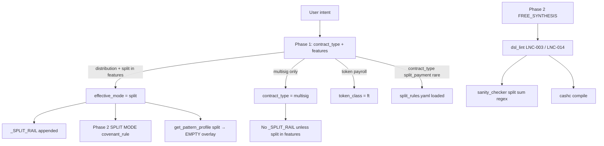

# Split Payment — State Report (Phase 1 Audit)

**Date:** 2026-06-07  
**Scope:** Static audit of `split_payment` path — rules, rail, evaluator, sanity checker, LNC-003, feature extraction, and all hardcoded 2-output conservation assumptions.  
**Method:** Code and artifact inspection; latest committed suite run `bench_20260331_2125_2cb6.json` (6 legacy cases). No code changes in this audit.

---

## Executive summary

Split payment has **partial scaffolding** (YAML rules, `_SPLIT_RAIL`, pattern profile entry, 6-case suite, fallback template) but the **entire conservation stack is hardcoded for exactly two outputs**. Rails, knowledge YAML, Phase 2 split prompt, LNC-003 sum detection, sanity checker, token split AST helpers, and fallback all encode `out[0] + out[1] == input`.

**Routing is fragile:** `_SPLIT_RAIL` and Phase 2 `SPLIT MODE` attach only when Phase 1 puts `"split"` in `features`. `split_rules.yaml` loads only when `resolve_effective_mode()` returns a mode that canonicalizes to `split_payment` — but the normal path returns `"split"` (from `distribution` + split feature), which **does not match** the `split_payment` pattern profile key. Knowledge overlay is often **empty** on the main generation path.

Latest full suite run: **50% compile/convergence**, **avg final score 0.033**, **avg intent coverage 0.17** (`bench_20260331_2125_2cb6`). Hard cases (3+ outputs, fee paths, time branches) fail at **Compile** after retry exhaustion. Composite split+multisig (`A_split_multisig`) fails lint (LNC-003 false negatives on N-output sums) plus compile (`LockingBytecodeP2PKH`).

**Verdict:** Split payment should be the **next convergence target**. The minimum fix surface is **N-output BCH and tokenAmount conservation** across rail, rules, lint, sanity, and AST — not new patterns.

---

## 1. Generation path map



| Step | Location | Behavior |
|------|----------|----------|
| Phase 1 | `pipeline.py:_build_phase1_prompt` ~1106–1107 | Instructs LLM: multi-recipient → include `"split"` in features; no `split_payment` contract_type enum |
| Mode resolution | `resolve_effective_mode()` ~431–434 | `"split"` only when `contract_type == "distribution"` **and** `"split" in features` |
| Pattern profile | `pattern_profiles.py:70–74` | Key is `split_payment`; disables **LNC-016** only |
| Profile lookup bug | `build_structured_knowledge()` ~564–566 | Uses `resolve_effective_mode()` → `"split"` → **no** `split_rules.yaml` overlay |
| Rails | `build_pattern_rails()` ~371 | `"split" in tags` → `_SPLIT_RAIL` (2-output) |
| Phase 2 split branch | `_build_phase2_prompt()` ~1176–1181 | 2 outputs; BCH + tokenAmount pairwise sum |
| Golden | `_GOLDEN_TYPE_MAP` | **No** split golden template |
| Fallback | `fallbacks/fallback_split.cash` | 2-output equal split only |

---

## 2. Split rules (`split_rules.yaml`)

**File:** `src/services/knowledge_structured/split_rules.yaml`

| Rule ID | Content | Issue |
|---------|---------|-------|
| SPLIT-LENGTH-GUARD | `require(tx.outputs.length == 2)` | Blocks 3+ recipient treasury / revenue cases |
| SPLIT-SUM-INVARIANT | `out[0].value + out[1].value == input.value` | N-output conservation impossible |
| NO-DIRECT-ANCHOR | Forbids single-output full anchor when splitting | Correct intent; paired with 2-output assumption |

**Related:** `ft_transfer_rules.yaml` `split:` section repeats 2-output `tokenAmount` sum only.

**Related:** `synthesis_rules.yaml` `canonical_split_2party` — explicit 2-party template; warns against `LockingBytecodeP2PKH()` in constructor (relevant to `A_split_multisig` compile failure).

---

## 3. Split rail (`_SPLIT_RAIL`)

**File:** `pipeline.py:204–208`

```
[RAIL: SPLIT MODE]
- require(tx.outputs.length == 2);
- require(tx.outputs[0].value + tx.outputs[1].value == tx.inputs[this.activeInputIndex].value);
- FORBIDDEN: direct_anchor_only_single_output
```

**Impact:** LLM retry context **actively steers** 2-output contracts even when intent specifies three or four recipients. Conflicts with `sp_002` (60/30/10), treasury (3-way), revenue share (4-way).

---

## 4. Evaluator / benchmark scoring

**File:** `benchmark/evaluator.py`

| Area | Finding |
|------|---------|
| Pattern-specific pool | No `split_payment` entry in `_cashtoken_alias_pool`; uses `default` alias pool |
| `output_amount_check` | Maps to `output_value_validation` capability — satisfied by any `value_check` regex, not N-output sum |
| `multiple_outputs` | Listed in suite `required_features` but **not defined** in `feature_rules.yaml` — always **missing** |
| `token_validation` | Required on `sp_001`–`sp_003` despite pure BCH intents — drags intent_coverage to 0.25 on converged cases |
| `three_way_split` | Critical on `sp_002` — **no mapping** in `semantic_requirement_map.yaml` |
| Semantic capabilities | `preserves_split_token_supply` uses `has_split_token_supply_conservation()` — **2-output token sum only** |

**Latest run evidence** (`bench_20260331_2125_2cb6.json`):

| Case | compile | conv | intent_cov | final_score | failure_layer |
|------|---------|------|------------|-------------|---------------|
| sp_001 | pass | yes | 0.25 | 0.05 | — |
| sp_002 | fail | no | 0.0 | 0.0 | Compile |
| sp_003 | pass | yes | 0.25 | 0.05 | — |
| sp_004 | fail | no | 0.0 | 0.0 | Compile |
| sp_005 | pass | yes | 0.50 | 0.10 | — |
| sp_006 | fail | no | 0.0 | 0.0 | Compile |

Converged cases use **exactly 2 outputs** with pairwise sum — aligned with rail/rules, not suite intent for 3-way splits.

---

## 5. Sanity checker

**File:** `sanity_checker.py:71–75`

Triggered when `ctype == "split_payment"` **or** `"split" in features`:

1. Requires `tx.outputs.length` guard — good.
2. Requires regex `tx.outputs[i].value + tx.outputs[j].value` — **exactly two indexed terms**.

**Gap:** A valid N-output conservation line using chained addition or per-output anchors fails sanity even if economically correct.

---

## 6. LNC-003 (value anchoring)

**File:** `dsl_lint.py:_check_value_anchoring` ~149–262

| Accepted anchor | Pattern | N-output support |
|-----------------|---------|------------------|
| Direct | `outputs[N].value == input.value` | Single output only |
| Sum | `outputs[i].value + outputs[j].value == input` | **Two indices only** |
| Partial | `outputs[N].value == input - amount` | Vault-oriented |
| Vault staged split | out0 partial + out1 == amount | Vault mode only |

**Skipped modes:** `multisig`, `timelock`, `stateless`, `""` — split+multisig composite may lint as `multisig` (skip) or `split` (strict 2-term sum).

**LNC-014** (`_check_split_token_conservation_in_body`): Same 2-output `tokenAmount` regex family.

**Evidence:** `coverage_stability_results.json` — `A_split_multisig` reports LNC-003 on functions that guard `outputs.length` but use N-output or param-based splits without the 2-term sum regex match.

---

## 7. Feature extraction

**Phase 1 features** (`pipeline.py:1107`): `[multisig, timelock, stateful, spending, tokens, minting, burn, distribution, split]`.

**Benchmark detector** (`benchmark/feature_extractor.py` + `feature_rules.yaml`):

| Feature | Detectable? | Notes |
|---------|-------------|-------|
| `value_check` | yes | `tx.outputs[N].value ==` |
| `output_value_validation` | yes | Same rule as value_check |
| `multisig_2of3` | yes | `checkMultiSig` regex |
| `multiple_outputs` | **no** | Not in feature_rules.yaml |
| N-output sum conservation | **no** | No dedicated feature |
| `token_validation` | indirect | category/amount in code |

**Phase 1 → rail coupling:** Benchmark `pattern: split_payment` field is **not** passed to the pipeline; only intent text drives Phase 1. Explicit “split among N recipients” wording is required for `"split"` feature and rail attachment.

---

## 8. Hardcoded 2-output assumption inventory

### BCH value conservation

| Location | Assumption |
|----------|------------|
| `split_rules.yaml` | `length == 2`; `out[0].value + out[1].value == input` |
| `pipeline.py:_SPLIT_RAIL` | Same |
| `pipeline.py` Phase 2 split ~1179–1180 | Same |
| `dsl_lint.py` LNC-003 sum_anchor ~204–207 | Two `outputs[i] + outputs[j]` only |
| `sanity_checker.py` ~74–75 | Two-term sum regex |
| `synthesis_rules.yaml` canonical_split_2party | 2-output template |
| `fallback_split.cash` | `length == 2`; equal split |

### tokenAmount conservation

| Location | Assumption |
|----------|------------|
| `pipeline.py` Phase 2 split ~1181 | `out[0].tokenAmount + out[1].tokenAmount == input` |
| `ft_transfer_rules.yaml` split section | 2-output token sum |
| `dsl_lint.py:_split_token_conservation_in_body` ~841–846 | 2-output regex only |
| `cashscript_ast.py:has_split_token_supply_conservation` ~380–386 | 2-output regex only |
| `semantic_capabilities.py` | Uses AST helper above |

### Evaluator / suite assumptions

| Location | Assumption |
|----------|------------|
| Legacy suite cases | Often require spurious `token_validation` on BCH splits |
| `three_way_split` critical feature | Unmapped — cannot score 3-way intent |
| Intent coverage | Penalizes converged 2-output code on 3-way prompts |

---

## 9. Composite: split + multisig

| Issue | Detail |
|-------|--------|
| Phase 1 routing | Multisig intent may set `contract_type: multisig` without `"split"` feature → **no split rail** |
| LNC-003 | Skipped for `multisig` mode — but generated code may still fail other lint/compile |
| Compile | `A_split_multisig`: `LockingBytecodeP2PKH` undefined — synthesis_rules forbids this; model violated |
| Conservation | 2-of-2 50/50 is 2-output — passes current rail but fails when combined with multisig param shapes |

---

## 10. Pattern profile and lint disables

```yaml
# pattern_profiles.py
split_payment:
  knowledge_files: [split_rules.yaml]
  disable_lint_rules: [LNC-016]
```

- **LNC-016 disabled** for split_payment profile — implicit output ordering rule relaxed.
- Profile rarely activates (see §1 routing bug).
- No evaluator relaxations; no Toll Gate split-specific detectors.

---

## 11. Should split_payment be the next convergence target?

**Yes.**

| Criterion | Assessment |
|-----------|------------|
| Infrastructure exists | Rails, rules, suite, fallback — extendable |
| Root cause is localized | 2-output hardcoding across ~8 files |
| Blocks other patterns | Escrow fee splits, vault staged splits, multisig distribution share mechanics |
| Measurable baseline | 50% convergence; clear compile failures on N>2 |
| Effort vs escrow | Smaller surface than full escrow; no golden dependency |

**Minimum changes for 85%+ convergence (estimate):**

1. Generalize conservation to N outputs (BCH + tokenAmount) in rail, rules, Phase 2 prompt.
2. Extend LNC-003 / sanity / AST to accept chained sums, explicit per-output anchors that prove conservation, or `length == N` + param-sum patterns.
3. Fix pattern profile lookup: map `split` effective mode → `split_payment` profile (or add `split` profile key).
4. Clean suite features: drop spurious `token_validation` on BCH cases; map `multiple_outputs` or replace with detectable features.
5. N-output fallback template (optional, benchmark uses `disable_fallbacks=True`).

---

## 12. Files referenced

| File | Role |
|------|------|
| `src/services/knowledge_structured/split_rules.yaml` | Pattern must/forbidden rules |
| `src/services/pipeline.py` | `_SPLIT_RAIL`, Phase 2 split mode, routing |
| `src/services/dsl_lint.py` | LNC-003, LNC-014 token split |
| `src/services/sanity_checker.py` | Pre-lint split sum check |
| `src/utils/cashscript_ast.py` | Token split conservation detection |
| `src/services/semantic_capabilities.py` | `preserves_split_token_supply` |
| `src/services/fallbacks/fallback_split.cash` | 2-output fallback |
| `benchmark/suites/split_payment.yaml` | Suite definition |
| `benchmark/evaluator.py` | Scoring / feature saturation |
| `benchmark/config/feature_rules.yaml` | Regex feature detection |
| `benchmark/results/bench_20260331_2125_2cb6.json` | Latest full split suite run |
