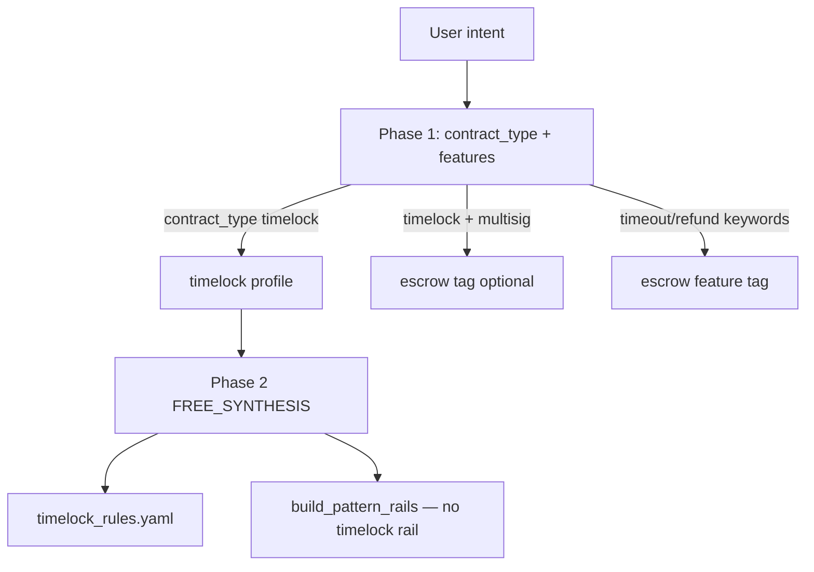

# Timelock — State Report (Phase 1 Audit)

**Date:** 2026-06-11  
**Scope:** End-to-end audit of `timelock` after Split, Escrow, and Multisig stabilization. No implementation changes.  
**Method:** Code inspection, `scripts/diagnose_timelock_case.py`, 4-case validation benchmark (`bench_20260611_1609_*`).

---

## Executive summary

Timelock has **complete scaffolding** (YAML rules, pattern profile, 5-case suite, fallback template) but **no dedicated generation rail**. Historical full-suite runs show **100% compile/convergence** with **very low scores** (avg **0.093**, `bench_20260331_2116_af18`) — dominant issue is **evaluator / suite mismatch**, not generation failure on simple CLTV paths.

**4-case validation (2026-06-11):** **100% compile**, **75% convergence**, **avg score 0.917**. Composite timelock paths (escrow refund, multisig backup) score **1.0**. Pure `timelock.yaml` gap is **`timestamp_based` / `block_height_based` / `relative_timelock` unmapped** in evaluator.

**Verdict:** Timelock follows the **Escrow/Multisig pattern** (measurement-limited), not the Split pattern (structural generation failure).

---

## 1. Routing

| Step | Location | Behavior |
|------|----------|----------|
| Phase 1 enum | `pipeline.py` ~1125 | `timelock` = single-beneficiary time-gated release |
| Mode resolution | `resolve_effective_mode()` | Stays `timelock` when `contract_type == timelock` |
| Escrow co-tag | `pipeline.py` ~653–661 | `timelock` + `multisig` → `escrow` tag (does not override `contract_type: timelock`) |
| Pattern profile | `pattern_profiles.py:46–49` | `timelock_rules.yaml`; disables LNC-008, LNC-016, `missing_output_anchor` |
| Golden | `_GOLDEN_TYPE_MAP` | **No** timelock golden entry |
| Fallback | `pipeline_engine.py` | `fallback_timelock.cash` when fallbacks enabled |

### Diagnostics (2026-06-11)

| Case | contract_type | effective_mode | timelock_rules | Rail |
|------|---------------|----------------|----------------|------|
| tl_001 | timelock | timelock | yes | none |
| tl_002 | timelock | timelock | yes | none |
| escrow_timeout_refund | escrow | escrow | no (escrow_rules) | escrow |
| ms_006 | multisig | multisig | no (multisig_rules) | escrow |

**Routing passes** for all validation cases.

---

## 2. Rails

**No `_TIMELOCK_RAIL`** in `build_pattern_rails()` (`pipeline.py:356–385`).

Generation guidance sources:

| Source | Content |
|--------|---------|
| Phase 2 prompt block | `TIMELOCK:` — `tx.time >= N` (CLTV), `tx.age >= N` (CSV) |
| Vesting block | Standalone timelock `require` (not chained with `&&`) |
| `timelock_rules.yaml` | `TL-TIME`, `TL-AUTH`; forbids wrong fields |
| `_ESCROW_RAIL` | Refund branch: `require(tx.time >= timeout)` when escrow tagged |

**Timeout guidance:** Phase 1 extracts `timeout_days`; escrow/multisig composites use timelock in multi-path functions.

---

## 3. Sanity

**File:** `sanity_checker.py`

| Check | Trigger | Rule |
|-------|---------|------|
| Timelock evidence | `"timelock" in features` | `tx.time`, `this.age`, or `tx.age` in code |
| Operator | `"timelock" in features` | Warn if `tx.time` without `>=` |

**Validation run:** No sanity failures on 4-case pass.

**Known mode:** `tl_001` historical code had no `checkSig` — covenant-only spend; suite still required `signature_verification` (evaluator gap). Current run generates signed spend.

---

## 4. Lint

**File:** `dsl_lint.py`

| Rule | Timelock behavior |
|------|-------------------|
| LNC-003 (value anchoring) | **Skipped** for `timelock` mode |
| LNC-008 (output limit) | **Skipped** via pattern profile |
| LNC-010 | `_check_timelock_standalone` — timelock must not be chained with `&&` |
| LNC-016 | **Skipped** via profile |

**Validation run:** 0 lint errors on 4 cases.

---

## 5. Evaluator

**Files:** `benchmark/evaluator.py`, `benchmark/feature_extractor.py`, `benchmark/config/feature_rules.yaml`, `semantic_requirement_map.yaml`

### Feature detection (working)

| Feature | Rule / logic |
|---------|----------------|
| `timelock_unlock` | `tx.time` / `tx.age` / `this.age >=` in code |
| `timelock_refund` | Same inside `require(...)` |
| `time_validation` | Maps via `timelock_unlock` / `timelock_refund` / `this.age` in legacy_capabilities |
| `locktime_check` | Alias pool → `time_validation` |

### Known mismatches (not in feature_rules or semantic map)

| Suite feature | Issue |
|---------------|-------|
| `timestamp_based` | **Not defined** — `tl_002` fails despite `tx.time >= unlockTime` |
| `block_height_based` | **Not defined** — `tl_003` fails despite CLTV block height |
| `relative_timelock` | **Not defined** — `tl_005` fails despite `this.age >= 144` |
| `sequence_check` | **Not defined** — critical on `tl_005` |
| `must_fail_wrong_time_field` | **Not wired** — `tl_004` failure case |
| `signature_verification` on unsigned covenant | Historical `tl_001` — intent allows no sig but suite requires it |

### Pattern pool

No dedicated `timelock` entry in `_cashtoken_alias_pool` — uses default + `locktime_check`.

---

## 6. Benchmark suite

**File:** `benchmark/suites/timelock.yaml` — **5 cases**

| ID | Intent | Tags |
|----|--------|------|
| tl_001 | Block height 800000 CLTV | basic |
| tl_002 | Unix timestamp unlock + owner sig | timestamp |
| tl_003 | 52560 block savings lock | savings |
| tl_004 | **FAILURE:** `tx.timestamp` wrong field | failure |
| tl_005 | Relative CSV 144 blocks | relative |

**Related composite cases (validation subset):**

| ID | Suite | Role |
|----|-------|------|
| escrow_timeout_refund | escrow_suite.yaml | Timelock + refund path |
| ms_006 | multisig.yaml | Timelock + multisig backup |

---

## 7. Historical evidence

| Run | Cases | Compile | Converged | Avg score | Notes |
|-----|-------|---------|-----------|-----------|-------|
| `bench_20260331_2116_af18` | 5 | 100% | 100% | **0.093** | Full timelock.yaml |
| `bench_20260331_2117_108e` | 2 | 100% | 100% | 0.117 | tl_001–002 subset |
| `diagnosis_11_patterns_20260331_213659` | 5 | 100% | 100% | low cov | Dominant: `compile_pass_but_low_intent_coverage` |
| `bench_20260611_1609_1d83` | 2 | 100% | 50% | **0.833** | tl_001=1.0, tl_002 evaluator |
| `bench_20260611_1609_f76d` | 1 | 100% | 100% | **1.0** | escrow_timeout_refund |
| `bench_20260611_1609_ec8e` | 1 | 100% | 100% | **1.0** | ms_006 |

**11-pattern diagnosis false positives:** tl_001 (missing `signature_verification`), tl_002 (`timestamp_based`), tl_003 (`block_height_based`), tl_005 (all three required features missing in scoring).

---

## 8. Classification preview

| Layer | Evidence |
|-------|----------|
| Routing | Pass — timelock profile loads |
| Rails | Informational gap only — no compile block |
| Sanity / Lint | Pass on validation |
| Compile / Generation | Pass on 4-case validation; historical 100% on full suite |
| **Evaluator** | **Primary** — unmapped suite features depress scores |

---

## 9. Files referenced

| File | Role |
|------|------|
| `benchmark/suites/timelock.yaml` | 5-case suite |
| `src/services/knowledge_structured/timelock_rules.yaml` | Pattern rules |
| `src/services/pattern_profiles.py` | Timelock profile |
| `src/services/pipeline.py` | TIMELOCK prompt block, routing |
| `src/services/fallbacks/fallback_timelock.cash` | Fallback |
| `src/services/sanity_checker.py` | Timelock evidence |
| `src/services/dsl_lint.py` | LNC skips, LNC-010 |
| `benchmark/evaluator.py` | Scoring |
| `benchmark/config/feature_rules.yaml` | timelock_unlock/refund regex |
| `scripts/diagnose_timelock_case.py` | Routing diagnostics |
