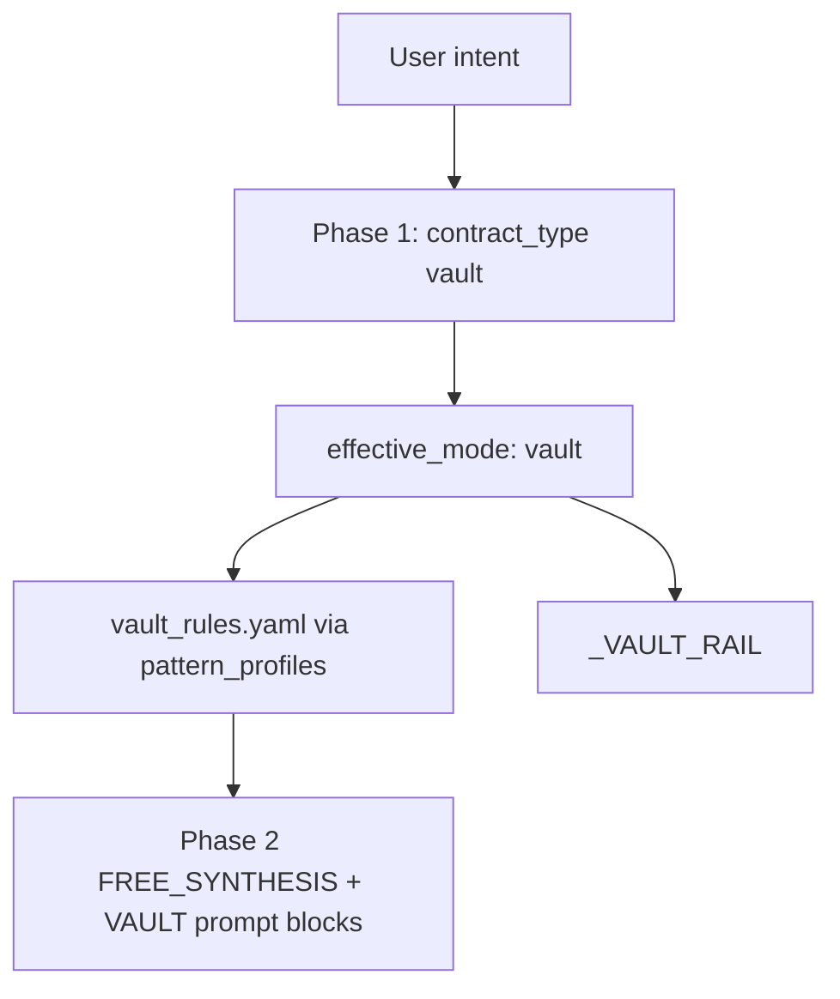

# Vault — State Report (Phase 1 Audit)

**Date:** 2026-06-11  
**Scope:** End-to-end audit of `vault` after Hashlock Phase 1A. **No implementation changes.**  
**Method:** Historical benchmark mining (23 runs), code inspection, `scripts/diagnose_vault_case.py`, generation review from `bench_20260401_2119_3456` and `bench_20260331_2128_47e9`.

---

## Executive summary

Vault is the **most infrastructure-complete** core BCH pattern: Phase 1 `contract_type: vault`, dedicated `_VAULT_RAIL`, `vault_rules.yaml`, vault-aware lint (LNC-003/008 staging), and evaluator relaxations (`token_vault_relaxed`).

**Historical trajectory:** Early March runs (**0% compile**) → April `vaults_real` runs (**92% compile**, **67% convergence**, **0.72 avg score** on 24 cases). Canonical `vaults.yaml` 8-case run (`bench_20260331_2128_47e9`) shows **88% compile/convergence** but **0.10 avg score** — classic **measurement false negative** (code structurally valid).

**Strongest run:** `bench_20260401_2107_be86` — 10-case `vaults_real` subset, **100% compile/convergence/score 1.0**.  
**Weakest run:** `bench_20260320_1118_d745` — 8-case `vaults.yaml`, **0% compile**.

### Failure-class classification

| Class | Verdict |
|-------|---------|
| **A — Production converged (subset)** | **Yes** for many `vaults_real` cases when evaluator credits features |
| **B — Measurement-limited** | **Primary** on `vaults.yaml` — compile OK, scores 0.06–0.20 despite valid staged vaults |
| **C — Generation-limited** | **Historical** (Mar 20); **residual** on hard cases (`vr_010`/`vr_023` timeout, `v_008` compile) |
| **D — Routing-limited** | **No** — diagnostics show `vault` + `vault_rules` + `_VAULT_RAIL` consistently |
| **E — Mixed** | **Overall classification** |

**Recommendation:** **Vault Phase 1A (measurement alignment only)** — not complete, not major redesign. Track failure cases (`v_006`, `v_008`, `vr_019`+) under security-negative initiative. **Effort: 1–2 days** for 1A; **2–3 days** if hard-case generation stability is in scope.

---

## Part 1 — Historical benchmark review

### Aggregate runs (all vault-containing `bench_*.json`)

| Run ID | Cases | Compile % | Convergence % | Avg Score | Suite / notes |
|--------|-------|-----------|---------------|-----------|---------------|
| `bench_20260401_2106_4c8e` | 1 | 100% | 100% | **1.000** | `vaults_real` subset |
| `bench_20260401_2107_be86` | 10 | 100% | 100% | **1.000** | `vaults_real` subset — **strongest** |
| `bench_20260401_2103_6f5c` | 10 | 100% | 90% | 0.920 | `vaults_real` subset |
| `bench_20260401_2055_1099` | 10 | 90% | 80% | 0.810 | `vaults_real` subset |
| `bench_20260401_2011_0c72` | 8 | 100% | 75% | 0.775 | `vaults.yaml` |
| `bench_20260401_2119_3456` | 24 | 92% | 67% | 0.718 | **Full `vaults_real`** — canonical large run |
| `bench_20260401_2051_2750` | 10 | 100% | 50% | 0.590 | `vaults_real` subset |
| `bench_20260401_2030_ceb2` | 24 | 96% | 46% | 0.567 | Full `vaults_real` |
| `bench_20260401_2007_cc09` | 8 | 100% | 0% | 0.175 | `vaults.yaml` — semantic gate |
| `bench_20260320_1441_5c18` | 8 | 100% | 100% | 0.144 | `vaults.yaml` — loose conv, low score |
| `bench_20260331_2121_d83d` | 2 | 100% | 100% | 0.135 | `vault_debug` |
| `bench_20260401_1946_a582` | 8 | 100% | 100% | 0.123 | `vaults.yaml` |
| `bench_20260320_1438_261a` | 2 | 100% | 100% | 0.118 | `vault_debug` |
| `bench_20260331_2128_47e9` | 8 | 88% | 88% | **0.100** | **`vaults.yaml` canonical** |
| `bench_20260320_1405_febf` | 8 | 88% | 88% | 0.000 | Early partial compile |
| `bench_20260320_1135_db27` | 8 | 25% | 25% | 0.000 | Early |
| `bench_20260320_1123_4ba0` | 8 | 13% | 13% | 0.000 | Early |
| `bench_20260320_1118_d745` | 8 | **0%** | **0%** | **0.000** | **Weakest** — all Compile |
| `bench_20260320_1210_01cc` | 2 | 0% | 0% | 0.000 | `vault_debug` early |
| `bench_20260320_1219_5809` | 2 | 0% | 0% | 0.000 | Early |
| `bench_20260320_1308_d782` | 2 | 0% | 0% | 0.000 | Early |
| `bench_20260320_1320_fce3` | 2 | 0% | 0% | 0.000 | Early |
| `bench_20260320_1454_2a21` | 2 | 0% | 0% | 0.000 | Early |

11-pattern diagnosis (`diagnosis_11_patterns_20260331_213659.json`): vault **87.5% compile**, avg score **0.10**, **4/7** compiling cases flagged `compile_pass_but_low_intent_coverage`.

### Per-case — canonical `vaults.yaml` (`bench_20260331_2128_47e9`)

| Case | Compile | Converged | Score | Failure layer |
|------|---------|-----------|-------|---------------|
| v_001 | pass | yes | 0.06 | Evaluator (`time_validation`, `token_validation`) |
| v_002 | pass | yes | 0.15 | Evaluator (`output_value_validation`) |
| v_003 | pass | yes | 0.12 | Evaluator (`time_validation`, `token_validation`) |
| v_004 | pass | yes | 0.15 | Evaluator (`time_validation`) |
| v_005 | pass | yes | 0.12 | Evaluator (`time_validation`, `output_value_validation`) |
| v_006 | pass | yes | 0.00 | Evaluator (`covenant_continuation`; failure case) |
| v_007 | pass | yes | 0.20 | Evaluator (partial) |
| v_008 | **fail** | no | 0.00 | **Compile** (failure case) |

### Per-case — full `vaults_real` (`bench_20260401_2119_3456`)

| Case | Compile | Converged | Score | Failure layer |
|------|---------|-----------|-------|---------------|
| vr_001–005, vr_007–008, vr_011–018, vr_024 | pass | yes | **1.0** | — |
| vr_006 | pass | no | 0.133 | Evaluator (`multisig` unmapped) |
| vr_009 | pass | no | 0.50 | Evaluator (`semantic_pass` — intent 1.0) |
| vr_010 | **fail** | no | 0.00 | **Timeout** |
| vr_019–022 | pass | no | 0.0–0.2 | Evaluator / failure cases |
| vr_023 | **fail** | no | 0.00 | **Timeout** |

---

## Part 2 — Routing audit



| Step | Location | Behavior |
|------|----------|----------|
| Phase 1 enum | `pipeline.py` ~1103 | `vault` — cold storage, withdrawal lock, controlled spend |
| Mode resolution | `resolve_effective_mode()` | Stays `vault` |
| Pattern profile | `pattern_profiles.py:76–84` | `vault_rules.yaml`; disables LNC-005/014/018; relaxes output detectors |
| Rails | `pipeline.py:381` | `_VAULT_RAIL` when `contract_type == vault` |
| Escrow co-tag | Phase 1 features | `escrow` may appear on emergency/multisig vault intents — adds `_ESCROW_RAIL` **in addition** to vault rail (not profile substitution) |
| Golden | `_GOLDEN_TYPE_MAP` | Template `vault_2step.cash` exists; **not** in golden map |
| Suites | `vaults.yaml` (8), `vault_debug.yaml` (2), `vaults_real` (24, **no `.yaml` extension**) |

### Diagnostics (2026-06-11) — all 8 representative cases

| Case | contract_type | effective_mode | vault_rules | vault_rail |
|------|---------------|----------------|-------------|------------|
| v_001 | vault | vault | yes | yes |
| v_002 | vault | vault | yes | yes |
| v_003 | vault | vault | yes | yes |
| v_007 | vault | vault | yes | yes |
| vr_001 | vault | vault | yes | yes |
| vr_003 | vault | vault | yes | yes |
| vr_006 | vault | vault | yes | yes |
| vr_009 | vault | vault | yes | yes |

**Routing passes** for all diagnosed cases. Not routing-limited.

---

## Part 3 — Sanity

**File:** `sanity_checker.py`

| Check | Vault behavior |
|-------|----------------|
| Signature accountancy | Relaxed for `vault`, `covenant`, `stateful` contract types |
| Covenant / staging | No dedicated hash/timelock-style vault guard |

**Historical runs:** No systematic sanity failures on compiling vault cases.

---

## Part 4 — Lint

**File:** `dsl_lint.py`

| Rule | Vault behavior |
|------|----------------|
| LNC-003 (value anchoring) | Vault-aware — staged split (`value - withdrawAmount`) accepted |
| LNC-008 (output limit) | Vault staging function name whitelist (`announce*`, `stage*`, …) |
| LNC-010 | Timelock standalone — applies to CSV/CLTV in finalize paths |
| Profile disables | LNC-005, LNC-014, LNC-018 skipped via `pattern_profiles` |

Lint was a **historical blocker**; April patches reduced false positives. Compiling vault cases in recent runs show **0 lint errors**.

---

## Part 5 — Evaluator

| Component | Status |
|-----------|--------|
| `token_vault_relaxed` | Exists — only when `token_validation` in required features |
| `covenant_continuation` | Mapped via INTERMEDIATE `has_anchor` + `has_value_check` — misses announce-only patterns |
| `time_validation` | Credits `this.age` / timelock features — gaps when only `this.age` in finalize |
| Vault criticals | `emergency_path`, `cancellation_path`, `tiered_delay_logic`, `amount_threshold_logic` — **regex in else branch only**, not in `semantic_requirement_map.yaml` |
| `must_fail_permanent_covenant` | Uses `_escrow_permanent_covenant` — may not match vault failure semantics |
| `must_fail_missing_amount_validation` | **Unmapped** in semantic map |
| Dedicated `vault` pool | **No** `_cashtoken_alias_pool` entry (unlike timelock/hashlock) |

11-pattern diagnosis false positives: `time_validation`, `token_validation`, `covenant_continuation`, `output_value_validation` missing despite compile success.

---

## Part 6 — Generation quality review (`bench_20260401_2119_3456` + `bench_20260331_2128_47e9`)

### 1. Structurally valid?

**Yes** on compiling cases. Example `vr_001`: announce (2 outputs, re-anchor) + claim (`this.age >= delay`) + cancel (re-anchor).

### 2. Staged outputs correct?

**Yes.** `v_001` (`bench_20260331_2128_47e9`):

```cashscript
require(tx.outputs.length == 2);
require(tx.outputs[0].lockingBytecode == this.activeBytecode);
require(tx.outputs[0].value == tx.inputs[this.activeInputIndex].value - withdrawAmount);
require(tx.outputs[1].value == withdrawAmount);
```

### 3. Value preservation?

**Yes** — sum conservation and full-value finalize/cancel paths common.

### 4. Covenant enforcement?

**Yes** — intermediate re-anchor; terminal finalize exits covenant (`lockingBytecode != this.activeBytecode` in `v_001`).

### 5. Vault invariants consistent?

**Mostly yes** on successful runs. Tiered/spending-limit paths (`v_002`, `vr_009`) use threshold compares and multi-function paths. **Gaps:** multisig recovery sometimes uses parallel `checkSig` without `checkMultiSig` (`vr_006`).

### 6. Match benchmark intent?

| Case | Intent match | Scoring match |
|------|--------------|---------------|
| v_001 | **Yes** — 2-step + delay | **No** — score 0.06 |
| v_002 | **Yes** — instant vs delayed paths | **No** — score 0.15 |
| vr_001 | **Yes** | **Yes** — score 1.0 |
| vr_006 | **Partial** — recovery without explicit 2-of-3 | **No** — `multisig` missing |
| vr_009 | **Yes** — founder treasury tiers | **No** — semantic_pass halved score |

---

## Part 7 — Classification (A–E)

| Label | Applies? | Evidence |
|-------|----------|----------|
| **A — Production converged** | **Partial** | `vaults_real` subset 10/10 at 1.0 (`bench_20260401_2107_be86`); 18/24 at 1.0 in full run |
| **B — Measurement-limited** | **Yes** | `vaults.yaml` avg 0.10 with 88% compile; 11-pattern false-positive flags |
| **C — Generation-limited** | **Partial** | Mar 20 0% compile; `vr_010`/`vr_023` timeout; `v_008` compile fail |
| **D — Routing-limited** | **No** | All diagnostics: vault profile + rail |
| **E — Mixed** | **Yes — overall** | Strong generation + weak canonical scoring + residual hard-case failures |

---

## Final recommendation

### **2. Vault Phase 1A (measurement alignment only)**

Mirror Escrow / Multisig / Timelock / Hashlock:

1. Add `vault` alias pool in evaluator
2. Map `covenant_continuation`, `time_validation` (CSV/`this.age`), `output_value_validation` for staged splits
3. Wire criticals: `emergency_path`, `cancellation_path`, `tiered_delay_logic`, `amount_threshold_logic`
4. Map failure-case `must_fail_*` scoring
5. Rename `vaults_real` → `vaults_real.yaml` (ops fix, not generation)

**Do not** start Vault Phase 1B (rails/golden) until 1A gate measured on `vaults.yaml` + representative `vaults_real`.

**Do not** classify vault complete — canonical suite still scores ~0.10.

### Effort estimate

| Track | Effort |
|-------|--------|
| Phase 1A measurement (`vaults.yaml` + evaluator) | **1–2 days** |
| Hard-case generation (`vr_010` timeout, complex multisig vault) | **+2–3 days** |
| Major redesign | **Not warranted** — generation evidence sufficient |

---

## Reproduce

```bash
python scripts/diagnose_vault_case.py all
python -m benchmark.runner benchmark/suites/vaults.yaml
python -m benchmark.runner benchmark/suites/vaults_real
```
